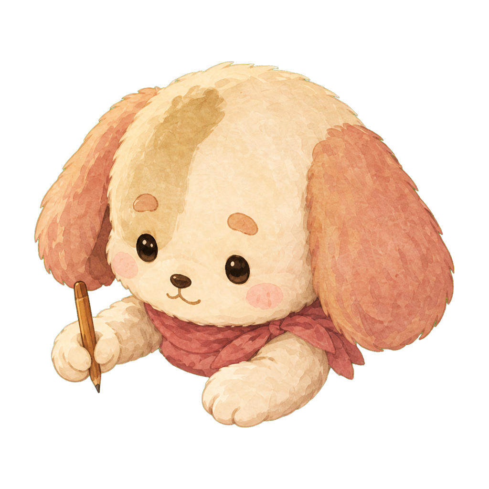

# 角色 · 当前设计

> [设计系统](design-system.md) / [场景](scene.md) / [UI 与在场信息](uiux/uiux.md) · 2026-09-13

| 蓝耳 · 阅读                                                        | 粉耳 · 书写                                                        |
| ------------------------------------------------------------------ | ------------------------------------------------------------------ |
|  |  |
|      |      |

## 外观与场景关系

双长耳角色分别用雾蓝、柔粉表达身份，奶油/浅棕脸部色块、围巾与毛绒四肢保持一致的形状语言。蓝耳坐左侧沙发，粉耳坐右侧书桌；角色单独贴装到场景，接触阴影连接家具。

当前设计强调安静陪伴，不做自由行走或从镜头外进场。角色比例、锚点和遮挡服从实际房间模板；日记打开时允许遮挡角色，不再沿用旧稿的全程避让规定。

## 当前动画怎样运行

| 动作     | 当前实现                                                                   |
| -------- | -------------------------------------------------------------------------- |
| 呼吸     | 3.6 秒正弦周期：纵向约 ±1.6%，横向反向约 ±0.3%；两角色相位错开             |
| 小幅摆动 | 7.4 秒周期，约 ±0.009 弧度；保持贴装锚点                                   |
| 眨眼     | 睁/闭两张图切换，闭眼约 140ms；通常间隔随机 2.4–6.5 秒，可有短间隔二次眨眼 |
| 环境受色 | 独立角色层使用场景配方 tint 和接触阴影，不是每个时辰另画一套角色           |

以上数值来自 [pixi-scene.ts](../../src/themes/cinnaglass/room/pixi-scene.ts)，是当前实现记录，不是新动画设计要求。静态立绘只能展示姿态，呼吸与摆动需在运行场景中查看。

## 交互与未完成部分

头顶信息、状态与聊天气泡属于 [UI/UX](uiux/uiux.md)。更丰富的翻页、倒咖啡、喝咖啡、伸懒腰与挥手仍是动作方向，不能把 [历史动作图鉴](concept/baselines/companionship-room/05-character-action-atlas.png) 当成已制作动画。在线/离线的最终呈现随 presence 待办推进。

后续动作同时考虑随机微动作、对用户操作的反应和偶发自主行为；无需对方操作也能表达在场。原有制作顺序建议是 idle → 翻页 → 喝咖啡 → 趴睡 → 挥手 → 倒咖啡，属于成本排序参考，具体采用仍需小样验证。

## 素材与实现

- 当前四张立绘：[public/characters](../../public/characters/)。
- 原始生成/处理记录：[20260810-000437Z](../../arts/characters/codex-report.md)。
- 贴装与相位：[study-room.ts](../../src/themes/cinnaglass/room/study-room.ts)；动画：[pixi-scene.ts](../../src/themes/cinnaglass/room/pixi-scene.ts)。
- 验收重点：实际小尺寸下脸部与蓝耳轮廓可辨认，摆动不滑离座位，两角色不机械同步。
