# 角色 · 当前设计

> [设计系统](design-system.md) / [场景](scene.md) / [物件](props.md) / [对坐深化稿](concept/across-the-table/across-the-table.md) · 2026-09-27
> **状态**：设计已定，第一期开发中：阿屿（她的视角）与小满（他的视角，2026-09-29）都已上线，默认他的视角。上一期的双犬角色已删除。

## 首批两个人物

| 小满（女，二十出头）                                                                   | 阿屿（男，二十五六）                                                               |
| -------------------------------------------------------------------------------------- | ---------------------------------------------------------------------------------- |
| 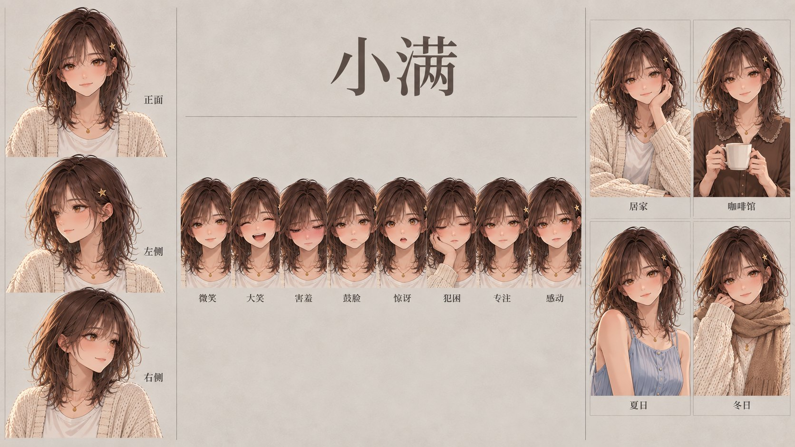 | 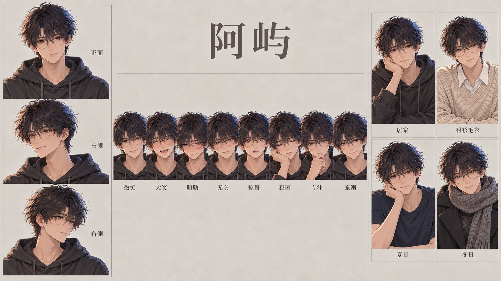 |

- **小满**：栗棕色齐肩发，碎刘海，金色小星星发夹，琥珀色眼睛，奶油色宽松针织开衫配白 T，细金项链；温柔、有点困的笑。
- **阿屿**：深藏青近黑的蓬松乱发，细圆框眼镜，炭灰连帽卫衣；安静温和的笑。
- 衣服可以随房间和季节换；发型、发夹、眼睛、项链、眼镜不变，它们是认人的标志。
- 画风见 [设计系统](design-system.md#整体风格)：二次元 CG 厚涂，半写实比例，不做 Q 版。

## 谁出现在谁的屏幕上

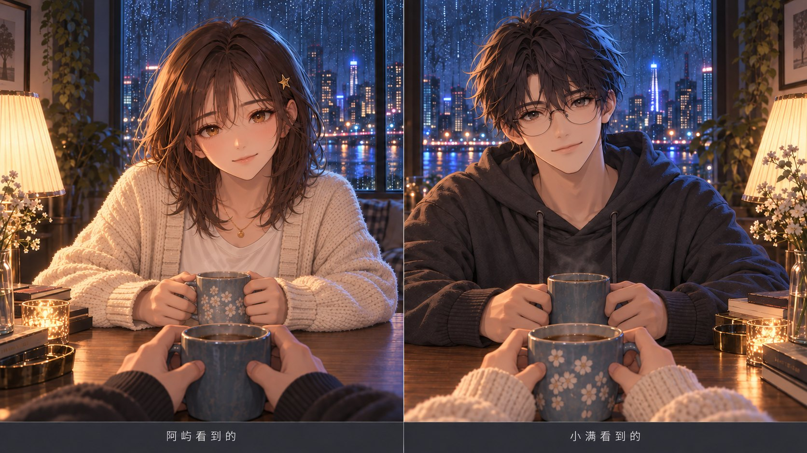

每个人看到的都是对方坐在对面；自己只出现在前景：你是阿屿时，前景是炭灰卫衣袖口；你是小满时，前景是奶油色针织袖口。第一期先做了**她的视角**（登录她的账号，对面是阿屿，前景是奶油色袖口），2026-09-29 补上**他的视角**（对面是小满，前景是炭灰袖口捧灰蓝杯，桌上是她的碎花杯，椅背搭她的开衫）。账号级的形象归属还没做，开发时用地址参数 `?as=xiaoman` / `?as=ayu` 切换。

## 形象预设（后续）

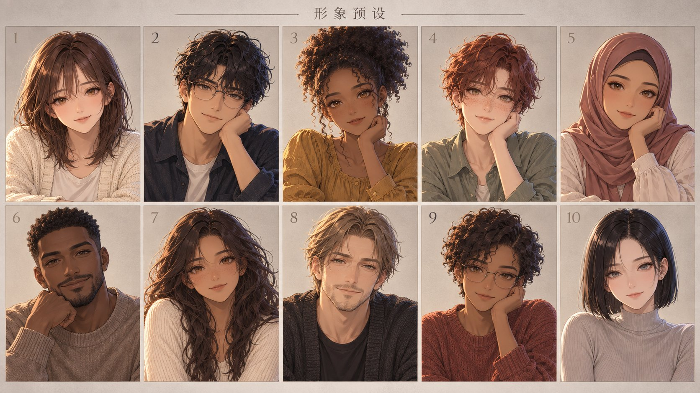

自定义形象从 10 个精修预设起步，覆盖不同肤色、直发 / 卷发 / 螺旋卷、眼镜、雀斑、头巾与年龄段，再做换色；部件自由组合放第二步。**声音名片**：每人录几句短语音（早安、戳我干嘛、想你了、晚安），对方点你的形象时播放，这是「画面里只有一个人」也能承载真人的关键。不在第一期。

## 动作：来自姿势库

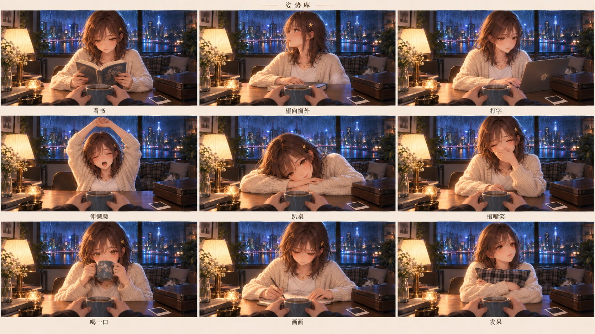

同一张桌子、同一套半身 rig 的基础动作：看书、望向窗外、打字、伸懒腰、趴桌、捂嘴笑、喝一口、画画、发呆。第一批概念图托腮用得太多，**每个房间至少用 3 种动作，托腮只是其中之一**。

### 第一期动作表（两人同一套）

| 动作       | 由什么触发（必须是真实来源）            | 画面                                                                 |
| ---------- | --------------------------------------- | -------------------------------------------------------------------- |
| 看书       | 对方在线、页面可见（默认在场状态）      | 双手捧书低头读                                                       |
| 抬眼       | 在场时随机（约 20–60 秒一次）、被戳之后 | 从书上抬眼看你，微笑                                                 |
| 眨眼       | 程序随机 2.4–6.5 秒                     | 睁眼 / 闭眼两帧，闭眼约 140ms                                        |
| 呼吸与微摆 | 程序常驻                                | 纵向约 ±1.5% 呼吸、极小幅度左右摆，保持贴座                          |
| 写字       | 对方正在聊天框里输入                    | 先把书放低、放平，再低头在本子上写字（书房）；其他房间可用看手机打字 |
| 喝一口     | 在场时随机、你递来咖啡之后              | 放低书、伸手握住桌上的杯子、拿起、带到嘴边喝，从杯沿抬眼，再放回原处 |
| 酣睡       | 对方主动设为「睡着了」                  | 书放下、打瞌睡、手臂折起、趴在手臂上睡，台灯调暗；醒来倒着走         |
| 摸头反应   | 你在 TA 头上按住轻抚                    | 书（或笔）还在手里，歪头迎向你的手，闭眼享受、脸微红                 |
| 戳一下反应 | 你点 TA                                 | 缩一下再笑（写字时边写边笑）；有声音名片时播放 TA 录的那句           |
| 暂时离开   | 对方页面隐藏或刚断开                    | 空椅，外套搭在椅背，杯子还冒热气                                     |
| 离线       | 断开较久                                | 空椅留痕，杯子不再冒气，有便条就留在桌上                             |

用户最喜欢的动作是摸头、酣睡，以及和对方当前操作绑定的两件事：**倒一杯咖啡给对方**、**TA 在输入时低头写字**。这四个排在第一期最前面。

## 在场状态

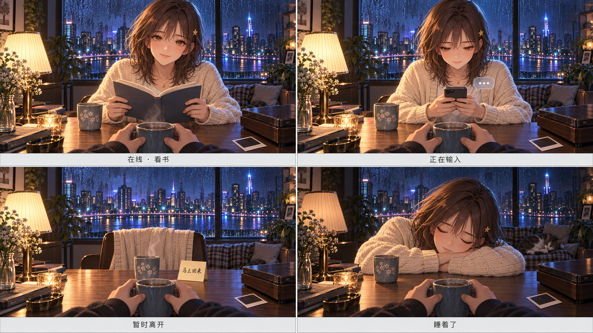

不用任何文字，瞥一眼就知道 TA 在干嘛。状态只来自应用内已知的事实：在线与页面可见、正在输入、主动设置的「睡着了」、断开时长。不监测对方的其他应用，也不因为几分钟没操作就把 TA 画成睡着。便条的内容必须是 TA 自己写的，不替 TA 许诺「马上回来」。

实装（2026-09-27，阿屿，状态暂由开发面板模拟）：

| 正在输入：低头写字                            | 睡着了：趴在手臂上，台灯自己调暗               | 暂时离开：外套搭在椅背，杯子还冒热气           |
| --------------------------------------------- | ---------------------------------------------- | ---------------------------------------------- |
| 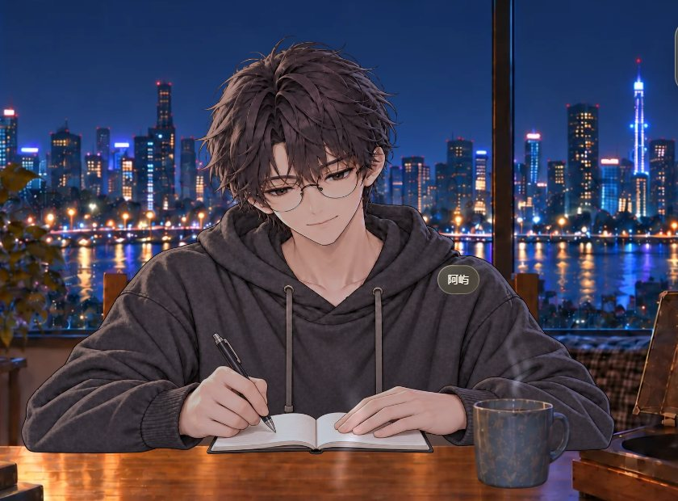 | 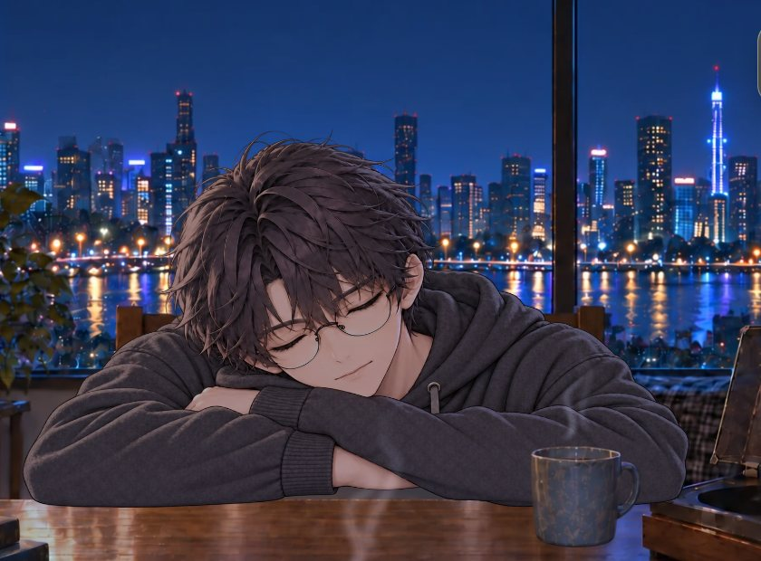 | 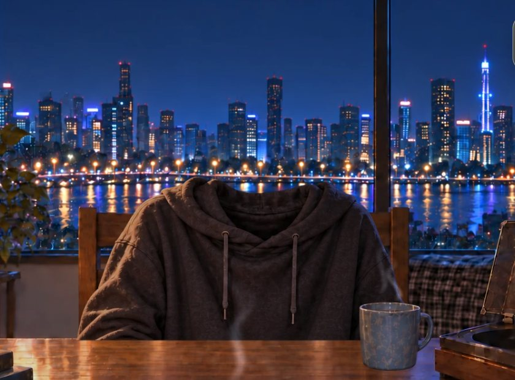 |

## 轻互动

| 轻互动四格                                                                         | 掌心相贴                                                                     |
| ---------------------------------------------------------------------------------- | ---------------------------------------------------------------------------- |
| 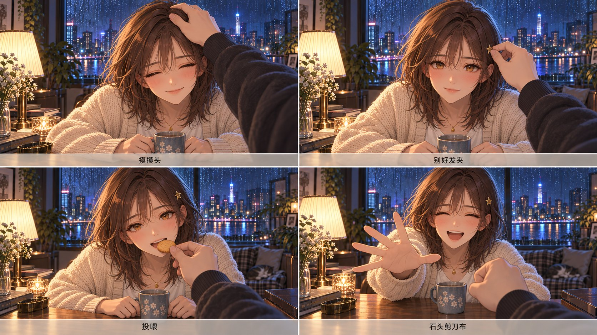 |     |
| **碰杯**                                                                           | **盖毯子**                                                                   |
| 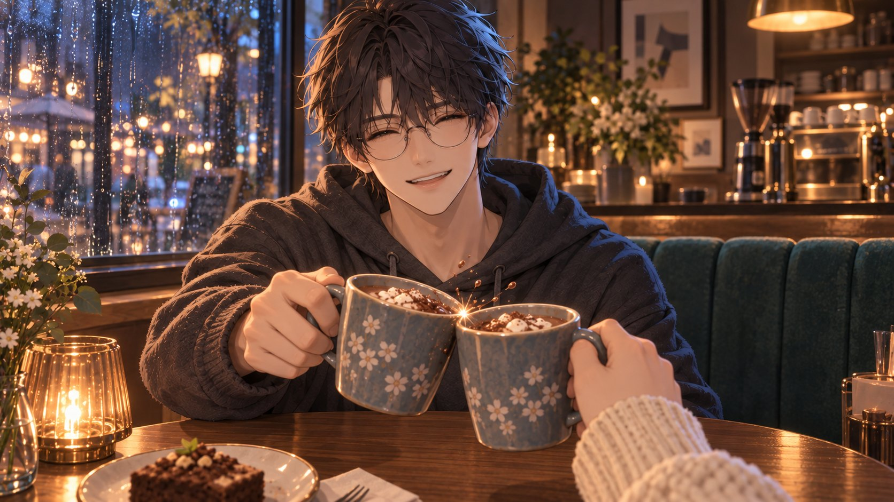                | 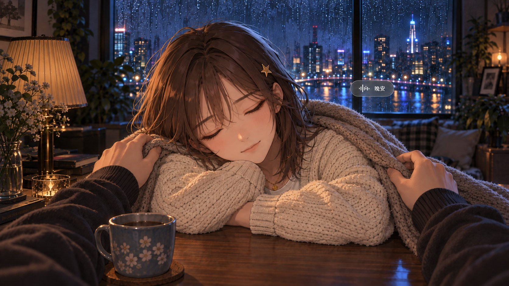 |

| 互动                         | 怎么成立（用户 2026-09-27 同意这样划分）                                       |
| ---------------------------- | ------------------------------------------------------------------------------ |
| 戳一下、摸摸头、别发夹、投喂 | 随时能做：对面播放预设反应和 TA 自己录的声音名片；这次触碰同时出现在对方屏幕上 |
| 掌心相贴、碰杯、石头剪刀布   | 双方同时在线才完成；对方不在时只留下邀请，不自动演出对方的回应                 |
| 盖毯子                       | 对方主动设为「睡着了」时才能盖；毯子和你的晚安语音留到 TA 醒来                 |

实装（2026-09-27）：点身体是戳一下，1.4 秒后回到原姿势；在头上按住并移动超过 12px 是摸头，按住期间一直享受，松手后停留 0.8 秒；递一杯咖啡后 TA 捧杯喝一口。

| 戳一下：闭眼大笑                              | 摸摸头：闭眼享受                               | 喝一口：从杯沿看你                          |
| --------------------------------------------- | ---------------------------------------------- | ------------------------------------------- |
|  |  | 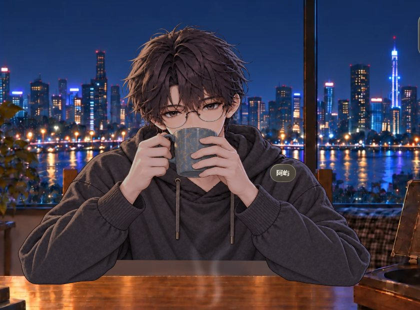 |

## 制作方式（第一期）

> 流水线本身（验收、稳帧、形变场、运动权重、导出、运行时模板、验证方法）已沉淀为 marionette 技能（`ai/jaSkills/marionette/`）；下面记的是这个项目的人物规格与定下来的做法。

- **一人一套透明姿势图**：和底图同尺寸的横版画布（1536×1024），半身像比在底图里放大约 1.8 倍、占满画布；所有姿势共用同一画布、同一肩线和同一条躯干截断线（桌面远沿：阿屿的画布 y=968，从底图量得；第一期 brief 写的 y=900 是估错的，2026-09-28 更正），每个眼睛睁着的姿势再出一张闭眼帧。由生成直接产出带透明通道的图，不从整幅场景里抠（铁律 5）；装配脚本只裁透明边，并用特征匹配算出姿势画布落到底图上的缩放与偏移。
- **为什么人物单独、放大出图**：半身人物本身是横向的（双臂搭在桌上）；手机竖屏时人物接近满屏宽，需要比底图里约 750px 宽更高的精度才不糊，所以人物按约 1.8 倍单独出图。
- **运行时**：引擎做呼吸、微摆、头发飘动、眨眼和姿势切换；受光吃场景配方（时辰 tint + 台灯开关），不为每种光重画人物（铁律 6）。躯干截断线落在桌面远沿，底图里的桌面自然显得在人物前面，不另做桌面前沿层。
- **眨眼帧验收**：闭眼帧只准眼睛和睁眼帧不同。显示尺寸下眼睛以外还有明显差异的，不上线，那个姿势先不眨眼；合格的也要先做一遍闭眼帧对齐（见下）。第一批里喝一口的闭眼帧重画了袖子，所以暂不眨眼；它的躯干截断线也比其他姿势低约 16px，在桌面远沿留下一道硬边，等重新生成。
- **idle 怎么动**（2026-09-28 定，参考 Wallpaper Engine 的 Shake / Puppet Warp）：每个姿势是一张平面画，引擎在上面铺网格，按「运动权重图」逐点变形，不整体缩放人物（整体缩放会让书一起呼吸、人像变胖变瘦）。权重图由脚本从姿势图自身算出，不切图、不改画：胸肩和头随呼吸轻抬约 2px，捧着的书和手、桌上的东西几乎不动；头发发梢单独飘，发根不动，摆动从上往下传。
- **姿势切换**（2026-09-28 改）：相近的姿势之间做形变过渡，像补帧那样由两张图算出中间帧——脚本测出一张图上每一点在另一张图里的位置（光流），运行时让旧姿势沿着它弯成新姿势的形状、新姿势从旧形状松回来，中途换图。轮廓差太多、光流解释不了的（喝一口两手离开书、酣睡趴下）仍是新姿势盖在旧姿势上淡入，旧姿势全程不透明，被盖住后再淡出。两张同时半透明会让身后的窗透出来，看起来像人闪了一下。
- **闭眼帧对齐**：逐帧生成的闭眼帧总会把眉毛、镜框、发丝挪一两个像素，眨眼时整张脸跳一下。上线前用光流把闭眼帧的几何对齐回睁眼帧，只挪位置、不重画像素；眼睛那一带只跟着头整体走，不跟局部光流（闭眼的眼睑和睁眼的虹膜不是同一样东西，硬对会把睫毛线拖弯）。
- **反应帧对齐**（2026-09-28 加）：反应姿势是「编辑看书那张」生成的，头发也会整体胖一圈，切过去时像多长了一块。表情不需要动头的反应（被戳的笑）在上线前按光流对齐回看书的几何，只有脸可以不同；多画出来的内容（一缕原本没有的头发）对齐去不掉，要重出。
- **反应要有身体**（2026-09-28 加）：姿势只换表情，身体的动作由运行时的手势曲线算——被戳是一缩、肩膀随笑颤几下、头发慢半拍跟着弹，捧书的手不动。新反应先想身体怎么动一下，能算的不去生成。
- **大动作是关键帧链**（2026-09-29 加）：手离开原位去拿东西、把书放下、趴下睡觉，都拆成一串相邻的关键帧，每步只走一小段，相邻两帧之间用光流补；从任何姿势都先回到看书再开始，结束倒着走回去。喝一口 9 帧，写字前放书 2 帧，入睡 4 帧。反应（摸头、被戳）只改脸和头，不换手里拿的东西——换道具的一步到位会在中段溶解出半透明的书。
- **杯子交接不出双杯**（2026-09-29 加）：桌上的杯子是场景的一层、画在人物前面。握住它的那一帧把杯子原位画进姿势图，拿起那一帧竖直抬起；流水线量出每帧杯子离原位多远，运行时桌上那只沿这段位移跟着手走、到位才消失，所以屏幕上始终只有一只杯子，蒸汽也跟着走。
- **第二个人物坐同一张椅子**（2026-09-29 加）：小满用阿屿量好的座位（缩放与偏移），只按她自己的躯干截断线（y 987，他是 968）把座位上移 10 个场景像素，让切线正好落在桌沿；触碰区、气泡锚点、取景都按她的帧重新量。
- **为什么不改用视频 / GIF 切帧**：视频模型一次生成一段连续动作，帧间确实更稳，但现在的工具链里没有可用的视频生成模型；图片模型生成的 GIF 本质上仍是逐帧画的，每帧一样会漂。要稳，就少生成、多计算：只生成关键姿势，中间帧由光流形变和网格变形算出来。帧数也不是问题——运行时 30fps 逐帧计算形变，不是几张图轮播；之前生硬是因为姿势之间只有淡入淡出，没有中间形状。
- **为什么不用 Live2D / Spine**：它们要求人物从一开始就按部件分层绘制（前发、后发、五官、身体各自一层）再绑骨，我们的姿势图是整张平面画；重画分层版无法保证和现有人物一致。动作需求超出网格变形能做的范围时再评估（Spine 有官方 PixiJS v8 运行时，Live2D 在 PixiJS v8 只有社区运行时，授权要核）。
- **体积**：Codex 估算一个半身角色图集 2–4 MB，每套额外衣服 0.8–1.8 MB，按需加载，未实测。逐图拆层建议见 [人物与互动制作注记](concept/across-the-table/notes/characters.md)。

## 来源

概念图与 brief：[对坐深化稿](concept/across-the-table/across-the-table.md)、[人物出图 brief](concept/across-the-table/notes/briefs/world/W-CH-characters.md)、[画风与人物锁](concept/across-the-table/notes/briefs/world/W-shared.md)。生产素材落在 `arts/characters/<人物>/`，运行时在 `public/characters/`；接入与验收记录在 [书房功能文档](../features/study-room/study-room.md)。
