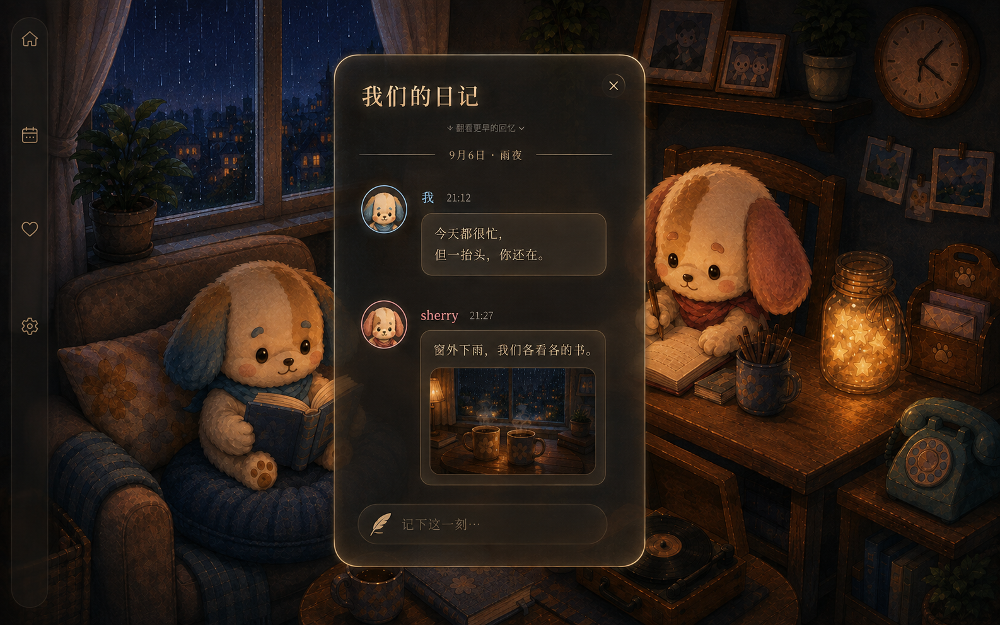

# 我们的日记 · 夜灯下的回忆

日期：2026-09-06。模式：design。状态：**用户已采纳并授权应用**。本页保留出稿时的判断；后续实装与验证见 [implementation.md](implementation.md)。

## 本轮判断

上一版把「记忆是阅读主体」误解为「整张页面必须最白」，又把内容挤进窄长纸页，造成白色面积过大、留白不足、卡片重复拥挤。工程跑起来并不代表视觉验收通过。用户已否决大白纸与作者色左边线；本轮按最新反馈重新设计。

视觉签名：**雨夜暖灯映在烟茶色磨砂面板上，回忆安静地浮出来。**

主色不超过五类：烟茶灰底、暖象牙文字、克制香槟反光、低饱和蓝身份、低饱和粉身份。质感来自边缘接光、磨砂厚度、轻微颗粒和阴影；形状是柔和圆角，没有书本折角、丝带、厚边框。

## 如何回应反馈

| 用户标准 | 新稿处理 |
| --- | --- |
| 太白，脱离 cozy 氛围 | 移除大白纸；深色半透明面板接住房间暖光，灯与角色仍是大面积亮部 |
| 想沉静、安静、沉浸 | 保留雨窗和暖灯，弱化无关工具；一屏两条完整回忆，日期与文字之间有停顿 |
| 内容撑满容器 | 留出完整外边距；头像一列，正文框一列；照片内嵌，四边都不贴框 |
| 喜欢第三稿头像和范围框 | 保留独立角色头像、其旁的作者名/时间、下方柔圆文字框 |
| 讨厌左侧作者色边线 | 完全移除；蓝粉只用于头像细环和名字，两个正文框同色 |
| 游戏质感、透明感 | 单层烟茶色磨砂外壳、局部高光、安静的细轮廓；正文区以稳定半实底保证阅读 |

## 布局与阅读规则（下一版实现的起点，尚未实测）

- 1440px 宽桌面以约 520px 容器为起点，左右外边距约 40px；头像约 44px，与正文列间隔约 18px。内容框内边距 22–24px。
- 标题区有独立留白；作者名/时间在正文框外，头像对齐作者行。条目之间约 36–44px，而非把连续卡片堆到容器边缘。
- 标题可用温柔的中文衬线字；正文推荐 16–18px 清晰常规字体，约 1.7 倍行高。日期与时间降低强调但仍须可读。
- 两到三条是阅读密度目标，不是分页条数；上旧下新的连续滚动、长文详情、多图与草稿规则继续保留。
- 长文本不无限拉长卡片；缩略照片保留内边距，更多内容到详情。底部「记下这一刻…」保持低强调并保留草稿预览。
- 小屏需另做紧凑构图，不能把本图等比压缩。此前 504/432/288px 不应再被当成已经通过的新稿断点。

## 明暗与材质边界

这次用户反馈覆盖日记此前的「大面积恒白最高亮」与「3px 作者色边线」裁决；其他功能的纸面规则不在本轮改动范围内。

新的层级是：**暖灯与角色保留光感 → 深色面板承接回忆 → 暖象牙文字形成局部阅读对比**。它不是要求所有场景像素都比面板亮；文本需要稳定底色，而整体氛围不靠白色矩形撑起来。

外层是一块磨砂材质；里面的文字框只是柔和的半实底，没有第二层折射/模糊，避免多层玻璃叠加。透明感主要发生在外沿和非文字区，正文背后不能透出清晰家具线条。

## 参考证据与借鉴限度

- [Spirit City 官方商店与展示](https://store.steampowered.com/app/2113850/Spirit_City_Lofi_Sessions/)：参考其房间陪伴与工具共存的产品方向。本稿的烟茶色材质是本项目设计，不宣称照搬其组件。
- [Sky 设计访谈](https://developer.apple.com/news/?id=zm47it7t)：参考情感联结与界面退让的设计方向，不移植其角色或菜单。
- [腾讯 ISUX：QQ8.0 有生机的设计](https://isux.tencent.com/articles/qq8.html)：参考全屏内容的沉浸感、清楚的转场来源和避免装饰疲劳。它是 QQ 设计说明，**不是历史 QQ 空间日志皮肤的精确证据**。用户提到的 QQ 空间只作为私人空间、氛围连续性的灵感，不引入访客量、留言板、聊天气泡或社交信息流。
- 项目图：旧第三稿只取头像/正文框关系；夜雨场景图取暖灯、原创双角色、材质和构图。

## 对生成结果的独立复核

已查看最终 1586×992 图：白纸消失；只有两条完整回忆；作者头像在框外；左右都没有作者色竖线；两张角色脸可见；照片没有铺满容器。相对上一版，留白和房间连续性明显改善。

仍有两处需明确：①外框的金色高光偏强，后续宜降为局部细反光，避免铜框感；②生成图把正文也画成衬线体，后续正文应换清晰常规字体，小号辅助文字还需对比度测试。图中的文字、像素尺寸与材质不构成 CSS 实现证明。

推荐继续推进这个方向，待用户评价后再做真实 CSS 组件稿与三断点/三时辰验收。本轮没有修改 src/，没有发布或改动真实帖子。

## 产物

- `night-memory-concept.png`：单张全场景设计稿。
- `prompt.md`：内置 image_gen 使用的完整生成描述与参考路径。
- 本文：设计判断、参考证据和偏差记录。
