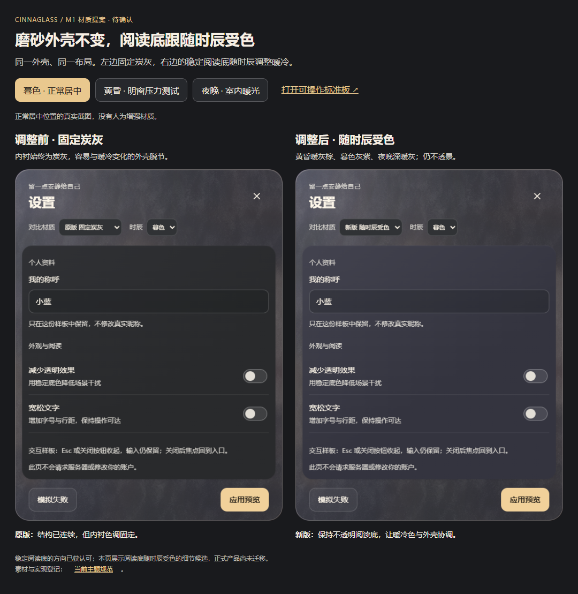

# 视觉工作台

调研、候选、比稿和待确认原型放在这里；`uiux/` 只保留定稿规范与选定展示。原始工具批次默认本地忽略，明确保留的比稿目录单独入库，普通回归报告仍写在会话中。

当前可操作提案：[连续玻璃壳](ui-unification/standard-board.html) · [新旧并排比较](ui-unification/material-comparison.html)。通过项目开发服务打开 HTML，不使用 `file://` 打开 React 样板。

稳定阅读底的方向已获认可，内衬受色与连续边框细节尚未接入正式设置。当前对照保持同一圆角内衬与磨砂外壳，只比较固定炭灰和随时辰受色：黄昏暖灰棕、暮色灰紫、夜晚深暖灰。外壳配方不变，内衬仍完全不透明；这是一组随现有 mood 切换的艺术调色，不是真实光照采样。设置支持关闭/重开、三时辰切换、输入与失败保留；账户和音乐仅作本页交互预览。

实现：[组件](ui-unification/standard-board.tsx)、[样式](ui-unification/standard-board.css)。真实房间/导航/天气复用产品组件，未更改产品路由或日记依赖。最终规范以 [设计系统](../design-system.md) 为准，确认后只晋升选定设计，不把整个候选批次移进 `uiux/`。
