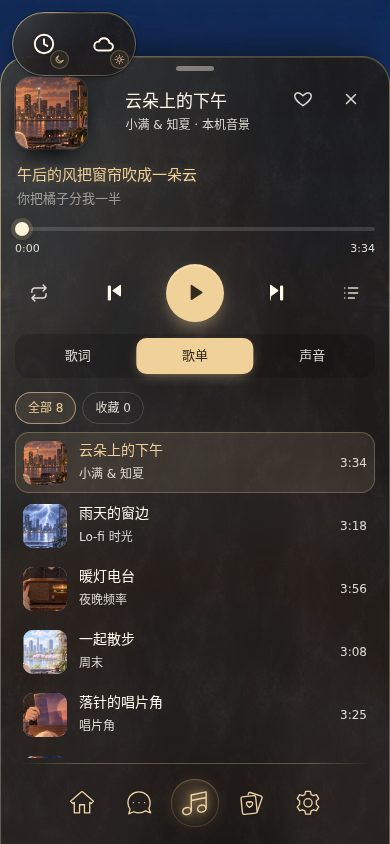
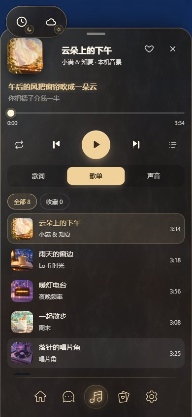
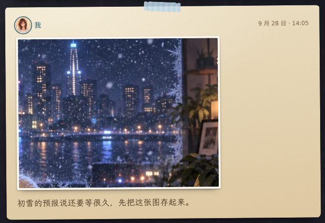
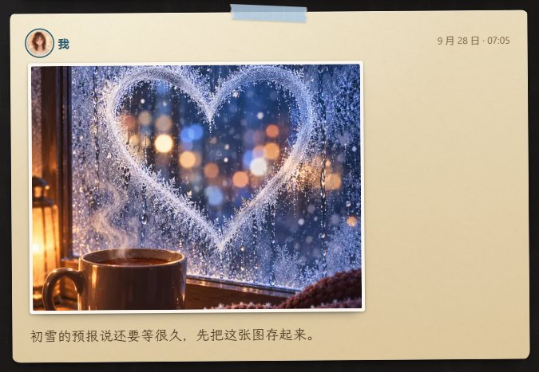
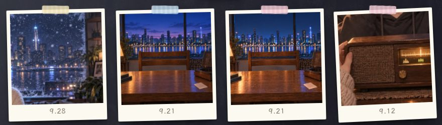
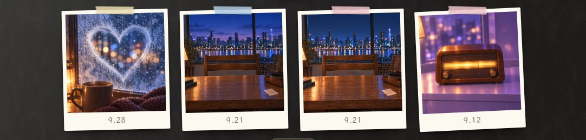
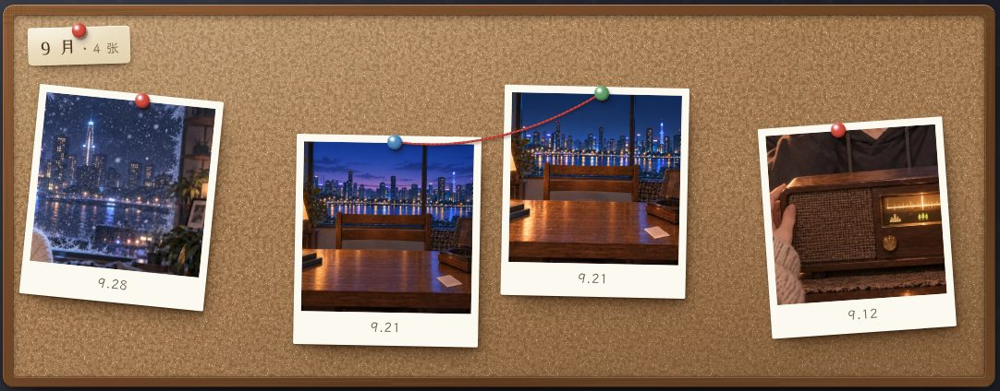
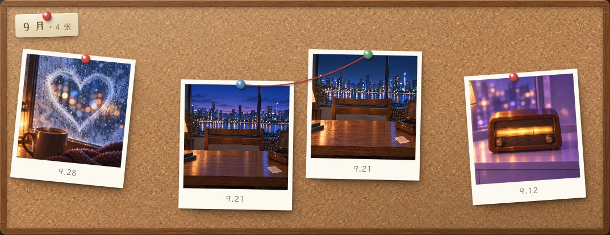
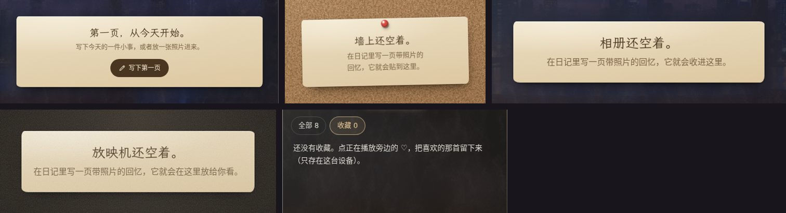
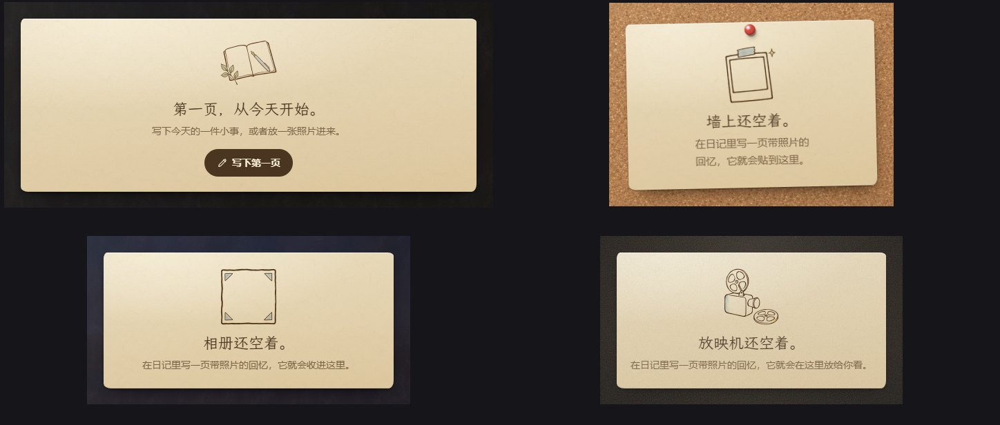

# 要图清单（交给出图的 agent）

> 2026-10-02 UI Tailor 整理，风格按 Monet 的设计系统。用户定规：美术图不在会话里自己生成，先占位，由下一个 agent 在用户的机器上用 `codex-visual` 出图。这里一处一处写清楚界面里还在用占位的地方：在哪、现在什么样、要什么、怎么接、怎么验。出完图、用户看过、接进代码后，把那一条从这里删掉，素材登记到 [设计系统「实际素材位置」](../../design-system.md#实际素材位置)。
>
> **2026-10-02 出图结果**：五项都已由 Codex 出图、Monet 审过并接进代码（每项末尾的「结果」写了采用哪一轮、和要求的偏差、要你看哪里），素材已登记到设计系统；**等你看样**，看过就把这几条删掉。打包脚本 [build-ui-art.py](../../../../scripts/build-ui-art.py)，母版、来源批次和每一步处理记在 [arts/ui/music/manifest.json](../../../../arts/ui/music/manifest.json) 与 [arts/ui/memory/manifest.json](../../../../arts/ui/memory/manifest.json)。

## 怎么用

1. 先读 [设计系统](../../design-system.md) 的铁律，尤其第 5 条（部件由生成直接产出，不后抠、不手修）和第 7 条（原创，提示词不写在世艺术家和工作室名），再读下面的「共用要求」。
2. **一次委派一组**（R1–R4），每组一条 `node ai/jaSkills/codex-visual/scripts/codex-visual.mjs run --mode design …`，参考图不超过 5 张（每组都列了），brief 用每组末尾的英文稿，可以直接贴。
3. 产物先落在 `ai/design_system/codex-visual/<时间戳>/`（不入库）。挑中的母版放 `arts/ui/<组>/source/`，运行时 WebP 放 `public/` 下写明的路径，`arts/ui/<组>/manifest.json` 记来源、尺寸和处理步骤（格式照 [arts/ui/journal/manifest.json](../../../../arts/ui/journal/manifest.json)）。
4. 按每条的「接入」改代码，按「验收」在样板里截图核对（桌面 1440×900、手机 390×844，三个时辰，深玻璃和暖瓷两种界面风格都看）。
5. 把接好后的截图换进 [UI/UX 看样页](../../uiux/cinnaglass/ux/index.html#art-title) 的「要图的地方」，交用户看样。

## 共用要求

| 项       | 要求                                                                                                                                                                                                                            |
| -------- | ------------------------------------------------------------------------------------------------------------------------------------------------------------------------------------------------------------------------------- |
| 世界     | 对坐：一对情侣隔着一张桌子坐着，镜头就是自己。画风是二次元 CG 厚涂、接近抽卡游戏主视觉的完成度；光是台灯一类的暖色实景光，配一道冷色环境光。界面是磨砂玻璃，回忆页是纸、和纸胶带、拍立得和软木板                                |
| 一组一套 | 同一组的图要像一套：同样的画法、细节密度、光的软硬和饱和度                                                                                                                                                                      |
| 不要     | 文字、字母、数字、logo、水印、签名；任何现有 IP 的角色或标志物；人脸（除非条目里写了要）；光圈、描边、发光外框；照片级写实（纹理可以写实，插画和海报不行）                                                                      |
| 颜色     | 和界面 token 对齐：纸 `#ecdfc2` → `#dec8a0`，墨 `#4a3620`，次要字 `#7b6446`，印泥 `#b3542f`，金 `#f1d19a`；胶带四色 `#b9d3e6` 蓝、`#efc3cf` 粉、`#efe1b4` 奶黄、`#cfe2c4` 灰绿                                                  |
| 尺寸     | 母版 PNG（sRGB、8 位），运行时 WebP（质量约 82）；写的都是像素，按 2 倍屏算好了                                                                                                                                                 |
| 平铺     | 平铺纹理四边无缝，2×2 拼起来看不出接缝，也没有一眼能认出来的重复斑点。无缝应来自生成本身；连续两次做不到，允许用脚本做确定性的接缝处理（偏移半格、宽羽化交叉淡化），在 manifest 里写明，不手修                                  |
| 透明     | 要透明的直接生成带 alpha 的 PNG（像 [quill.webp](../../../../public/ui/journal/quill.webp) 那样），不从别的图里抠。条目里写了「白底 + 正片叠底」的，就在纯白底上画，接入时用 `mix-blend-mode: multiply`，白色自然消失，不算抠图 |
| 光       | 回忆页和音乐托盘在房间压暗之后的玻璃上，不随时辰变化，所以不出时辰变体；纹理一律均匀照明，明暗渐变由 CSS 加                                                                                                                     |
| 报告     | 每组写一份简体中文 `codex-report.md`：每个文件的像素尺寸、alpha 或平铺检查、怎么回应 brief、还看得到的缺陷                                                                                                                      |

## 一览

| 编号   | 要什么                       | 在哪                                         | 原来的占位                             | 优先 | 组  | 状态（10-02）                        |
| ------ | ---------------------------- | -------------------------------------------- | -------------------------------------- | ---- | --- | ------------------------------------ |
| ART-01 | 歌单海报 8 张                | 音乐托盘、停靠栏、迷你条、歌单、沉浸歌词     | 当期概念图的方形裁切，8 张都是窗外城市 | 高   | R1  | 已出图接入，两张重画一轮；待看样     |
| ART-02 | 手帐纸纹理                   | 回忆页所有的纸：日记页、便签、写一页、月份签 | CSS 分形噪点                           | 高   | R2  | 已出图接入；待看样                   |
| ART-03 | 和纸胶带 4 色                | 日记页顶上、拍立得、日历纸的角               | CSS 条纹加锯齿裁切                     | 中   | R3  | 第二轮接入，胶带位改成约 5:1；待看样 |
| ART-04 | 软木板纹理、木框（图钉可选） | 照片墙·软木板                                | CSS 四层噪点加渐变                     | 中   | R2  | 软木与木框接入，图钉保留 CSS；待看样 |
| ART-05 | 空状态小插画 4 张            | 日记、照片墙、相册、放映的空状态纸条         | 只有字的纸条                           | 中   | R4  | 第二轮接入；待看样                   |

**不需要出图**（保持 CSS / SVG）：图标（随主题换色、要锐利）、放映的银幕和胶片齿孔、日历的格子、「记」字印章、玻璃本身的霜纹（已有 [frost.webp](../../../../public/ui/nav/frost.webp)）。房间切换（E）和找歌（C）还没做，要图等做的时候再列。

## ART-01 歌单海报（R1）



**在哪**：[music-tracks.ts](../../../../src/themes/cinnaglass/music-tracks.ts) 每首歌的 `poster`，文件在 [public/music/covers/](../../../../public/music/covers/)。显示尺寸：托盘和停靠栏的封套 72–112px（唱片从封套后面滑出来，海报同时印在唱片中心的圆标上，见 [music.css](../../../../src/themes/cinnaglass/music.css) `.mp-art`、`.mp-disc`）；歌单每行 44px；迷你条 40–52px；沉浸歌词里是 48px 小图，同时糊成整块面板的底色（`blur(38px) brightness(0.5)`）。

**现在**：当期概念图的方形裁切，8 张几乎都是窗外的城市和桌子，44px 时分不出哪首是哪首，有几张还带着概念图里人物的手。

**交付**：8 张方图，文件名不变。母版 `arts/ui/music/covers/source/<名>.png` 1024×1024 不透明；运行时 `public/music/covers/<名>.webp` 512×512，每张不超过 60 KB。

| 文件               | 歌名 · 歌手                | 主色（`tint`）               | 画面（歌词里来的）                                                                   |
| ------------------ | -------------------------- | ---------------------------- | ------------------------------------------------------------------------------------ |
| `afternoon-clouds` | 云朵上的下午 · 小满 & 知夏 | 杏色 `#FCE3B0 → #F5B774`     | 午后开着的窗，白窗帘被风鼓成一朵云，外面是很大的积云；窗台上掰开的一个橘子和一杯冰饮 |
| `rainy-window`     | 雨天的窗边 · Lo-fi 时光    | 长春花蓝 `#BFD0F2 → #8C9DDB` | 傍晚下雨的玻璃，雨痕后面城市的灯糊成光斑；窗台上冒热气的杯子和摊开的书，一点暖灯     |
| `lamp-radio`       | 暖灯电台 · 夜晚频率        | 丁香紫 `#E7C4F0 → #B68FD9`   | 台灯下一台老木壳收音机，刻度盘发着暖光，背景是柔和的紫色夜晚；不要手                 |
| `spring-walk`      | 一起散步 · 周末            | 薄荷绿 `#BFE8D2 → #86C9A6`   | 周末早上的河边小路，樱花瓣在空中，长椅上一袋刚出炉的面包；清新的晨光                 |
| `record-corner`    | 落针的唱片角 · 唱片角      | 紫 `#C9B3E8 → #7E6AB5`       | 书架一角的唱机，唱臂正落到转着的唱片上，旁边立着一张紫色晚霞的唱片封套               |
| `seaside-stars`    | 海边的星星 · 潮汐          | 深蓝 `#9FB6E8 → #3F5A9E`     | 夜里开着的窗挂着贝壳风铃，外面是星空下的海，远处灯塔亮着，有一颗星最亮               |
| `dawn-train`       | 列车清晨 · 远行            | 蜜桃 `#F7D1A6 → #D98C6A`     | 日出时沿海岸走的列车车窗，小桌上一张明信片和一盒有玉子烧的便当，窗外小镇掠过         |
| `first-snow`       | 初雪的夜 · 冬至            | 雾蓝 `#D6E2F3 → #8FA3C6`     | 结霜的窗玻璃上画了一颗心，外面夜里下着雪的城市，近处一杯冒烟的热可可和一条针织围巾   |

**必须**：

- 和书房是同一个世界、同一种画法（参考书房底图），8 张像一套唱片。
- 一个清楚的主体放在画面正中（唱片圆标只露出中间约 40% 的圆），44px 时靠轮廓和明暗就能分清 8 首。
- 主色就是表里的 `tint`；出图后色调有偏差，就把 `tint` 改成和图一致，因为它是海报载入前的底色和海报后面的光。
- 不画人脸；最多一截袖口或一只手的局部。

**不要**：歌名或任何字；边框；把整张封面画成一张唱片（界面已经画了滑出来的唱片）；和现在一样的窗外城市构图。

**参考图**：[书房夜景底图](../../../../public/rooms/study/plate-night-on.webp)（画法和光）、[对坐主视觉 A1](../../concept/across-the-table/img/A1-keyart.jpg)（世界）、[现在的歌单](img/now-posters-phone.jpg)（摆在哪、多大）。

**接入**：同名覆盖 `public/music/covers/*.webp`；需要的话改 `tint`；把 [music-tracks.ts](../../../../src/themes/cinnaglass/music-tracks.ts) 文件头关于「概念图裁切」的注释改成新来源，更新 design-system.md「歌单海报」一行。

**验收**：8 张缩到 44px 拼成一排，一眼分得清；中间 40% 的圆里主体还在；`mobile-ui.html?screen=room&mood=night` 打开音乐托盘看封套和唱片圆标、切到歌单看 8 行、点歌词进沉浸看糊开的底色上歌词是否清楚；桌面停靠栏同样看一遍；每张 ≤ 60 KB。

**结果（2026-10-02，待看样）**：



- 第一轮（批次 `20261002-081349Z`）8 张留用 6 张。`lamp-radio`（初稿木色好但整张是棕不是丁香紫，终稿把收音机也染成紫木头）和 `spring-walk`（纸袋折成硬多面体，像低模渲染）在第二轮（`20261002-085413Z`）按审图意见重画：收音机保持胡桃木本色、只让环境是丁香紫；纸袋换成柔软的皱纸。
- 和要求的偏差：母版是工具原生的 1254² 而不是 1024²（原样入库，不缩放）；`seaside-stars` 没画出「开着的窗」，读成星空海面前的贝壳风铃；`tint` 改成每张海报左上→右下的平均色——它只用作载入前的底色，原来的亮色渐变在深色海报载入前会闪一下。
- 验收：44px 深浅两种底上 8 张都分得开，唱片圆标里主体还在；8 张 13–59 KB（`first-snow` 降到 q74 才进 60 KB）；手机托盘、歌单、沉浸歌词、桌面停靠栏和四种界面风格的截图已重拍进 [UX 参考](../../uiux/cinnaglass/ux/ux.md)。

```text
Production asset delegation (UI Tailor, Claude) for "Our World", a web + phone app for couples: each partner sees
the other sitting across a table in a painted anime-style study room. PRODUCTION UI ASSETS, NOT CONCEPT ART.
Make 8 square album covers for the app's built-in playlist, one per track (titles and scenes in the table of
ai/design_system/codex-visual/art-requests/art-requests.md, ART-01). Each: 1024x1024 opaque PNG, file names
afternoon-clouds, rainy-window, lamp-radio, spring-walk, record-corner, seaside-stars, dawn-train, first-snow.
Style: the same world and rendering as the attached study plate — high-finish 2D anime CG background art,
painterly gradients, soft bloom, shallow depth of field; the eight must read as one series.
Composition: one clear subject centred (a circular crop of the middle 40% must still read); at 44 px the eight
must be told apart by silhouette and value alone; dominant colour = the track's tint gradient.
Rules: no text, letters, numbers or logos; no faces (at most part of a sleeve or a hand); no borders; do not paint
the whole cover as a vinyl record; original — no existing IP; straight from generation, never hand-repaired.
Write codex-report.md in Simplified Chinese: per file the size, how it answers its scene, defects you still see.
```

## ART-02 手帐纸纹理（R2）



**在哪**：[memory.css](../../../../src/themes/cinnaglass/surfaces/memory.css) 的 `--paper-grain`（文件开头），用在 `.mem-paper`（日记页、空状态和出错的便签）、写一页的纸、软木板的月份签（[photo-cork.css](../../../../src/themes/cinnaglass/surfaces/photo-cork.css)）和日历纸（[journal-calendar.css](../../../../src/themes/cinnaglass/surfaces/journal-calendar.css)）。

**现在**：SVG 分形噪点（不透明度 0.07）叠在奶油色渐变上，近看是均匀的沙点，没有纸的纤维感。

**交付**：`paper-tile` 一张无缝平铺纹理。母版 2048×2048 PNG；运行时 `public/ui/memory/paper-tile.webp` 1024×1024（按 512px 平铺），不超过 90 KB。

**画面**：好的日本手帐本的内页纸（偏米白），细长纤维、很淡的云状深浅，近乎白色，**专门用来正片叠底**：底色在 `#ffffff`–`#f6f1e7` 之间，纤维是暖灰；最暗处不低于 sRGB 236，大部分在 245–255。

**不要**：横格、边缘、折痕、污渍、咖啡渍、阴影、暗角、光照渐变（这些 CSS 画）；任何字。

**参考图**：[现在的纸](img/now-paper.jpg)、[旧书的纸纤维 paper-corner.webp](../../../../public/ui/journal/paper-corner.webp)（纤维的感觉，颜色不用照）。

**接入**：`--paper-grain: url('/ui/memory/paper-tile.webp') 0 0 / 512px 512px`；用到它的几处背景加 `background-blend-mode: multiply, normal, normal`（层数照各自的 background 写），奶油色和渐变保持现在的 CSS。

**验收**：2×2 拼看不出接缝；在 `?screen=journal&journal=scrapbook|calendar` 里看日记页和日历纸，纸的颜色和现在一样、只多了纤维；在纸最深的角上量对比度：正文墨色 `#4a3620` ≥ 6.5:1、次要字 `#7b6446` ≥ 3.2:1（现在分别约 7.0 和 3.4）。

**结果（2026-10-02，待看样）**：



- 用第二次生成的近白纸纹（批次 `20261002-081435Z`）：远看还是那张奶油色的纸，近看有细长纤维，原来的数码沙点没有了。
- 偏差：母版 1254² 而不是 2048²；两次生成的接缝都还量得出（上下接缝处的差是内部相邻像素的 1.5 倍），按共用要求做了确定性的接缝处理（和半格偏移的副本做保对比度的交叉过渡，参数记在 manifest），处理后 1.03。运行时 1024² WebP 用 q97（73 KB）：纤维只深 1–4 个色阶，q82 会压掉三分之二。
- 对比度（纸最深的角，叠上纸纹后）：正文墨色 6.84:1、次要字 3.35:1；纤维最密的一小块（字那么大的 9px 区域）上 6.63 / 3.25，都过线。

## ART-03 和纸胶带（R3）



**在哪**：[memory.css](../../../../src/themes/cinnaglass/surfaces/memory.css) 的 `.mem-entry::before`（日记页顶上，76×20px）和 `.mem-pola::before`（拍立得，54×17px）；[journal-calendar.css](../../../../src/themes/cinnaglass/surfaces/journal-calendar.css) 的日历纸角。颜色按每一页的哈希从 `TAPES` 里挑（[journal-stream.tsx](../../../../src/themes/cinnaglass/surfaces/journal-stream.tsx)、[photo-wall.tsx](../../../../src/themes/cinnaglass/surfaces/photo-wall.tsx)）。

**现在**：纯色加白色细条纹，`clip-path` 剪出锯齿边，像色块，不像纸胶带。

**交付**：4 条，对应 `TAPES` 的四种颜色：`tape-blue`、`tape-pink`、`tape-butter`、`tape-sage`。母版 1024×256 PNG，**带 alpha**，半透明（不透明度约 0.8，能隐约看到底下的照片和纸）；运行时 `public/ui/memory/tape-<色>.webp` 240×64，每条不超过 20 KB。出不了透明底就改成**白底 + 正片叠底**：纯白底上画，胶带四周留白。

**画面**：和纸胶带的一小段，两头是手撕的毛边，看得到纸纤维；每条一种很淡的印花：蓝是细格子、粉是小樱花、奶黄是小圆点、灰绿是细斜纹；平放、正面、均匀光，不带投影（投影由 CSS 加）。

**不要**：卷起来的整卷胶带；透视；字；印花太密太艳盖过照片。

**参考图**：[现在的胶带](img/now-tape.jpg)、[日记页](img/now-paper.jpg)。

**接入**：`TAPES` 改成颜色加图（例如 `{ tint: '#b9d3e6', img: '/ui/memory/tape-blue.webp' }`），行内样式多给一个 `--tape-img`；CSS 换成 `background: var(--tape-img) center / 100% 100% no-repeat`，去掉 `clip-path`（毛边在图里），投影改 `filter: drop-shadow(0 1px 1px #0003)`；白底方案再加 `mix-blend-mode: multiply`。`--tape` 颜色保留给图片载入前。

**验收**：`?screen=photos&photo=polaroid` 和 `?screen=journal` 里，胶带在亮照片、暗照片和纸上都像真的贴着；54px 宽时毛边和印花还看得出、不糊；四种颜色和 `TAPES` 对得上。

**结果（2026-10-02，待看样）**：



- 第一轮（`20261002-081513Z`）纸质和透明底都好，但胶带约 7:1 太长、两头像规则的小锯齿；第二轮（`20261002-084211Z`）换成带纤维毛边的不规则撕口，印花放大到小尺寸也读得出，采用第二轮。
- 偏差：两轮都做不到 3.6:1 的短胶带（第二轮 4.4–5.2:1）。真实手帐里的胶带本来常是这个长度，所以改界面不改图：胶带位改成约 5:1（日记页 98×20、拍立得 72×15、日历角 104×22 / 92×20），每条按自己的比例 `contain` 放进去、不拉伸；锯齿 `clip-path` 删掉，投影改成跟着撕口走的 `drop-shadow`。胶带主体不透明（≈ 98%），透明感仍由原来的 `opacity: 0.86` 给。灰绿实测 `#c9d5b7`，比 `#cfe2c4` 灰一点。
- 颜色和图收在 [washi-tape.ts](../../../../src/themes/cinnaglass/surfaces/washi-tape.ts)（日记页四色、拍立得沿用原来的前三色）；图没载入时，胶带位里先垫一小块原色。

```text
Production asset delegation (UI Tailor, Claude) for "Our World" (couples' app; the memory page is a paper
journal with polaroids). PRODUCTION UI ASSETS. Specs: ai/design_system/codex-visual/art-requests/art-requests.md,
ART-03. Four short strips of washi tape, 1024x256 RGBA PNG with NATIVE alpha, about 80% opaque so the photo
under them shows faintly: tape-blue #b9d3e6 with a fine grid print, tape-pink #efc3cf with tiny cherry
blossoms, tape-butter #efe1b4 with small dots, tape-sage #cfe2c4 with fine diagonal stripes. Both short ends
hand-torn with visible paper fibres; lying flat, seen straight on, even light, no drop shadow (CSS adds it).
If native transparency is impossible, paint each strip on pure white with white margin all round instead
(it will be multiplied in) — never cut out of another image. No rolls, perspective, text or loud prints.
Write codex-report.md in Simplified Chinese: size, alpha check (or white-ground note), defects.
```

## ART-04 软木板与木框（R2，图钉可选）



**在哪**：[photo-cork.css](../../../../src/themes/cinnaglass/surfaces/photo-cork.css) 开头的 `--cork-grain`、`--cork-mottle`、`--wood-h`、`--wood-v`，`.cork-surface`、`.cork-frame`；图钉 `.cork-pin`（16px，颜色在 [photo-cork.tsx](../../../../src/themes/cinnaglass/surfaces/photo-cork.tsx) 的 `PINS`）。

**现在**：四层 SVG 噪点模拟软木颗粒，木框是噪点木纹加渐变；整体说得过去，但近看是数码噪点。

**交付**：

- `cork-tile`：软木无缝平铺，**最终颜色**、不透明（平均约 `#ae8259`，颗粒在 `#b98d63`–`#a57850` 之间，少量浅色碎屑和小坑）。母版 2048×2048；运行时 `public/ui/memory/cork-tile.webp` 1024×1024（按 512px 平铺），不超过 140 KB。
- `wood-rail`：横向木纹长条，横向无缝（胡桃木，`#93613a`–`#5b371d`，顺着长边的细直纹）。母版 1680×96；运行时 `public/ui/memory/wood-rail.webp` 840×48（按 420×24 平铺）。竖框用同一张旋转 90°（确定性处理，写进 manifest）。
- 可选 `pin-*`：5 颗图钉，颜色照 `PINS`（红、黄、蓝、绿、象牙），带 alpha，正上方俯视略偏，左上来光，128×128 母版、32×32 运行时。不做就保留 CSS。

**不要**：照片、纸条、图钉画进纹理里；暗角和光照渐变（CSS 有左上亮、右下暗的两层光）；颗粒大到 512px 一格就能认出重复。

**参考图**：[现在的软木板](img/now-cork.jpg)、[书房夜景底图](../../../../public/rooms/study/plate-night-on.webp)（木头的颜色和质感）。

**接入**：`.cork-surface` 的 `var(--cork-grain), var(--cork-mottle), linear-gradient(…)` 换成 `url('/ui/memory/cork-tile.webp') 0 0 / 512px 512px`，上面两层径向光保留；`--wood-h` / `--wood-v` 换成 `wood-rail.webp`（竖向用旋转后的那张）；删掉不用的噪点变量。

**验收**：`?screen=photos&photo=cork` 桌面和手机，板子 2×2 以上看不出重复；照片、月份签和红线压在上面层次清楚；木框四边接得上；`memory-views.html?view=cork&empty=1` 的空板也看一遍。

**结果（2026-10-02，待看样）**：



- 软木（最终色、细颗粒）和胡桃木细直纹都用第二次生成（`20261002-081435Z`）。左上亮、右下暗的光仍是 CSS；木纹不透明，所以木框上加了一层同方向的光，代替原来被盖住的渐变；四个 SVG 噪点变量已删。
- 偏差：软木平均 `#b38053`，比 `#ae8259` 略暖；软木两次生成都有可见接缝，木纹左右接缝更明显（接缝处的差是内部的 6.9 倍），都做了确定性接缝处理（软木 1.10 / 1.02、木纹 0.89）。横框是从 2167×726 的木纹正中切一条，竖框是同一条转 90°。图钉没出：14–16px 下 CSS 图钉已经够真，不值得多 5 张透明图。

R2 的 brief（ART-02 和 ART-04 一起）：

```text
Production asset delegation (UI Tailor, Claude) for "Our World", a web + phone app for couples (a painted
anime-style study room; the memory page is paper, washi tape, polaroids and a cork board over frosted glass).
PRODUCTION UI TEXTURES, NOT CONCEPT ART. Specs: ai/design_system/codex-visual/art-requests/art-requests.md,
ART-02 and ART-04.
1. paper-tile.png, 2048x2048, seamless tile: the inside paper of a good Japanese notebook, long fine fibres and
   a faint cloudy texture, almost white (#ffffff to #f6f1e7, darkest pixel not below sRGB 236) — it is
   multiplied over the app's cream paper colour, so no colour cast of its own.
2. cork-tile.png, 2048x2048, seamless tile, opaque, final colour: pinboard cork averaging #ae8259 (granules
   #b98d63 to #a57850, a few pale crumbs and small pits); no repeat recognisable at a 1024 px tile.
3. wood-rail.png, 1680x96, seamless along the long edge: walnut picture-frame rail, #93613a to #5b371d, fine
   straight grain along the length.
Optional 4. pin-red/yellow/blue/green/ivory.png, 128x128 RGBA with native alpha: glossy pushpin heads seen from
above, lit from the top-left (colours #d2493e, #e6b43f, #4b87ba, #5f9e68, #efe6d2).
All textures: flat, even lighting — no vignette, gradient, shadow, stains, folds, ruled lines, text or objects.
Seamless must come from the generation; check a 2x2 tiling. Never hand-repaired. Write codex-report.md in
Simplified Chinese with each file's size and the 2x2 seam check.
```

## ART-05 空状态小插画（R4）



**在哪**：空状态纸条 `.mem-note`（[memory.css](../../../../src/themes/cinnaglass/surfaces/memory.css)），标题上方加一张小图。用到的地方：

| 文件              | 纸条标题             | 出现在                                                                                                                                                                                                 |
| ----------------- | -------------------- | ------------------------------------------------------------------------------------------------------------------------------------------------------------------------------------------------------ |
| `empty-journal`   | 第一页，从今天开始。 | 日记·手帐（[journal-stream.tsx](../../../../src/themes/cinnaglass/surfaces/journal-stream.tsx)）、日记·日历（[journal-calendar.tsx](../../../../src/themes/cinnaglass/surfaces/journal-calendar.tsx)） |
| `empty-wall`      | 墙上还空着。         | 照片墙·拍立得（[photo-wall.tsx](../../../../src/themes/cinnaglass/surfaces/photo-wall.tsx)）、照片墙·软木板（[photo-cork.tsx](../../../../src/themes/cinnaglass/surfaces/photo-cork.tsx)）             |
| `empty-album`     | 相册还空着。         | 照片墙·相册（[photo-album.tsx](../../../../src/themes/cinnaglass/surfaces/photo-album.tsx)）                                                                                                           |
| `empty-projector` | 放映机还空着。       | 照片墙·放映（[photo-projector.tsx](../../../../src/themes/cinnaglass/surfaces/photo-projector.tsx)）                                                                                                   |

**交付**：4 张，**白底 + 正片叠底**（纯白 `#ffffff` 底，四周留白）。母版 768×768 PNG；运行时 `public/ui/memory/<名>.webp` 192×192（显示 96px，手机 72px），每张不超过 30 KB。

**画面**：像主人自己在手帐里用钢笔随手画的小画：深棕墨线（`#4a3620`），线有轻重，加一两块淡水彩（从胶带四色里挑），留白多。

- `empty-journal`：摊开的空白本子，一支钢笔斜放在上面，旁边一小枝叶子。
- `empty-wall`：一张空白的拍立得，顶上一小段胶带，旁边一颗小星芒。
- `empty-album`：一页空相册，四个相角贴着，中间空着。
- `empty-projector`：一台小小的老式放映机，镜头盖着，旁边一卷胶片。

**不要**：厚涂、扁平矢量图标风、阴影、彩色底、字；人物；画得太满（它只是纸条上的点缀，不能比标题抢眼）。

**参考图**：[现在的空状态](img/now-empty.jpg)、[日记页](img/now-paper.jpg)（纸和墨的颜色）。

**接入**：在每处纸条标题前加 `.webp" alt="" width="96" height="96" />`（装饰图，alt 为空）；CSS 加 `.mem-note-art { display: block; margin: 0 auto 6px; mix-blend-mode: multiply }`，手机 72px；低动效不受影响。

**验收**：`memory-views.html?view=calendar|cork|album|projector&empty=1` 和 `mobile-ui.html?screen=journal` / `?screen=photos` 的空状态，桌面和手机都看：白底完全消失，线条在纸上像墨水画的；4 张是一套；标题仍然是纸条上最醒目的东西。

**结果（2026-10-02，待看样）**：



- 第一轮（`20261002-082040Z`；最初那次因为 Codex 的命令沙箱在这台机器上起不来没出图，加了工具说明重发）语义和画风都对，但线太细，放进 72–96px 的纸条里像淡铅笔；第二轮（`20261002-085134Z`）换粗一号的笔尖、暖棕墨，去掉书签带一类细节，采用第二轮。
- 处理（脚本里确定性完成，画本身不动）：生成的「白底」其实是 253–254 的近白噪点，叠在纸上会露出淡淡的方框，所以把高于 252 的通道归白；四张的留白不一样，按画的外框裁成方形、让每张画占 84%，看起来一样大。
- 接入：六处空状态纸条的标题上方，96px（手机 72px），`mix-blend-mode: multiply`；`mobile-ui.html` 样板加了 `?empty=1`，手帐和拍立得的空状态也能直接看。

```text
Production asset delegation (UI Tailor, Claude) for "Our World" (couples' app; the memory page is a paper
journal and a photo wall). PRODUCTION UI ASSETS. Specs: ai/design_system/codex-visual/art-requests/art-requests.md,
ART-05. Four small spot illustrations for empty-state notes, 768x768 PNG on pure white #ffffff with generous
white margin (they are multiplied onto paper, so the white disappears): empty-journal (an open blank notebook
with a fountain pen across it and a small sprig), empty-wall (one blank polaroid with a bit of washi tape and a
tiny sparkle), empty-album (an empty album page with four photo corners), empty-projector (a small vintage
projector with its lens cap on and a film reel). Style: a fountain-pen doodle in someone's own journal — dark
brown ink #4a3620 with varied line weight, one or two pale watercolour washes from #b9d3e6 / #efc3cf / #efe1b4 /
#cfe2c4, lots of white. Not thick paint, not flat vector icons; no shadows, coloured ground, text or people.
The four must read as one set. Write codex-report.md in Simplified Chinese: size, how each answers its note.
```

## 交接记录

- 2026-10-02：清单建立，五项都还没出图（UI Tailor）。下一步：用户在机器上装好 Codex 并登录后，按 R1 → R4 的顺序委派。
- 2026-10-02（下一个 agent，Monet 审图 + UI Tailor 接入，同 agent 自审）：R1–R4 并行委派，海报两张、胶带、空状态小画各重做一轮，五项全部接入；之前 / 现在的对照在 [看样页](../../uiux/cinnaglass/ux/index.html#art-title)。剩下等你看样，看过后删掉这五条。
