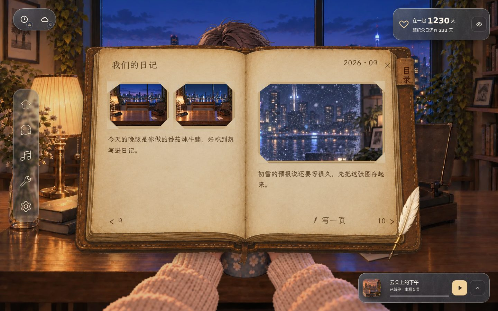
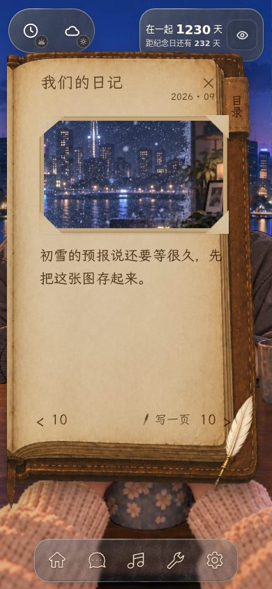
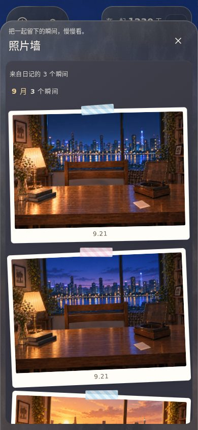
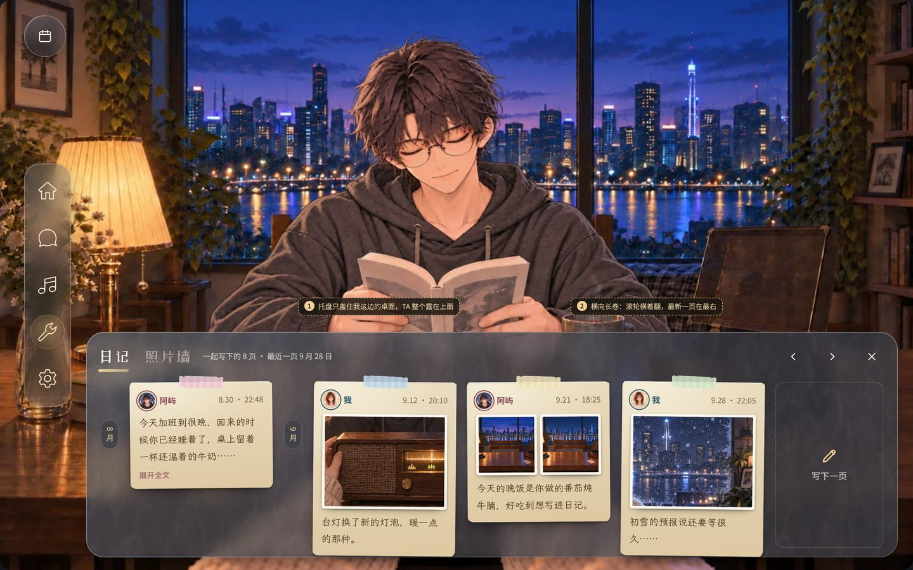

# 日记与照片墙 · 比稿与本期实装

状态：2026-09-30 出稿，推荐 G1 + H1 做成回忆面板；**2026-10-01 用户看样**：日记和照片墙是**内容页**（手机直接全屏、桌面正中弹窗，不缩在一边）；G3 日历、旧棕皮书都是日记的变种，G1 按居中重新设计；H2、H3、H4 也做成照片墙的变种；每种都有手机版，随时切换。**全部已实现**（待看样），页头切换、设置里也能选。[看样页](../ui-motion/review/index.html)（第 G、H 节）· [画板](board.html)（用开发服务打开）· 现行规范与录屏见 [UX 参考 §4](../../uiux/cinnaglass/ux/ux.md)。

画板用开发环境拍的书房截图做背景，玻璃、纸和胶带的数值抄自实装（[memory.css](../../../../src/themes/cinnaglass/surfaces/memory.css)），图里的照片是现有的歌单海报和书房底图。**没有生成任何美术图**：纸面、胶带、软木、胶片都是 CSS；需要正式美术（纸张纹理、胶带、空状态插画、软木板等）时先用占位，等用户装好 Codex 再出图（2026-09-30 用户定）。

## 改之前

| 桌面：棕皮书居中，TA 只露出头发            | 手机：书本占满，TA 被盖住                   | 照片墙（手机）：任务窗几乎盖满全屏              |
| ------------------------------------------ | ------------------------------------------- | ----------------------------------------------- |
|  |  |  |

问题：日记（C 类物件 UI）在桌面和手机都盖住对方，和这一轮「TA 始终可见」的规则相反；翻页在手机上读长文很碎；关闭、目录、写一页是另一套控件；照片墙是通用任务窗，没有和日记的联系，灯箱不能滑动翻页。

## G · 日记

2026-10-01 起这四个方向不再是四选一：G1、G3、G4 都是日记的「样子」。G2 没做：它是只盖半张桌子的底部托盘，和「内容页桌面正中、手机全屏」冲突，横着翻的长卷也和居中的 G1 重复。

| G1 手帐（已实现 · 默认，按居中重做）                                                                           | G2 桌面长卷 · 底部托盘（未做）       | G3 日历（已实现）                                                                         | G4 书本（已实现）                                               |
| -------------------------------------------------------------------------------------------------------------- | ------------------------------------ | ----------------------------------------------------------------------------------------- | --------------------------------------------------------------- |
|  |            |  |  |
| 纸页贴在玻璃上从旧到新往下排；桌面左边常驻目录日历和按月列表，手机全屏长卷                                     | 托盘盖住我这边的桌面，横向手卷往回翻 | 一整页月历，点一天看那天的纸页；手机是日期条加那天的纸页，左右滑换天                      | 原来那本书，原样开在回忆页里                                    |

原来的 G3 概念图（[桌面](img/G3.jpg)、[手机](img/G3m.jpg)）是实现的出发点。

## H · 照片墙

| H1 拍立得（已实现 · 默认）                                                         | H2 软木板（已实现）                                                                    | H3 相册（已实现）                                                           | H4 放映（已实现）                                                                 |
| ---------------------------------------------------------------------------------- | -------------------------------------------------------------------------------------- | --------------------------------------------------------------------------- | --------------------------------------------------------------------------------- |
|  |  |  |  |
| 照片墙和日记同一个页面，灯箱能跳回那一页日记                                       | 按月一块软木板，桌面可拖着摆（摆法只在这台设备），红线串同一天                         | 方格、按月跳，一屏看得多                                                    | 大图 + 胶片条，打开就一张张放                                                     |

原来的概念图：[H2](img/H2.jpg)、[H3](img/H3.jpg)、[H4](img/H4.jpg)。

## 灯箱（G、H 共用）

| 桌面                                                               | 手机                                                                | 下拉关闭                                                            |
| ------------------------------------------------------------------ | ------------------------------------------------------------------- | ------------------------------------------------------------------- |
|  |  |  |

照片从缩略图里长出来，左右滑 / 方向键翻页，下拉或 Esc 缩回原位；说明条写谁、哪天、那一页的字；从照片墙打开时能「在日记里看」。

## 已实现的范围

回忆页（内容页：桌面正中、手机全屏）、日记三种样子（手帐 / 日历 / 书本）、照片墙四种样子（拍立得 / 软木板 / 相册 / 放映）、共用灯箱、写一页（草稿换样子也在）、目录日历；导航「回忆」入口（日记 / 照片墙 / 纪念日）；设置里「日记的样子」「照片墙的样子」。完整的流程、状态、动效数值与录屏在 [UX 参考 §4](../../uiux/cinnaglass/ux/ux.md)，结构说明在 [timeline 功能文档](../../../features/timeline.md)。旧书本代码（`src/themes/cinnaglass/journal/`）原样保留。

## 待你决定

1. 日记默认用哪种样子（现在是手帐），照片墙默认用哪种（现在是拍立得）。
2. 软木板、胶片、纸张纹理、胶带和空状态插画现在是 CSS 占位，要不要等 Codex 能用后出正式素材。

## 验证边界

- 验证（2026-10-01）：`pnpm build`（`tsc -b` + `vite build`）、ESLint、Prettier 通过；[手机回归](../../../features/mobile-ui.md) 13 页 × 8 尺寸的布局全过，并检查了回忆页在手机上占满屏幕、灯箱 Esc 只关照片、草稿关页和换样子后都在、七种样子都能画出来且不溢出、先开照片墙再切日记也停在最新一页。每种新样子另有自己的交互脚本：软木板的拖动、整理和 Alt + 方向键，日历的翻月、方向键和滑动换天，相册的月份跳转和方向键，放映的自动播放、悬停停住、按键、滑动和胶片。写一页的发布在样板里用本地假数据走完。
- 没有验证：真实账号下的发布与照片签名（样板里原图签名会失败，灯箱显示「原图暂不可用」）、日历往前翻月份时的真实分页、真机上的拖动与滑动手感、Safari 和 Firefox（软木板的 Alt + ← 在个别浏览器里可能被当成后退）。
