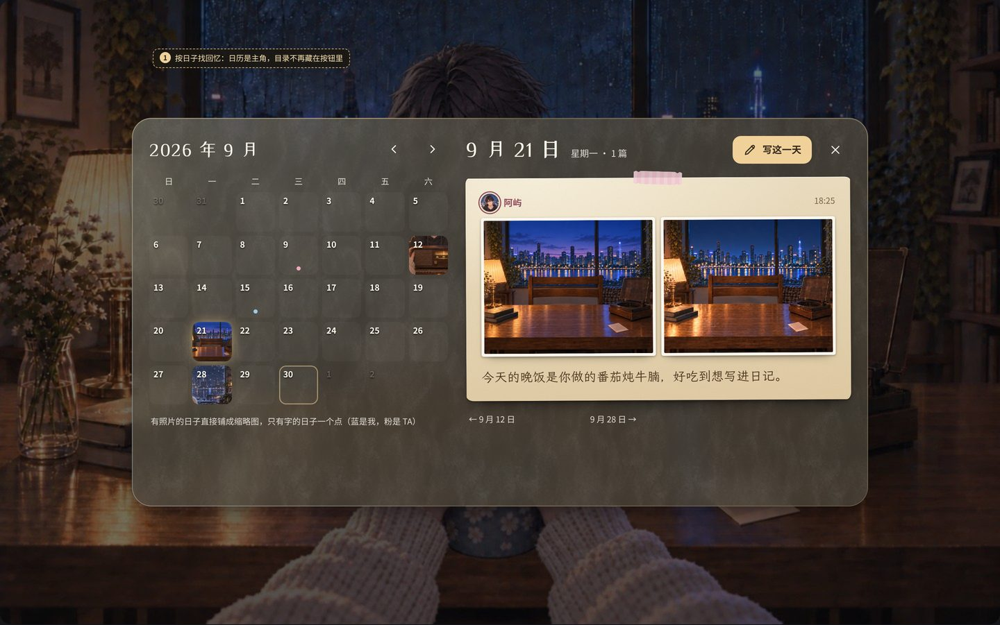
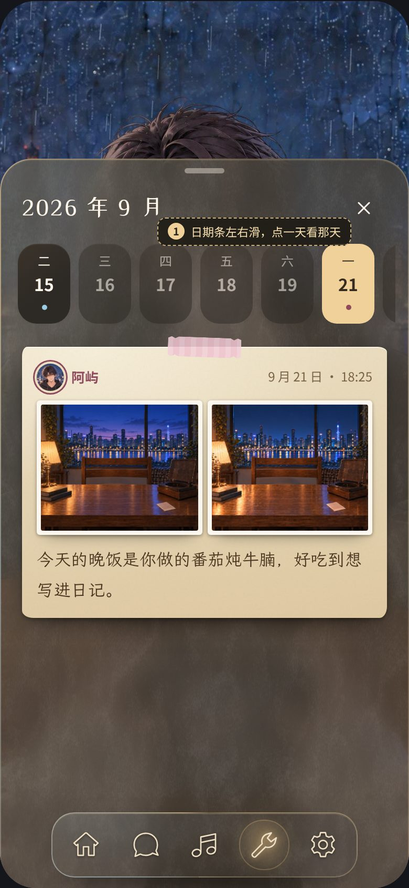
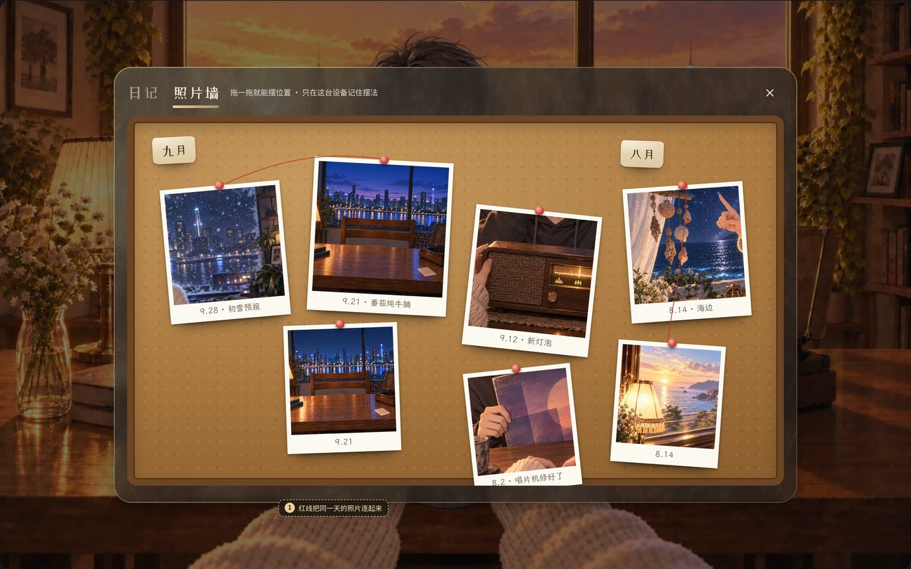
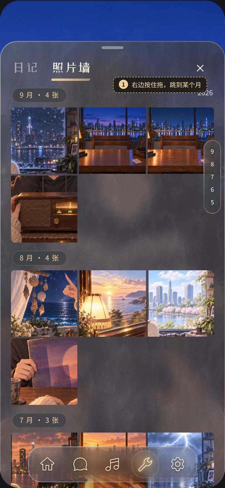
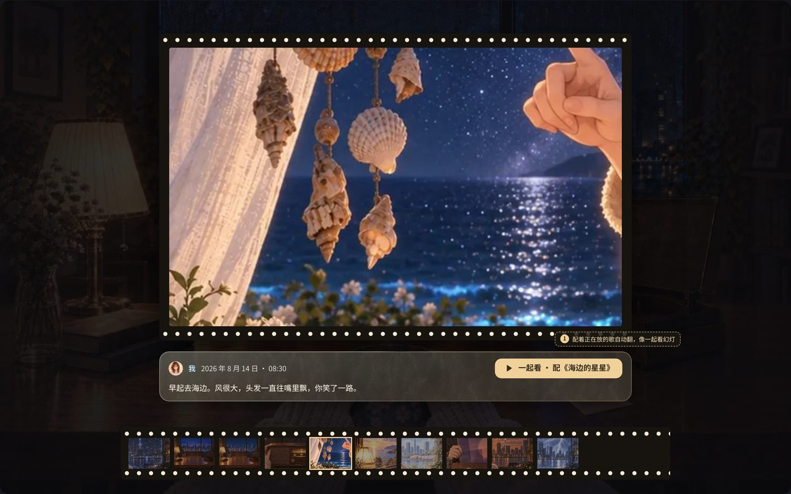

# 日记与照片墙 · 比稿与本期实装

状态：2026-09-30。用户要求日记、照片墙的桌面版和手机版跟这一轮 UI 统一迭代，旧日记先不删，本期直接做完合并。**推荐方案 G1 + H1 已实现**（用户授权直接做完，还没看过，待看样）；其余方向留在这里备选。[看样页](../ui-motion/review/index.html)（第 G、H 节）· [画板](board.html)（用开发服务打开）· 现行规范与录屏见 [UX 参考 §4](../../uiux/cinnaglass/ux/ux.md#4-回忆面板日记--照片墙--实装--待看样g1-手帐--h1-拍立得墙)。

画板用开发环境拍的书房截图做背景，玻璃、纸和胶带的数值抄自实装（[memory.css](../../../../src/themes/cinnaglass/surfaces/memory.css)），图里的照片是现有的歌单海报和书房底图。**没有生成任何美术图**：纸面、胶带、软木、胶片都是 CSS；需要正式美术（纸张纹理、胶带、空状态插画、软木板等）时先用占位，等用户装好 Codex 再出图（2026-09-30 用户定）。

## 改之前

| 桌面：棕皮书居中，TA 只露出头发            | 手机：书本占满，TA 被盖住                   | 照片墙（手机）：任务窗几乎盖满全屏              |
| ------------------------------------------ | ------------------------------------------- | ----------------------------------------------- |
|  |  |  |

问题：日记（C 类物件 UI）在桌面和手机都盖住对方，和这一轮「TA 始终可见」的规则相反；翻页在手机上读长文很碎；关闭、目录、写一页是另一套控件；照片墙是通用任务窗，没有和日记的联系，灯箱不能滑动翻页。

## G · 日记

| G1 手帐长卷（推荐 · 已实现）                                                     | G2 桌面长卷 · 底部托盘               | G3 日历手账                            | G4 棕皮书（保留为「书本（旧版）」）                              |
| -------------------------------------------------------------------------------- | ------------------------------------ | -------------------------------------- | ---------------------------------------------------------------- |
|  |            |              |  |
| 纸页贴在玻璃上从旧到新往下排；桌面停在右列，手机是托盘；TA 始终可见              | 托盘盖住我这边的桌面，横向手卷往回翻 | 左边日历、右边那天的纸页；盖住整张桌子 | 原来的书，设置里可切回                                           |

G3 在手机上是日期条 + 当天纸页：

**为什么推荐 G1**：和音乐停靠栏、手机托盘是同一套载体，TA 一直看得见；竖向长卷读长文最自然，也最容易写下一页（写在末尾，就像日记本的下一页）；用纸片、胶带和手写字把原来那本书的温度留下来。G2 更像「摊在桌上」，但长文要点开读、滚轮要横向映射；G3 的找法最好，但日子稀疏时大半是空格，而且得盖住整张桌子。G3 的「按日子找」已经收进 G1 的「目录」日历。

## H · 照片墙

| H1 拍立得墙（推荐 · 已实现）                                                          | H2 软木板                                | H3 月历相册                  | H4 放映机                     |
| ------------------------------------------------------------------------------------- | ---------------------------------------- | ---------------------------- | ----------------------------- |
|  |                  |    |       |
| 和日记同一个面板，按月两列拍立得，灯箱能跳回那一页日记                                | 按月钉在软木板上，可拖着摆，红线串同一天 | 三列方格、按月跳，一屏看得多 | 大图 + 胶片条，配着音乐自动放 |

**为什么推荐 H1**：照片本来就来自日记，同一个面板两页签，看照片时能一键回到写它的那一页；拍立得保留手作感。H2 最好玩但照片一多就乱，摆法只在本机；H3 最好找但像手机相册；H4 建议以后作为灯箱里的「放映」按钮加进来，而不是替代墙。

## 灯箱（G、H 共用）

| 桌面                                                               | 手机                                                                | 下拉关闭                                                            |
| ------------------------------------------------------------------ | ------------------------------------------------------------------- | ------------------------------------------------------------------- |
|  |  |  |

照片从缩略图里长出来，左右滑 / 方向键翻页，下拉或 Esc 缩回原位；说明条写谁、哪天、那一页的字；从照片墙打开时能「在日记里看」。

## 已实现的范围（G1 + H1 + 灯箱）

回忆面板、日记长卷、目录日历、写一页、照片墙、灯箱，桌面停靠 + 手机托盘；工具菜单新增「日记」；设置里「日记样式：手帐 / 书本（旧版）」。完整的流程、状态、动效数值与录屏在 [UX 参考 §4](../../uiux/cinnaglass/ux/ux.md#4-回忆面板日记--照片墙--实装--待看样g1-手帐--h1-拍立得墙)，结构说明在 [timeline 功能文档](../../../features/timeline.md)。旧书本代码（`src/themes/cinnaglass/journal/`）原样保留，选「书本」时仍然是原来的样子。

## 待你决定

1. 日记用 G1 手帐（已实现），还是换 G2 桌面长卷 / G3 日历手账；旧书本要不要一直留在设置里。
2. 照片墙用 H1 拍立得墙（已实现），还是 H2 软木板 / H3 月历相册；H4 放映要不要以后加进灯箱。
3. 纸张纹理、胶带和空状态插画现在是 CSS 占位，要不要等 Codex 装好后出正式素材。

## 验证边界

- 验证：`tsc -b`、ESLint、Prettier、`vite build` 通过；[手机回归](../../../features/mobile-ui.md) 加了日记和照片墙两页（13 页 × 8 尺寸）、托盘两档、灯箱 Esc 只关照片、草稿收起再打开还在、先开照片墙再切日记也停在最新一页。写一页的发布在样板里用本地假数据走完。
- 没有验证：真实账号下的发布与照片签名（样板里原图签名会失败，灯箱显示「原图暂不可用」）、真机上的拖动与滑动手感、Safari。
