# 手机导航与托盘

> UI Tailor。**第二轮比稿，等用户选**（2026-10-03）。第一轮的坞已实装上线，用户 10-03 在真机上看后否决（见下文第一轮）。选定后把结论写进 [UX 参考 §1](../../uiux/cinnaglass/ux/ux.md) 和 [决定](../../uiux/cinnaglass/decisions.md)，这页移进档案。能上手比较的模拟手机在 [看样页 N 节](../../uiux/cinnaglass/ux/index.html#nav2-title)。

## 第二轮（2026-10-03）

**用户**：导航栏在弹出框后样子改变，打断了体验的延续性；按钮的位置也改变了，同样打断延续性；而且（真机截图里）导航栏甚至遮挡了半打开的 UI。重新去网上调研，结合我们的设计概念，重新比稿。

**约束**（加上 10-02 的「导航不能像一层浮在托盘上」）：

1. 托盘开关时，导航的样子、按钮的位置都不变；
2. 托盘的内容永远不被导航挡住，换什么手机都一样；
3. 导航不叠在托盘的内容上。

**遮挡是怎么来的**：半开高度按可见高度的一半算（`sheet.tsx` 的 `HALF_RATIO`），没扣掉导航和底部安全区。用户的 iPhone 底部安全区 34px，坞是 64 + 34 = 98px，音乐托盘最下面「歌词 / 歌单 / 声音」那一排就被盖住了。样板里按 393 × 852、安全区 34px 复现：

| 现在的坞 · 真机尺寸（已否决）                                    | 方向 A · 同一台手机                                    |
| ---------------------------------------------------------------- | ------------------------------------------------------ |
| 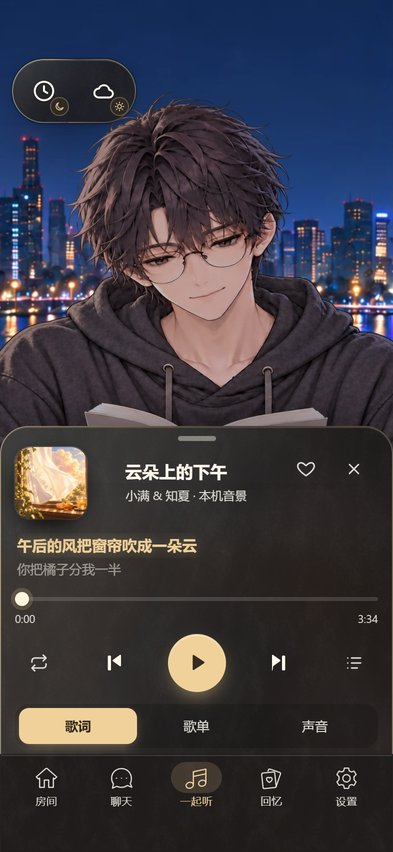 | 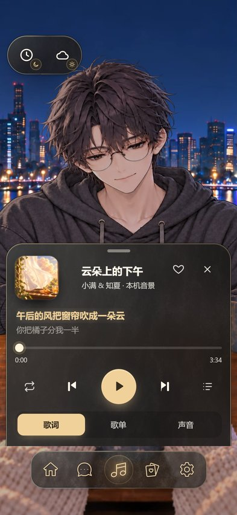 |

### 调研

- **Material**（[Sheets: bottom](https://m2.material.io/components/sheets-bottom)）：可展开的托盘和底部导航一起用时，收起的托盘放在底部导航上方；托盘展开时导航才让开。
- **iOS 26**（[Presenting Liquid Glass sheets](https://nilcoalescing.com/blog/PresentingLiquidGlassSheetsInSwiftUI/)）：半高托盘离开屏幕边缘、四角圆，像浮在界面上；拉到最高才贴到屏幕两边和底边、变成不透明。标签栏是浮着的胶囊，迷你播放器这类「底部配件」放在它上方（[Exploring tab bars on iOS 26](https://www.donnywals.com/exploring-tab-bars-on-ios-26-with-liquid-glass/)）。
- **Google 地图**：可拖的托盘在上，五个标签的导航在下，两者一直同时在（[Mobbin · Bottom sheet](https://mobbin.com/glossary/bottom-sheet)）。
- **我们的概念**：导航胶囊是已定的 A 类悬浮 UI 基准；「TA 优先」——托盘只盖住我这边；「弹层从触发它的地方长出来」——桌面上导航的菜单就是从按钮长出来的。

### 三个方向（导航都保持平时的胶囊；图在正式组件上临时注入样式拍的，代码里没有）

|          | **A · 浮在导航上方**（推荐）                     | B · 插在导航后面                    | C · 凹槽托住导航                                   |
| -------- | ------------------------------------------------ | ----------------------------------- | -------------------------------------------------- |
| 半开音乐 | 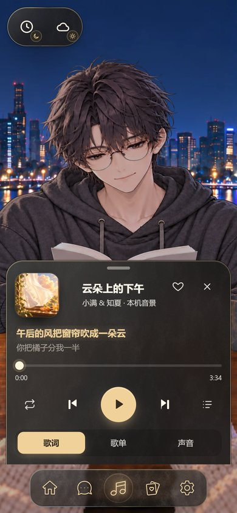              | 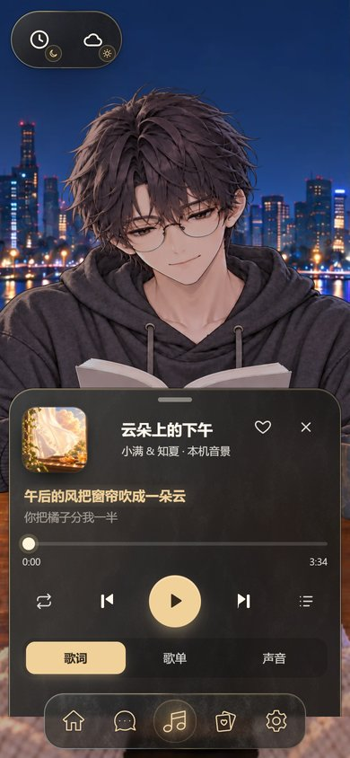 | 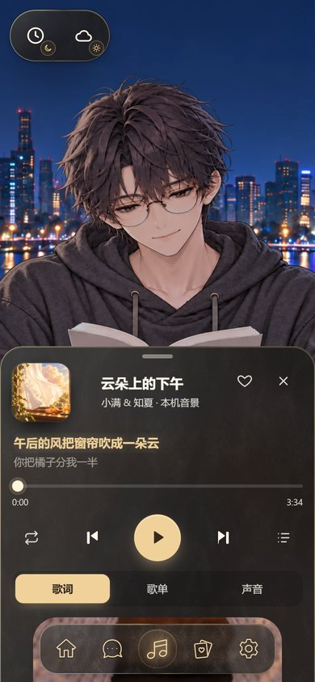                |
| 半开聊天 | 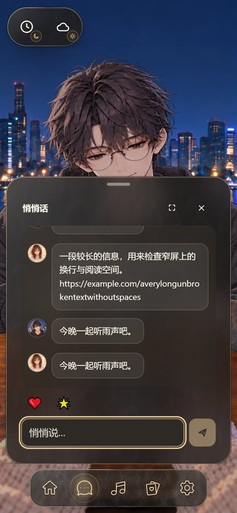               | 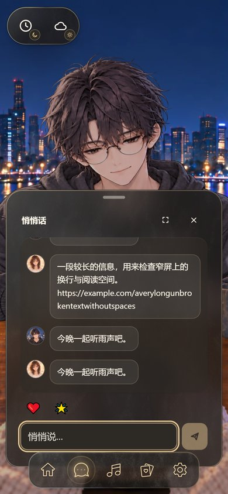  | 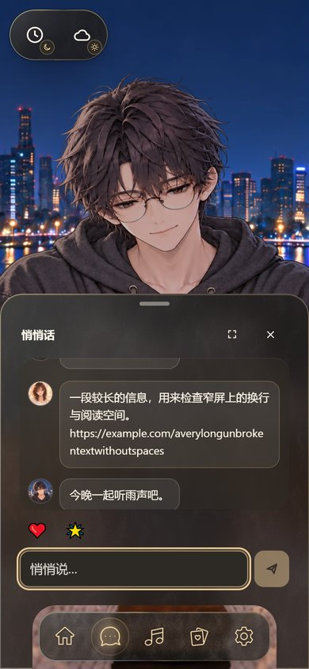                 |
| 拉满     | 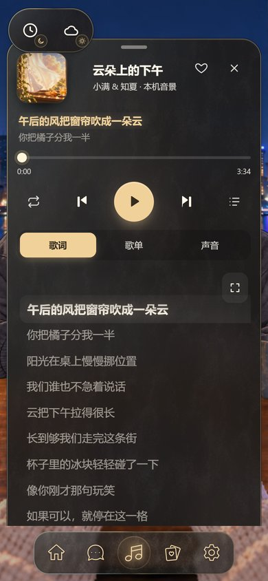               | 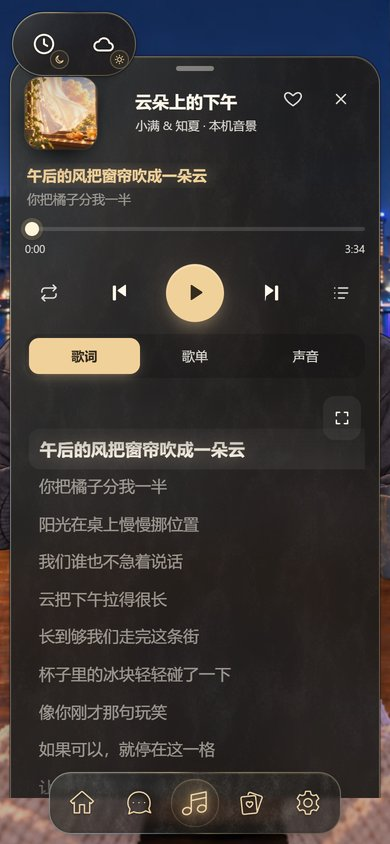  | 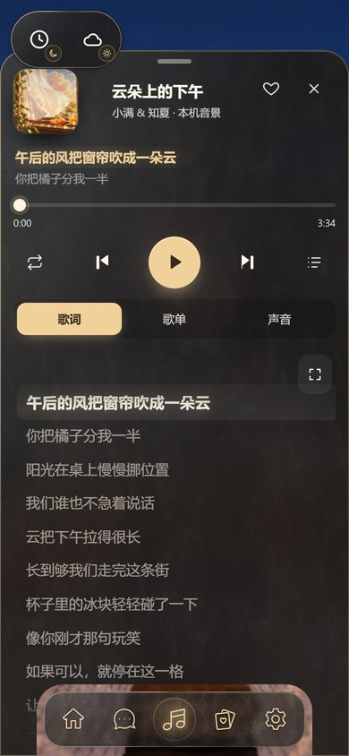                 |
| 导航     | 完全不变，四周仍是房间                           | 不变，但压着托盘的下沿              | 不变，坐在凹槽里，四周露出房间                     |
| 托盘     | 离屏幕边 8px、四角圆的浮层，停在导航上方一道缝里 | 从导航后面抽出来，两侧露出它的下角  | 和以前一样铺到底，导航处挖空                       |
| 动法     | 从导航上沿里长出来，收起时缩回那里               | 从导航后面滑出、滑回                | 从屏幕底边升起，凹槽一直在                         |
| 挡内容   | 不会                                             | 不会（内容在导航上方结束）          | 不会（内容在凹槽上方结束）                         |
| 像第三层 | 不会：两块玻璃不重叠                             | 有一点：导航叠在托盘边上            | 不会：导航和托盘之间是房间                         |
| 做起来   | 最省：静止的圆角裁切框，托盘在框里移动           | 同 A                                | 要带凹槽的遮罩，第一次画更贵；凹槽两侧的托盘是空白 |

**推荐 A**：只有它让导航的样子、位置和背后的房间三样都不变；托盘和导航不重叠；内容量在导航上沿以上，哪台手机都不挡；托盘从导航上沿里长出来，和桌面「弹层从触发它的地方长出来」是同一个规矩；四周露出一点房间，「场景一直在」的感觉更强；做起来最省。C 是第二选择（更想要「托盘贴着屏幕底」的稳），B 有一点叠层感。拉满时三个方向都留着导航（用户要连续），这点和 Material「展开时导航让开」不同。

**三个方向共用的改动**（选定后一起做）：

- 半开高度按内容算：音乐露出「正在播放」那一块（到「歌词 / 歌单 / 声音」为止），聊天露出到输入框；量的是导航上沿（含安全区）以上的空间。对方的脸仍然完整露出。
- 拉满高度：从顶上让出安全区和 56px，到导航上方（A、B）或屏幕底（C，凹槽上方是内容的结束处）。
- 托盘在一个静止的裁切框里移动（A、B 是圆角框，C 是带凹槽的框）：裁切框不动，托盘只做位移，开关和拖动都还走合成器。
- 去掉坞的全部样式，导航回到 10-01 之前的胶囊；回归检查改成「托盘打开时导航的位置、大小和关着时一样，托盘内容的下沿在导航上沿以上」。

## 第一轮：坞（2026-10-02 实装，10-03 用户否决）

**用户（2026-10-02）**：托盘出现时导航只是去掉背景还不够，图标看起来没有成为托盘的一部分，有第三层的感觉。

| 10-01（改之前）                                             | 坞：标签栏（10-02 实装 · 10-03 否决）                     | 备选①：只把图标染成托盘的墨色                                                  | 备选②：托盘打开时藏起导航                                |
| ----------------------------------------------------------- | --------------------------------------------------------- | ------------------------------------------------------------------------------ | -------------------------------------------------------- |
|  |  |  |  |
| 图标浮在托盘上，第三层                                      | 读成托盘的底边：贴底、整宽、托盘的玻璃和字色、写着名字    | 颜色对了，位置和形状还是胶囊的，内容照样从底下滑过                             | 最干净，但换到另一个托盘要先关再开                       |

坞当时的理由是「手机应用底部标签栏」的读法（[Apple HIG · Tab bars](https://developer.apple.com/design/human-interface-guidelines/tab-bars)、Material 3 [Navigation bar](https://m3.material.io/components/navigation-bar/overview)）。没想到的是：标签栏本身是一个持续存在的元素，在 iOS / Android 上它从不因为托盘而变形；我们让胶囊在托盘打开时变成标签栏，恰恰把「持续存在的东西」变成了会变的东西，按钮也跟着挪位。再加上它占了 64px 加安全区的高度、半开高度没把它算进去，真机上就盖住了内容。第二轮的三个方向都让导航保持原样。

实现（在用户选定第二轮方向时一起撤掉）：[navigation-glass.css](../../../../src/themes/cinnaglass/shell/navigation-glass.css) 的竖屏手机段、[sheet.css](../../../../src/themes/cinnaglass/ui/sheet.css) 的 `--ui-dock-h`，手机回归里「导航整宽贴底」的检查。
