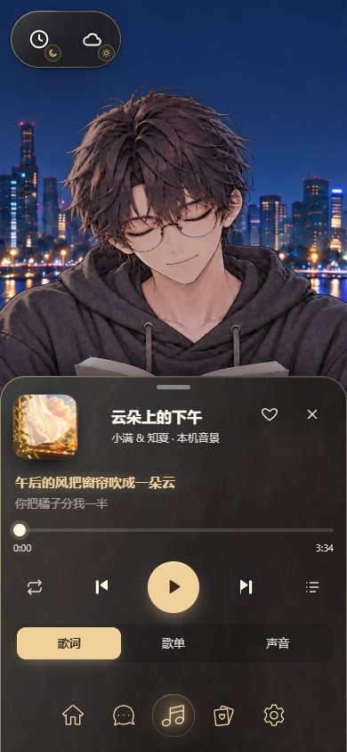

# 手机导航与托盘：坞（标签栏）

> UI Tailor，2026-10-02。**已实装、待用户看样**：用户在线上看过点头后，把这页的结论留在 [UX 参考 §1](../../uiux/cinnaglass/ux/ux.md) 和 [决定 U-23](../../uiux/cinnaglass/decisions.md)，这页移进档案。

**用户（2026-10-02）**：现在手机版导航栏会在弹出框出现时取消背景，这不够——没背景的图标大部分情况下还是看起来没有成为弹出框的一部分，还是有第三层的感觉，要重新设计。

## 问题出在哪

10-01 的做法（下图第一张）只把导航胶囊的底、霜纹和描边淡掉。剩下的图标仍然：

- 带着自己的发光底和投影，选中的那个还有一圈金色光晕——这是浮在场景上的按钮的画法，不是面板里的东西；
- 停在胶囊原来的位置：比屏幕窄、离底边 10px、间距是胶囊的间距，和托盘的边、托盘里的排版对不上；
- 托盘升起、拖动的时候，托盘里的内容从图标**底下**滑过——眼睛看到的就是三层：场景、托盘、浮在托盘上的一排图标。

## 三个方向（同一个夜晚的书房、同一首歌、390 × 844）

| 10-01（改之前）                                             | **坞：标签栏**（采用 · 已实装）                           | 备选①：只把图标染成托盘的墨色（只出设计）                                      | 备选②：托盘打开时藏起导航（只出设计）                    |
| ----------------------------------------------------------- | --------------------------------------------------------- | ------------------------------------------------------------------------------ | -------------------------------------------------------- |
|  |  |  |  |
| 图标浮在托盘上，第三层                                      | 读成托盘的底边：贴底、整宽、托盘的玻璃和字色、写着名字    | 颜色对了，位置和形状还是胶囊的，内容照样从底下滑过                             | 最干净，但换到另一个托盘要先关再开，「一次一个」多一步   |

（备选的两张是在正式组件上临时注入样式拍的，代码里没有。）

**采用坞的理由**

- 手机应用底部的标签栏是最熟的一种读法：整宽、贴底、图标加名字、当前项有一块底（[Apple HIG · Tab bars](https://developer.apple.com/design/human-interface-guidelines/tab-bars)；Material 3 的 [Navigation bar](https://m3.material.io/components/navigation-bar/overview) 用的就是图标后面一块圆角的「当前项指示」）。看到它，就知道它属于这块面板，而不是另一层。
- 它用托盘自己的材料：`--ui-base` 的玻璃（比托盘略实，内容从后面经过时被挡住）、面板里的细分隔线 `--ui-line`、托盘的次要字色和金色。三种界面风格都跟着变。
- 托盘从它后面升起、沉回它里面，于是「托盘 + 标签栏」是一个整体在动；切换到另一个托盘时它不收回。
- 名字顺便解决了手机上没有悬停提示的问题（桌面上悬停才出的名字，在手机上一直不可见）。

## 动起来

- **展开是一下切过去**：在托盘还看不见的时候（托盘先画好再升起）胶囊换成标签栏，只有颜色 260ms 过渡、名字 260ms 淡入。最初做的是逐帧变宽变高，帧测发现这会让托盘升起的每一帧都多一次排版和重画（开托盘的累计卡顿多出约 70ms），所以改成切换。
- **收起有过程**：托盘沉下时名字 150ms 先淡出；托盘卸下后，标签栏 260ms `--ease-out` 收回胶囊（宽、高、圆角、图标 25 → 28px，往上回到离底 10px 用的是 `translate`），这时别的都不在动，房间也还停着。
- 低动效：形状直接换，只有颜色淡变。

## 实现与验证

- 样式在 [navigation-glass.css](../../../../src/themes/cinnaglass/shell/navigation-glass.css) 的竖屏手机段（`max-width: 767px` 且 `min-height: 600px`；横屏仍是右侧一列托盘加导航自己的胶囊），用 `.app:has(.ui-sheet[data-state=open|closing])` 判断；托盘的底边留白由 `--ui-dock-h`（64px）决定（[sheet.css](../../../../src/themes/cinnaglass/ui/sheet.css)）。
- 手机回归 [check-mobile-ui.mjs](../../../../scripts/check-mobile-ui.mjs) 现在检查：托盘打开时导航整宽贴底、写着名字。
- 录屏：[手机托盘与坞](../../uiux/cinnaglass/ux/live/phone-sheets.mp4)（一起听 → 回忆 → 房间 → 关闭 → 聊天 → 设置）。
