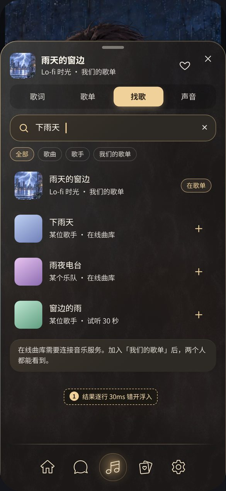
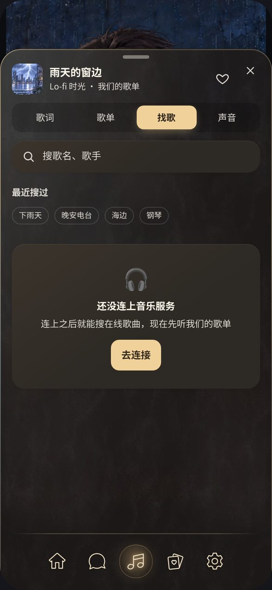
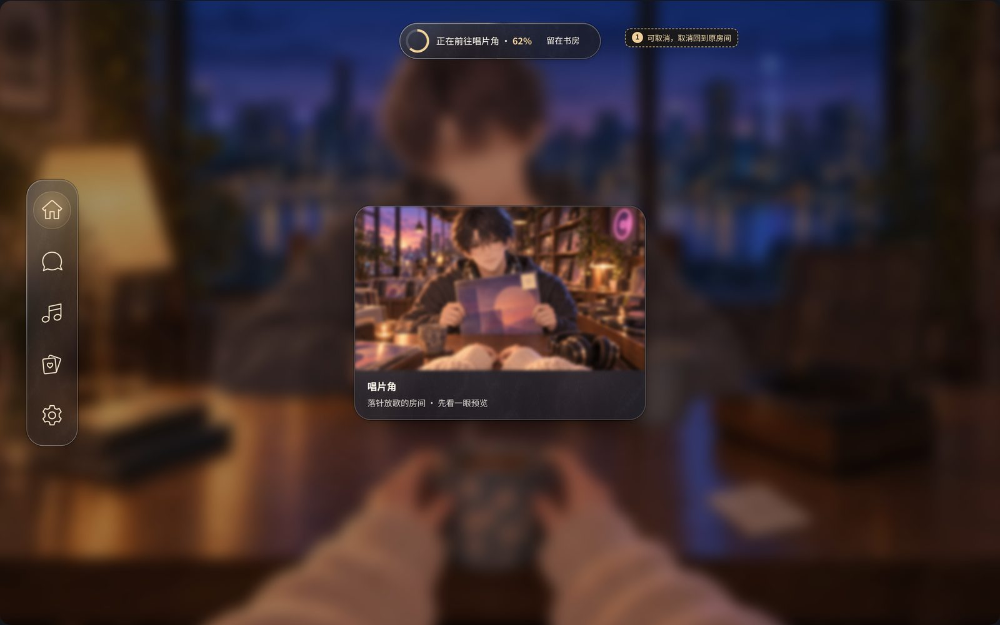
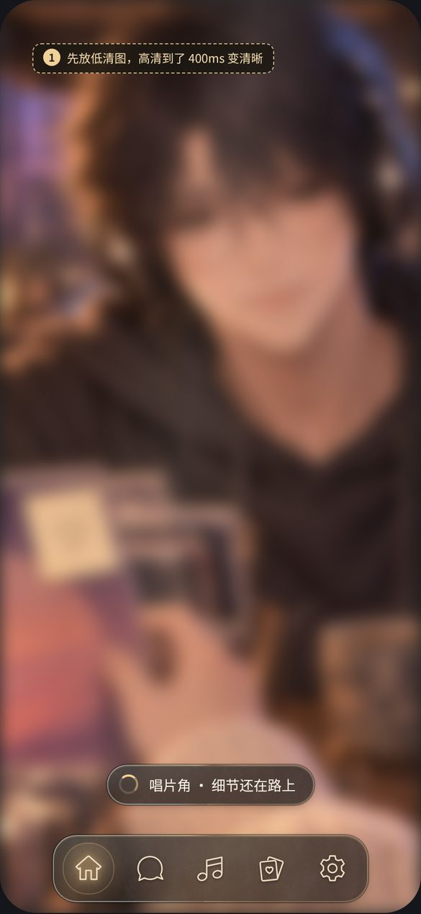

# 找歌与房间切换 · 还没做的设计

> 2026-10-02 起这里只放**还在等**的两组：C 找歌、E 房间切换的加载。2026-09-29 那一轮的其余方案（手机托盘 A、音乐主页面 B、进入世界 D、反馈语言 F）都已定案并实装：规范在 [UX 参考](../../uiux/cinnaglass/ux/ux.md)，现在的界面、录屏和动效试验区在 [UI/UX 看样页](../../uiux/cinnaglass/ux/index.html)，当时的比稿和说明移进了 [档案](../../../../arts/archive/v3-ui-rounds/ui-motion/ui-motion.md)。

两组画板在 2026-10-02 按现在的界面重画：导航第四项是「回忆」，托盘打开时导航并进托盘，每个托盘都有关闭按钮，玻璃是深玻璃。画板源文件是 [board.html](board.html)（用开发服务打开），背景是在开发环境里拍的书房（隐藏了界面），材质数值抄自线上 Cinnaglass（[ui-system.css](../../../../src/themes/cinnaglass/ui/ui-system.css)），所以玻璃和线上一致。图上的金色虚线标签是设计注记，不是界面。图不是生成的：用 HTML 按真实素材搭出来，再由浏览器截图。

## C · 找歌（只出设计）

| C1 找歌                                                                        | C2 一起听（远期）                                | C3 未连接与最近搜索                                              |
| ------------------------------------------------------------------------------ | ------------------------------------------------ | ---------------------------------------------------------------- |
|  |  |  |

- **C1**：音乐托盘的第三个标签换成「找歌」：搜索框加类型胶囊，本地歌单的命中排最前，在线结果标出来源和试听限制，「+」加进「我们的歌单」后两个人都能看到。
- **C2**：接上在线曲库以后的共享听歌：托盘顶上显示对方也在听，谁暂停两边一起停，对方切歌时头像轻轻闪一下。
- **C3**：没连音乐服务时的空状态，说清楚为什么搜不到、下一步做什么；最近搜过的词做成胶囊，点一下就搜。

**等什么**：音乐来源（用哪个平台、版权、怎么登录）要用户定，定了以后再细化这一组。共享听歌要在线曲库加实时同步，放到远期。

## E · 房间切换的加载（只出设计）

| E2 卡片进度环（建议）                                          | E3 低清先到（建议）                                            |
| -------------------------------------------------------------- | -------------------------------------------------------------- |
|  |  |

建议以后 E2 + E3 组合：点房间卡后人还留在当前房间，卡角画一圈进度；好了以后横移过去，先放缩略图糊着，高清到了再变清楚。E1 的顶部胶囊留给网络慢的时候（例如超过 1.5 秒），并且能「留在书房」取消。进度直接复用进入世界那一套（[load-progress.ts](../../../../src/themes/cinnaglass/shell/load-progress.ts)）。

**等什么**：第二个房间。现在只有书房能进。

## 依据

- **动画库**（09-29 调研，全文在 [档案](../../../../arts/archive/v3-ui-rounds/ui-motion/ui-motion.md)）：CSS 优先，加一个自写的小托盘，不新增依赖。Motion 太重，而且跑在主线程，会和常驻的书房场景抢帧；Vaul 已经不维护；以后想换成熟的抽屉组件，首选 Base UI Drawer。
- **弹簧**（10-02 调研，用户要求参考苹果的弹簧曲线）：按 WWDC23「Animate with springs」的模型，用「感觉多长」和「回弹多少」来定弹簧；拖动按 WWDC18「Designing Fluid Interfaces」：跟手、可以打断、按速度推算落点、过边缘有橡皮筋。数值和用法写在 [UX 参考](../../uiux/cinnaglass/ux/ux.md)，能拖着试的在 [看样页 M 节](../../uiux/cinnaglass/ux/index.html#spring-title)。以后做这两组时照这一套来：E2 卡片横移过去用 `--spring-snappy`，C 的结果逐条浮入用 `--ease-spring`。
