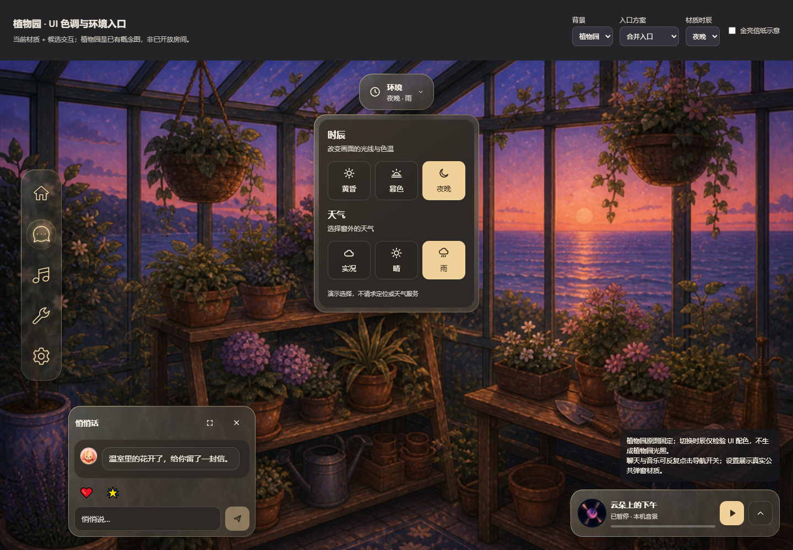
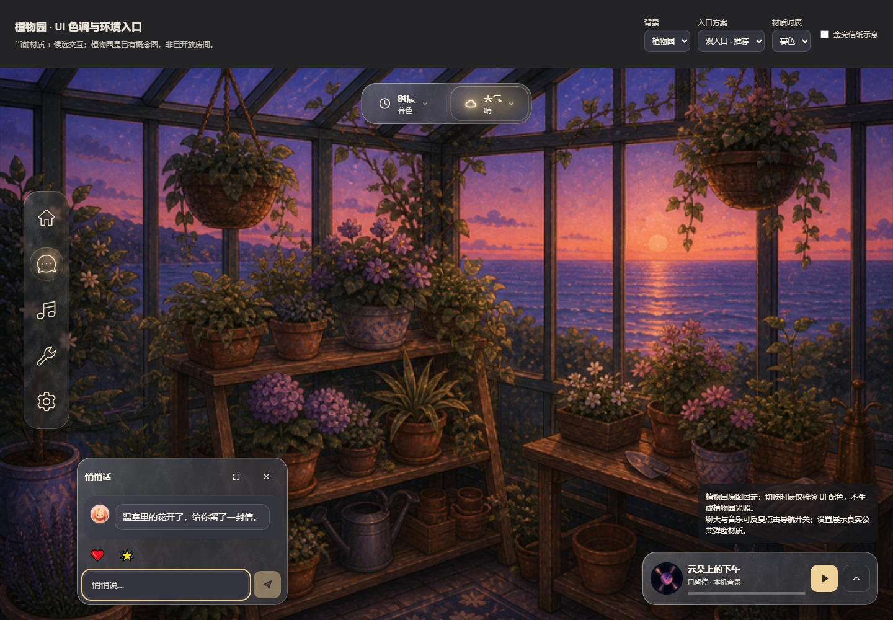
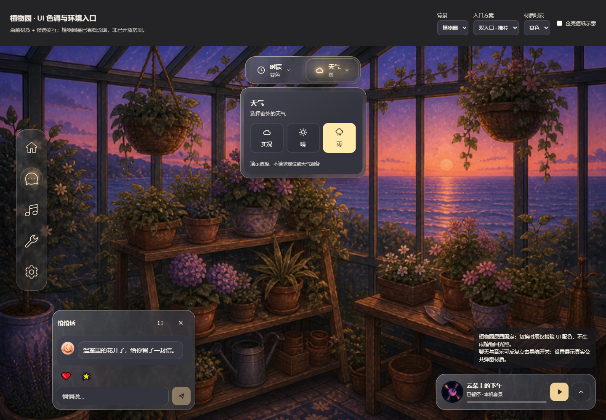
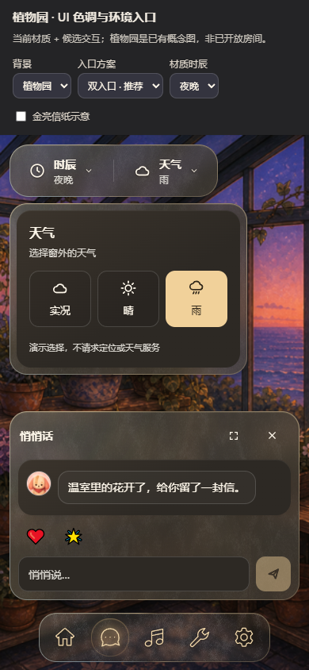
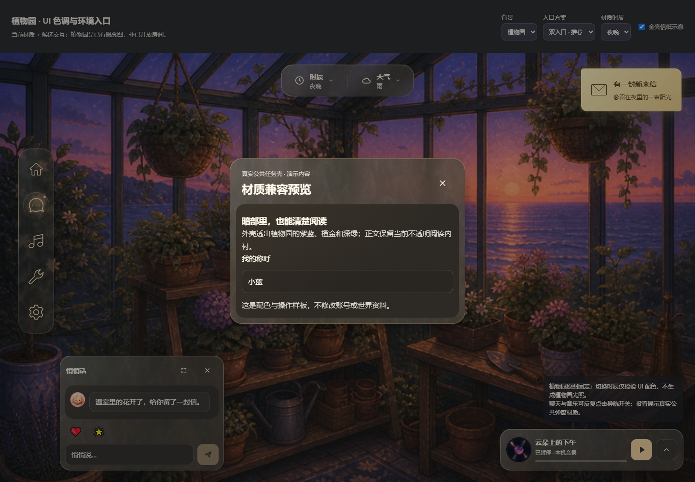
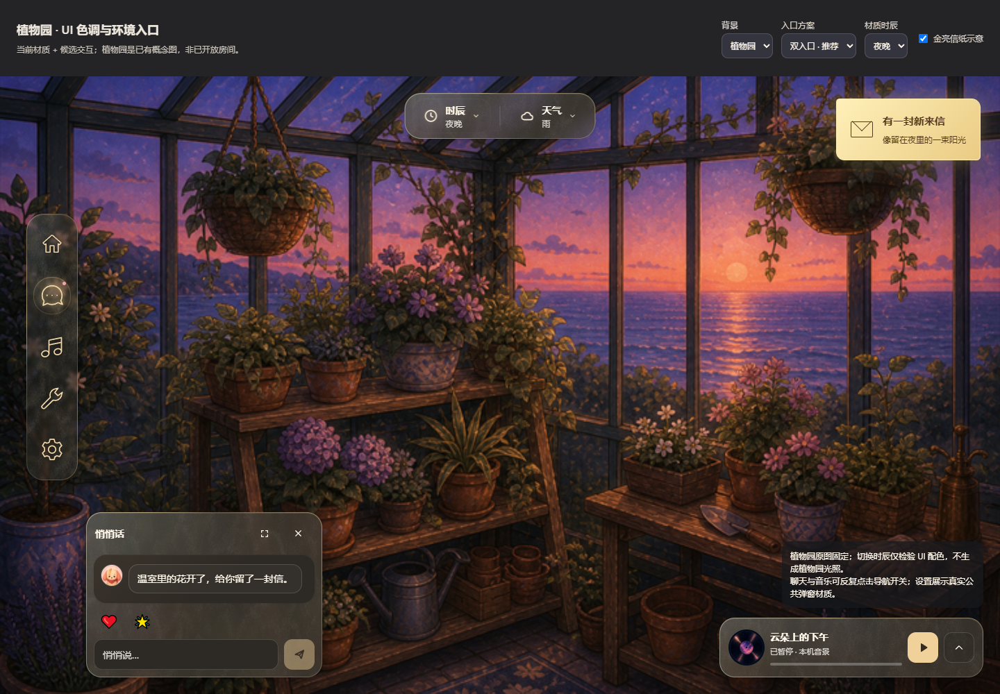
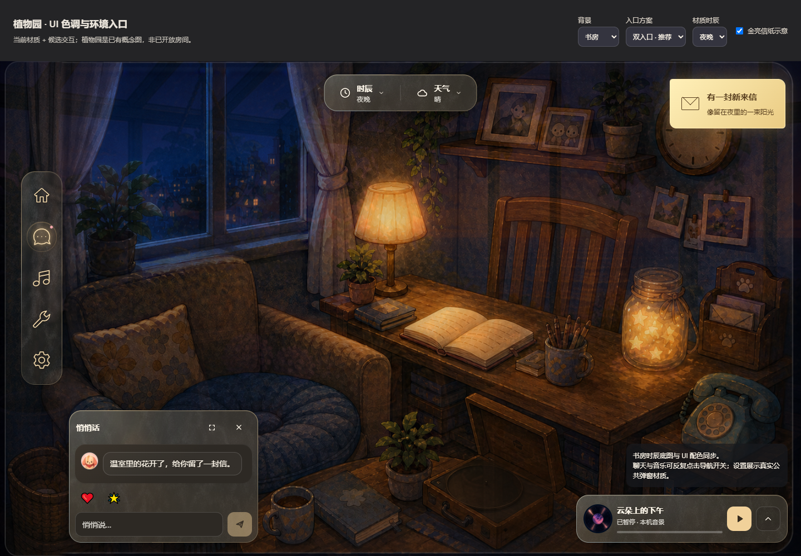
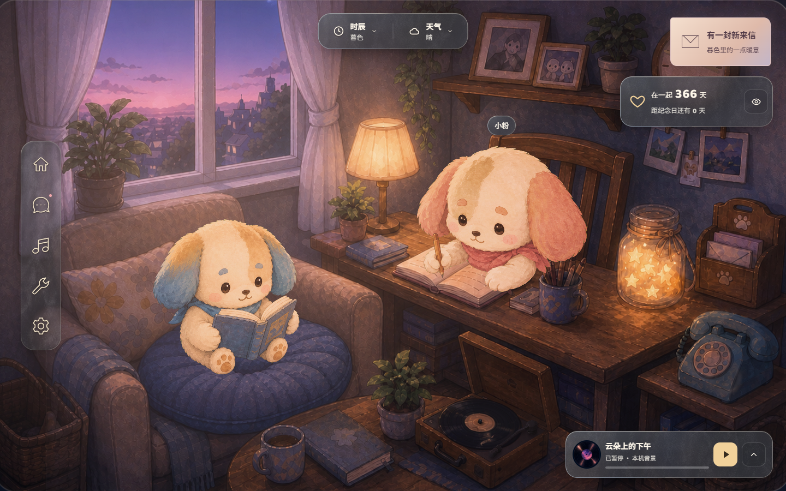
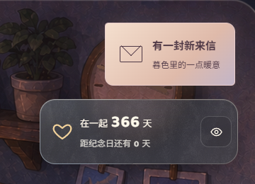
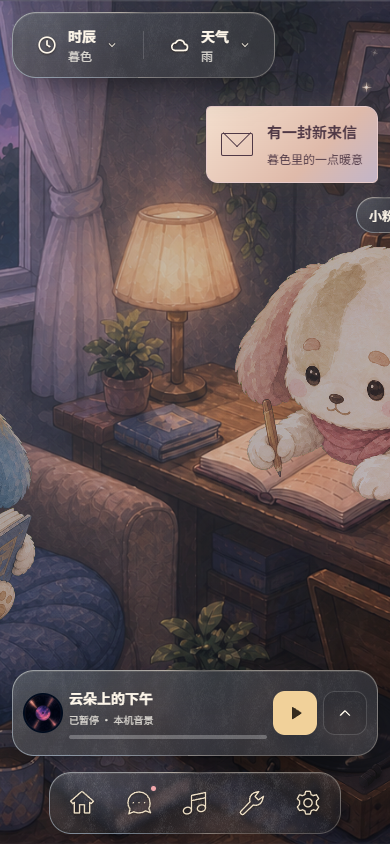

# 植物园兼容与暮色信纸 · 看样及研究档案

> 本页记录上一轮已采用方向与信纸看样；最新环境控件候选见 [圆钮 A/B](climate-orbits.md)，尚未定稿。可操作页面默认书房夜晚、A 双圆收纳，顶部另可选 B 双轨直达、现行版双入口和历史合并入口。

[打开可操作 mock](climate-controls.html) / [当前正式规范](../../uiux/cinnaglass/ui-system.md) / [产品光影理念](../../design-system.md#光影之间的信息)

## 使用与边界

顶部可切换植物园/书房、四种入口方案、三时辰材质与来信演示，也可隐藏工具只看场景。现行双入口与信纸复用正式 Ambience / SunlitLetter；天气实况在本页不接定位，现行版显示不可用，新候选仅演示选中。聊天和音乐导航可反复开关；设置打开实际 TaskDialog。此页使用真实 Rail、ChatCard、MusicMini、TaskDialog 与公共材质，消息为本页演示数据，音乐为本机合成音景，不调用账号写入。天气选择不请求定位；植物园底图固定，切换时辰仅改变 UI 配色；书房则切换已有时辰原画。

植物园来源：[arts 原图](../../../../arts/rooms/thumbs/garden.png)。它仍是概念图，不把放大后的画质或植物园运行时光照视为已完成验收。当前正文不透明内衬保持原配方，检验它与紫蓝天空、橙金夕照、深绿植物的兼容。

## 入口方向

**已采用双入口**：常驻「时辰 / 天气」类别文字和当前值；时辰用时钟、天气用云作为类别图标，太阳/月亮只在带文字的具体选项中出现。点哪个直接展开对应三选项，两个菜单互斥；再点触发钮或 Esc 收起，Esc 返回原入口。

**合并入口**：一个「环境」按钮，二级文字显示时辰与天气；面板同时列两组。占地更少，但识别与查找具体组仍多一步视觉扫描。合并方向留作历史对照，正式产品采用双入口。

**hover**：已接入正式 Ambience，复用导航 `.rail-btn` 的径向暖光、边缘、图标辉光和键盘焦点。下面原始 mock 截图用于追溯批准稿，当前实装以 [正式规范](../../uiux/cinnaglass/ui-system.md#时辰--天气与新来信) 为准。

## 配色与信息示意

夜晚信纸已按批准稿接入世界会话未读；这里的复选框仍只控制隔离演示，不写账号数据。评估时看大面积阅读底是否协调、暖金信息是否清楚但不过曝；不改变日记和现有场景光照。

## 设计依据

用户明确指出太阳/月亮相似造成误判，本方案用常驻文字明确分类，再用不同类别图标辅助；[NN/g 图标可用性研究](https://www.nngroup.com/articles/icon-usability/) 同样建议为存在歧义的图标提供文字标签。减少点击不是隐藏名称，而是让用户从正确入口直接到需要的选项。

本页保留研究来源与未确认适配。已采用双入口与夜晚信纸登记在 uiux；合并方向未采用，暮色适配待用户看样。

## 暮色适配 · 本地实现，待用户视觉反馈

同一个纸张轮廓，纸面改为玫瑰金 `#f4dfce → #dfbaaa`，右侧收至灰紫 `#c2b5c8`；文字 `#503946`，近处暖光减弱、远处仅少量紫光。夜晚保留原金亮配方；不修改导航磨砂和阅读内衬。使用真实产品组件、书房原画与隔离消息数据截图，没有新增纸张位图素材。

形状、消息触发与关闭流程沿已批准实现；这部分展示新增的时辰配色，用户反馈后再晋升对应选定截图。来源：[组件](../../../../src/themes/cinnaglass/shell/sunlit-letter.tsx)、[样式](../../../../src/themes/cinnaglass/shell/sunlit-letter.css)。
