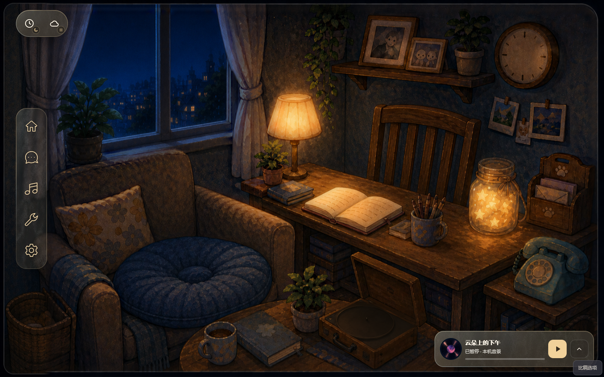
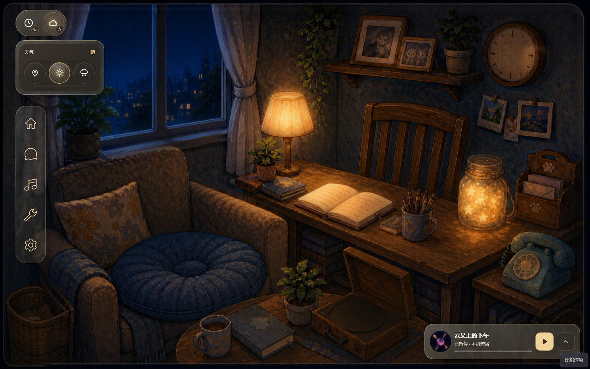
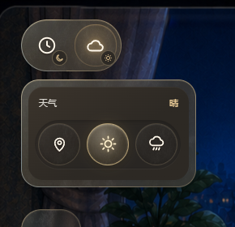
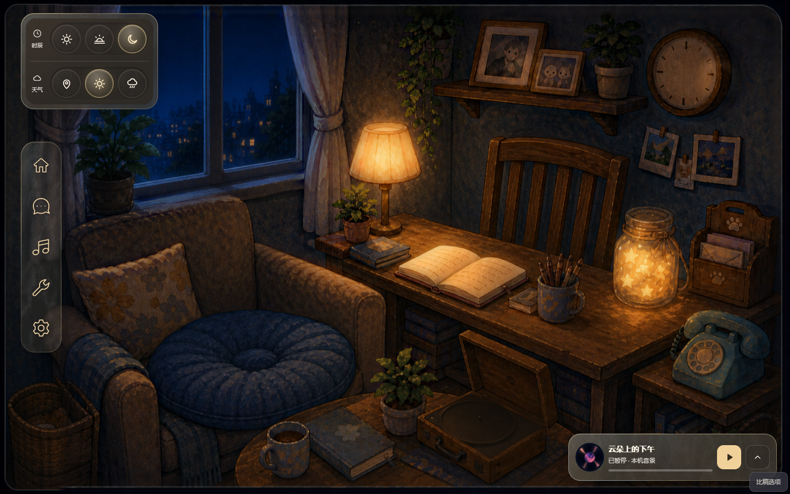
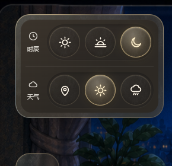
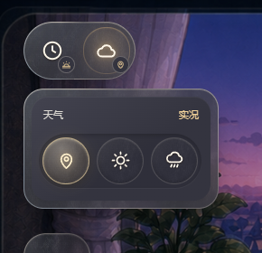
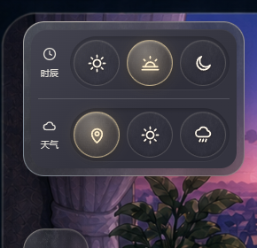
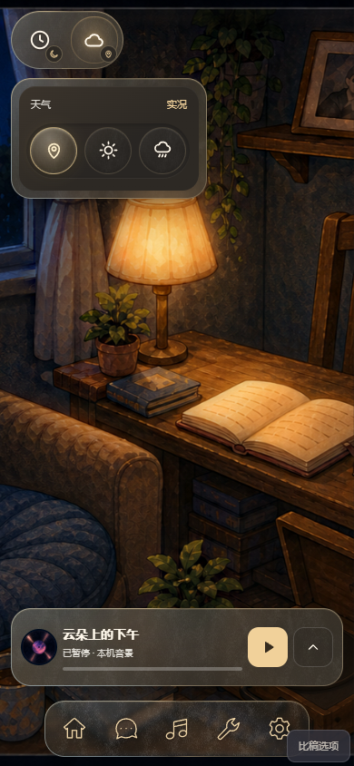
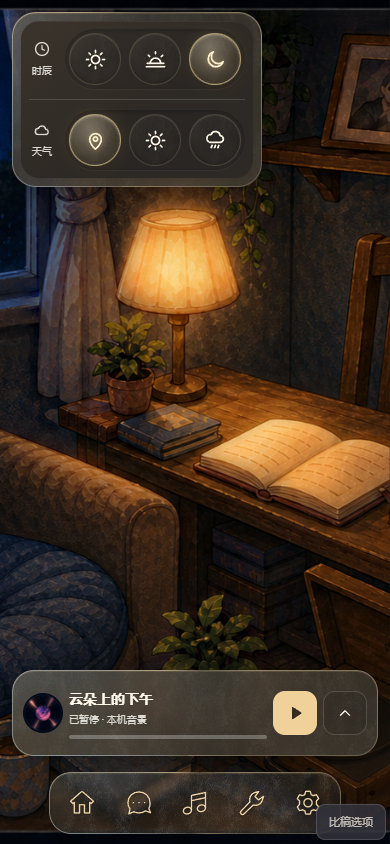
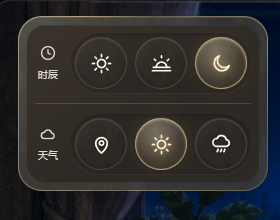

# 环境圆钮 · A/B 候选

状态：2026-09-20 用户选定 A 双圆收纳，已接正式 Ambience；B 保留为历史备选。以下图片记录选型时的候选，最新状态/实装截图以现行 UI 为准。[打开比稿](climate-controls.html) / [现行 UI](../../uiux/cinnaglass/ui-system.md) / [上一轮与信纸](climate-controls.md)。顶部可切换方案、场景与时辰，点击「只看场景」隐藏看样工具。

## 同一背景上的两个方向

沿用已认可的磨砂外壳和随时辰受色的深色内衬。内圈改为导航同源的细反光边、固定纹理和暖光反馈；选中态是一枚滑动的透明金色透镜，取代整块实心黄色。取消说明段落，保留类别和状态短词，名称在悬停或键盘聚焦时显示。

**A · 双圆收纳（推荐）**：左上角只露出时钟、云两个类别圆钮，小角标表达当前状态；点击展开对应三选项，再点收起。适合房间长期安静地开着，代价是切换需要先展开。

**B · 双轨直达**：两排圆钮常驻左上角，每排左侧用类别图标和短词区分。一次点击或横向拖动即可切换，代价是常驻面积更大。

天气实况使用定位符号，避免把太阳误当作天气类别入口；时辰类别始终是时钟、天气类别始终是云。无障碍名称始终存在，不依赖 tooltip。图标对初次使用者的理解仍需用户试用反馈，不能把减少文字视为已消除认知成本。

## 暮色与窄屏

桌面入口距左 38px、上 24px；窄/矮屏均为 12px。圆钮触点为 52px，间距 8px。外壳不承担滚动，保留反光边；正式现行控件仅在内容超高时由内衬提供细条纵向滚动，正常尺寸没有横竖滚动条。

## 局部动效与操作契约

- 同一枚选中透镜沿轨道平移：360ms，`cubic-bezier(0.22, 0.8, 0.2, 1)`；连续切换从当前视觉位置续接。
- A 展开为 180ms 淡入与 5px 上移归位；关闭即时。两类别互斥，点外关闭，Esc 关闭并返回原按钮。
- 点击选择；横拖超过 8px 后按最近槽位选择。键盘方向键循环选择，Tab 进入当前选项，空格选择。
- 系统「减少动态效果」开启时去掉本候选的滑动与展开动画。

这是用户本轮明确要求的环境控件局部动效样板；全项目动画体系仍后置，曲线与时长不自动晋升全局规范。

## 素材与实现边界

复用真实书房三时辰原画、植物园概念图及 `/ui/nav/frost.webp`；没有新增绘画素材。植物园切时辰只改变 UI 配色，不代表植物园已实现重光照。组件：[climate-orbits.tsx](climate-orbits.tsx)，样式：[climate-orbits.css](climate-orbits.css)，宿主页：[climate-controls.tsx](climate-controls.tsx)。天气为隔离演示，不定位、不请求天气、不写账号；当前截图均为浏览器真实组件渲染。

交互依据：[WAI-ARIA Radio Group](https://www.w3.org/WAI/ARIA/apg/patterns/radio/) 的分组、选中和键盘语义；[MDN prefers-reduced-motion](https://developer.mozilla.org/en-US/docs/Web/CSS/Reference/At-rules/@media/prefers-reduced-motion) 的系统动效偏好。视觉由本代理按 Monet 标准自审，不标为独立主美审核。选定 A 的规范和正式组件截图/动图已晋升 `uiux/`；本页保留比稿来源，不作为当前状态真源。
