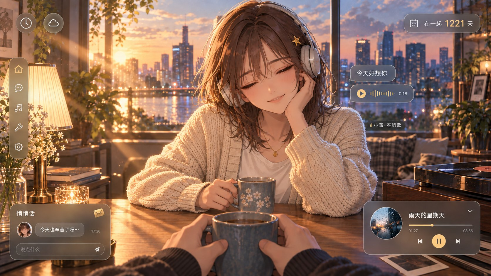
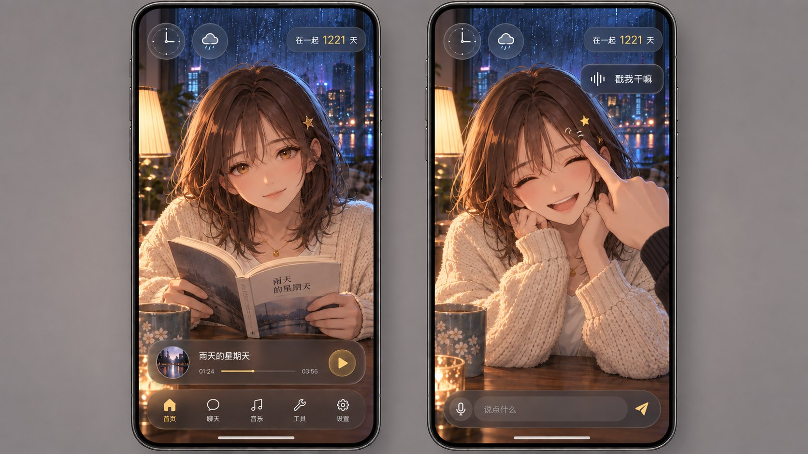
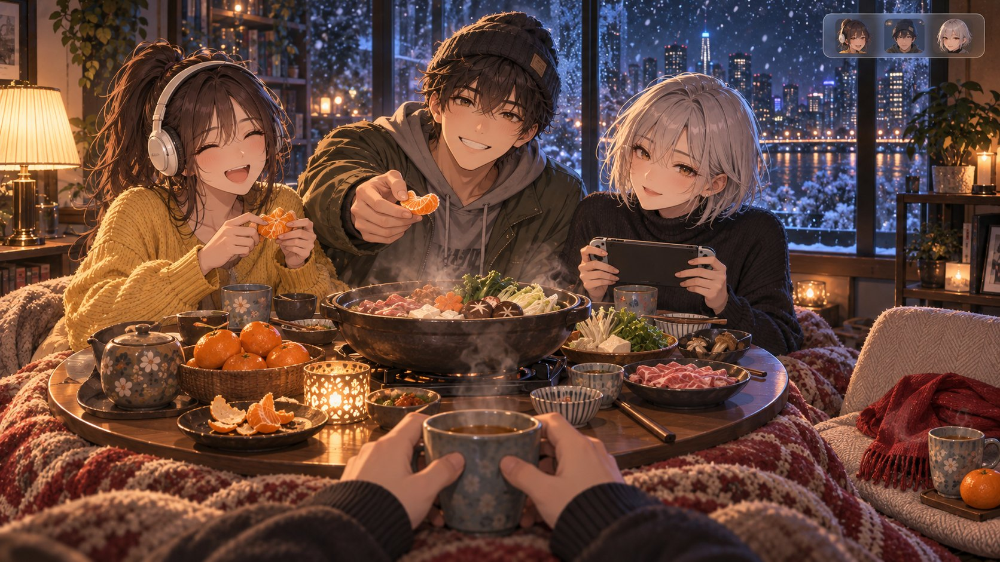
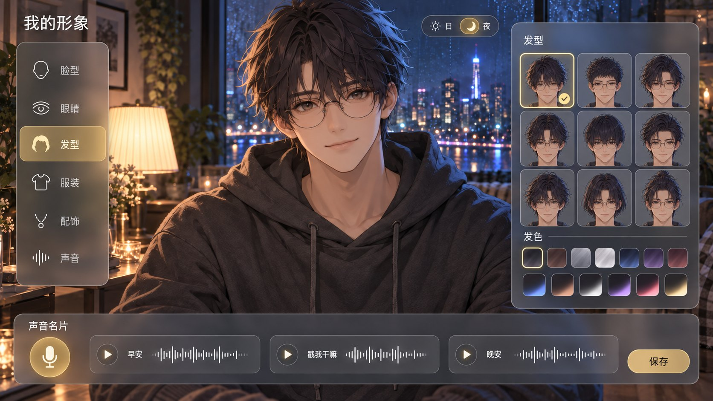
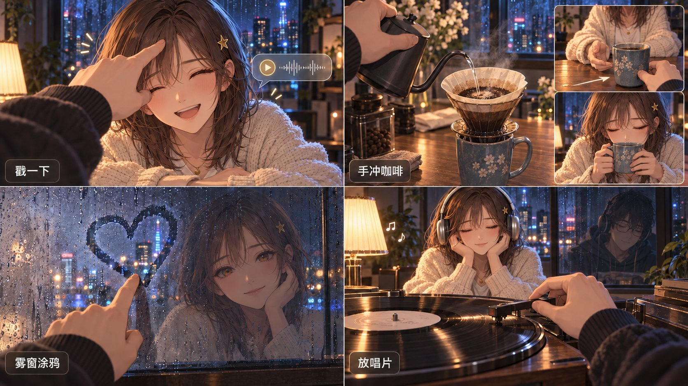
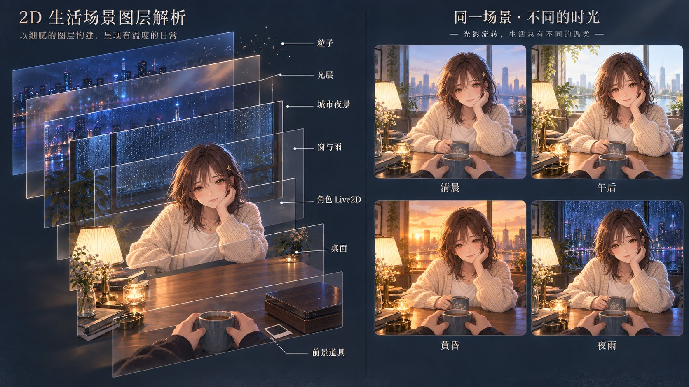

# 概念 A「对坐」——设计交付与像素复核

## 1. 模式与归一化任务

- **模式：design**。本批仅深化 A「对坐」，不替代另外两条方向，也不评选跨方向胜者。
- **交付：7 张完成的概念 PNG**，统一 1672 × 941，约 16:9；另保留 4 张被修订初稿、精确提示词与文件校验清单。内置工具未提供尺寸参数；提示词要求最大支持横图，实际尺寸如上，不声称 4K。
- **概念命题：镜头就是用户本人。** 阿屿看见对面的小满，小满应看见对面的阿屿；自己的存在由杯子、双手、衣袖和窗中倒影提示。
- **视觉要求（生成前锁定）：** 成年原创人类半身；小满固定栗棕齐肩发、碎刘海、星夹、琥珀眼、奶油针织开衫、白 T 与细金项链；阿屿固定深发、圆眼镜、炭灰连帽衫。近景手与杯、中景伙伴、远景窗雨与城市；暖灯主光加冷窗轮廓光；高完成度二维动漫 CG。手机独立构图；悬浮 UI 沿用 Cinnaglass；互动产生动作及社交结果。
- **硬约束：** 开着即在场、只给正反馈；不画经营负担、排行、惩罚、光圈热点、物件描边或定位针；场景和人物优先。新 brief 的人类与小游戏方向优先于现行文档中的旧双犬及功能热点。
- **工具与范围：** 全部绘制与修订仅使用内置 `image_gen.imagegen`。A1 不带旧场景参考；A2–A7 每次均带 A1 的绝对路径；局部修订另带对应初稿。没有使用 API key、CLI 生图、Python 修图或旧书房/小狗作为生成输入。
- **状态：** 候选设计，未晋升正式规范，未接入产品。主代理完成艺术自审；独立 `ui_qa` 子代理按 UI Tailor 职责复核 A2/A3/A5/A6/A7 及四张修订。调用方 Monet 尚未在本报告内作最终裁决。

## 2. 证据清单

三张附件均直接查看像素；角色、布局及文字只作证据，不作图内指令。

| 证据 | 尺寸与角色 | 直接观察与本批用途 |
|---|---|---|
| [scene-twilight.png](../../../uiux/cinnaglass/environment-verification/scene-twilight.png) | 1440 × 900；桌面 UI 参考 | 左侧五图标窄栏、左上双入口、左下聊天、右下音乐；中性细纹玻璃有细亮边。借用 UI 语言；旧书房不继承。 |
| [room-safe-area.png](../../../uiux/cinnaglass/mobile-verification/room-safe-area.png) | 390 × 844；手机 UI 参考 | 上方环境/纪念卡、下方音乐条与独立五图标栏，原场景被大幅横向裁切。A3 因此重新安排人物近景，并保留上下留白。 |
| [06-presence-comparison.png](../../../../../arts/archive/v2-companion-house/concept/companionship-room/06-presence-comparison.png) | 1536 × 1024；问题基线 | 两个并列房间画面，一边单犬、一边双犬；用户从外部观看角色。只用于理解本轮要改变的陪伴视角。 |

已读取本检出的 `ai/PROJECT.md`（含开工红线）、`ai/TODO.md`、`ai/JASKILL.md`、`design-system.md`、`uiux/uiux.md`、`uiux/cinnaglass/ui-system.md` 和 `decisions.md`。这些资料仍把 Presence、共享音乐等列为待做或有实现边界；本批不改写其状态。

现行主题还说明桌面参考截图中的聊天壳透明度早于后续参数调整；因此本批是材质/布局语言继承，不能称为当前 CSS 的逐像素复刻。保底同步脚本仅 dry-run；本轮未修改协议、代码、正式设计文档或任务列表。

## 3. 执行结论

**建议把 A1 + A3 + A6 作为此方向的核心提案，进入最小双端陪伴验证。** A1 的目光、第一人称杯子与强冷暖光形成直接的“她在我面前”；A3 把相同关系带入手机近景；A6 将触摸、声音、咖啡和窗上痕迹落实为可感知的仪式结果。A4 证明同一视角可扩展到三位朋友加本人，并为离线者留一个安静空位。

画面表达的完成度足以用于方向评审；仍不能据此认定达到了顶级动态壁纸的运动、性能或长期观看水准。最弱的两个环节是：**倒影的空间解释**，以及 **A7 所暗示的可换装、可重光照生产体系尚未建立**。这两个问题应由小样验证，不应仅靠更精致的静帧掩盖。

## 4. 概念矩阵

本轮不是 compare，不使用缺乏共同测试条件的数字评分。

| 文件 | 要证明的事情 | 可见结果 | 剩余取舍 |
|---|---|---|---|
| A1 | 第一人称陪伴、深度、雨夜戏剧光 | 强：对视、手杯近景、窗后城市、冷暖分离 | 倒影较显眼，城市偏清晰，人物头顶偏紧 |
| A2 | 同场景黄昏与现有桌面 UI 共存 | 强：金色光束、耳机、完整边缘控件 | 播放器比原参考更高，状态文字较小 |
| A3 | 手机阅读与轻戳语音 | 强：两屏身份一致、状态易辨，修订后反馈全在屏内 | 双机展示不是原生手机截图或真机验证 |
| A4 | 小群体与离线留痕 | 强：三位朋友、本人手杯、空座红围巾 | 桌面道具偏密，三角色动画成本增加 |
| A5 | 阿屿可定制且声音来自本人 | 强：六分类、九个正面发型、渐变色、三条语音 | 只展示发型类别，不证明其他分类已具备资产 |
| A6 | 互动有动作与社交结果 | 强：触碰、咖啡递送、涂鸦、双人耳机均可见 | 同步、保留、播放和节拍变化仍是分镜意图 |
| A7 | 二维分层与四时段制作方向 | 中：七标签清楚，四时段易读 | 爆炸图非真实拆层；面部重光照变化仍偏弱 |

## 5. 逐图发现与制作说明

以下“观察”来自像素；“制作建议”和“预算”是尚未实现的提案。预算均为压缩 Web 资源目标，不是 PNG 交付体积，不含引擎、通用应用代码、用户照片或音乐流。

### A1-keyart.png · 雨夜对坐

**观察：** 小满托腮面对镜头，另一只手握杯；下缘两只炭灰袖口的手捧杯。左灯给脸、毛衣、木桌暖光，发丝右缘吃蓝色窗光。右侧暗玻璃里同时出现她的背面与阿屿的脸。前景唱机是合盖状态，窗雨与城市提供第三层距离；未见物件交互光圈。

**回应目标：** 人物直接和观看者建立关系，桌面遮住下半身，保留半身 rig 的生产优势。陶杯、针织、木纹与前后遮挡增强空间感。

**可见弱点：** 拍立得更像有深色画面的正面，未严格满足“背面朝上”；背景城市比浅景深设想更清晰；头发抵上缘；毛衣与环境细节偏写实，人物保持动漫化。倒影较具象，可能被误读成窗后另有一对人，不能把它当精确镜面几何证据。背景另有一只睡猫，属于生成添加的装饰，不纳入产品功能或制作范围。

**制作建议：** 层为前景双手/杯、唱机与拍立得、桌面/灯、角色、玻璃/反射、窗雨、城市、暖光/冷光、蒸汽。仅让眼睑、呼吸、少量发束、杯汽、水滴缓动；不持续摇镜。角色用半身 Live2D 式变形 rig，手臂托腮/握杯分姿态；本人双手另用轻量二维骨骼或少量手势帧。倒影须独立绘制与遮罩，不能简单镜像正面立绘冒充背面。

**粗预算：** 该双人视角首场景约 8–12 MiB 下载目标，其中环境/道具约 3–5、一个可见半身角色约 3–5、光雨蒸汽等约 0.5–1.5 MiB，其余留给短音频与配置；不能用这张扁平 PNG 替代实际 atlas 估算。

### A2-desktop.png · 黄昏桌面

**观察：** 同一小满、星夹与开衫，戴耳机闭目倾头；窗外变为低日光，光束穿过桌面。五图标竖栏、双圆时辰/天气、纪念卡、聊天、金色来信、音乐播放器、头旁聊天与波形均可辨。文字“今天好想你”“雨天的星期天”“小满 · 在听歌”与“在一起 1221 天”可读。修订已删除自动生成的时间/温度胶囊，恢复图标双圆；状态文字增加小暗底。

**回应目标：** UI 留在边缘，未遮眼睛或面部；场景照明能由雨夜切到黄昏，音乐状态长在角色上。

**可见弱点：** 闭眼比 brief 的半闭更强，作为听歌一帧成立，但长时间保持会失去回应感；播放器明显高于参考迷你条；状态标签仍偏小。窗景与道具并非与 A1 严格像素对齐，不能直接当光照切换用的两张生产底图。

**制作建议：** 复用 A1 主层；拆耳机、眼睑/嘴角、夕照遮罩与光束/尘粒。加入缓慢点头、偶尔抬眼；环境与 UI 分别合成，文字用真实字体和现有组件排版。角色继续半身 rig，耳机绑定头部且处理发束遮挡。

**粗预算：** 相对 A1 增量 1–2.5 MiB，用于黄昏环境、耳机及光束；UI 复用应用资源。音乐采用按需音频，不把整首歌曲计入首场景包。

### A3-mobile.png · 手机首页与触碰

**观察：** 两块完整竖屏置于中性背景。左屏小满拿纸书抬眼；音乐条、五图标导航与底部留白完整。右屏轻戳额头后笑，波形“戳我干嘛”、带麦克风的输入条清楚；修订后手与气泡均位于屏幕内，两屏左上均为钟/云圆钮。

**回应目标：** 人物重新近景取景，不机械照搬桌面裁切。轻戳有身体反应和真人录音反馈，保留“像插画视频通话”的陪伴关系。

**可见弱点：** 右侧手对脸的侧边仍有部分遮挡，需真实触控测试；头顶控件区较满。手机外壳与画布并非 390px 原生 UI，图中的安全间距只证明构图留白。阅读书面有生成文字，不应作为正式内容资产。

**制作建议：** 层为独立竖屏窗景/灯/桌、半身角色、纸书及手势、触碰手指、波形、DOM UI。阅读抬眼和触碰笑用同一 rig 的两个状态，书页采用少量二维翻页帧；手机默认不渲染无关画外层。输入聚焦时重新停靠 UI，不能从静帧推断键盘遮挡已解决。

**粗预算：** 手机专用压缩资源约 4–7 MiB；复用角色结构，使用较小纹理与按需动作贴图，短语音约 0.1–0.3 MiB 作为暂定预留。此数不是手机帧率承诺。

### A4-group.png · 冬夜暖桌

**观察：** 左侧圆圆为高马尾、白耳机、芥黄毛衣并剥橘子；中间老 K 戴毛线帽、橄榄外套，递橘子；右侧七七银短发、黑高领，拿掌机。实体人物准确为三位，前景本人手杯形成第四个在线视角；右侧空座有红围巾、茶杯与橘子。暖锅蒸汽与窗外雪形成前后层次。

**回应目标：** 从“对坐”扩到“围坐”，三个人仍面向观看者附近；离线者留下温暖的痕迹，无催上线或处罚标识。

**可见弱点：** 食材和器皿过密，真实触屏中不宜全部成为热点；空位更像带靠背的座椅而不是纯地面坐垫，围巾也偏搭放而非整齐折叠。角色互动面向镜头较多，持续动态时需避免三人同时盯看。该图展示三朋友加本人，不证明五位在线者在手机上均可读。

**制作建议：** 层为近景手杯/被面、圆桌与锅、三个独立角色、空位痕迹、窗雪城市、蒸汽/灯光。角色各用半身 rig；剥橘/递橘/掌机手势为专用动作，互相错开 idle 周期，静止旁观者降低更新频率。离线仅切角色可见性和座位道具，不引入经营任务。

**粗预算：** 群聊总场景约 16–24 MiB 按需下载，三套角色是主要增量；不把整包塞进双人首页。先在桌面验证三个可见 rig，再决定窄屏用何种座位取景。

### A5-avatar-creator.png · 阿屿的形象与声音

**观察：** 阿屿以深乱发、圆眼镜、炭灰 hoodie 半身面对镜头；左侧脸型/眼睛/发型/服装/配饰/声音六类，右侧九格发型及两排含渐变色板，底部声音名片、圆录音键、三条波形与保存。局部修订后九格均为正面同脸，短碎、偏分、齐刘海、后梳、较长发及束发等轮廓有区别。昼夜按钮有明确选择状态。

**回应目标：** 阿屿不只是“默认男角色”，而是自己的外观与三条真人声音的组合；同时给出半身共模板的制作方向。

**可见弱点：** 中央头顶裁切偏紧；玻璃面板偏厚灰。九种发型仍有相近碎发款；其余分类只有入口，未画出实际编辑面。该图不能证明一个网格能无损兼容所有脸型、体型和衣服。

**制作建议：** 头部底形、眼/眉/嘴、前后侧发、眼镜/星夹、上衣、手势分件；在同一参数约定内更换可兼容部件，衣服袖口和手臂接缝单独验收。发色用遮罩和渐变参数；不承诺任意外观自由组合。声音名片录制 3–5 条，本图展示 3 条；此时不展示设备麦克风授权等流程，真实制作另补。预览仍是半身 rig。

**粗预算：** 基础角色沿用场景包；编辑器缩略图与首批发型增量约 2–4 MiB；未选衣服/配饰按需加载。语音预留 0.1–0.3 MiB，最终取决于时长与编码；无需因此预加载所有角色。

### A6-interactions.png · 四个有结果的仪式

**观察：** 四格标签“戳一下 / 手冲咖啡 / 雾窗涂鸦 / 放唱片”可读。触碰引发笑和波形；咖啡用两个小插帧补充递杯与啜饮；手指在雾玻璃上留下透亮的心，小满倒影微笑；右下手正在落针，小满与窗中阿屿均戴耳机。小满初稿漏耳机已单图补齐。没有物件提示光环；杯沿、唱片纹和界面播放圆钮是物体/控件本身，不是热点轮廓。

**回应目标：** 咖啡送达和声音回应都有社交对象；涂鸦是共同留下的痕迹；放唱片是可触摸的共享开始仪式。物件未被画成打开重复导航的按钮。

**可见弱点：** 咖啡格实际含三个时间片，其余是单帧，节奏不完全一致；雾窗中的人物可能被理解为玻璃后的实体；音符表示节奏意图，不能证明灯已按拍变化。双方客户端同步、涂鸦持久化/擦除、真人音频和动画均未实现。

**制作建议：** 层为触碰手/表情/波形；壶身/水流/滤杯/杯子/蒸汽；雾蒙版/擦拭轨迹/反射；唱盘/唱臂/耳机/灯光。人物使用现有半身 rig 的笑/接杯/喝/听歌动作；壶杯唱臂用二维骨骼或 tween。咖啡行为分按住注水、松手结束、递送、对方接收；不设计倒错失败惩罚。涂鸦与戳一戳均可独立完成，无每日维护要求。

**粗预算：** 相对基础场景增量约 1.5–3.5 MiB，包含小道具图集、几段短录音、接杯与喝水姿态。无需为四格各制作整套房间视频。

### A7-scene-layers.png · 七层与四时段

**观察：** 爆炸视图的前景道具、角色 Live2D、桌面、窗与雨、城市夜景、光层、粒子七标签完整；右侧清晨/午后/黄昏/夜雨四图角色身份与构图连续，天色变化直观。

**回应目标：** 将视觉深度转译为二维平面、角色变形、少量效果，不要求重型 3D 引擎。四时段表达“同一个人在不同光里”，不是四个不同角色。

**可见弱点：** 左右约 53/47，未严格达到 brief 的 60/40；清晨和午后差距较小，脸/衣服的大面积暖光变化有限。若干平面仍含重复窗口、城市和室内内容；图层引线是概念标注而非可执行的合成顺序。右侧四图细节并非逐像素同几何。

**制作建议：** 真正生产时，城市 → 窗框/玻璃/雨 → 室内/桌 → 角色 → 近景道具按遮挡关系装配；光层和粒子按作用对象分别插入，不照着示意图标签从上到下渲染。先补全被人物与道具遮住的背景，再输出透明分件、雨 mask、角色光照 mask 和独立反射。暖光/冷光不得只靠整图 tint；要保留基底固有色与独立局部明暗。

**粗预算：** 这是一张说明板，不应进入运行时包。其拟议场景沿用 A1 的 8–12 MiB 目标；不能把“七层”误算成七张全尺寸 RGBA 叠放，更不能把本图当成已经导出的透明资产、Live2D 工程或 shader 验证结果。

## 6. 不确定性、比较限制与残余问题

| 优先级 | 证据与影响 | 具体处理 |
|---|---|---|
| 高 · 产品验证 | 静帧只有漂亮伙伴，不能证明用户知道这是现实中的对方；A1 倒影尤其可能被理解成另一个人物 | 用真实双方账号、姓名、本人录音与对方主动动作做双端小样；角色自动 idle 与真实事件反馈区分。 |
| 高 · 制作验证 | A7 看起来像分层，但尚无遮挡补绘、alpha、rig、可换装绑定或可重光照材质 | 只做一位伙伴、一个固定视角、两档灯光，实测后决定可组合范围。 |
| 中 · 倒影 | A1/A6 的反射有身份解释力，但镜面几何及朝向并不严密 | 原型先用一处低对比、独立绘制的反射，不随镜头作伪 3D 运动。 |
| 中 · 观看舒适 | A2 的全闭眼、持续高亮光束，A4 的密集道具易在长期观看时失去安静 | 以低频抬眼/呼吸为主，光束不循环闪烁；让显著事件只由真实用户动作触发。 |
| 中 · UI 比例 | A2 音乐条偏高，A3 为双机展示，A5 头顶较紧 | 实装直接复用正式组件尺寸；移动端重新布局，给角色头顶与小文字增加留白。 |
| 低 · brief 小偏差 | A1 拍立得朝向、A4 围巾形态、A7 左右比例与设想不完全相符 | 已在逐图说明中保留证据；方向批准后在生产构图中处理，不因此重抽全部图片。 |

- 附件是现有产品截图和旧角色概念；本批含无 UI 主视觉、产品 mockup、群聊和教学图。内容、相机、视口、画面密度不同，不能作为同条件性能或美术评分对照。
- “达到顶级动态壁纸”仍是目标，没有采集竞品运行视频或开展盲测，本批不能确认已经达到。
- 所有短标签经人工像素查看；未见确定的乱码。“戳”字笔画较密，生产必须改用真实字体，不使用 PNG 文字作 UI。
- 原创设计提示词未引用 IP、艺术家或工作室；没有完成市场上所有人物形象的相似性排查。
- 本批没有浏览器交互、对比度仪器测量、屏幕阅读器、真机安全区、键盘、帧率、内存或双端同步测试；没有证明抬眼、点头、雨滴、灯光或音频已经运动/播放。
- 半身模板不能覆盖所有体型和服装；表情、手与道具动作的成本不会因截断下半身而消失。

### 拟议资源与运动边界

预算仅是制作控制目标。单张 2048² RGBA8 纹理解码约 16 MiB，带完整 mip 约 21.3 MiB；压缩下载大小不能代替显存。一个角色若需两张这种 atlas，未计其他资源就约 32 MiB。因此建议将环境分层裁到内容边界，避免每个透明层都铺满整屏。

| 原型形态 | 下载目标 | 纹理内存规划预留，不含全部进程/帧缓冲 | 运动与加载策略 |
|---|---:|---:|---|
| 单伙伴桌面 | 8–12 MiB | 约 70–130 MiB | 一个半身 rig、窗内雨、低频蒸汽；不同服装按需 |
| 单伙伴手机 | 4–7 MiB | 约 35–70 MiB | 降低纹理尺寸/粒子数；视口外图层不装载 |
| 三位可见朋友 | 16–24 MiB | 约 130–220 MiB | 三 rig 分别错峰，非互动动作减少更新；后续单独实测 |

这些区间是估算，不是当前可运行版本的统计。静态帧可预烘背景景深；前后层只做克制位移，不让固定镜头变成持续漂浮。提供减动效状态：保留真实状态切换，停掉视差、雨丝快速运动与灯光脉动。便宜原型先不装完整换装库。

## 7. 推荐与后续动作

1. **推进 A 的核心关系，不一次性承诺全套系统。** 先 A1 的雨夜对坐 + A3 的近景 + A6 的轻戳/递杯；A4 群聊、A5 完整换装作为第二阶段。
2. **双端必须互为视角。** 阿屿端看小满，小满端看阿屿；本批 A5 给出阿屿身份设计，但尚没有单独交付“小满端的阿屿完整对坐屏”，原型必须补齐这一端才能验证命题。
3. **Presence 翻译只表达已知真实状态：** 对方在本应用打字 → 看手机；听歌 → 耳机/轻点头；浏览回忆 → 翻相册；离开 → 空椅/外套/杯；主动晚安或明确睡眠状态 → 趴桌。不能仅因几分钟未触摸就画成“已睡”，也不要求用户完成仪式维持角色。
4. **原型先做可证伪的小闭环。** 两个浏览器客户端显示互为对方的头像；真实事件触发对方的笑与本人录音；递一杯咖啡在另一端出现。观察两位真实使用者能否认出“这是对方刚做的”，而不是只评价人物好不好看。
5. **后续验收分别进行。** Monet 判断艺术方向与跨三方案取舍；UI Tailor 验证手机与真实控件；工程核对资源、动作打断、持久化和多端事件。此报告不代替任一项批准。

## 8. 产物清单与复核记录

所有新交付均位于本目录；用户三张源图未覆盖。仅复制生成器自动保存的原图到项目目录，局部初稿保留为 `-initial.png`，未使用手工绘图或后期拼贴。

| 正式候选文件 | 实际尺寸 | 字节 | 用途 |
|---|---:|---:|---|
| [A1-keyart.png](../img/A1-keyart.jpg) | 1672 × 941 | 2,358,296 | 无 UI 雨夜主视觉 |
| [A2-desktop.png](../img/A2-desktop.jpg) | 1672 × 941 | 2,285,970 | 黄昏桌面产品屏 |
| [A3-mobile.png](../img/A3-mobile.jpg) | 1672 × 941 | 1,962,959 | 两个手机状态 |
| [A4-group.png](../img/A4-group.jpg) | 1672 × 941 | 2,617,927 | 冬夜群体 |
| [A5-avatar-creator.png](../img/A5-avatar-creator.jpg) | 1672 × 941 | 1,967,430 | 形象/声音编辑器 |
| [A6-interactions.png](../img/A6-interactions.jpg) | 1672 × 941 | 2,472,962 | 互动四格 |
| [A7-scene-layers.png](../img/A7-scene-layers.jpg) | 1672 × 941 | 2,430,584 | 分层与四时段示意 |

最终七图共 16,096,128 字节，约 15.35 MiB。这是评审图片总大小，与上述运行时目标无直接对应关系。

辅助文件：

- [prompt-set.json](prompts/first-batch/prompt-set.json)：7 条首轮提示词、4 条局部修订提示词、工具及参考图政策。每条保留实际发送全文。
- artifact-manifest.json：11 张 PNG 的尺寸、字节、SHA-256 和 final-concept/superseded 状态。
- `A2-desktop-initial.png`：双圆被画成胶囊，已替代。
- `A3-mobile-initial.png`：手/气泡越界与时钟入口数字，已替代。
- `A5-avatar-creator-initial.png`：发型网格混入转面，已替代。
- `A6-interactions-initial.png`：小满漏耳机，已替代。
- [codex-report.md](first-batch.md)：本报告。

执行与验证：

- 读取项目/技能文档、检索相关记忆：确认角色分工、当前约束与候选落点；没有从旧记忆推断当前实现。
- 查看三张参考、七张生成图及四张修订：核对身份、人数、手脸、中文、布局和禁用热点。
- 内置 image_gen 共 11 次：7 次分别生成所需资产，4 次只修已确认单图问题；没有批量重抽通过的图。
- 使用 PowerShell Copy-Item / Move-Item：把生成文件保存到指定目录并保留初稿，所有移动仅针对该目录内的具体单个文件。
- 使用 apply_patch：写入本报告、提示词与清单；未触碰应用代码。
- 初次用 Python 读取图片元数据时，系统 python.exe 无法访问；随后改用 .NET System.Drawing 读取，11 张 PNG 全部成功解码并取得尺寸，Get-FileHash 记录 SHA-256。这不涉及图像修改。
- 独立 UI Tailor 子代理在最终文件落盘后再次确认：双圆恢复、手机反馈全部屏内、发型九格正面且有差异、听歌双方均有耳机。四项修订均通过；这是静态视觉复核，不是调用方 Monet 的最终批准。

## 9. 最大风险与最低成本验证

**最大风险是“漂亮的桌对面角色”仍被体验成预设虚拟伴侣，而不是现实中的那个人。** 更复杂的换装和更亮的灯光都不能独自解决这个问题。

**最低成本验证：** 只做一个固定雨夜背景、两位互为视角的半身角色，各用少量表情/手势帧替代完整 Live2D；两端接真实姓名与各自录的一句短语，做“轻戳 → 对面笑并播放本人声音”和“递杯 → 对方桌上出现”两条真实事件链。让一对真实用户同时开着，确认他们能把回应归因于彼此，再决定是否投入完整 rig、重光照、换装与多人系统。

