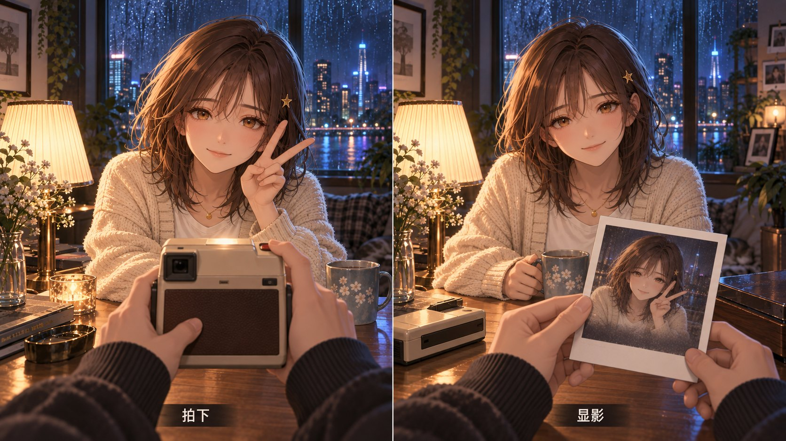

# 对坐 A 世界 · 桌面互动道具设计报告

## 1. 模式与归一化简报

**模式：design。交付：10 张横向互动概念图，全部 1672×941 PNG；另保留星星罐首版。**

本批只深化家中桌面和周边物件：雪花球、星星罐、蜡封信、拉绳台灯、八音盒、日历、猫、拍立得、收音机、转盘电话。不是新的房间提案，不扩大到其他五个并行批次。沿用 2026-09-25 用户选定的 A「对坐」方向：镜头就是本人，对面一位真实伙伴的半身形象；前景自己的袖口和手把触感带入画面，物件反馈通向伙伴或可留下的结果。

生成前明确的视觉要求：

- 小满：A1 同一脸型、栗色齐肩发、碎刘海、金星夹、琥珀眼、奶油针织开衫与金项链；阿屿：A5 同一深色蓬发、圆框眼镜与炭灰连帽衫。
- 对面小满时观者为阿屿，前景袖口炭灰；对面阿屿时观者为小满，前景袖口奶油针织。
- 精细线稿、柔和赛璐璐阴影与绘画渐变的成熟二次元 CG；暖色实际灯源与冷蓝窗光分开；前景操作、中景伙伴、后景房间有层次。
- 单幅场景无覆盖式 UI、标题或说明文字；灯光和拍立得各两格，字幕分别为“关灯 / 开灯”“拍下 / 显影”。纸条和信纸上的细笔迹属于实物纹理，不是可读正文。
- 不画热点圈、描边、光环、针点；罐内星光、雪粒、音符、呼噜和铃震线只在 brief 允许的物件反馈中出现。
- 图片展示在线共同活动的概念关键帧；离线必须空座留痕。图中的表情不能作为已接入真实状态或任意代替真人回应的证据。

## 2. 证据清单

### 输入图片：均直接检查像素

| 输入 | 角色与直接观察 | 采用方式 |
|---|---|---|
| [A1-keyart.png](../img/A1-keyart.jpg) | 小满正面对坐、奶油开衫、星夹项链、阿屿前景灰袖；暖灯／冷雨窗；窗内存在一组较明显人物反射 | 锁定小满、材质与光色；新图去掉易误认成第二对人的反射 |
| [A5-avatar-creator.png](../img/A5-avatar-creator.jpg) | 阿屿圆框眼镜、深色乱发和炭灰连帽衫；有较大捏人 UI | 仅锁定阿屿身份与绘画风格，不复制 UI |
| [A6-interactions.png](../img/A6-interactions.jpg) | 触摸、手冲、雾窗和唱片互动，前景手与伙伴回应相连；属于多格动作板 | 采用触觉叙事和局部反馈；不沿用其中强反射与语音气泡 |

用户提到 A2 作为风格依据，但本轮没有附上 A2；没有声称看过它。A1/A5 身份参考至少一张传入每次生成或单图修订。A6 已观察，未作为本轮工具参考路径重复传入。

仓库依据：已读 ai/PROJECT.md 开工红线、ai/TODO.md、ai/JASKILL.md、design-system.md、props.md、effects.md，以及 custom-skill、monet、codex-visual、imagegen 技能。设计系统明确记录 A 已选定，而旧书房双犬仍是实际实装；本报告以新 brief 为设计依据，没有将概念图说成实装替换。

### 执行与复核证据

- 内置 image_gen 共 11 次：10 个独立初稿 + 星星罐 1 次局部修订；没有 CLI/API-key 回退，没有整批重抽。
- 根代理直接看过三张参考、全部 10 张初稿和星星罐修订稿。三个制作子代理分别自审其输出；根代理复核这些输出；另由独立子代理复核根代理制作的雪花球与收音机，并复核星星罐修订。
- 上述属于 Codex 内部制作／复核；**Claude Monet 的最终美术批准尚未发生**。
- PNG IHDR 核实尺寸；文件长度与 SHA256 见 artifact-manifest.json。10 张最终 PNG 合计 23,567,008 bytes，约 23.57 MB。没有裁切、插值放大或压缩重编码。
- 完整提示词、工具来源和分支记录见文末清单。交付目录以外只有 image_gen 自动保留的工具缓存原件；所有交付副本、报告与记录都在指定目录，输入未覆盖。

## 3. 执行结论

**建议保留全部 10 张作为 A 世界桌面互动的候选概念图，进入 Monet 选定与生产拆层阶段。** 这组的共同价值是让动作从自己的手开始，以桌上的实物为媒介，到达对方的反应或可保存的小结果；物件不是菜单按钮的皮肤。

最值得先做小样的是 **台灯、蜡封信、拍立得**：分别验证环境共享、异步留物、共同记忆，动作因果和结果都最直观。猫提供更丰富的共同关注，制作成本也最高。

本轮只发现一处需要马上补画的缺失：星星罐首版纸条空白，已补细笔迹与小心形，旧图保留为 -initial。其余可见弱点属于静帧表达或后续生产限制，不需要重抽整图。所有最终图保留一位对面伙伴，袖口归属正确，没有明显多手、多脸或强人物反射，没有交互圈。

## 4. 概念矩阵与关键问题

| 文件 | 观者 → 伙伴 | 可见动作与反馈 | 留下的结果（设计意图） | 结论 |
|---|---|---|---|---|
| OB-snowglobe | 阿屿 → 小满 | 双手持球、球内飞雪、小满托腮 | 初遇咖啡馆记忆卡 | 保留；回放需动态证明 |
| OB-starjar | 小满 → 阿屿 | 笔迹纸条、投星、阿屿持星 | 共同愿望 | 修订后保留 |
| OB-letter | 小满 → 阿屿 | 压红蜡印、阿屿伸手 | 对方桌侧等待拆封的信 | 保留 |
| OB-lamp | 阿屿 → 小满 | 拉绳、冷蓝暗室变暖灯 | 共同灯光状态 | 保留；两格非配准帧 |
| OB-musicbox | 阿屿 → 小满 | 上弦、黄铜舞伴、闭眼聆听 | 可再次开启的曲目 | 保留 |
| OB-calendar | 小满 → 阿屿 | 翻页露红心、纸花、鼓掌 | 共同纪念日 | 保留 |
| OB-cat | 阿屿 → 小满 | 摸背、蹭手、抬爪与呼噜线 | 共同摸猫的时刻 | 保留；按特写使用 |
| OB-polaroid | 阿屿 → 小满 | 举机、V 手势、纸上显影 | 进入照片墙的相片 | 保留；生产用同帧捕获 |
| OB-radio | 小满 → 阿屿 | 转旋钮、侧头听、窗景转森林 | 两人选择的音景 | 保留；明确过渡而非实况 |
| OB-phone | 阿屿 → 小满 | 摘机、空叉簧、羞涩微笑 | 被听见的真实录音 | 保留；摘机即停铃 |

| 等级 | 可见证据／限制 | 影响 | 具体处理 |
|---|---|---|---|
| 中，已修正 | 星星罐初版纸条没有笔迹 | 更像普通折纸，愿望语义不足 | 单独补画笔迹和心形，保留 initial |
| 中，生产前解决 | 灯光两格的手与局部几何略变 | 直接淡化整图会产生双影 | 同一底图／rig 拆受光层，生成共用光照参数 |
| 中，生产前解决 | 拍立得照片中的姿态与左格是近似一致 | 真实记忆可能被重新“画过” | 捕获真实同帧角色画面并贴入相纸 |
| 中，生产前解决 | 收音机窗外左城右林同时存在 | 静帧可能被读作拼接窗景 | 固定窗 mask、统一过渡进度；环境选择不冒充真实天气 |
| 低 | 猫占右侧较大面积 | 常驻画面可能压过伙伴 | 作为临时近景动作；待机时降低占幅 |
| 低 | 音符稍亮、电话仍有余震线、显影已较完整 | 对过程阶段的理解略模糊 | 缩短提示生命期；接听停铃；显影控制对比渐入 |
| 共用边界 | 全部为扁平图，未展示离线空座 | 不能直接证明 presence 或异步状态 | 在后续生产中单独做空座／留物状态，不复用在线人物假回应 |

## 5. 逐图观察与生产说明

以下“可见”来自成图；“循环／拆层”是建议，不是已经完成的功能。预算统一指 **新增压缩传输资产**，不含共享房间、人物基础图集、音频、用户照片数据；没有执行压缩测试。

### 01 · 雪花球

**可见：** 炭灰袖双手托住玻璃球，内部咖啡馆遮阳棚、灯窗、双椅和飞雪清楚；小满双手托腮，星夹、项链完整；桌上同一咖啡馆照片把实物与初遇记忆连接起来。玻璃反光属于材质，不是热点光环。

**弱点：** 手势偏稳，摇动靠球内飞雪暗示；小满视线更接近观者。照片只能提示结果，不能证明记忆卡已回放。

**五步循环：** 触碰雪花球 → 小幅摇动 → 雪粒按惯性旋转／小满在真实参与时回应 → 出现既有初遇记忆卡 → 允许重看或收藏，不自动编造相遇内容。

**拆层与动效：** 球后壁、咖啡馆微景、球内雪 mask、球前反射、木底座、前景双手分别分开；少量粒子限定在球体，木底跟手旋转；记忆照片是独立纹理。人物复用托腮 rig。新增预算 **0.35–0.8 MB**，回忆卡图另计；共享素材可复用。

### 02 · 星星罐许愿

**可见：** 奶油袖右手将粉星送到罐口，左手纸条已有细笔迹与小心形；阿屿持蓝星准备加入。暖星与透明玻璃形成明确焦点。

**弱点：** 笔迹是不可读的视觉占位；投入是松手前一刻，不能从静帧判断写入数据。罐内细亮点略像灯串，正式版应将短暂增亮集中在刚投的星上。

**五步循环：** 写下自己的愿望 → 折成纸星 → 放入后星轻闪、对方真实参与时加入 → 星与原愿望在共同罐中等待 → 达成后可留纪念或再次展开，不设置未完成惩罚。

**拆层与动效：** 罐后壁／内星／前壁、罐口遮挡、独立投放星、纸条与正文贴图、手指松开姿态；星落入后轻碰一次。阿屿独立举星前臂，避免用整张人物换帧。新增预算 **0.25–0.55 MB**。

### 03 · 蜡封信

**可见：** 奶油袖右手压下木柄铜章，左手固定信封；红蜡、星纹示范章与短笺提示写信；阿屿伸出接收手掌，空间方向清楚。

**弱点：** 信内容模糊；旁边独立示范蜡印略有展示性质。当前是盖章中间帧，信还没抵达对方桌侧，也没有画离线状态。

**五步循环：** 写短笺 → 滴蜡压星印 → 抬章露纹、真实在线参与者伸手 → 信移到对方桌侧持续等候 → 对方亲自拆阅并收入信匣。

**拆层与动效：** 信封身／翻盖、蜡未压／压印／成印、印章杆／底、信纸和真实文本、接收前臂；压下停顿再拔起，短小高光沿蜡缘变化。生产时可去掉示范蜡印，露真实成印即可。新增预算 **0.25–0.6 MB**。

### 04 · 台灯拉绳

**可见：** 两格同一家庭构图，小满与炭灰袖手都可识别；左格灯罩暗、冷蓝窗光，右格灯亮、暖光落在桌面与脸上。“关灯 / 开灯”正确可读且位于画面底部。

**弱点：** 两格高度相似但不是像素配准；手只小幅移动，拉动幅度略保守。图片表现可交互光源的目标，并不证明已存在实时灯光系统。

**五步循环：** 拉链轻摆可发现 → 观者拉一下 → 灯罩亮起与局部光变化 → 对面收到相同灯状态、真实参与时给出回应 → 环境偏好保持，离线留灯。

**拆层与动效：** 灯暗底／亮罩、链节与末端珠、桌面光、角色局部受光、手臂分别处理；链条回弹和光渐变各自控制。采用同底图的受光层，不拿本双格整图相互淡入，不用全场橙色滤镜吞掉冷窗光。新增预算 **0.2–0.5 MB**。

### 05 · 八音盒

**可见：** 炭灰袖左手稳盒、右手拧侧钥匙；黄铜舞伴微型雕像在盒顶，小满闭眼、嘴微张，呈聆听／哼唱姿态；暖木、金属和肤色区分良好。

**弱点：** 静帧不能证明旋转；音符略亮。闭眼不等于真实睡眠，不能把这张表情自动当作对方正在哼唱。

**五步循环：** 触碰钥匙 → 小幅上弦 → 雕像缓转与选定音乐响起 → 对方真实加入聆听或明确选择哼唱状态 → 曲目与时刻可留为共同记忆。

**拆层与动效：** 盒体、上弦钥匙、转盘、微型雕像两至四方向帧、接触阴影、手与表情独立；不旋转整盒。音符短暂淡出，声音按需加载。新增预算 **0.8–1.6 MB**。

### 06 · 翻页日历

**可见：** 奶油袖双手固定木架并掀页，页被铜环连住，下页红心清楚；阿屿笑着举掌准备合拍，少量花瓣和纸屑不遮脸。

**弱点：** 没有真实日期数字，是动作概念。双掌还未相触；完整鼓掌需要后续帧。纸页穿环结构生产时要补绘背面。

**五步循环：** 翻看桌面日历 → 翻到真实纪念日 → 红心露出与小纸花飞起 → 对方真实参与庆祝／明确触发回应 → 可选保存当天留言或照片，不设置连续签到。

**拆层与动效：** 木架、铜环前后遮挡、旧新纸页、弯折阴影、真实日期贴图、红心与纸片粒子；纸页二维网格弯曲，纸屑短时一次播放；人物双臂掌面独立。新增预算 **0.2–0.5 MB**。

### 07 · 家里的猫

**可见：** 一只灰白长毛猫抬前爪走过桌面，头靠小满手，阿屿右手摸背、左手扶杯；尾巴抬起，细卷线表示呼噜。人物看向猫，共同注意力自然。

**弱点：** 猫覆盖画面右半和小满部分上身，适合动作特写；后腿部分被身体和袖口遮住，拆 rig 时需补全。没有明显额外腿、重复猫或手爪融合。

**五步循环：** 猫走近桌边 → 玩家顺毛触摸 → 猫蹭对方手并呼噜 → 双方看见同一段愉快回应 → 自愿拍照保留，不做饥饿、死亡或签到压力。

**拆层与动效：** 头耳眼、胸／躯干、四腿、尾巴与软毛边、接触影、双方接触手；步行、停步、蹭头、抚摸分别做状态，接触点用共同锚点。新增预算 **1.2–2.4 MB**；本批制作难度最高。

### 08 · 拍立得

**可见：** 左格炭灰袖双手举机，小满比 V；右格双手展示白边相纸，内有同样的伙伴与 V 手势，底部低对比像正在显影；实际伙伴仍在桌对面，“拍下 / 显影”可读。

**弱点：** 纸中人物是近似重绘，和左格并非同一捕获帧；显影已偏完整。相机在两格中的机壳细节不是工业设计连续性证明。

**五步循环：** 举相机 → 真实在线参与者选择摆姿／拍下 → 相机吐纸 → 同一捕获纹理逐渐显影 → 选定后存入照片墙，另一人可稍后看。

**拆层与动效：** 机身、快门、出片口、左右手、相纸和阴影；人物 V 手势与持杯姿态独立。照片从同一场景状态捕获，纸上显影用对比／颜色／mask 动画。新增预算 **0.45–0.9 MB**；保存照片每张约 **60–150 KB** 为另项估算。

### 09 · 老收音机

**可见：** 奶油袖右手握黄铜旋钮，左手稳木壳；发亮调谐刻度与织物网罩清晰；阿屿侧头托腮倾听；窗景左城市、右森林。

**弱点：** 城林并存只能提示切台过渡，可能被看成固定拼景。图中未同时列出雨、咖啡、森林、海四类台；不据此声称四台已制作。声音本身不可从图片验证。

**五步循环：** 触碰旋钮 → 轻转选择音景 → 指针移动、声音交叉淡入，窗景可选同步过渡 → 真实一起听的伙伴进入聆听状态 → 选择保留为两人的房间偏好。

**拆层与动效：** 壳／网罩、独立旋钮、指针、背光、接触手；窗外城／林分别放在同一 mask 下交叉淡入，雨玻璃层不跟背景跳动。若产品需要真实天气，音景和视觉预设必须与其区分。新增道具预算 **0.35–0.8 MB**；每个额外窗景约 **0.2–0.6 MB**，音频另计。

### 10 · 转盘电话语音

**可见：** 观者炭灰袖左手拿起听筒，空叉簧与通向底座的卷线清楚，右手靠近底座；小满托腮带微红面颊微笑；底座两旁细震动线提示刚响过铃。

**弱点：** 摘机后仍画有余震线，只能作为过渡瞬间；没有录音内容／时间，静帧不能证明声音来自小满。转盘无数字，对本次无 UI 的概念表达足够，实际拨号另需设计。

**五步循环：** 真实未听语音到达 → 电话短促轻响 → 玩家提起听筒 → 立即停铃并播放录音，真实已听事件到达对方 → 放回后录音仍可回听或保存。

**拆层与动效：** 底座／转盘、叉簧、听筒、双端固定卷线、前景手、接触影；铃震、摘机、播放状态联动。小满的笑是本图在线情境；离线只留空座与待听电话。新增预算 **0.7–1.4 MB**，语音按需加载。

## 6. 不确定性与可比性边界

1. 全部是概念关键帧，不是拆层资产、交互原型、骨骼 rig、声音成品或产品截图。没有做浏览器、手机、帧率、内存、压缩或后端测试。
2. 本轮共同家桌是刻意一致的物件专项，不用它证明“每间房各有玩法和气候”；多房间由其他批次承担。
3. A1 是场景关键图，A5 是带 UI 的头像近景，A6 是多格交互板；信息密度和裁切不同，不能机械按脸部像素大小评分。本轮角色辨识以面部特征和标志物为依据，不宣称数学意义的完全同脸。
4. 两张双格的单格约半幅宽；不能与单幅图直接比较细节数量。所有图都未验证竖屏，不能把横向构图直接中心裁切当手机版。
5. 预算是手工制作目标估计，和当前 2.30–2.45 MB 的原始 PNG 大小不同。共享背景建议单份 WebP/AVIF 0.6–1.2 MB，人物基础图集每人约 1.5–3 MB；具体受拆件面积、透明边缘和设备解码影响。
6. 工具按提示返回 1672×941；无显式尺寸参数可核实“全服务最大分辨率”。本批与所给参考尺寸一致，没有声称生成了更高分辨率。
7. 人物动画只能由真实参与、显式状态或明确回应驱动；“在线”本身不证明对方在拍手、唱歌、看照片。异步内容应保留物件状态与真实作者，不制造在线人像。

## 7. 建议与后续动作

推荐 Monet 先选定台灯、蜡封信和拍立得的细节，再用同一桌面底图与两套半身 rig 做一个短小可测的动作闭环。雪花球和星星罐随后接入真实记忆／愿望数据；八音盒、收音机、电话复用声音与留物机制；猫单独排骨骼与接触动画成本。

生产验收应先看：手与物件不穿插、前后遮挡正确、人物身份稳定、同一时刻的灯光一致、照片捕获一致、录音接听后停铃、离线空座、减少动态偏好。原图应保留为制作参考，不能直接把整套 23.57 MB PNG 当作运行时多层纹理预载。

本报告交付候选与制作证据；不晋升到 uiux，不修改实际产品代码，不替 Monet 作最终批准。

## 8. 产物清单

### 最终图像

全部相对于本报告同目录；精确文件名与尺寸已核实。

| 文件 | 像素 | PNG bytes |
|---|---:|---:|
| [OB-snowglobe.png](../img/OB-snowglobe.jpg) | 1672×941 | 2,446,198 |
| [OB-starjar.png](../img/OB-starjar.jpg) | 1672×941 | 2,310,942 |
| [OB-letter.png](../img/OB-letter.jpg) | 1672×941 | 2,402,587 |
| [OB-lamp.png](../img/OB-lamp.jpg) | 1672×941 | 2,358,255 |
| [OB-musicbox.png](../img/OB-musicbox.jpg) | 1672×941 | 2,337,378 |
| [OB-calendar.png](../img/OB-calendar.jpg) | 1672×941 | 2,300,999 |
| [OB-cat.png](../img/OB-cat.jpg) | 1672×941 | 2,379,929 |
| [OB-polaroid.png](../img/OB-polaroid.jpg) | 1672×941 | 2,382,251 |
| [OB-radio.png](../img/OB-radio.jpg) | 1672×941 | 2,295,241 |
| [OB-phone.png](../img/OB-phone.jpg) | 1672×941 | 2,353,228 |

### 来源、修订与核验

- OB-starjar-initial.png：唯一被替代初稿，纸条空白；保留审计。
- [objects-core-notes.md](prompts/objects/objects-core-notes.md)：雪花球／收音机／星星罐修订完整 prompts、来源与独立复核说明。
- [objects-ayu-notes.md](prompts/objects/objects-ayu-notes.md)：星星罐初稿／蜡封信／日历完整 prompts 与分支 QA。
- [objects-storyboards-notes.md](prompts/objects/objects-storyboards-notes.md)：灯光／拍立得完整 prompts、来源与分支 QA。
- [objects-rituals-notes.md](prompts/objects/objects-rituals-notes.md)：八音盒／猫／电话完整 prompts、来源与分支 QA。
- artifact-manifest.json：10 个 final + 1 个 superseded 的尺寸、字节与 SHA256。
- codex-report.md：本报告。全部交付共 17 个文件。

输出目录：
D:/Repo/our-world/.claude/worktrees/dynamic-scene-concept-design-0b6ef0/ai/design_system/codex-visual/scene-concepts/A-world/objects/20260925-211252Z

报告绝对路径：
D:/Repo/our-world/.claude/worktrees/dynamic-scene-concept-design-0b6ef0/ai/design_system/codex-visual/scene-concepts/A-world/objects/20260925-211252Z/codex-report.md

