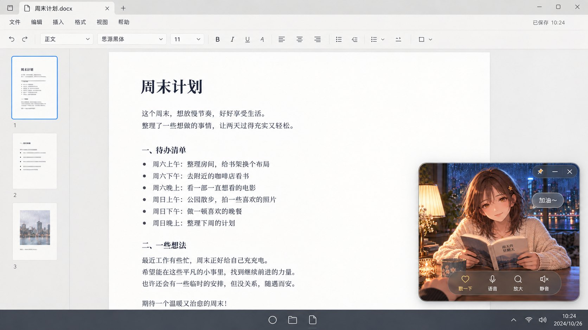
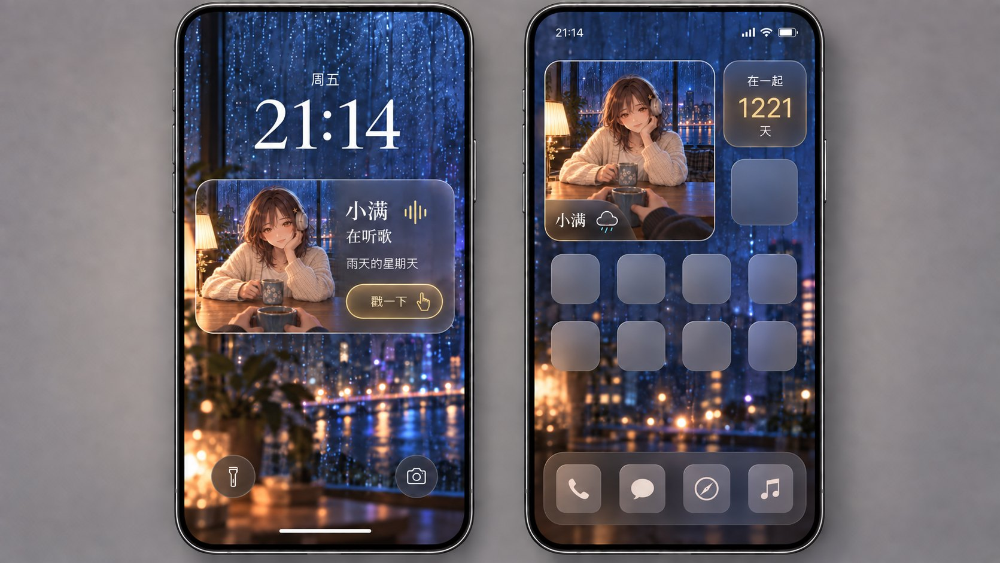
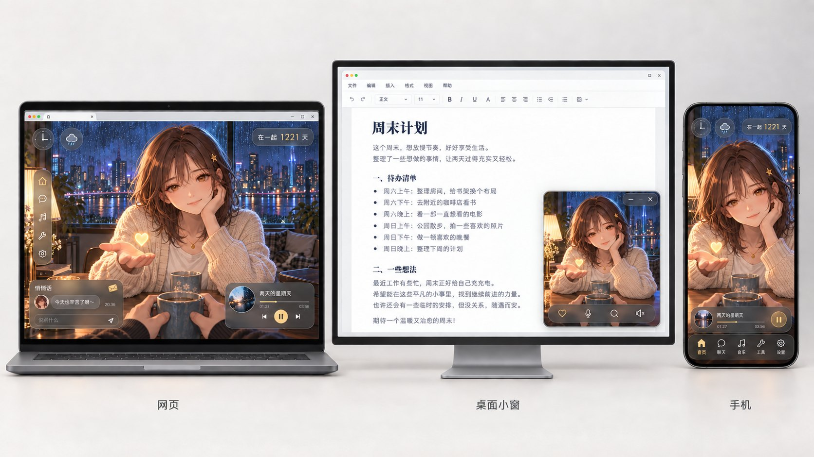
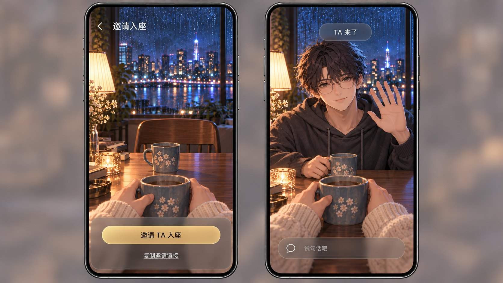
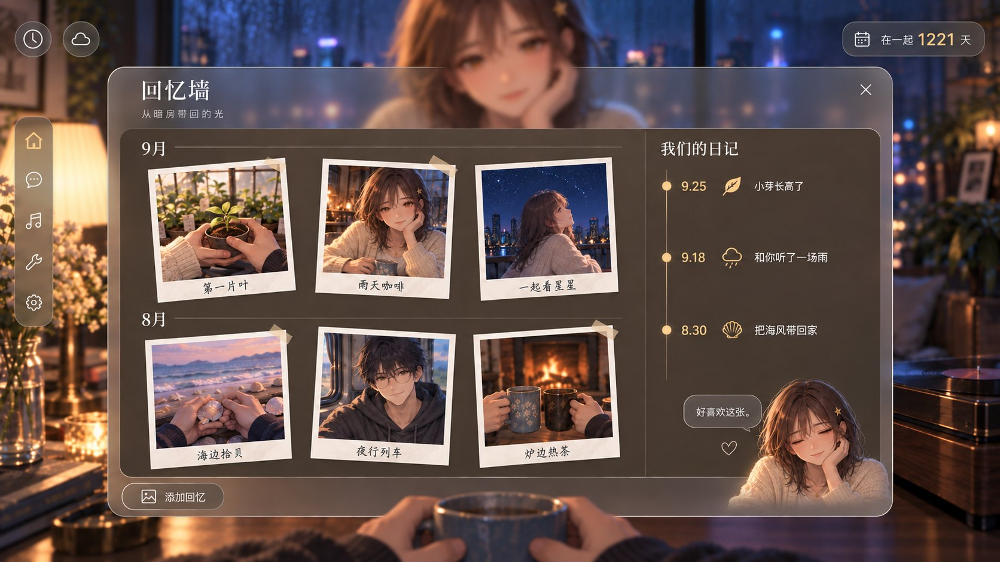
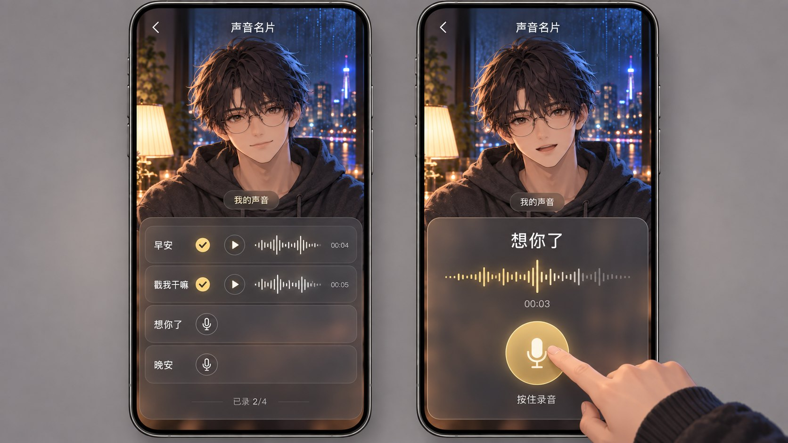
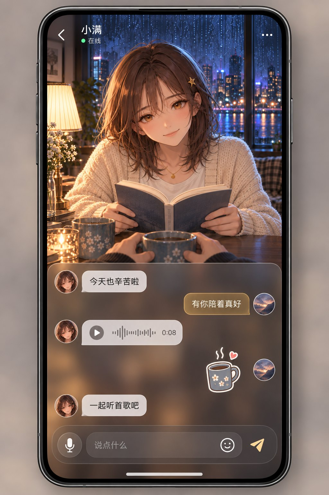

# A「对坐」产品屏幕与跨端概念扩展

## 1. 模式与标准化任务

- **模式：design**。交付 9 张静态产品概念图；范围仅本次 Product screens and cross-device。
- **制作状态：候选图与像素审查证据**。不是应用截图，不代表功能已经实现、测试或上线。最终设计判断交本次调用方 Monet；独立 QA 不等于 Monet 批准或用户批准。
- **方法：内置 image_gen**。逐图提供 A1 和/或 A5 的绝对参考路径，使用 A2/A3 的界面材质；未使用 CLI、API key、图片编辑脚本或其他生图服务。修正仅针对单张明确问题，早稿留存。全部交付与提示词位于本目录，源参考未覆盖。
- **画幅目标：**桌面、双手机与设备板为 16:9，工具目标 1672×941；完整聊天为一台竖屏手机置于软背景，采用 1024×1536。实际尺寸以 artifact-manifest.json 为准，不伪称可锁定工具未暴露的尺寸参数。

### 概念与视觉要求

大厅是人际空间总览；每扇可进入的窗代表一个人或一个群体。进入空间后与 TA 对坐；房间表示双方今天共同所在的地点。“入座”用于邀请/加入，不与“换房间”混用。

对坐场景使用第一人称、对方半身、桌面遮挡下半身与自己的袖手/杯子。小满作为对方时，观者为阿屿炭灰袖；阿屿作为对方时，观者为小满奶油针织袖。大厅、照片内容、本人声音预览、设备展示板分别按 brief 的任务例外处理，不机械套成九张同构大头像。

人物继承 A 系列的脸、发色、发夹/眼镜和服饰标志；画风为精细线稿、柔和赛璐璐与绘画渐变、暖主光与冷环境光。玻璃沿用中性细纹磨砂、柔模糊、细亮边、暖金操作与米白文字。回忆墙使用连续磨砂壳和不透明暖灰阅读内衬。没有场景热点光圈；UI 按钮本体亮边、照片纸框和选中卡边缘不视作物件热点圈。

## 2. 证据清单

### 直接查看像素的用户参考

| 文件 | 用途及直接观察 |
|---|---|
| [A1-keyart.png](../img/A1-keyart.jpg) | 小满身份、观者炭灰袖/杯、雨夜对坐、暖灯与冷蓝窗光；原图右窗的人影反射较可辨，本批未沿用为额外真人。 |
| [A2-desktop.png](../img/A2-desktop.jpg) | 左侧五图标导航、左上时钟/云双圆、纪念卡与角落浮窗；玻璃色泽受环境影响，材质保持中性。 |
| [A3-mobile.png](../img/A3-mobile.jpg) | 手机竖构图、场景主导、底部功能层与短语音泡；只作为参考，不假定其隐藏导航行为。 |
| [A5-avatar-creator.png](../img/A5-avatar-creator.jpg) | 阿屿乱发、细圆眼镜、炭灰卫衣、本人形象/声音任务的参考。 |
| [C1-keyart.png](../../../../../arts/archive/v3-direction-proposals/img/C1-keyart.jpg) | 雨夜楼房、暖窗/冷街的空间概览；本批大厅只借建筑组织，不复制原稿多住户与偏小比例角色。 |

绝对输入路径逐次记录在 desktop-prompts.json、mobile-prompts.json、device-prompts.json。所有五张附件均由主执行者直接查看，独立 QA 也查看了这五张。

### 当前仓库规范

已读取 ai/PROJECT.md（含开工红线）、ai/TODO.md、完整 ai/JASKILL.md、ai/design_system/design-system.md、uiux/uiux.md、uiux/cinnaglass/ui-system.md 与 decisions.md；同时读取 custom-skill、ui-tailor、monet、codex-visual 与系统 imagegen 技能。

当前设计系统明确区分 2026-09-25 已选的 A 方向与仍在运行的旧书房/双犬实装。本批采用用户的新 A 方向，复用已经批准的 Cinnaglass 材质，不将新概念写成既有实现，也没有修改被冻结的日记本组件。

房间原画在本轮开工时陆续存在。直接查看 cafe、study、greenhouse、train 四张；房间选择生成实际传入：
- rooms-1/20260925-211124Z/R-greenhouse-keyart.png；
- rooms-2/20260925-211132Z/R-train-keyart.png。

另两张只作观察，没有虚称传入模型。缩略图是本次重绘的概念预览，并非并行房间图的确定性缩小复制。

## 3. 执行结论

九个指定界面均已有对应产物。最明确的三条产品关系是：大厅按人/群体进入，房间按地点切换，跨端围绕同一个 TA 的同一次动作组织。入座空椅→阿屿出现的两联图，是“真实的人来到共同空间”最直接的证据；完整聊天保留对坐但将文字放入连续阅读区；回忆墙把物件活动的结果收进照片与日记。

**最终独立 QA：9/9 已逐图查看；没有遗留 blocker / high。** 房间背景柔焦、小组件戳手图标、三端播放状态三项复核意见已在最终像素中解决。保留 1 项 medium 生产风险：完整聊天软键盘出现后的消息空间；其余可见建议为 low，逐项证据见 qa-review.md。主执行者也直接查看了全部最终结果，没有只依据子代理文字作结论。

生成期间对明确偏差做了局部修正：大厅招牌英文、房间选择背景清晰度、回忆墙多余长段落、置顶窗过大及系统品牌图标、小组件过近的胸像，以及小组件/三端板的图标语义。每次保留早稿，没有整批重抽。

仍需在产品化时验证的重点是完整聊天的软键盘布局、系统小组件权限/刷新限制，以及真实事件驱动的在线、录音、鼓励语和送心。静态概念不能提供这些运行证据。

## 4. 概念矩阵与验收口径

| 产物 | 核心可见证据 | 对 A 的作用 | 取舍 |
|---|---|---|---|
| UI-hub.png | 小满 1 人、桌游 3 人、离线窗 0 人+猫 | 大厅先选人际空间 | 建筑细节丰富，但可进入窗与装饰需明确区分 |
| UI-rooms.png | 10 张不同地点卡，温室放大，共同换房提示 | 不换 TA，只换共同地点 | 一屏展示全量卡利于概念检查，真实小屏须横向滚动 |
| UI-pip.png | 通用文档工作区、右下对坐小窗、四操作 | 忙时仍能陪伴 | 展示的是悬停展开尺寸，常驻可更紧凑 |
| UI-widget.png | 锁屏状态卡、2×2 场景卡、1×1 纪念卡 | 手机外部入口仍保留桌边关系 | OS 能力与栅格仅示意 |
| UI-devices.png | 网页/编辑器角落小窗/手机，同姿态送心 | 同一事件跨三种使用情境 | 生成裁切有细差，不是同一帧像素复制 |
| UI-pairing.png | 空椅和等待杯→阿屿挥手，奶油袖 | 入座是关系发生的时刻 | 未覆盖无效链接等错误状态 |
| UI-memories.png | 两月份六照片、三条日记、小满微笑 | 日常仪式留下共同结果 | 右列是简短索引，长篇正文另需打开 |
| UI-voicecard.png | 四台词恰两勾、本人预览、按住录音波形 | 把本人的声音交给 TA | 录音许可、取消与失败状态另需验证 |
| UI-chat.png | 读书的小满、文字/语音/贴纸/输入栏 | 聊天与在场共享同一画面 | 键盘时应收起大场景避免挤压 |

不同任务、画幅和信息量不作统一数值排名；概念矩阵比伪精确总分更适合本批。

## 5. 逐图观察、弱点与制作说明

### UI-hub.png — 大厅

**观察：**三个命名窗口分别是小满、周末桌游、室友们。小满戴耳机坐在桌后；三位朋友的黄衣白耳机、帽子橄榄外套、银短发黑高领可分别辨认。室友窗无人物，只有猫、空椅和冷暗室内。悬停卡为“小满·在听歌”与“进入”，手指指针不遮脸；导航、双圆和 1221 卡与参考一致。最终街牌已改成无字咖啡杯/叶子粉笔画。

**弱点：**楼下另有明亮的无标签咖啡入口，可能被误认为第四个可进空间（low）。实现时将可进入性绑定到命名窗的清晰按钮/键盘焦点；装饰不接点击。标签与状态必须取真实空间数据，不能把所有亮灯当成在线。

**制作：**街景/建筑/三窗内部/窗框遮罩/人物/雨/灯/标签分层；小满眼睛、发梢、耳机、杯、手臂分件，三个朋友使用小尺寸半身 rig，猫独立。在线窗只用真实 presence 显示角色，离线退回空座；雨和枝叶慢循环。约 0.9–1.5 MB 建筑背景、0.9–2 MB 窗内角色裁切、0.1–0.3 MB 道具和效果，首屏压缩资产目标 1.9–3.8 MB。

**路径：**看到窗口状态 → 悬停预览 → 进入对应空间 → 对坐；离线仍可进入并放下异步物件，不伪造真人。

### UI-rooms.png — 房间选择

**观察：**十张卡顺序完整：咖啡馆、温室、书房、暗房、唱片角、列车、天台、海边、木屋、棋牌室。每张均有同一小满坐在对应地点。温室更大，有勾与“一起养一盆花”；底部“换房间会同时带上 TA”和“一起去”明确表达共同位置。修正版将大场景柔焦，保留卡片、导航与文字锐利，并提高同步提示对比。

**弱点：**九张非选中卡较窄，小满在各卡里基本沿用托腮姿势，房间玩法依赖道具而非动作差异（low）。第一张咖啡馆沿用雨夜桌景，地点辨识比暗房、海边、列车弱。正式缩略图应从已选房间原画和同一 rig 导出，不依赖本图的独立重绘。主画面手与袖大部分被选择层遮住，作为聚焦选择态可接受；退出后恢复完整前景。

**制作：**房间卡使用 240–360 px 的独立预览，每张约 35–75 KB；十卡合计约 0.35–0.75 MB；现有背景、人物与玻璃母材质复用。只在选定并确认后切换共享 room_id 与双方房间，渲染各自面对 TA 的视角；双向状态与失败恢复需要实际系统验证。未把十个完整房间同时加载当成本批设计要求。

**流程：**打开地点选择 → 浏览预览与玩法一句话 → 确认温室 → 双方进入同一温室 → 开始共同种植。

### UI-pip.png — 桌面置顶小窗

**观察：**文档编辑器占主画面，小窗位于右下，约 27% 屏宽、42% 屏高。小满持书抬眼，窗内有暖灯、雨夜、桌面与炭灰前景袖手；“加油～”没有挡脸。控制条包含戳一下、语音、放大、静音。系统图标已改为通用圆、文件夹和纸页，没有真实产品标志。

**弱点：**当前尺寸适合悬停操作，日常驻留可再缩小（low）；静音的划线喇叭与动作名应区分当前状态和即将执行的动作（low）。图中文字“加油”只能表达收到 TA 的真实消息或 TA 预先录制并授权触发的声音，不能推断对方想法；图里的阅读姿势也不是行为遥测证明。

**制作：**复用雨窗、灯、桌、人物、书、杯、袖手；小满的头眼口、持书手臂、发梢与翻页独立。悬停展开控件，消息泡由真实事件触发。512–768 px 小窗背景约 100–250 KB，角色 atlas 0.5–1.2 MB，道具前景 100–250 KB；增量目标 0.7–1.7 MB。电脑工作区与系统外壳不属于运行资源。

### UI-widget.png — 锁屏与小组件

**观察：**两台无品牌手机。左锁屏有时钟与小满的听歌状态、歌名、轻触操作；右主屏的大场景组件和纪念卡面积约 4:1。小满的耳机、星夹、奶油衣及桌面、双方杯与炭灰观者袖可辨，微型画幅仍保留“对坐”。

最终“戳一下”右侧为小手指，已去掉容易混淆为音乐播放的三角。工具原生输出为 1671×941，保留原尺寸。

**弱点：**无品牌主屏以纯色方块示意普通 app，系统栅格并非某个 OS 的精确规范（low）。雨景是当前天气的设计示例，不能证明接了真实天气；锁屏按钮可否直接发出动作、刷新频率及后台权限未验证。

**制作：**共享场景的预渲染快照＋系统文字/状态图标＋动作入口；在不支持连续 rig 的平台用静态快照保持诚实状态。384–512 px 快照每份约 80–180 KB，两种裁切约 160–360 KB，人物资源走已有缓存；不用持续 WebGL 假装系统 widget 原生可用。实际 OS 外壳不下发为资源。

### UI-devices.png — 三端互通

**观察：**左笔记本完整网页、中间显示器文档编辑器的右下小窗、右手机；三处小满均托腮、摊另一只手，掌上出现暖金心。三处雨夜、衣饰、杯和观者炭灰袖相同；设备下短标签为网页、桌面小窗、手机。

最终网页和手机播放器均显示暂停双竖条，进度均为 01:27，首稿的播放状态分歧已修复。

**弱点：**三设备的脸发丝、手掌与裁切有生成式细差（low）；这是同一事件/同一姿态的设计示意，不是同帧复制或网络同步证据。中间 PIP 文案因整台显示器缩在展示板中偏小，不能据此验收实际点击区和字号。送心必须来自 TA 主动事件。

**制作：**共享背景/半身 rig/桌面/袖手/道具，加独立心 sprite；三个视口复用同一事件标识与动画状态，按安全区域裁切。手掌、托腮臂、眼口、头发分件，心轻缓上浮消散。约 300–700 KB 背景、1.5–3 MB 角色、200–450 KB 前景道具、20–80 KB 心特效；共享冷载目标约 2–4.5 MB。硬件展示壳仅供评审，不下发。

### UI-pairing.png — 邀请入座

**观察：**左手机为空椅、亮灯、等待杯；右手机只有阿屿坐下挥手，黑发、圆眼镜、炭灰连帽衫与 A5 一致。两侧前景均为小满奶油针织袖和握杯手；挥手五指清楚。“邀请 TA 入座”“复制邀请链接”“TA 来了”可读。新关系没有被强加 1221 天纪念卡。

**弱点：**右侧输入占位灰字偏弱（low）；图没有复制成功、链接失效、拒绝或加入失败状态。邀请发出不等于对方在线，实际入座反馈应由加入事件触发。

**制作：**雨窗/房内/桌面/空椅/杯/灯分层；阿屿眼镜、头发、眼口、挥手臂独立；奶油袖手属于镜头前景。背景 0.7–1.2 MB，阿屿半身 atlas 1.8–3.2 MB，袖手道具 0.2–0.4 MB，冷载约 2.7–4.8 MB。入座后挥手是事件响应；未接受前始终空座。

**流程：**邀请 TA → 复制或分享链接 → TA 接受 → 座位出现其本人头像并挥手 → 开始真实交流。

### UI-memories.png — 回忆墙

**观察：**大窗为一体连续磨砂外壳，内部深暖褐不透明阅读底；照片白纸框只属于照片。9 月、8 月各三张拍立得，右侧为 9.25、9.18、8.30 三条短日记。小满的角落头像微笑，不挡条目。最终已柔化大背景人物并删除额外长段落，照片与短文案保持清晰。正文不是改造冻结中的实体日记本。

**弱点：**月份/标题采用较书卷的衬线，部分照片题字是手写风，与 A2 通用无衬线略有差异（low）；可解释为回忆内容的语气，但生产需统一字体映射。小满表情是任务反馈示意，不能代表真实人的自动情绪识别。默认背景头像不应持续高幅运动干扰阅读。

**制作：**外壳、内衬、照片纸框、内容图、时间线、文字全部与背景分开；照片从真实回忆数据加载，正文 DOM 渲染。六张 400–600 px 缩略图各约 60–140 KB，总 0.36–0.84 MB；纸框/胶带复用约 30–80 KB，已有小满裁切与场景缓存复用。页面增量约 0.4–1 MB。只在用户操作/真实回应事件下出现角落短反应，不持续虚构反馈。

**回忆路径：**打开回忆墙 → 按月浏览暗房产出的照片 → 选择照片/日记 → 留下真实回应 → 保留在共同回忆中。

### UI-voicecard.png — 声音名片录制

**观察：**两屏为本人阿屿预览，明确标“我的声音”。四台词为早安、戳我干嘛、想你了、晚安，恰好前两条完成，显示已录 2/4；右屏想你了、00:03、波形和手指按住圆录音钮，本人嘴微张。炭灰袖与本人身份一致，没有把自己标为 TA。

**弱点：**右侧录制中仍写“按住录音”，可在实装中变为“松开完成”并提供取消（low）。两帧口型差异表达录制反馈，但不能证明收音、录音权限或音素同步。

**制作：**复用阿屿 atlas 与场景，嘴/下颌独立；波形、计时、完成勾从真实录音数据驱动。外部操作手是展示元素，不是运行时常驻层。已缓存时 UI 增量目标低于 0.1 MB；四条 4–5 秒语音按规划编码约 32–80 KB，受实际时长/格式影响；无音频文件在本批交付。冷载约 2–3.8 MB。

### UI-chat.png — 完整聊天

**观察：**一台居中的竖屏手机，上半为小满读书抬眼，星夹、琥珀眼、奶油开衫、金项链正确，书和桌挡住下身；前景炭灰袖与握杯手明确。下方有三条短文本、0:08 语音泡、原创咖啡杯贴纸和麦克风/贴纸/发送入口。中文无明显乱码。

**弱点：**场景约占屏幕一半，同屏消息较少（medium 生产风险）。键盘弹起后是否仍可读、可滚动、可发送，静图不能证明；建议键盘态收起为紧凑头像条，并用真实设备验收。输入占位对比偏低（low）。在线标记必须来自真实 presence，抬眼微笑不是消息已读证明。

**制作：**小满 atlas、书/手遮挡层、桌和观者袖手、雨窗分开；消息、头像、气泡、输入区为 DOM。眨眼/呼吸/看书/抬眼按真实状态或显式允许的 idle 表现组织，不将“正在阅读你最新消息”作为已验证事实。小满 1.8–3.2 MB，背景 0.7–1.2 MB，道具前景 0.3–0.6 MB，贴纸 15–45 KB；冷载约 2.8–5 MB。

### 房间卡对应的轻量仪式建议

下表是本次房间选择的玩法衔接建议，未替代并行房间 run 的主美方案，未声称以下循环已实现。每项都为 5 步：触发 → 行动 → 响应 → 结果 → 回忆；对方离线时留下物件，实际反馈等 TA 回来，植物不会死亡，不设计连续签到、排名或处罚。

| 房间 | 五步循环建议 |
|---|---|
| 咖啡馆 | 拿起奶壶 → 在杯里画一颗心 → 奶纹缓缓成形 → 杯子递到 TA 一侧 → 双方愿意时存为咖啡照片 |
| 温室 | 拿起种子卡 → 将种子埋入共同花盆 → 浇水后出现新叶 → TA 桌侧看见同一株植物 → 成长快照进入回忆 |
| 书房 | 翻开共读书 → 夹上一枚手写书签 → 书签留在对应页 → TA 回来看到标记 → 共同摘句进入日记 |
| 暗房 | 将底片放入托盘 → 轻轻摇动显影液 → 照片慢慢显现 → 挂在双方可见的晾片线上 → 收入回忆墙 |
| 唱片角 | 拿起一张唱片 → 放针试听 → 唱片旋转与真实播放 → TA 收到共同收听邀请 → 将曲目与留言留作回忆 |
| 列车 | 拿起沿途明信片 → 在看到的风景处盖章 → 印章落下并风干 → 卡片推到 TA 桌侧 → 收入旅途相册 |
| 天台 | 拿起观星卡 → 连起自己看到的几颗星 → 线条形成小星图 → TA 一侧留下同一张卡 → 合为当夜观星记忆 |
| 海边 | 捡起一枚贝壳 → 排成小小图案 → 海风轻动边缘纸片 → TA 桌侧收到贝壳作品 → 拍照留在回忆墙 |
| 木屋 | 拿起茶壶 → 为对侧空杯续热茶 → 蒸汽升起 → TA 回来发现暖茶与便条 → 留下一条炉边日记 |
| 棋牌室 | 拿起一块拼图/合作棋子 → 放到共同棋盘 → 图案连上并轻响 → TA 看到可接续的一步 → 完成后存棋盘合照 |

以上反馈不需要伪造 TA 反应；异步结果存在于共同物件状态。

## 6. 不确定性与可比性限制

1. 所有画面是内置 image_gen 的静态概念，不是可运行原型，没有操作系统、录音、通知、真实天气、网络同步或软键盘测试。
2. 生成工具没有暴露可强制设置最大尺寸的参数；提示词请求最大 landscape 并测量返回值。个别输出可相差 1 px，具体以最终清单为准。
3. 图像不是分层源文件、Live2D/Spine rig 或 WebGL 实装；本报告的拆层、预算、状态逻辑均为生产建议。压缩预算未通过真实导出或 GPU/首屏量测验证，也不包含引擎/程序包/公共字体成本。
4. Cinnaglass 是视觉继承，没有声称每个半径、颜色、模糊值与现役 CSS 像素完全一致。生成中文字需在真实 UI 中改用 DOM/原生文字，不能直接把整幅 UI 当按钮图。
5. A1 的人物原画、A2 的桌面、A3 的双手机、A5 的本人编辑器和 C1 的建筑概览任务不同，不适合以构图或内容数量直接排名。
6. 图中的在线、听歌、1221 天、日期与文档正文都是示例内容，不是读取了任何人的真实数据。本人录音不涉及 AI 克隆声音，伙伴头像代表真实联系人。
7. 这批未修改源代码、AGENTS.md、CLAUDE.md、TODO 或已批准 UI 目录；未提交、推送、发布，也未读 ai/sessions/。

## 7. 建议与下一步

**本批建议采用统一的产品关系继续深化：**大厅找人，入座建立共同空间，房间承载当天的具体仪式，回忆墙收集自然结果。优先制作入座、完整聊天和桌面小窗的一条可测体验，保留本批的侧边/底边玻璃语言。

生产验收顺序：
1. 由调用方 Monet 审核本批真实图片，挑选要采用的界面细节；本次方向批准不自动批准每张控件布局。
2. 从角色半身/桌前袖手/房间/道具输出共用层，用同一 rig 状态导出三端，消除生成式细差；UI 文案和图标转为可访问的真实控件。
3. 首先测试聊天软键盘与实际小窗尺寸，其次测试房间共同切换与真实在线/离线状态；小组件做目标平台可行性验证。
4. 批准后由调用方按项目流程将选定规范/展示晋升至 uiux；未选候选和本报告保留在 codex-visual。

**执行和验证证据：**使用 rg/Get-Content 查规范、技能与现有房间资产，用 view_image 直接检查参考和成图，用内置 image_gen 生成/局部修正，用 Copy-Item 把原生输出复制到本目录，用 apply_patch 写提示词和本报告，用只读 PNG 头/文件长度/SHA-256 检查交付。sync-worktree 仅执行 --dry-run 检查，没有授权外的协议写入；技能真源实际可读。没有代码改动，因此没有运行构建或单元测试并冒称其为图片验收。逐图独立像素 QA 详见 qa-review.md。

## 8. 产物清单

### 九张最终候选

| 文件 | 交付用途 | 实际尺寸 | PNG 字节 |
|---|---|---:|---:|
| [UI-hub.png](../img/UI-hub.jpg) | 桌面大厅 | 1672×941 | 2,645,152 |
| [UI-rooms.png](../img/UI-rooms.jpg) | 桌面房间选择 | 1672×941 | 1,767,365 |
| [UI-pip.png](../img/UI-pip.jpg) | 文档工作时的置顶小窗 | 1672×941 | 1,554,306 |
| [UI-widget.png](../img/UI-widget.jpg) | 锁屏与主屏小组件 | 1671×941 | 1,795,283 |
| [UI-devices.png](../img/UI-devices.jpg) | 三端互通展示板 | 1672×941 | 1,778,785 |
| [UI-pairing.png](../img/UI-pairing.jpg) | 两手机的邀请/入座状态 | 1672×941 | 1,880,692 |
| [UI-memories.png](../img/UI-memories.jpg) | 回忆墙聚焦任务 | 1672×941 | 1,834,312 |
| [UI-voicecard.png](../img/UI-voicecard.jpg) | 本人声音名片录制 | 1672×941 | 1,685,511 |
| [UI-chat.png](../img/UI-chat.jpg) | 完整聊天竖屏 | 1024×1536 | 1,913,834 |

九张最终 PNG 总计 **16,855,240 bytes（约 16.07 MiB）**。这是原生评审 PNG 的实测体积，不是上文压缩运行资产预算。全批共 16 次内置调用：9 张首稿、7 次单图定向修正，未整批重抽。

### 审查与生成来源

- [qa-review.md](prompts/screens/qa-review.md)：独立审查者直接查看最终像素的结果；与本报告主执行者的自检分开。
- artifact-manifest.json：九张最终 PNG 的实际尺寸、字节数、绝对路径与 SHA-256。
- [desktop-prompts.json](prompts/screens/desktop-prompts.json)：大厅、房间选择、回忆墙的完整初稿/修正提示词与引用路径。
- [mobile-prompts.json](prompts/screens/mobile-prompts.json)：入座、声音名片、完整聊天的实际提示词与引用路径。
- [device-prompts.json](prompts/screens/device-prompts.json)：小窗、小组件、三端板的实际提示词与修正记录。
- [mobile-notes.md](prompts/screens/mobile-notes.md)、[device-notes.md](prompts/screens/device-notes.md)：子任务逐图观察、制作建议、元数据与复核过程。
- UI-hub-prompt.txt / UI-hub-revision-prompt.txt、UI-rooms-prompt.txt / UI-rooms-revision-prompt.txt、UI-memories-prompt.txt / UI-memories-revision-prompt.txt：桌面组每次实际调用前保存的提示词。
- 过程证据共 7 张：UI-hub-initial.png、UI-rooms-initial.png、UI-memories-initial.png、UI-pip-initial.png、UI-widget-initial.png、UI-widget-initial-2.png、UI-devices-initial.png。它们不是额外交付方向，保留用于比较修正，不替换 final 文件。

输出目录：
D:\Repo\our-world\.claude\worktrees\dynamic-scene-concept-design-0b6ef0\ai\design_system\codex-visual\scene-concepts\A-world\screens\20260925-211452Z
