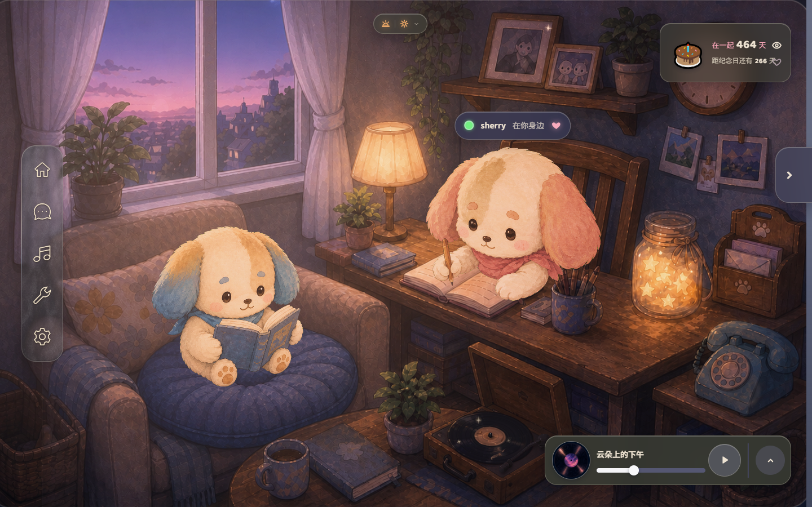

# Our World · 当前设计系统

> 维护：Monet；UI/UX：UI Tailor。更新：2026-09-13。此文档与下面链接的常驻 Markdown 是当前设计来源，README 只解释目录。

上图为 2026-09-11 产品实景；本轮只更新设计资料与技能，产品画面没有改版。导航已认可，其余 UI 尚待统一。

## 整体风格

**固定近景的双人手绘陪伴小屋。** 柔软角色、木制家具、可触摸的纸与玻璃，把真实回忆与日常工具藏进房间。画面应适合长时间陪伴；趣味来自角色细节和物件反馈，信息需要时清楚出现。

| 维度 | 当前约束 |
| --- | --- |
| 形状与构图 | 双长耳角色、圆润轮廓、略俯视固定机位；场景和角色优先，UI 不长期占满房间 |
| 色彩与材质 | 手绘笔触、柔软毛绒、木与纸；作者身份蓝/粉区分；悬浮导航中性磨砂细纹，暖光为反馈之一 |
| 光与环境 | 目前 golden / twilight / night 三档底图与配方合成；窗外天气与室内氛围分层。四时辰及共享光环境是目标，尚未实现 |
| 使用体验 | 点房间物件进入相应功能；工具可悬浮使用。真实状态、阅读、焦点和小屏避让必须明确 |
| 动态与声音 | 微小呼吸/眨眼、物件反馈、窗外天气与分层音景；安静耐看。UI 新动画体系仍后置 |

Monet 的职责是整体艺术与体验判断；光照只是其中一项。当前项目使用 Web + Pixi，不把这个实现选择变成跨项目美术规范。

## 所有在用设计的常驻入口

| 设计领域 | 图文与行为规范 | 当前覆盖 |
| --- | --- | --- |
| 角色 | [character.md](character.md) | 蓝耳阅读、粉耳书写，当前形体、素材、呼吸/摆动/眨眼 |
| 场景与建筑空间 | [scene.md](scene.md) | 书房三时辰、镜头/层次/锚点；棋牌室与植物园仅缩略概念 |
| 物件 | [props.md](props.md) | 日记、相框、挂钟、唱片机、许愿罐、灯与家具的外观和交互入口 |
| 环境效果 | [effects.md](effects.md) | 雨、光层、角色 tint、星星提示与声音；现状和后续计划分开 |
| UI/UX | [uiux/uiux.md](uiux/uiux.md) | 全项目界面地图、交互和当前主题；Monet 与 UI Tailor 共同维护 |
| Cinnaglass 主题 | [uiux/cinnaglass/ui-system.md](uiux/cinnaglass/ui-system.md) | 导航、悬浮窗口、弹窗、物件 UI、字体/控件及实际素材 |

新采用类别出现时新增相应常驻 Markdown 并补入此表；不预建空的建筑、CG 或其他未存在类别。每个采用项都要有图片/动画或运行预览、描述、行为和实际来源。

## 实际素材位置

下面是首次核实后登记的**本项目位置**，不是技能的固定假设；路径变化时同步这里和使用它的领域文档。

| 内容 | 原始/编辑来源 | 运行时或实现 |
| --- | --- | --- |
| 书房原画/派生部件 | [arts/rooms/study](../../arts/rooms/study/) | [public/rooms/study](../../public/rooms/study/)、[房间模板](../../src/themes/cinnaglass/room/study-room.ts) |
| 双角色 | [原始生产批次](../../arts/characters/) | [public/characters](../../public/characters/)；没有另建角色源素材目录 |
| 导航细纹 | [arts/ui/navigation](../../arts/ui/navigation/) | [public/ui/nav](../../public/ui/nav/)、[navigation-glass.css](../../src/themes/cinnaglass/shell/navigation-glass.css) |
| 日记本/羽毛笔 | [arts/ui/journal](../../arts/ui/journal/) | [public/ui/journal](../../public/ui/journal/)；设计与交互见主题文档 |
| UI 主题、字体、图标等 | [主题源码](../../src/themes/cinnaglass/)、[字体资源](../../public/fonts/) | [实际样式变量](../../src/themes/cinnaglass/cinnaglass.css)、[UI 资源](../../public/ui/) |
| 其他房间缩略图 | [原始制作批次](../../arts/rooms/thumbs/) | [棋牌室](../../public/rooms/gameroom/)、[植物园](../../public/rooms/garden/) |

## 当前边界与后续设计

- A 场景浮窗以当前导航为母材质；天气、聊天、音乐等尚未迁移。
- B 弹窗目前暖灰纸；较厚同源磨砂是待确认建议，不能写成最终批准。
- C 日记本保持当前棕皮旧纸及翻页；本 session 冻结，不重做它。
- 场景/UI 共用光环境待讨论；UI 交互动画在静态规范、状态和焦点之后处理。
- [UI 当前决定](uiux/cinnaglass/decisions.md)、[统一计划](../features/ui-system/ui-system.md)、[任务列表](../TODO.md) 管理决定与实施状态。

整体构想、未来想法和否决理由见 [concept 档案](concept/README.md)；研究与比稿见 [research](research/README.md) 和 [UI research](uiux/research/README.md)。这些资料提供依据，不能取代当前规范。

## 更新方式

每次设计变化同步本页和受影响领域文档，检查图片、动画、来源及交互说明。阶段收尾整理过期附属资料：保留独有且仍有效的研究结论，清除无用报告、重复稿与临时文件。日常回归/进度在 session 汇报。

用户需要跨设备网页时，再从这些常驻 Markdown 生成并更新同一个 HTML 展示版，替换旧输出并按授权发布。目前没有另设已发布的 mood board；Git 提交与网页发布是两件事。
