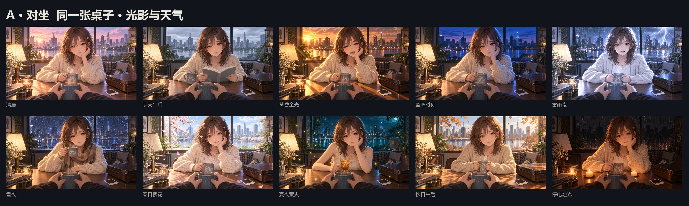

# Our World · 当前设计系统

> 维护：Monet；UI/UX：UI Tailor。更新：2026-09-27。**当前一期：对坐（2026-09-25 用户选定，09-27 定为开发方向）。** 本页与下面链接的常驻 Markdown 是概念与 UI 在内所有美术开发的唯一参考源；上一期资料已移到 `arts/archive/`，不在这里并存。

**[打开整体风格预览](preview.html#world) · [打开 UI/UX 全局预览](preview.html#ui)**

## 整体风格

**镜头就是你，桌子对面坐着你在乎的那个人。** 画面里只有对面一个人，正对着你；你出现在前景的手、袖口和杯子里。每个人的屏幕上都是对方，是同一张桌子的两头。角色是对方本人的形象，不是 AI 陪伴角色；对方真实在做什么，角色就在做什么。

| 维度       | 当前规范                                                                                                                                         |
| ---------- | ------------------------------------------------------------------------------------------------------------------------------------------------ |
| 构图与镜头 | 第一人称固定机位；对方半身居中偏上，桌子挡住下半身；前景是自己的手、袖口和杯子；前中后景分明、浅景深；只做小幅视差，不做自由镜头                 |
| 画风       | 二次元 CG 厚涂，接近抽卡游戏主视觉的完成度：半写实比例（不是 Q 版，也不写实）、细线稿、柔和赛璐璐加绘画渐变、暖色透光皮肤、细致发丝高光          |
| 光         | 实景光源做主光（台灯、炉火、红色安全灯），再配一道反差的环境光或轮廓光（窗外城市、雨夜冷光）；泛光、散景；每种时辰和天气的主光方向与色温明确不同 |
| 房间       | 一个房间 = 一个功能 + 一个小游戏；十个房间是十个真正不同的地方，各有自己的色调、光和标志物，不是一套公寓换颜色                                   |
| 互动       | 动手 → 对面有回应 → 结果留在对方那边 → 变成回忆；对方不在线也能玩，只加不减                                                                      |
| UI         | Cinnaglass 磨砂玻璃继续沿用，贴边停靠；场景和人物优先，UI 不长期盖住对方的脸                                                                     |

### 铁律（违反即返工）

1. **对面是真人**：角色的每个主动动作都来自对方的真实状态，或 TA 亲手留下的东西（录音、便条、送来的咖啡）。人不在就是空椅留痕，不装作在；「睡着了」只由对方主动设置，不靠断线猜测。
2. **只做正反馈**：植物不会死，没有连续打卡、排行和惩罚。
3. **互动长在房间和物件上**：场景里的东西是仪式和玩具，不做 UI 功能的重复入口；完整功能仍在 UI。
4. **可点物件不画光圈、描边、光环或定位针**：提示只用细小星芒、物件自身的待机动作（蒸汽、转盘、摇叶）或桌面端手形光标；hover 只改亮度、速度、透明度等参数，不换图。
5. **部件必须由生成产出，不后抠、不手修**（2026-09-06 用户定规）。
6. **死物吃画里的光，活物吃场景的光**（2026-09-07 用户定规）：静物保留原画光影；会动的部件和角色由引擎给光（tint、光层）。
7. **人物原创**：不像任何现有 IP；提示词不写在世艺术家或工作室名。

## 所有常驻入口

| 领域       | 文档                                                         | 覆盖                                                                 |
| ---------- | ------------------------------------------------------------ | -------------------------------------------------------------------- |
| 概念       | [对坐深化稿](concept/across-the-table/across-the-table.md)   | 77 张概念图、十个房间的玩法闭环、互动边界、界面流程、审图结论        |
| 角色       | [character.md](character.md)                                 | 小满与阿屿、形象预设、姿势库、在场状态、轻互动、第一期动作与制作方式 |
| 场景       | [scene.md](scene.md)                                         | 十个房间、书房第一期、时辰与天气、分层、镜头与手机取景               |
| 物件       | [props.md](props.md)                                         | 桌上物件、房间玩法道具、活物件制作管线与铁律                         |
| 效果       | [effects.md](effects.md)                                     | 光层、天气、粒子、声音、减少动态效果与性能边界                       |
| UI/UX      | [uiux/uiux.md](uiux/uiux.md)                                 | 当前界面地图、交互规则与手机布局                                     |
| Cinnaglass | [uiux/cinnaglass/ui-system.md](uiux/cinnaglass/ui-system.md) | 导航、场景浮窗、任务弹窗、物件 UI、字体与控件                        |

## 实装现状（2026-09-27）

- **书房第一期：第一个能跑的切片已完成**（开发环境加 `?table` 打开，线上仍是上一期书房）。她的视角：对面是阿屿，前景是她的奶油色针织袖口；三档时辰 × 晴 / 雨、台灯拉绳、五种在场状态、戳一下 / 摸头 / 喝一口的反应、两只杯子的蒸汽，桌面与手机同步。实装截图见 [场景](scene.md#实装截图) 与 [角色](character.md#在场状态)；他的视角、倒咖啡仪式和唱片机还没做，范围与进度见 [书房功能文档](../features/study-room/study-room.md)。
- **运行中的书房原画和双犬角色属于上一期**（放置陪伴小屋），书房替换完成后删除；它们的源素材已移档。
- **Cinnaglass UI 是当前 UI**：导航、双圆时辰 / 天气、聊天窄卡、音乐、纪念卡、金亮信纸、任务弹窗与手机布局继续沿用；UI 文档里的实装截图背景仍是上一期书房，书房翻新后重拍。

## 实际素材位置

| 内容                         | 位置                                                                                               | 状态                                                                                            |
| ---------------------------- | -------------------------------------------------------------------------------------------------- | ----------------------------------------------------------------------------------------------- |
| 对坐概念图                   | [concept/across-the-table/img](concept/across-the-table/img/)                                      | 当期参考，77 张全分辨率 JPG                                                                     |
| 出图 brief 与 Codex 制作注记 | [concept/across-the-table/notes](concept/across-the-table/notes/)                                  | 画风锁、人物设定、逐图拆层与体积估算                                                            |
| 书房与角色生产素材           | `arts/rooms/study/`、`arts/characters/ayu/`                                                        | 第一期：7 张底图 + 1 张几何母版、6 个部件、阿屿 7 个姿势（采用的原图、Codex 报告与 manifest）   |
| 运行时素材                   | [public/](../../public/)                                                                           | `rooms/study/table/`、`characters/ayu/` 为当前；旧书房底图与双犬为上一期，ST-10 删除；UI 为当前 |
| 书房实装截图                 | [study-verification](study-verification/)                                                          | 2026-09-27 开发环境拍摄，隐藏开发面板                                                           |
| UI 素材与样式                | [arts/ui](../../arts/ui/)、[public/ui](../../public/ui/)、[主题源码](../../src/themes/cinnaglass/) | 当前                                                                                            |
| 上一期档案                   | [arts/archive/v2-companion-house](../../arts/archive/v2-companion-house/README.md)                 | 放置陪伴小屋（2026-08-09～09-24）                                                               |
| 方向比稿档案                 | [arts/archive/v3-direction-proposals](../../arts/archive/v3-direction-proposals/scene-concepts.md) | 并肩、灯火小楼两个落选方向与比较                                                                |

## 维护规则

- **设计系统只放最新一期**（2026-09-27 用户定规，Monet 技能「换期与档案」）：新一期定下后，上一期的旧概念、旧稿与旧素材移到 `arts/archive/<期>/` 留档，只留一期；两期以前的资料尽量删除。档案不作开发参考源。
- **原始生成批次不入库**：`codex-visual` 的时间戳批次目录（草稿、未选图、工具日志）留在本地；定稿图、提示词与制作注记整理进常驻文档或 concept 后入库。
- **待确认的比稿**放 [视觉工作台](codex-visual/README.md)；方向认可后，Monet 把定下的部分写进领域文档，UI Tailor 把定稿的界面写进 `uiux/`。
- 每次设计变化同步本页和受影响的领域文档，并运行 `node scripts/check-design-system.mjs` 检查链接与图文。
