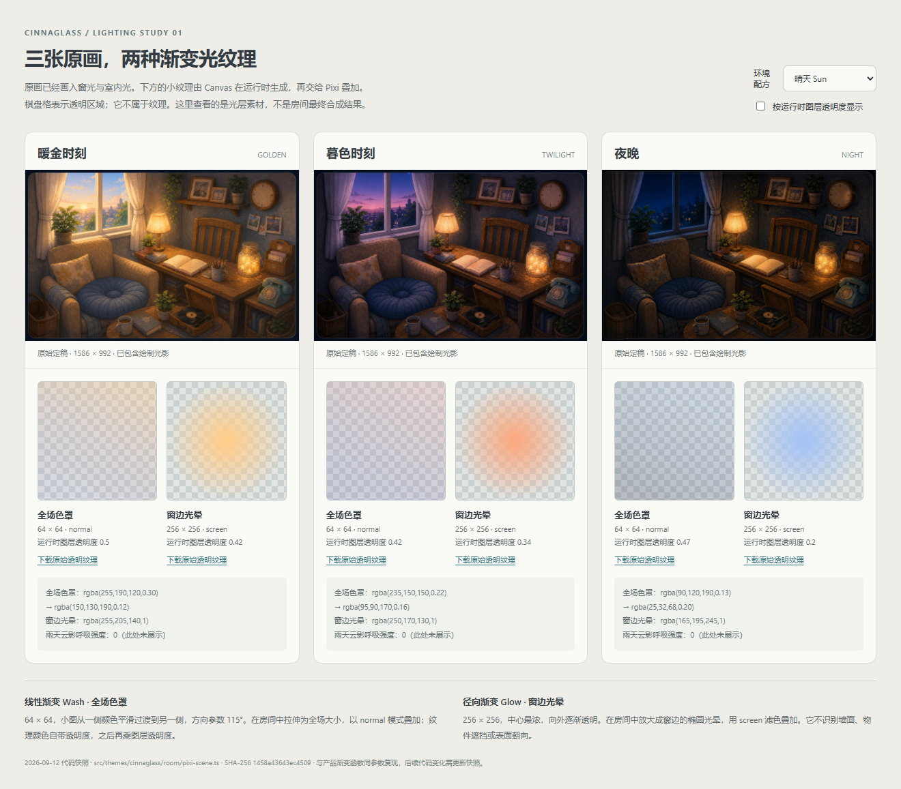

# 环境效果与反馈 · 当前设计

> [设计系统](design-system.md) / [场景](scene.md) / [角色](character.md) / [UI](uiux/uiux.md) · 2026-09-13

上图展示现有配方的纹理，既不是一套新原画，也不等于最终运行时全部叠层。[可切时辰/天气的现状预览](research/art-relighting-preview/index.html) 可随时查看。

## 目前采用的效果

| 效果             | 外观和行为                                           | 来源/限制                                                                 |
| ---------------- | ---------------------------------------------------- | ------------------------------------------------------------------------- |
| 时辰底图         | golden、twilight、night 交叉淡化，保留各档画中的光色 | 当前三档；不是计算任意灯光后自动重画整间房                                |
| 全场色罩 wash    | 半透明线性渐变覆盖画面                               | 小纹理拉伸合成；不是另一张房间图                                          |
| 窗边 glow        | 径向光晕在窗边叠加                                   | 按配方和窗位放大；不代表真实光线追踪                                      |
| 雨与云影         | 窗格内的雨层，以及雨天光层强弱变化                   | 晴/雨为当前两类表现，雪待做                                               |
| 角色、钟针与唱臂 | 根据环境着色，保留接触/局部投影                      | tint 和静态光层按不同部件使用，见实现；共享环境是输入关系，不是全物理光照 |
| 物件提示与反馈   | 星星提示、唱片机本体微动                             | 具体触发/粒子与当前源码一致；不恢复已否决的描边/换图路线                  |
| UI 表面反馈      | 导航细纹、透景模糊、绘制边光、悬停/按压暖光          | 见 [UI 主题](uiux/cinnaglass/ui-system.md)，不宣称实时场景反射            |

真实配方、雨层、星星与角色循环在 [pixi-scene.ts](../../src/themes/cinnaglass/room/pixi-scene.ts)。图像与代码展示的身份要分清；需要检验时长、轨迹或中间帧时看运行演示，不根据静态示例推断。

## 观看与交互原则

微动作避免催促感，装饰不遮住角色、文字和操作目标。保留适用的减少动态效果路径，长时间观看与性能分别检查。已决定“日记阅读雨不停播”，本轮不会借规范调整它；新的可访问性选择在相应阶段设计。

声音分为环境、音乐、反馈三层，组合应可记忆；网页不自动播放声音，需用户手势后才出声，静音开关跟随本地存储。ASMR 音景仍是 MVP 目标（见 [项目说明](../PROJECT.md) PRD），当前仅有音乐播放器（`music.tsx` / `shell/floaters.tsx`）；未接通的音乐按钮不能用动画伪装正在播放。

## 尚待决定

天光/窗光/室内灯的职责、独立控制和 UI 共用光环境尚未定稿；材质重光照研究见 [art-relighting](research/art-relighting.md)。新方案需要先对齐效果和成本，不能仅因主美谈光就引入新的渲染架构。UI 动画体系仍排在静态规范与状态/焦点之后。
