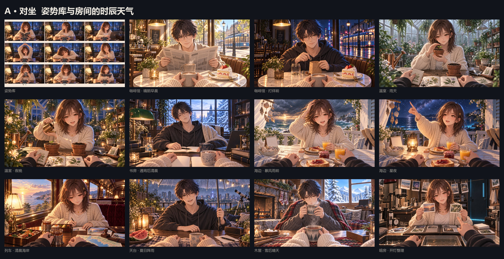

# 光影、天气与效果 · 当前设计

> [设计系统](design-system.md) / [场景](scene.md) / [角色](character.md) / [物件](props.md) · 2026-09-27
> **状态**：设计已定；书房第一期先做时辰三档、晴雨、台灯开关和人物受光，其余按下表排期。

同一机位、同一家具、同一个人，只换光和天气。这证明了一套场景分层加上每种状态各自的光层与天气层就够用，不必每种天气重画房间。

## 光

| 光           | 做法                                                                   | 第一期             |
| ------------ | ---------------------------------------------------------------------- | ------------------ |
| 时辰底图     | 每档一张画好光影的室内底图，切换时交叉淡化；静物保留画里的光（铁律 6） | 黄昏 / 暮色 / 夜晚 |
| 台灯         | 底图有「台灯关」一版，开灯时叠加台灯光层；关灯时人物受光一起变暗变冷   | 做                 |
| 人物受光     | 人物按时辰和台灯状态吃场景 tint；轮廓冷光之后用一层加色描边光补        | tint 先做          |
| 窗外城市     | 夜里城市灯带做少量闪烁；黄昏窗灯逐个亮起                               | 后续               |
| 体积光与尘埃 | 渐变网格加滚动噪声，尘埃粒子只在光束里可见（黄昏金光、温室）           | 后续               |
| 音乐联动     | 放歌时台灯光层随节拍轻微呼吸，不做全城频谱闪烁                         | 后续               |
| 调色与泛光   | 每档一张调色表；泛光在半分辨率做                                       | 后续               |

## 天气

| 天气     | 表现                                                                  | 第一期 |
| -------- | --------------------------------------------------------------------- | ------ |
| 晴       | 按时辰                                                                | 做     |
| 雨       | 窗外斜雨 + 玻璃上的水珠与下滑水痕，全部遮罩在窗格内；雨天光层变暗变冷 | 做     |
| 雪       | 窗外近远两层雪粒，玻璃边缘结霜                                        | 后续   |
| 雷雨     | 偶发闪电短暂把室内打成冷白；**必须能减弱或关闭**                      | 后续   |
| 季节粒子 | 樱花花瓣飘进来落在桌上、夏夜萤火虫、秋天落叶                          | 后续   |

## 粒子与小效果

| 效果     | 形状与行为                                                                                                                                                                                                                    |
| -------- | ----------------------------------------------------------------------------------------------------------------------------------------------------------------------------------------------------------------------------- |
| 杯子蒸汽 | 细长半透明的弯曲烟带，2–3 条错开上升后淡出；对方离开越久越弱，离线后停止。**已实装**（书房）：程序生成的 S 形飘带，加色混合、吃场景 tint；TA 离开或睡着后 15 分钟内减弱到三成，离线不再冒；我这杯一直冒；减少动态效果时不显示 |
| 光里尘埃 | 很小的暖色光点，稀疏、缓慢漂移，只在光束里可见                                                                                                                                                                                |
| 提示星芒 | 物件上偶尔闪一下的细小四角星，不围成圈、不描边                                                                                                                                                                                |
| 触碰反馈 | 摸头、戳一下、掌心相贴时在接触点出现一次柔和的暖光或小星星，短暂出现后消失，不长期发亮                                                                                                                                        |

## 声音

分环境、音乐、反馈三层：环境层（雨、炉火、咖啡馆）、音乐层（唱片机与播放器）、反馈层（倒咖啡、拉灯、翻页）。网页不自动出声，用户操作后才播放；静音跟随本地偏好。声音名片是对方亲自录的语音，只在 TA 录过时播放。

## 观看舒适与性能

- **减少动态效果**：关掉视差、快速雨丝、闪电和灯光呼吸；在场状态、开关灯这类有意义的变化保留。
- **长期挂着**：微动为主，不做催促式闪烁；显著的变化只由真实事件触发（对方上线、TA 在输入、你倒了一杯咖啡）。
- **帧率**：有动画时 30fps，静止时降到约 15fps，页面隐藏时暂停；设备像素比上限 1.5。
- **预算**：常驻滤镜不超过 2 个区域；透明层都要裁边；房间、状态和衣服按需加载。

实现：现有合成器 [compositor.ts](../../src/themes/cinnaglass/room/compositor.ts)、雨层 [rain-layer.ts](../../src/themes/cinnaglass/room/rain-layer.ts)、光照配方 [lighting.ts](../../src/themes/cinnaglass/room/lighting.ts)；第一期的改造进度见 [书房功能文档](../features/study-room/study-room.md)。各状态的拆层与体积估算见 [光影天气制作注记](concept/across-the-table/notes/lighting.md)。
