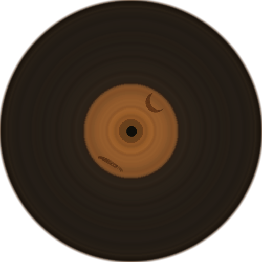
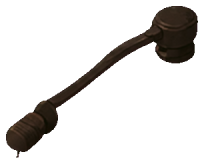

# 房间物件 · 当前设计与交互

> [设计系统](design-system.md) / [场景](scene.md) / [UI/UX](uiux/uiux.md) · 2026-09-13

物件保留画中的尺度、透视与手绘材质；它们既是家具，也承载功能入口。采用状态与后续“活物”设想分开记录。

| 物件与位置            | 外观                         | 当前点击/动画                                                                              |
| --------------------- | ---------------------------- | ------------------------------------------------------------------------------------------ |
| 日记 · 右侧书桌       | 棕皮、旧米纸、叠页与暖褐墨色 | 点击打开实体日记；正文随纸翻页，阅读时雨不停。拿起/收回及羽毛笔交互仍待办；本 session 冻结 |
| 相框 · 上方书架       | 木框与照片构成生活痕迹       | 点击进入照片墙；照片采用拍立得/纸面组织，外壳尚待 B 类统一                                 |
| 挂钟 · 右上墙面       | 圆形钟面贴合画中透视         | 钟针显示真实时间并有投影；点击进入时钟功能                                                 |
| 唱片机 · 前景低桌     | 木机壳、黑胶盘、标签与唱臂   | 盘面持续转动；悬停改变转速并抬针；点击打开音乐相关 UI，控件真实播放行为仍有待办            |
| 星星许愿罐 · 右侧桌面 | 暖色透明罐与瓶内星星         | 点击进入心愿功能；更完整的罐体/粒子动画是研究方向，未整体实施                              |
| 台灯、沙发、书架等    | 暖灯、织物、木家具           | 当前主要属于绘制背景；不把画中的发光解释为可单独开关的实时灯                               |

热点矩形与物件 ID 以 [study-room.ts](../../src/themes/cinnaglass/room/study-room.ts) 为准。曾经的外围光环、贴形金色描边和换图提示路线已被否决，不因保留研究就重新启用。

## 唱片机的活动部分

| 转盘外观层（展开显示）                                                               | 唱臂                                                                          |
| ------------------------------------------------------------------------------------ | ----------------------------------------------------------------------------- |
|  |  |

运行时用测得的盘面外沿和圆心约束透视旋转；标签和纹理跟盘转，静态光层保持在场景方位。唱臂从转轴抬起并带投影变化，不能把所有部件作为一张图片整体旋转。数值和分层关系见 [模板](../../src/themes/cinnaglass/room/study-room.ts)、[装配工具](../../scripts/build-turntable-parts.py) 与 [活物研究](research/living-props.md)。

## 日记的当前动态示例

这是已有运行示例，用于说明当前采用效果，不是本轮新动画。完整物件 UI 规范见 [Cinnaglass](uiux/cinnaglass/ui-system.md#c-专属物件-ui)。

原始/派生素材位置在 [设计系统来源表](design-system.md#实际素材位置)；运行时部件位于 [public/rooms/study/parts](../../public/rooms/study/parts/)，UI 物件资源另见 [public/ui/journal](../../public/ui/journal/)。
