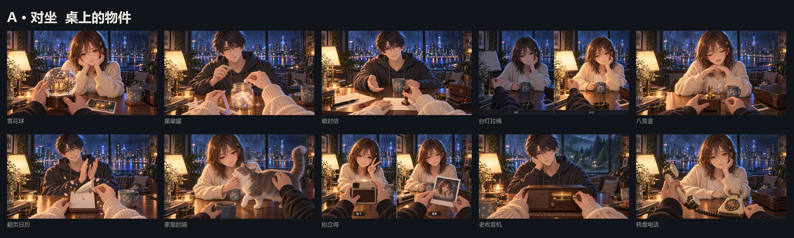
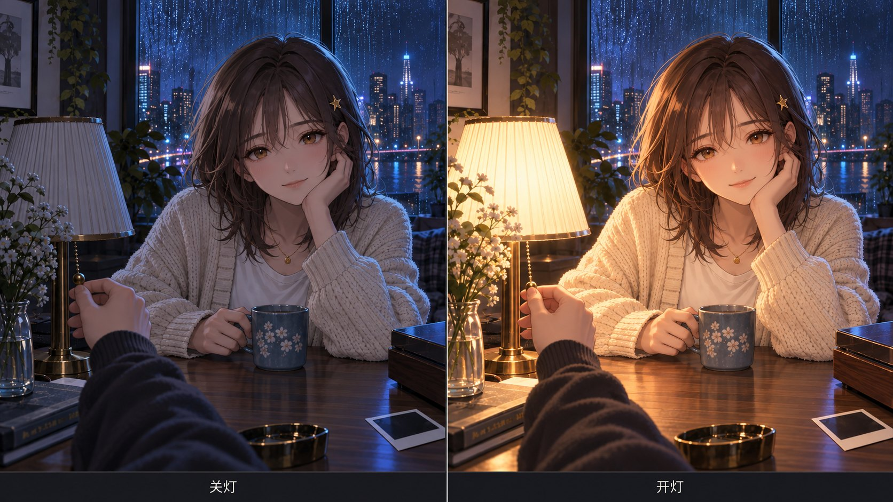

# 物件与活物件 · 当前设计

> [设计系统](design-system.md) / [场景](scene.md) / [角色](character.md) / [效果](effects.md) · 2026-09-27
> **状态**：设计已定；书房第一期的物件开发中。运行中书房的五个热点（日记、相框、挂钟、唱片机、许愿罐）属于上一期，书房替换后按下表重新映射。

## 桌上的物件

物件是仪式和玩具，不是 UI 功能的重复入口：动手 → 对面有回应 → 结果留在对方那边。可点物件不画光圈、描边、光环或定位针，提示只用细小星芒、物件自身的待机动作或桌面端手形光标。

| 物件     | 你做什么               | 结果                                               |
| -------- | ---------------------- | -------------------------------------------------- |
| 台灯拉绳 | 拉一下                 | 真的开灯或关灯，对方那边也跟着亮                   |
| 咖啡壶   | 倒一杯                 | 杯子滑到对面，TA 捧起来喝一口                      |
| 唱片机   | 放下唱针               | 开始放歌；完整播放器仍在 UI                        |
| 雪花球   | 摇一摇                 | 球里是你们初遇的咖啡馆，重看那张回忆卡             |
| 星星罐   | 把写了愿望的纸星放进去 | 进心愿单，实现后可以拆开                           |
| 蜡封信   | 写信、压蜡封           | 信放在对方桌上，等 TA 亲手拆开                     |
| 八音盒   | 上弦                   | 小人转起来，放一首你们的歌                         |
| 翻页日历 | 翻到有红心的那页       | 纪念日纸花飞出，可以留下当天的话或照片             |
| 家里的猫 | 摸它                   | 它去蹭对方的手，两边看到同一段                     |
| 拍立得   | 举起相机拍             | 照片慢慢显影，进照片墙                             |
| 老收音机 | 转旋钮                 | 换环境音（雨、咖啡馆、森林、海），窗景跟着变       |
| 转盘电话 | 电话响了，拿起听筒     | 播放 TA 留的语音；语音住在房间里，不只在聊天列表里 |

## 书房第一期的物件

| 台灯拉绳：关灯与开灯                                        | 倒一杯咖啡给对方（咖啡馆拉花的书房版）                                  |
| ----------------------------------------------------------- | ----------------------------------------------------------------------- |
|  |  |

| 物件       | 第一期做什么                                                                 | 真实数据                           |
| ---------- | ---------------------------------------------------------------------------- | ---------------------------------- |
| 台灯       | 拉绳轻摆可发现；拉一下开关灯，底图在开 / 关两版间过渡，人物受光跟着变        | 开关状态之后同步给对方             |
| 咖啡壶     | 点咖啡壶倒一杯 → 杯子滑到对面 → 对面人物接杯喝一口（喝一口姿势）             | 送出的这杯之后同步到对方桌上       |
| 唱片机     | 沿用现有转盘活物的做法（透视旋转、hover 抬臂），换成新画；落针即播放本机音乐 | 共享同听是后续功能，不伪装成已同步 |
| 日记本     | 放在桌上，点开现有的棕皮日记（日记 UI 本身冻结不改）                         | 现有时间线数据                     |
| 对方的杯子 | TA 在场时捧着或放在手边；TA 离开时留在原处，冒热气的强弱表示离开多久         | 在场状态                           |

相框（照片墙）、挂钟（时钟）和许愿罐（心愿）在第一期不放上桌，功能从导航进入；之后按暗房、拍立得、星星罐的玩法回到房间里。

## 活物件的制作（从上一期沿用的规则）

**铁律**

- 部件必须由生成产出，不后抠、不手修（2026-09-06 用户定规）。
- 死物吃画里的光，活物吃场景的光（2026-09-07 用户定规）：静物保留原画光影；会动的件出平光固有色，光由引擎给。
- 提示状态只做参数缓动：hover 只改 tint、速度、透明度，不换图、不描边。

**路线**：物件拆层 + 引擎内程序动画（位移、旋转、透明度缓动），辅以少量粒子和不超过 2 个着色器区域；蒸汽、窗帘这类有机形变用网格扰动或 8–16 帧循环兜底。一个场景有 2–3 个主循环加几处微动就足够「活」，物件按视线优先级分批做，不一期拆十个。

**七步管线** 0. 先列运动清单：切割线由运动决定，不由物体轮廓决定。

1. 全画布尺寸导出每个部件，保留同一坐标系。
2. 底图补洞（clean plate）：带全图上下文修，修完用差分确认只有洞区变了。
3. 被遮挡的部分补全整件（旋转件必须补成完整的圆）。
4. 差分闸门：clean plate + 全部部件原位叠回，应等于原底图（洞区除外）。
5. 打包：裁掉透明边，偏移、轴心、层级写进 manifest。
6. 有机件优先程序化，其次 AI 视频循环（用两段拼接法），再烘成小尺寸帧序列；AI 视频拆帧不作主力。
7. hover 差异不出图，亮度和速度全在引擎里做。

**教训**

- 生成模型的局部重绘不锁像素，会留残影和接缝：生成图只能当「捐体」贴回，不能就地修图。
- 按颜色阈值抠件必穿帮（投影和边缘会被一起抠进去）：抠件要按形状，最终改为生成优先。
- 多档时辰的生成部件，几何按一档统一再逐档配色，否则切时辰会变形。
- 贴图尺寸先贴近显示尺寸，再考虑 mipmap。
- 唱片按旋转对称性分解（基底 + 标签 + 固定光层）才成立；这套方法只适用于旋转对称的物体。

**性能**：动态精灵约 40 层加不超过 50 个粒子对 PixiJS 是小数目；真正的预算在纹理内存、滤镜（全场常驻不超过 2 个区域）和部件裁边（否则全屏过度绘制）。所有动画吃同一个场景时钟，失焦暂停。

上一期唱片机的完整制作记录（透视单应、闸门数值、五轮迭代）已移档到 `arts/archive/v2-companion-house/research/living-props.md`。它的代码（`room/turntable-prop.ts`、`room/homography.ts`、`scripts/build-turntable-parts.py`、`scripts/fit-disc-ellipse.py`）绑定上一期的素材格式，已随旧书房删除，在 git 历史里（提交 d555f06 及之前）；新唱片机按新书房的唱臂与唱片部件重写时参考其中的透视旋转做法。
