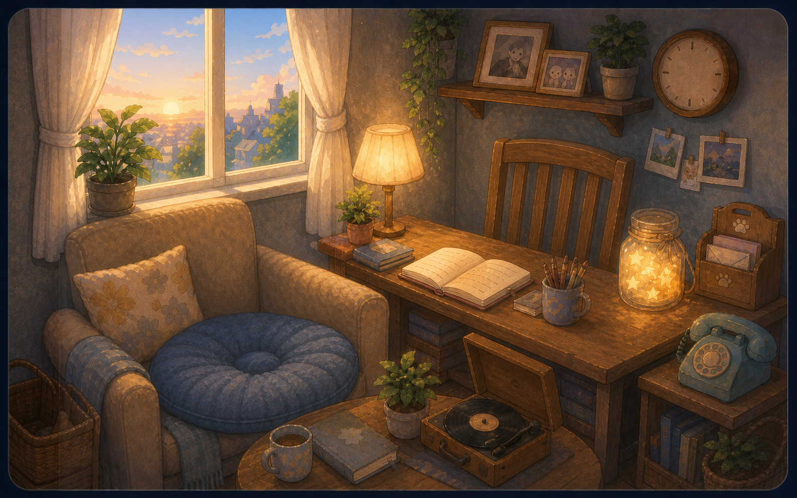
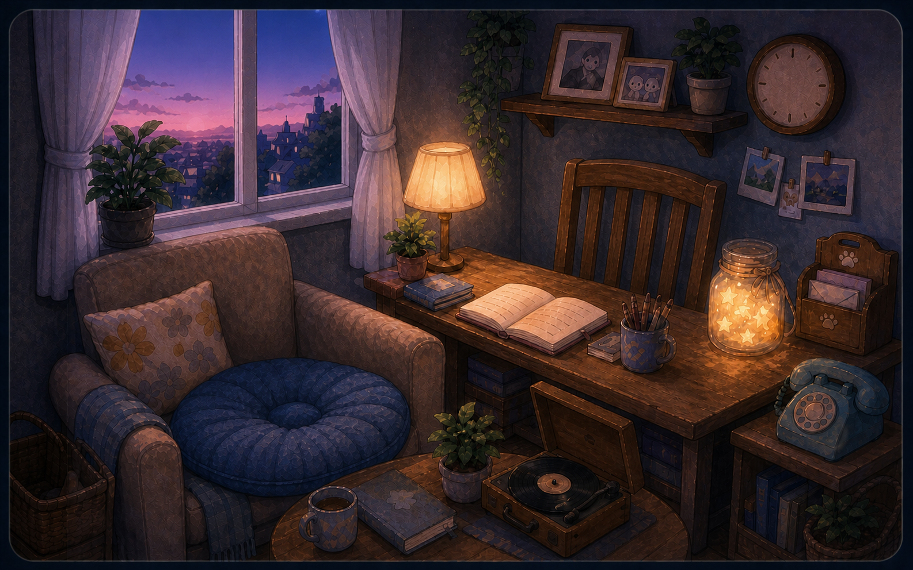
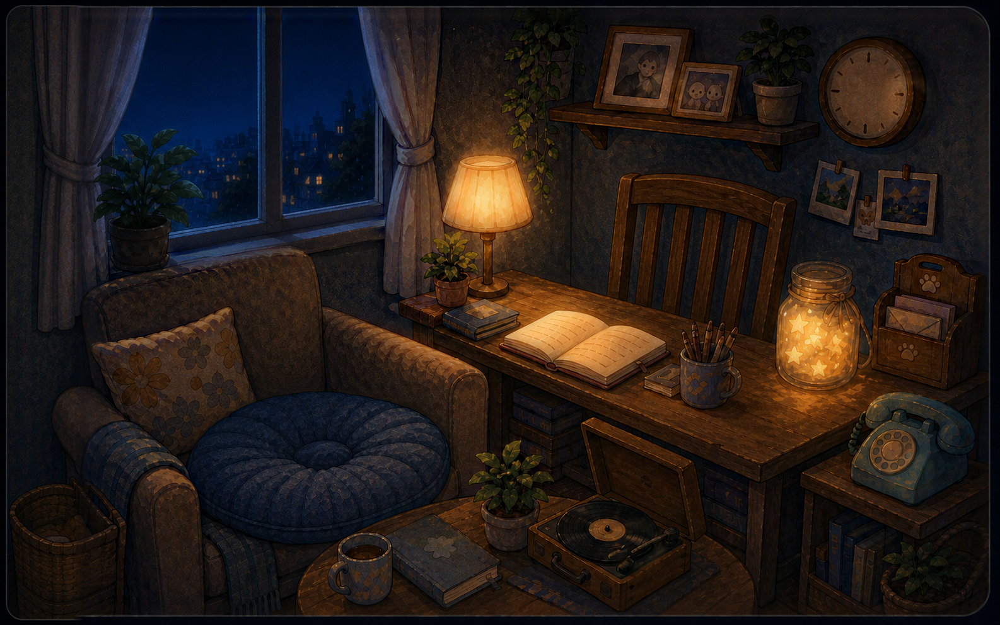
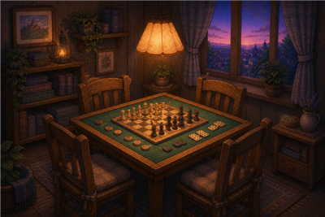
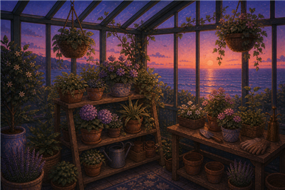

# 场景与建筑空间 · 当前设计

> [设计系统](design-system.md) / [角色](character.md) / [物件](props.md) / [环境效果](effects.md) · 2026-09-13

| golden · 黄昏                                                 | twilight · 暮色                                                 | night · 夜晚                                                 |
| ------------------------------------------------------------- | --------------------------------------------------------------- | ------------------------------------------------------------ |
|  |  |  |

以上是 1586×992 原画，已包含画中光色与阴影；运行时底图对唱片机盘/臂区域做了装配处理。不能把原画称为无光材质图。

## 构图与空间语言

当前采用一间书房：左侧窗与沙发，右侧书桌/书架，低桌唱片机形成前景。镜头固定、略俯视，木、织物、纸与玻璃采用柔软手绘边缘；场景不追求可以自由走动的完整 3D 房间。

房间模板拆分为时辰底图、角色座位锚点、物件热点、窗格区域、钟面与活物件（唱片机）；音景预设是目标字段，尚未进入模板。角色与房间解耦，为以后扩展房间保留相同使用方式。当前没有独立的室外建筑系统，因此本页覆盖实际采用的建筑空间，不预建空的建筑文档。

## 行为与动画

- 切换时辰时三张房间底图交叉淡化，角色/钟针等按同一个环境状态调整外观；三档是现状，四档是量产目标。
- 天气雨滴限制在窗格内，避免流到窗框或室内；环境的云影/光层见 [effects](effects.md)。
- 点击家具上的功能热点进入 UI，具体映射见 [props](props.md)。UI 导航与房间存在感要分清，实际关闭/焦点规则见 [交互文档](uiux/interaction.md)。
- 镜头与界面打开态需在真实场景中验收；日记当前允许遮挡角色，旧概念图的偏置/避让规则不再作为硬要求。

## 房间选择器中的预览

| 棋牌室                                                   | 植物园                                                 |
| -------------------------------------------------------- | ------------------------------------------------------ |
|  |  |

这两张是正在使用的缩略概念资源，完整房间尚未开放，不将缩略图存在当成功能已实现。后续构想在 [concept](concept/README.md) 登记，采用后再补本页与模板。

## 来源与检查

[原画](../../arts/rooms/study/source/) · [生产派生层](../../arts/rooms/study/generated/) · [运行时素材](../../public/rooms/study/) · [模板](../../src/themes/cinnaglass/room/study-room.ts) · [合成器](../../src/themes/cinnaglass/room/compositor.ts)

验收时同时看实际视口、角色表情、层级与热点位置；场景开着时应安静耐看，性能目标要实测，不能以图片静止推断渲染成本。
