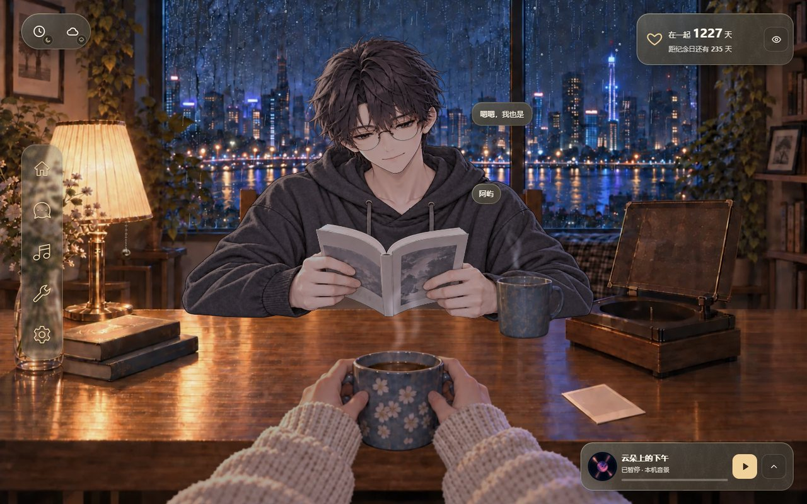
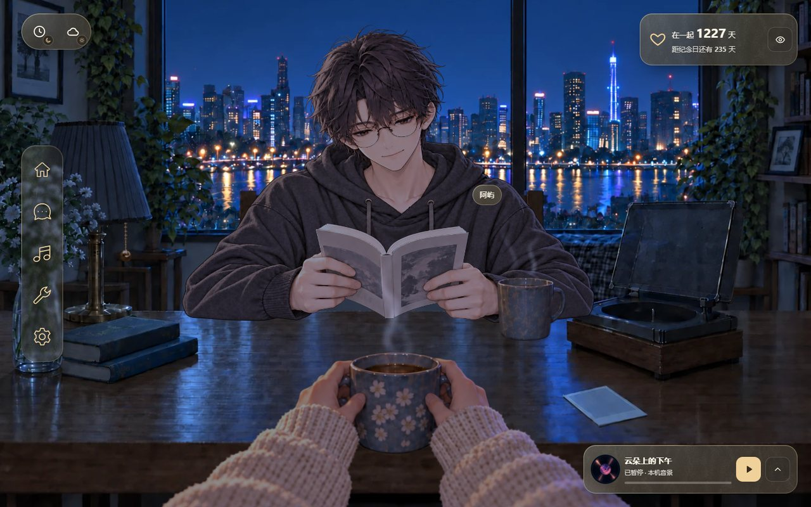
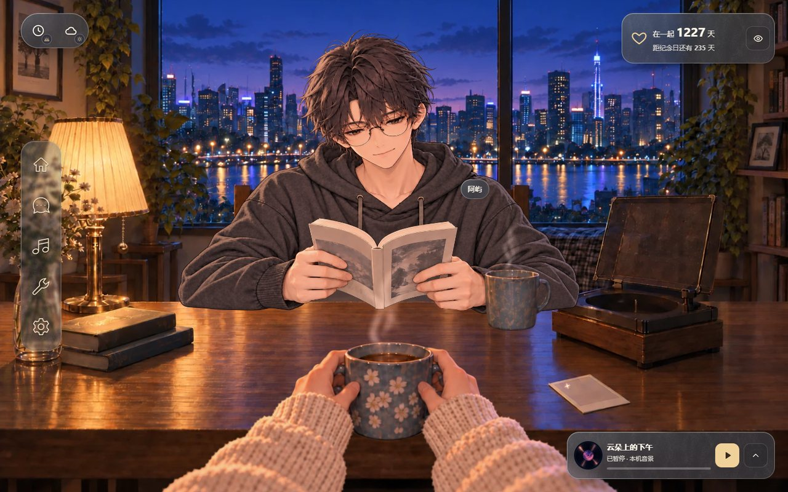
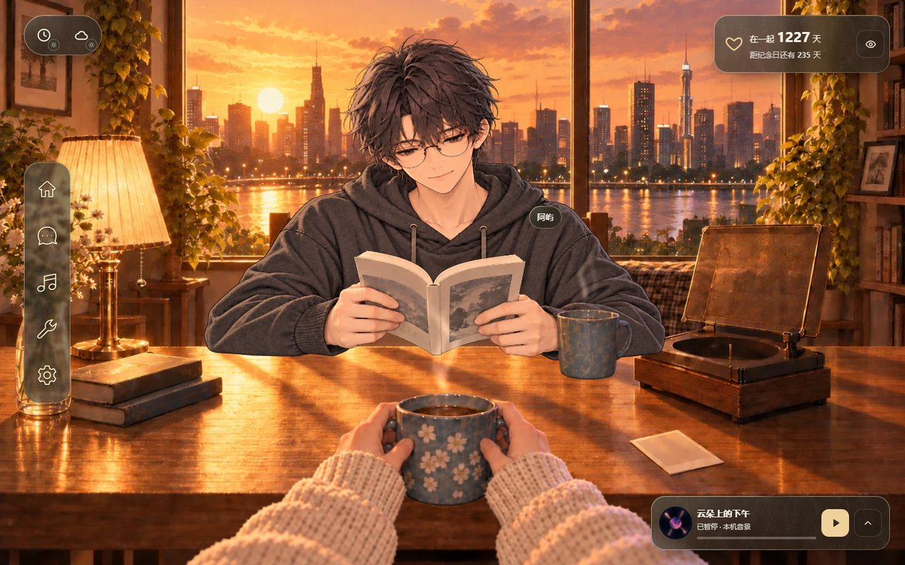
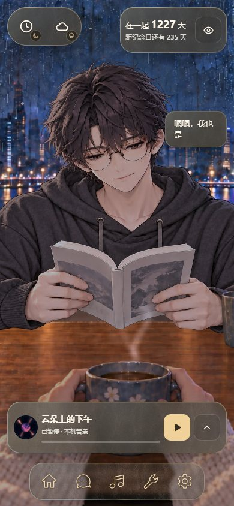
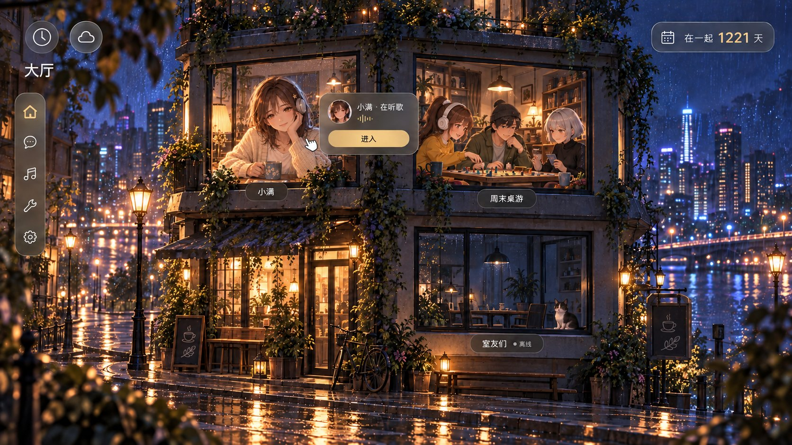

# 场景 · 当前设计

> [设计系统](design-system.md) / [角色](character.md) / [物件](props.md) / [效果](effects.md) / [对坐深化稿](concept/across-the-table/across-the-table.md) · 2026-09-27
> **状态**：十个房间的设计已定；第一期只做书房（翻新现有书房），开发中。运行中的书房原画属于上一期，替换完成后删除。

## 十个房间

每个房间是一张桌子所在的地方，对应一个功能和一个小游戏；两个人看到的是同一个房间，换房间会同时带上 TA。完整的玩法闭环、主视觉和玩法图见 [深化稿·十个房间](concept/across-the-table/across-the-table.md#十个房间)。

| 房间       | 功能             | 小游戏           | 光与天气         | 排期                 |
| ---------- | ---------------- | ---------------- | ---------------- | -------------------- |
| 书房       | 日记、在场、音乐 | 倒咖啡、落针放歌 | 雨夜城市窗、台灯 | **第一期**           |
| 唱片角     | 音乐             | 为你选一张       | 黄昏霓虹         | 首批（音乐）         |
| 暗房       | 照片墙           | 冲洗我们的照片   | 红色安全灯       | 首批（照片墙）       |
| 深夜书房   | 日记、一起专注   | 翻沙漏           | 雪夜、绿罩台灯   | 首批（并入书房玩法） |
| 玻璃温室   | 一起养成、纪念日 | 一起养一盆花     | 晴天光束         | 第一个新玩法         |
| 街角咖啡馆 | 聊天、送礼       | 为对方点一杯     | 雨天午后         | 后续                 |
| 棋牌室     | 小游戏、朋友房   | 桌游之夜         | 雨夜吊灯         | 后续                 |
| 夜行列车   | 异地、时差       | 一起去远方       | 雪原月夜         | 后续                 |
| 天台       | 心愿单           | 许个愿           | 夏夜萤火         | 后续                 |
| 海边小屋   | 闹钟、早安       | 早安风铃         | 日出、海风       | 后续                 |
| 雪夜木屋   | 环境音、睡前     | 烤棉花糖         | 壁炉、暴雪       | 后续                 |

唱片角的「落针一起听」先放进书房：桌上的唱片机就是音乐入口，完整播放器仍在 UI（用户 2026-09-27 交由 Monet 决定）。

## 书房（第一期）

构图沿用首张主视觉，也就是在场四态、姿势库和十种光共用的那张桌子：左边台灯，右边唱片机，桌上有书、拍立得和两个人的杯子，身后是雨夜城市的大窗，对面是一把木椅。第一期的书房在这张桌子上放进三件功能物：日记本（打开现有日记）、唱片机（音乐）和咖啡壶（倒一杯给对方）。深夜书房的沙漏和星星罐之后再并进来。

| 深夜书房（后续并入的玩法）                                               | 同一张桌子的十种光                                                    |
| ------------------------------------------------------------------------ | --------------------------------------------------------------------- |
|  |  |

### 时辰、天气与灯

- **时辰**：第一期沿用现有三档（黄昏 / 暮色 / 夜晚），跟系统时间走，也能手动切换；目标是五档（清晨、白天、黄昏、蓝调、夜晚）。
- **天气**：晴、雨（雨丝和水珠限制在窗格内）；雪和雷雨在后续。
- **台灯**：真的能开关。每个时辰画一对几何完全一致的整幅底图，开灯一版、不含台灯贡献的关灯一版，开关就是两版交叉淡化，不能只关一层新加的光晕（上一期重光照研究的结论）。光是相加的，所以「调暗」就是关灯版以部分不透明度盖在开灯版上，不用再画第三版。
- **对方的状态会改变画面**：TA 睡着时台灯在 1.6 秒里自己调暗到约 55%；TA 离开时椅子空着，外套搭在椅背、杯子留在原处，杯子的热气随离开时长变弱，离线后停止。

### 分层（从后往前，已实装）

1. 底图：每个时辰 × 天气一组，开灯版在下，关灯版按台灯亮度盖在上面；窗外、室内、桌面和桌上的死物都在这一幅画里，吃画里的光
2. 窗面雨层：程序生成的雨丝和水珠，遮罩在窗格内；雨夜另有一组画着雨痕的底图
3. 留痕：TA 离开时搭在椅背的外套
4. 对方人物：姿势图（见 [角色](character.md#制作方式第一期)）。躯干截断线正好落在桌面远沿，底图里的桌面自然显得在人物前面，不需要单独的桌面前沿层
5. 对方的杯子和它的蒸汽
6. 台灯拉绳：一直轻摆，拉一下会抖动并开关灯
7. 热区星芒：物件上偶尔一闪，不画圈、不描边
8. 前景：我的手和杯子（按我的形象换袖口），以及我这杯的蒸汽

会动的部分（人物、杯子、外套、拉绳、前景、蒸汽）吃场景的光：时辰配方的 tint，关灯时再乘一层偏冷的暗色。原计划里单独的「台灯光层」和「桌面前沿层」已由整幅开 / 关底图和截断线取代；唱片机盘面与唱臂、光里的尘埃还没接入。

### 镜头与取景

- 固定机位，不做自由镜头。视差只分两层：底图连同对方一起跟鼠标移动约 3px，前景的手和杯子移动约 10px。底图和人物不分开移动，免得人物和椅子之间露缝。手机陀螺仪视差之后再做；系统开了减少动态效果就关掉视差。
- **取景由模板里的两个数决定**：`x` 是对方脸的中心列，`top` 是所有姿势里最高的发顶再往上约 12px。
    - **比 3:2 更扁的宽屏**（大多数桌面浏览器）：从 `top` 往下取，头顶只留一线，多出来的高度全给桌面和我的手。对坐的「你在这里」靠前景的手成立，天空和天花板最先舍弃。
    - **更窄的屏幕**（平板竖屏、手机）：整幅底图的高度都放得下，横向以对方的脸为中心裁切。台灯和唱片机会出画，这时从导航进入对应功能。
    - 接近 3:2 的屏幕两个条件都满足，看到的就是完整构图。
- 对方身边的气泡与名牌怎么落位（避开脸），见 [UI 地图](uiux/uiux.md)；UI 停靠沿用 [手机版规范](uiux/mobile.md)。
- 场景底图按横屏 1536×1024 生成；人物单独按约 1.8 倍精度出图，所以两种屏幕上人物都清楚。

### 实装截图

2026-09-27 拍摄（开发环境，隐藏了开发用的对方状态面板）。

| 雨夜：气泡在他脸侧，名牌在肩线                             | 关灯：整间屋子转冷，两只杯子的热气更显眼               |
| ---------------------------------------------------------- | ------------------------------------------------------ |
|  |  |
| **暮色**                                                   | **黄昏**                                               |
|    |  |
| **手机竖屏：横向以他的脸为中心，气泡贴右边缘**             |                                                        |
|  |                                                        |

## 大厅与多人（后续）

大厅是所有空间的总览：每扇亮着的窗是一个人或一群人，窗暗着只剩猫表示离线；点进去就是和 TA 对坐。3–5 人的小桌用对坐（被炉、棋牌桌），更多人从大厅进入。

## 制作与体积

- 场景底图、人物、前景都要由生成直接产出（不抠图、不手修），几何按一档统一后再逐时辰配色，否则切时辰时会变形（上一期唱片机的教训）。
- Codex 估算单个房间首次进入 4–12 MB（压缩下载，未实测）；下载体积不等于显存，一张 2048×2048 的透明贴图解码后约 16 MiB，所以房间、状态和衣服都按需加载。
- 逐房间的拆层建议见制作注记：[房间 I](concept/across-the-table/notes/rooms-1.md)、[房间 II](concept/across-the-table/notes/rooms-2.md)、[光影天气](concept/across-the-table/notes/lighting.md)。

生产素材落在 `arts/rooms/study/`（采用的原图、Codex 报告与 `table-manifest.json`），运行时在 `public/rooms/study/`（含房间选择卡片的缩略图 `thumb.webp`，由装配脚本从晴夜开灯底图缩出）。对坐书房的模板是 [study-table.ts](../../src/themes/cinnaglass/room/study-table.ts)，合成器是 [table-scene.ts](../../src/themes/cinnaglass/room/table-scene.ts)，模板里的坐标全部从 manifest 粘贴。上一期的水彩书房（`study-room.ts`、`compositor.ts` 与它的素材）已删除。接入进度见 [书房功能文档](../features/study-room/study-room.md)。
