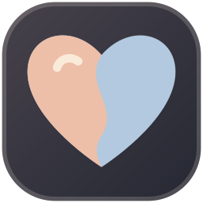

# 网站图标 · 两半心意

2026-09-27 用户选择 D「两半心意」，用于网站 favicon 和 iPhone 主屏幕图标。

两种身份色拼成同一颗心：玫瑰暖色 `#edbea8`、冷灰蓝 `#b3c9df`，米白高光 `#fff8eb`，底色沿用 Cinnaglass 深灰方向。轮廓与颜色来自本轮用户选定的矢量候选，不是实时在线状态。

## 实现与资源

- 浏览器标签：[favicon.svg](../../../../public/favicon.svg)，保留圆角深底与细边；[48px PNG](../../../../public/favicon-48.png) 和 [16/32/48px ICO](../../../../public/favicon.ico) 为兼容资源。
- iPhone 主屏幕：[apple-touch-icon.png](../../../../public/apple-touch-icon.png)，180×180、不透明、满幅深色底；系统负责最终圆角裁切，避免两层圆角。矢量源见 [apple-touch-icon.svg](identity/apple-touch-icon.svg)。
- HTML 配置：[index.html](../../../../index.html)，包括 `rel="icon"`、`rel="apple-touch-icon"` 和主屏幕标题「我们的小世界」。不改变当前启动模式或离线行为。

首次添加：iPhone Chrome 打开 `https://ilovelei.com`，分享 → 添加到主屏幕。已添加的图标可能缓存旧资源，可重新添加并确认预览，再移除旧快捷方式；不保证系统即时刷新已有图标。

## 验证边界

本轮同一 agent 按 Monet 标准自审：SVG/PNG 轮廓与 16/32px 小尺寸已检查，Apple PNG 尺寸和无透明通道已检查。桌面与服务端文件验证不等同于 iPhone 真机验收。

参考：[Apple Web Clip 图标配置](https://developer.apple.com/library/archive/documentation/AppleApplications/Reference/SafariWebContent/ConfiguringWebApplications/ConfiguringWebApplications.html)、[Chrome iPhone 添加到主屏幕](https://support.google.com/chrome/answer/15085120?co=GENIE.Platform%3DiOS&hl=zh-Hans)。
