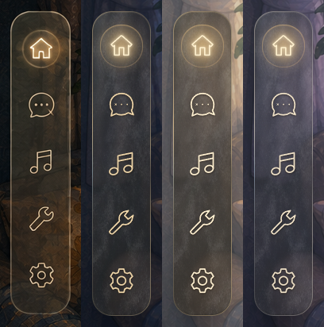

# 导航还原 · 实现与验证

2026-09-07。导航已接入本地产品并通过下列检查，待用户看实景；未部署。批准参考：[桌上的同一本日记](room-journal-concept.png)。本轮只实现导航；用户认可稿中发光，保留明显暖光，覆盖旧报告「下调光晕」的建议。日记本、其他弹窗与场景暂停逻辑不在范围内。机制说明见 `ai/features/navigation-glass.md`，本文只记数值、生成来源与验证。

## 1. 实际结果

后三列是运行产品的浏览器截图而非生成图，同尺寸裁图比较，原始截图留在 `navigation-verification/`。五图标布局、窄圆角外形、暖色线条、悬停光圈、非均匀边缘反光与微纹理透景已接入。**不是逐像素相同**：原图宽约 74、高约 382 px，实装 74×384 px；真实窗帘与房间透过玻璃会改变最终颜色，图标是按稿型重绘的矢量轮廓。

## 2. 材质数值

唯一实现位置 `src/themes/cinnaglass/shell/navigation-glass.css`；变量只存在 `.rail-wrap` 内，不改共用 `--cg-*` / `--craft-*`，避免把所有纸页与旧弹窗一起改色。

| 时辰 | 烟色底 RGB / 底色透明度 | 细纹强度 | 图标静止色 |
| --- | --- | --- | --- |
| 深夜 night | 76, 69, 58 / 0.17 | 0.34 | #EED5A8 |
| 黄昏 golden | 43, 36, 28 / 0.52 | 0.36 | #FFF0D0 |
| 暮色 twilight | 63, 64, 72 / 0.19 | 0.34 | #EEE0C6 |

透明度只指底色这一层，**不是合成后整条的不透明度**。黄昏窗帘比夜间亮很多，初版图标采样只有约 2.22:1；加厚该档烟色后最低核心采样升到 3.14:1，不是把黄昏直接套成夜色。

背景模糊 2.4 px、饱和度 0.7；反光边缘沿周长分段透明度约 0.02–0.72（1 px 遮罩边缘分段变亮变暗，不做等亮描边）。day / morning 留有中性回退参数，但现有书房只有上述三档，没有宣称白天或花园已验收。

层序：场景透射（不把底图烘进 UI）→ 按 mood 选厚度的中性烟色底 → 透明浅/深细纹（原始灰底已去掉）→ 局部细反光 → 图标线条自发光加一层琥珀光斑，不是给整张方形图提亮。

## 3. 尺寸与交互

桌面（视口 ≥768×600）：导航 74×384、圆角 25，离左 38 px，垂直居中；主按钮 54×54，五个入口依次为房间、聊天、一起听、工具、设置，不再叠无功能顶部徽标；聊天未读粉点保留。窄屏/矮屏：底部横条 292×62、离底 10 px，五个 48×48 触摸按钮；房间与工具小菜单向上展开，尺寸受视口约束。

| 状态 | 反馈 |
| --- | --- |
| 静止 | 暖色细线、轻接触阴影；无持续发光动画 |
| hover | 图标提亮，线条光晕与光斑约 200 ms 内出现 |
| pressed | 缩至 94%，光收紧更亮；松手恢复 |
| 菜单打开 | 保留较弱暖光，移开鼠标仍看得出哪个开着 |
| 键盘焦点 | 暖色轮廓与发光；Escape 收起小菜单 |
| 禁用 | 变淡、不可操作、不发光 |

触屏按住由 `data-pressed` 指针状态驱动（Chromium 下 `:active` 对按住不生效），发光不依赖鼠标悬停。房间/工具小菜单复用同一材质家族，但为读清文字把模糊提到 8 px、底色透明度至少 0.5，不照搬窄导航的薄玻璃参数；点外关闭由外部指针事件判断，不放可能撑宽页面的透明遮罩；导航用视口固定定位，不随页面滚动偏移。

## 4. 验证证据

脚本 `scripts/check-navigation.mjs`，输出 [results.json](navigation-verification/results.json)；截图使用真实应用加载的 CSS 与纹理，不由设计稿重新生成。

- 三时辰的静止/悬停/按住/菜单打开/键盘焦点均截图，鼠标移开后打开态暖光仍在；四尺寸 1440×900、960×700、640×400、390×844 的位置、大小与房间菜单边界断言通过。
- 五个主入口、禁用装扮、工具开关切换与恢复、照片墙开关、Escape 与点击外部通过；无未捕获脚本错误；共用纸色仍为 #D8CDBA，未被导航覆盖。
- 触屏模拟（390×844 粗指针、无悬停）：按住亮光达 1、缩放 0.94，松手与取消清除状态，菜单开关通过——桌面 Chrome 模拟，未冒充真机。
- 减少动态效果：过渡时长 0；禁用透明的回退样式已提供，未做 Safari 与真实系统偏好专项验收。
- 静止图标核心像素第 10 百分位对比度：深夜 4.52:1、黄昏 3.14:1、暮色 3.76:1。采样为隐藏图标前后截图配对、只查亮线核心，不等于全像素或全产品无障碍认证。

构建：改动 TSX 的 ESLint 与 Vite 打包通过；完整 TypeScript 类型构建仍被既有 `shell/chat-card.tsx:10` 的 `Msg` 导入错误阻断。Vite 主包超 500 kB 为既有提示，非导航新增。

未覆盖：真实触屏硬件、Safari、真实花园/白天房间、低端设备帧耗、双账号业务发送；未部署。最终审美确认由用户实景给出，不以自动脚本代替。

## 5. 文件与复用边界

`shell/rail.tsx`（原入口与菜单、五图标排列、键盘/指针反馈与关闭行为）、`shell/rail-icons.tsx`（五个导航专属线性图标，不改全项目图标体系）、`shell/navigation-glass.css`（尺寸、三档材质、局部反光、反馈状态、窄屏规则）；`arts/ui/navigation/` 原生成图与来源登记，`public/ui/nav/` 当前透明纹理与清单；`scripts/pack-navigation-texture.mjs` 把中灰偏差转成透明细纹并编码为约 298 kB WebP，不裁切或替换房间。

复用边界：本轮只迁移导航自身的房间/工具菜单；其他弹窗后续按同一材质家族归类，书页、照片等内容物件保留自己的实体材质，不能把整本日记变玻璃。

生成来源：[纹理提示词](navigation-texture-prompt.md)。设计系统：[导航登记](../ui-system.html#navigation-glass)。
