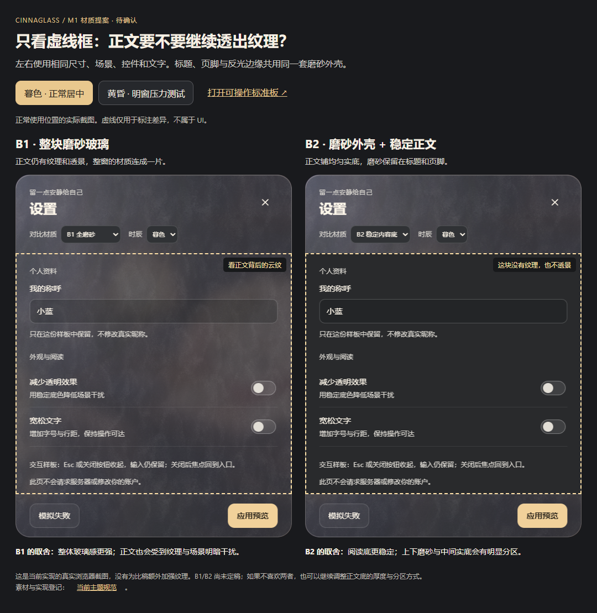
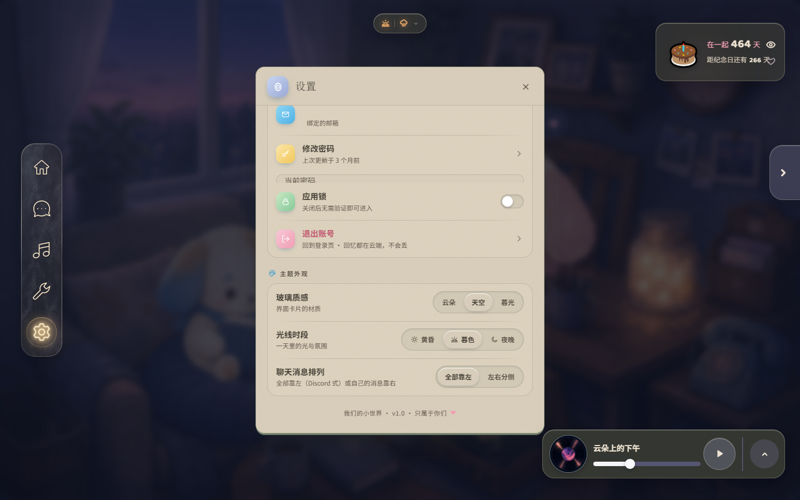
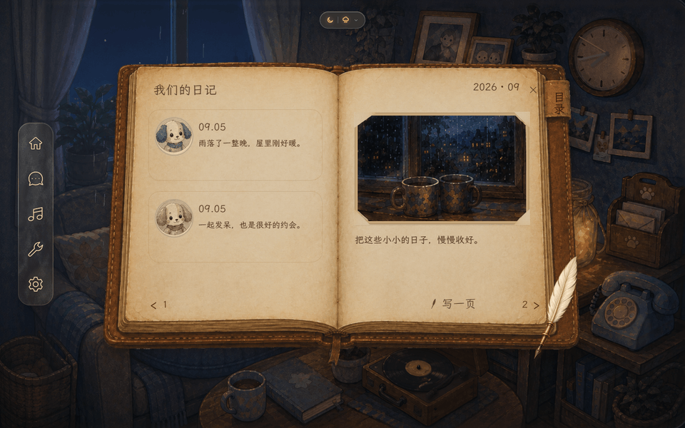

# Cinnaglass · 当前主题规范

> [UI/UX 总览](../uiux.md) / [整体设计](../../design-system.md) / [当前决定](decisions.md) · 2026-09-20。

导航是已认可的统一起点；A/B 其余界面只记录真实现状，C 日记本 session 冻结。本页是主题常驻规范，[HTML 组件/参数预览](ui-system.html) 看真实 CSS 与交互样板，历史内容必须有标识。

## M1 可操作标准板（提案，未定稿）

[实景标准板](standard-board.html) · [B1/B2 并排材质比较](material-comparison.html)。先看左右正文区的区别，再回到实景中操作；不依赖用户记住切换前的画面。

- **B1**：纹理与透景延伸到正文，整体玻璃感连续；明暗与云纹也会出现在文字背后。
- **B2**：标题/页脚沿用同一磨砂壳，正文使用均匀 `#292a2c` 实底；阅读更稳定，但三段衔接仍需打磨。UI Tailor 建议 B2；Monet 同一 agent 复核与独立视觉第二意见均支持该方向，**用户尚未选择**。
- 比较页保存暮色正常居中、黄昏明窗压力测试两组。明窗组只是临时摆位，不能据此把正式设置改成偏窗布局；同一组先冻结场景再截图，不人为加强材质差异。原截图在 [material-comparison](ui-unification/material-comparison/)，页面中的虚线不属于 UI。
- 标准板复用真实房间、导航与天气组件；聊天、音乐、设置为独立本地交互样板。支持三时辰/晴雨、聊天草稿与本页发送、音乐收起/恢复、设置关闭回焦点、模拟失败保留输入、减少透明效果与宽松文字；不连接账号保存或音频播放，不宣称这些产品功能已迁移。
- 壳沿用导航的 `frost.webp`，按 256×512 固定尺度取样；聊天/音乐使用固定偏移，不随打开或时辰重新随机。暖冷与边缘读取导航三档调色值，没有逐帧采样、真实环境反射或新增共享光照引擎。
- 窄屏（宽 ≤767 或高 ≤599）用底导航，聊天/音乐展开互斥；设置居中并限制在可视区域，内容可滚动。触控软键盘、系统缩放和产品数据链验收留在迁移阶段；标准板通过不代表全站通过。

实现来源：[页面入口](standard-board.html)、[交互组件](standard-board.tsx)、[隔离样式](standard-board.css)、[比较页](material-comparison.html)。正式路由未引入这些文件，日记与公共生产材质未修改。

设计参考：[Apple 材质指南](https://developer.apple.com/design/human-interface-guidelines/materials) 用于区分承载导航与内容的材质职责；[W3C 原生 dialog 技术](https://www.w3.org/WAI/WCAG22/Techniques/html/H102) 用于模态焦点与背景不可操作的验证，不复制其他平台的外观。

## A 场景悬浮 UI

**导航**：圆润窄 rail、克制图标、悬停/按压暖光；五入口为房间、聊天、音乐、工具、设置，工具再展开具体功能。键盘焦点与触屏按压需可辨认。材质机制与素材生成不在本页复述，见 [导航说明](../../../features/navigation-glass.md)。来源：[navigation-glass.css](../../../../src/themes/cinnaglass/shell/navigation-glass.css)、[frost.webp](../../../../public/ui/nav/frost.webp)、[源素材](../../../../arts/ui/navigation/)。

**天气/聊天/音乐/纪念卡/头顶状态**仍是各自配方，目标是继承导航材质与反馈、按内容加稳定阅读底。天气支持实况与手动晴/雨；聊天有窄卡和头顶气泡；音乐有展开与收起。实况失败语义、音乐假播放/进度、小屏越界与多窗重叠按 [审计](../../../features/ui-system/audit.md) 修正，**不能只改外观就宣称完成**。

## B 任务与功能弹窗

设置、照片、心愿、日历/时钟等通用壳混用暖灰纸与旧玻璃，纸色/文字以 [materials.css](../../../../src/themes/cinnaglass/materials.css) 为准；同源较厚磨砂外壳加稳定内容底**尚未批准或迁移**。照片仍用拍立得拼贴，心愿/时钟等内部内容无需强套书本。

弹层规范须同时解决：打开/关闭、背景是否可操作、焦点进入/返回、隐藏后能否获焦、草稿保存、加载/错误、实际提交。已知层级/隐藏焦点/假成功问题见 [交互](../interaction.md) 与 [M2/M4 计划](../../../features/ui-system/ui-system.md)。

## C 专属物件 UI

棕皮、旧米纸、叠页与手写风墨色，文字与图片随真实纸面一起翻动。桌面双页、小屏单页；允许遮挡角色，阅读时雨继续。拿起/收回与羽毛笔交互待做。

[原素材](../../../../arts/ui/journal/) · [运行时素材](../../../../public/ui/journal/) · [journal-room.css](../../../../src/themes/cinnaglass/journal/room.css) · [journal-turn.css](../../../../src/themes/cinnaglass/journal/turn.css) · [功能与翻页机制](../../../features/timeline.md)。

## 边缘页面与公共规则

登录、重置、大厅、加载/空态/错误仍用 [screens.tsx](../../../../src/themes/cinnaglass/surfaces/object-surfaces.tsx) 等现有主题代码，范围见 [全组件审计](../../../features/ui-system/audit.md)；M5 与公共控件一起收敛，有消费者的旧样式逐项迁移后再清。

色彩、字体、间距、图标、选中/禁用/焦点/错误共享语义，A/B/C 不另建三套品牌。当前 `--nav`、`--cg`、`--shell/--glass`、`--craft` 并存，参数在 [cinnaglass.css](../../../../src/themes/cinnaglass/cinnaglass.css) 及组件文件；不另建手抄 tokens.md。

### 实现与验收注意

- 透明度与真实文字对比度一起检查；必须用真实场景亮度和真实图标，不能用 emoji 或浅文档底替代。
- CSS 变量别名在声明处求值，mood 宿主的重新声明不能随意删。四载体契约：主题 token/原子类 → 域前缀组件 `<style>` → 页面 CSS Module → `<image-slot>` shadow DOM。有消费者的 `.glass`、按钮、字段等旧类按审计依赖逐项迁移，不按名称直接删。
- 动画后置；先定状态、显隐、焦点与反复输入行为，旧“果冻时长表”不是新定稿。
- 新采用组件必须补本页或链接的独立 Markdown：图片/动态示例、特征、操作路径、真实来源。UI Tailor 维护，Monet 审核；普通回归报告留在 session。
