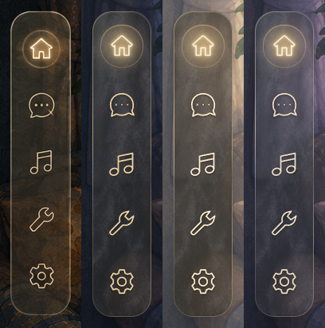
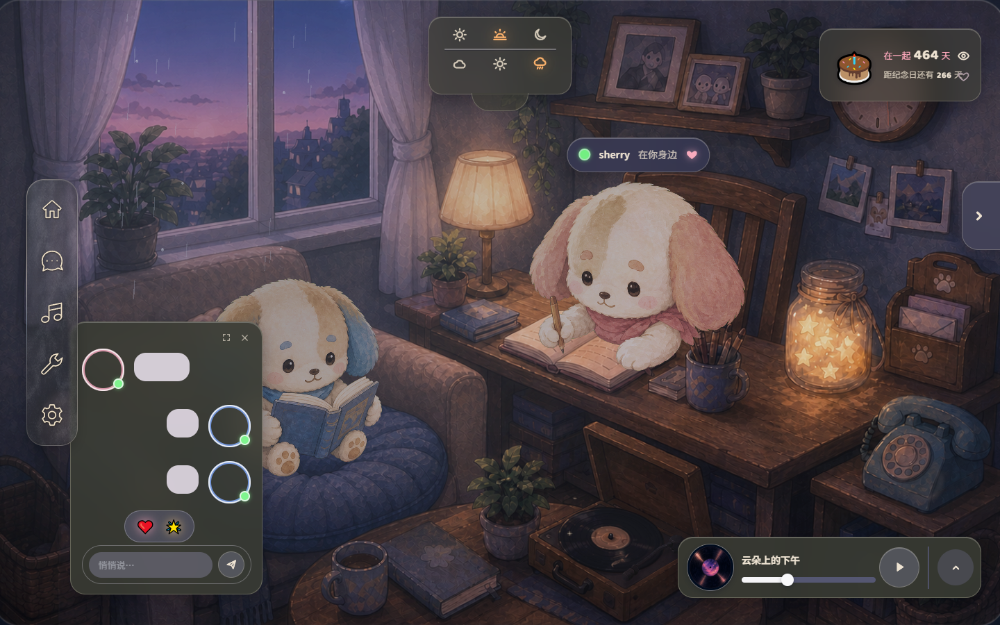

# Cinnaglass · 当前主题规范

> [UI/UX 总览](../uiux.md) / [整体设计](../../design-system.md) / [当前决定](decisions.md) · 2026-09-20。

导航是已认可的统一起点；设置已采用 B 新材质；其余 A/B 界面记录真实现状，C 日记本 session 冻结。本页是主题常驻规范，[HTML 组件/参数预览](ui-system.html) 看真实 CSS 与交互样板，历史内容必须有标识。

## A 场景悬浮 UI

**导航**：圆润窄 rail、克制图标、悬停/按压暖光；五入口为房间、聊天、音乐、工具、设置，工具再展开具体功能。键盘焦点与触屏按压需可辨认。材质机制与素材生成不在本页复述，见 [导航说明](../../../features/navigation-glass.md)。来源：[navigation-glass.css](../../../../src/themes/cinnaglass/shell/navigation-glass.css)、[frost.webp](../../../../public/ui/nav/frost.webp)、[源素材](../../../../arts/ui/navigation/)。

**天气/聊天/音乐/纪念卡/头顶状态**仍是各自配方，目标是继承导航材质与反馈、按内容加稳定阅读底。天气支持实况与手动晴/雨；聊天有窄卡和头顶气泡；音乐有展开与收起。实况失败语义、音乐假播放/进度、小屏越界与多窗重叠按 [审计](../../../features/ui-system/audit.md) 修正，**不能只改外观就宣称完成**。

## B 任务与功能弹窗

**设置已定稿并接入本地产品（2026-09-20）**：连续磨砂外壳包住圆角阅读内衬，标题与页脚共享外壳，正文独立滚动。内衬不透明，只随时辰改变固有底色：黄昏暖灰褐、暮色灰紫、夜晚深暖灰；外壳纹理、透景和边缘配方沿用已批准样板。不是实时场景采光或物理反射。

图中为实际 SettingsScreen + RoomScene + Rail，姓名/邮箱是隔离测试的演示数据；正式入口为房间导航「设置」。[全局预览](../../preview.html#ui) 自动读取这些图；[原比稿](../../codex-visual/ui-unification/material-comparison.html) 只作来源。

- **材质与布局**：外壳 488px，视口四周至少 12px；圆角 26px、小屏 22px；内衬圆角 18px、小屏 14px。只有正文滚动，保留标题与关闭入口；控件点击区至少 44px。唯一参数真源是 [settings.css](../../../../src/themes/cinnaglass/settings.css)，不另建 tokens 文档。
- **操作**：原生 modal dialog 限制背景操作与焦点；打开聚焦标题，Esc/关闭按钮/点外关闭并返回入口。密码折叠后不可获焦；本次未新增开合动画。
- **真实行为**：昵称失焦或 Enter 保存，失败留草稿可重试；邮箱只读；改密先验证当前密码，成功再清空，失败保留输入；退出失败可重试。设置关闭保留未提交密码（当前挂载期间），不写入持久存储；外观即时生效，没有虚构的总「应用」按钮。
- **兼容与降级**：「卡片配色」暂保留供尚未迁移界面使用，并明确设置随时辰变化；不支持背景模糊或系统偏好减少透明时外壳用稳定底色。世界设置入口按用户决定暂不恢复。
- **来源**：[settings.tsx](../../../../src/themes/cinnaglass/settings.tsx)、[导航配色](../../../../src/themes/cinnaglass/shell/navigation-glass.css)、[同一 frost.webp](../../../../public/ui/nav/frost.webp)。只改设置作用域，未改公共 `.modal/.paper` 或 C 日记依赖。

其他 B（照片、心愿、日历/时钟、完整聊天等）仍待迁移；已批准设置样板不代表全站统一完成。它们的关闭/草稿/嵌套选择器需逐项按 [交互规则](../interaction.md) 和 [M2/M4 计划](../../../features/ui-system/ui-system.md) 验证。

## C 专属物件 UI

棕皮、旧米纸、叠页与手写风墨色，文字与图片随真实纸面一起翻动。桌面双页、小屏单页；允许遮挡角色，阅读时雨继续。拿起/收回与羽毛笔交互待做。

[原素材](../../../../arts/ui/journal/) · [运行时素材](../../../../public/ui/journal/) · [journal-room.css](../../../../src/themes/cinnaglass/journal/room.css) · [journal-turn.css](../../../../src/themes/cinnaglass/journal/turn.css) · [功能与翻页机制](../../../features/timeline.md)。

## 边缘页面与公共规则

登录、重置、大厅、加载/空态/错误仍用 [screens.tsx](../../../../src/themes/cinnaglass/surfaces/object-surfaces.tsx) 等现有主题代码，范围见 [全组件审计](../../../features/ui-system/audit.md)；M5 与公共控件一起收敛，有消费者的旧样式逐项迁移后再清。

色彩、字体、间距、图标、选中/禁用/焦点/错误共享语义，A/B/C 不另建三套品牌。当前 `--nav`、`--cg`、`--shell/--glass`、`--craft` 并存，参数在 [cinnaglass.css](../../../../src/themes/cinnaglass/cinnaglass.css) 及组件文件；不另建手抄 tokens.md。

### 实现与验收注意

- 透明度与真实文字对比度一起检查；必须用真实场景亮度和真实图标，不能用 emoji 或浅文档底替代。
- CSS 变量别名在声明处求值，mood 宿主的重新声明不能随意删。四载体契约：主题 token/原子类 → 域前缀组件 `<style>` → 页面 CSS Module → `<image-slot>` shadow DOM。有消费者的 `.glass`、按钮、字段等旧类按审计依赖逐项迁移，不按名称直接删。
- 动画后置；先定状态、显隐、焦点与反复输入行为，旧“果冻时长表”不是新定稿。
- 新采用组件必须补本页或链接的独立 Markdown：图片/动态示例、特征、操作路径、真实来源。UI Tailor 维护，Monet 审核；普通回归报告留在 session。
