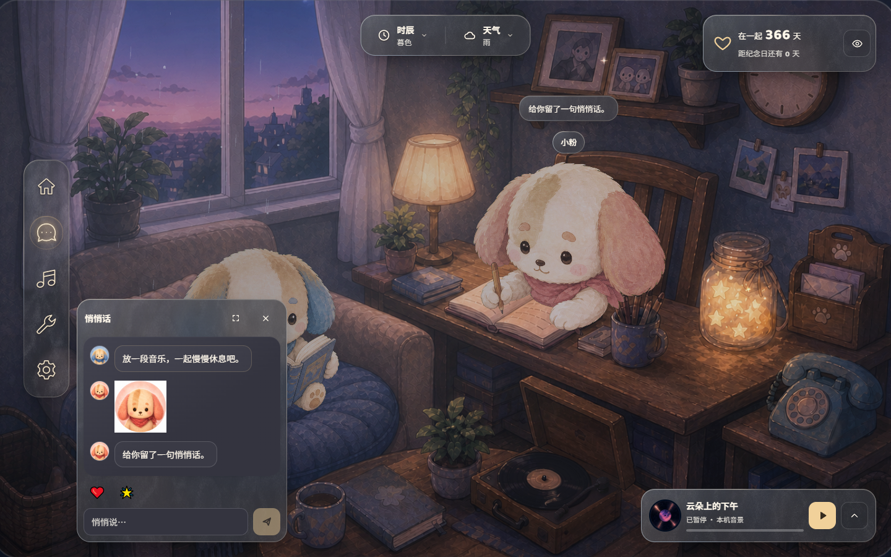
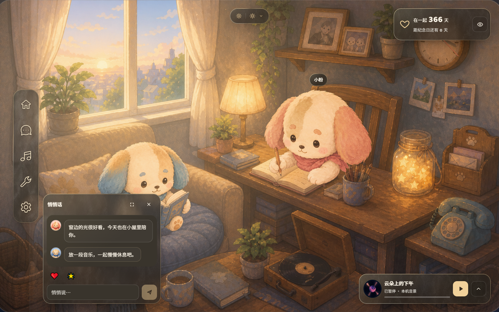
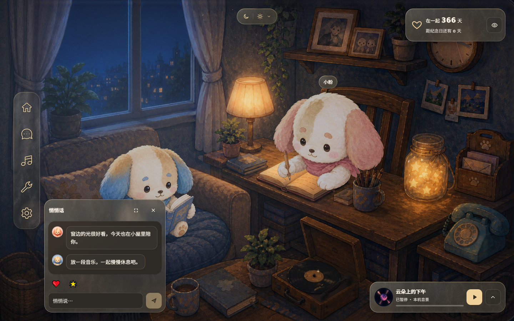
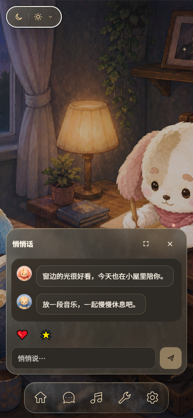

# Cinnaglass · 当前主题规范

> [UI/UX 总览](../uiux.md) / [整体设计](../../design-system.md) / [当前决定](decisions.md) · 2026-09-20。

**[打开全局实景预览](../../preview.html#ui)**。A/B 与账户、大厅已按用户批准的导航母材质完成本地迁移；下图为实际组件与真实房间素材，账号、消息、照片列表用隔离演示内容。它们展示当前实现，独立 Monet 复核不代替用户后续体验反馈。C 日记冻结，新的 UI 动画体系后置。

## A 场景悬浮 UI

**同源材质**：固定 [frost.webp](../../../../public/ui/nav/frost.webp)、实时背景模糊与艺术化边光。导航外观保持原配方；A/B 读取其三时辰的 tint/top/cold/rim。纹理不随打开或渲染随机变化，边缘不做真实场景反射；共同光环境仍是后续工作。

**停靠与操作**：桌面左下聊天、右下音乐、上方天气/纪念卡；窄/矮屏聊天与展开音乐互斥，打开音乐能恢复已隐藏的 widget。A 不打开全屏遮罩；天气菜单 Esc 返回触发钮。聊天支持输入法，完整操作展开到 B；姓名不冒充在线状态，纪念日来自实际世界数据。

**声音与天气真实边界**：音乐是四组 WebAudio 合成音景，没有歌曲文件，也没有双人同步。播放/暂停、进度/拖动、曲目、循环方式与音量独立于展开/隐藏，隐藏不销毁音频。天气手动模式不显示虚构温度；实况加载、成功和不可用明确区分。时间提醒只在本机保存，不发系统通知。

来源：[公共材质](../../../../src/themes/cinnaglass/ui/ui-system.css)、[导航说明](../../../features/navigation-glass.md)、[环境接口](../../../../src/themes/cinnaglass/ui/use-ui-environment.ts)、[停靠布局](../../../../src/themes/cinnaglass/shell/shell-layout.css)、[天气](../../../../src/themes/cinnaglass/shell/ambience.tsx)、[聊天窄窗](../../../../src/themes/cinnaglass/shell/chat-card.tsx)、[音乐](../../../../src/themes/cinnaglass/music.tsx)、[音频生命周期](../../../../src/themes/cinnaglass/use-music-playback.ts)、[场景反馈](../../../../src/themes/cinnaglass/room/room-overlays.css)。

## B 任务与功能弹窗

**连续磨砂壳 + 圆角不透明阅读内衬**。标题和页脚共享外壳，正文滚动；黄昏暖灰褐、暮色灰紫、夜晚深暖灰。照片保留拍立得纸框，表单和通用壳不再使用旧纸/苔绿底。

- 唯一 A/B 参数真源：[ui-system.css](../../../../src/themes/cinnaglass/ui/ui-system.css)。默认宽 488px，内容宽窗 920px，视口边距至少 12px；外圆角 26px、小屏 22px，内衬 18px、小屏 14px。动作点击区至少 44px；窄屏日历保持七列，日期格宽度随列缩小、高度 44px，不宣称每个日期格均 44×44。
- [TaskDialog](../../../../src/themes/cinnaglass/ui/task-dialog.tsx) 统一原生顶层、背景不可操作、标题初始焦点、最上层 Esc、点外关闭与焦点返回。光箱先关自己；编辑/表情选择器先消费 Esc。草稿生命周期仍按各任务定义。
- 设置保留真实昵称/改密/退出链路，失败可重试；头像仅本机保存，键盘可替换/调整/移除；外观即时生效。新增「减少透明效果」，系统偏好与不支持模糊时也有稳定底色。旧 glassStyle 存储只作未迁移 C 兼容，不再显示无效选项。

聊天保留历史加载、重试、编辑/删除、反应、贴纸和好友能力；按钮使用线性图标。输入法确认不发送/搜索，失败内容可恢复；贴纸删除和好友解除需显式确认。

来源：[设置](../../../../src/themes/cinnaglass/settings.tsx)、[日历/提醒](../../../../src/themes/cinnaglass/calendar.tsx)、[完整聊天](../../../../src/themes/cinnaglass/chat/chat-hub.tsx)、[选择器](../../../../src/themes/cinnaglass/chat/emote-picker.tsx)、[好友](../../../../src/themes/cinnaglass/chat/friends-page.tsx)、[集合入口](../../../../src/themes/cinnaglass/surfaces/object-surfaces.tsx)、[照片](../../../../src/themes/cinnaglass/surfaces/photo-wall.tsx)、[心愿](../../../../src/themes/cinnaglass/surfaces/wishlist.tsx)、[世界设置](../../../../src/themes/cinnaglass/world-settings.tsx)。交互细节见 [常驻交互规范](../interaction.md)。

## C 专属物件 UI

棕皮、旧米纸、叠页与手写风墨色，文字与图片随真实纸面一起翻动。桌面双页、小屏单页；允许遮挡角色，阅读时雨继续。拿起/收回与羽毛笔交互待做。

[原素材](../../../../arts/ui/journal/) · [运行时素材](../../../../public/ui/journal/) · [journal-room.css](../../../../src/themes/cinnaglass/journal/room.css) · [journal-turn.css](../../../../src/themes/cinnaglass/journal/turn.css) · [功能与翻页机制](../../../features/timeline.md)。

## 边缘页面与公共规则

来源：[登录](../../../../src/pages/LoginPage.tsx)、[重置](../../../../src/pages/ResetPasswordPage.tsx)、[路由加载](../../../../src/pages/ProtectedRoute.tsx)、[大厅](../../../../src/themes/cinnaglass/lobby.tsx)、[入口样式](../../../../src/themes/cinnaglass/entry.css)。场景模块加载和失败也提供可读反馈与重新加载入口。

共用米白文字、暖金操作、身份蓝/粉、明确错误/成功语义；局部兼容旧字段名时在 A/B 宿主范围重绑，避免旧 `.paper` 的棕色文字漏入新内衬。旧 `--cg-*`、无消费者面板原子、旧大厅和 LoginBackdrop 已退役；日记依赖的 `.paper/.craft`、素材和交互保持原状。

**验证边界**：本地浏览器验证覆盖三时辰、桌面/窄屏/矮屏、最上层关闭、焦点与主要失败恢复；演示数据不代表线上内容。真实手机软键盘、OS 缩放和低端设备性能仍需真机验收。当前已有动效保留，新动画体系另做；普通回归报告只写 session。
