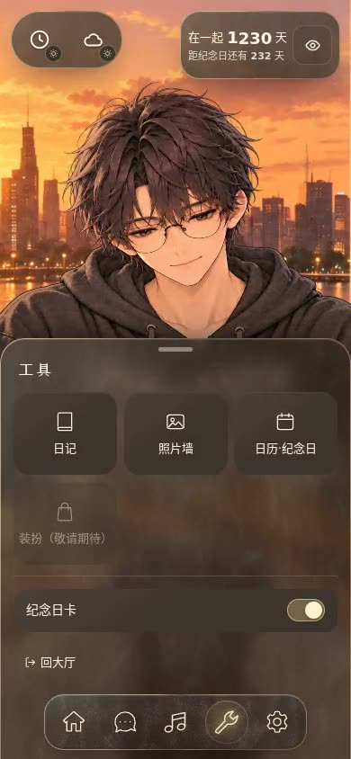
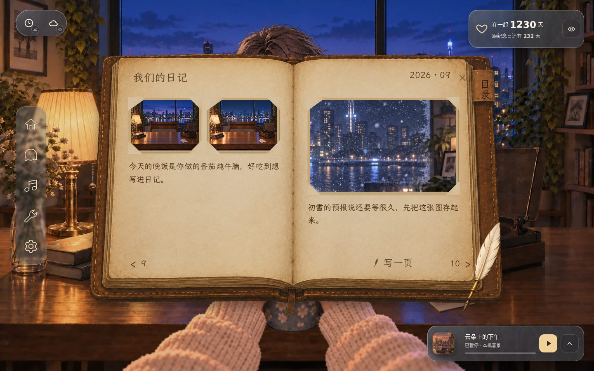
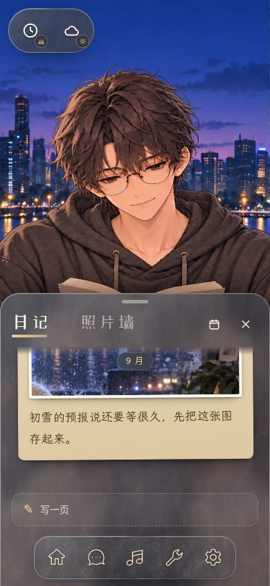
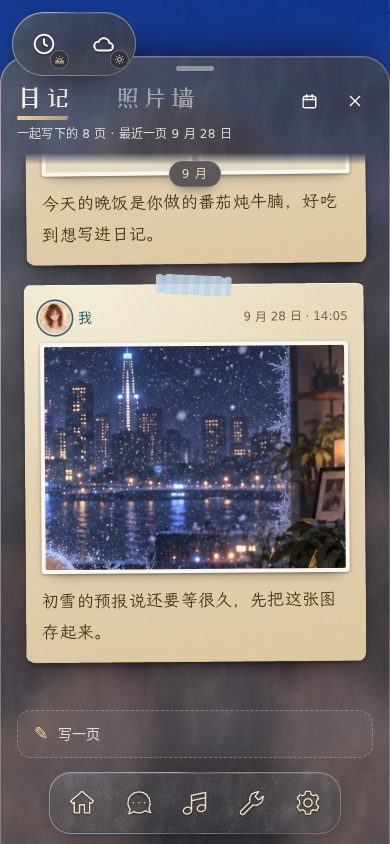
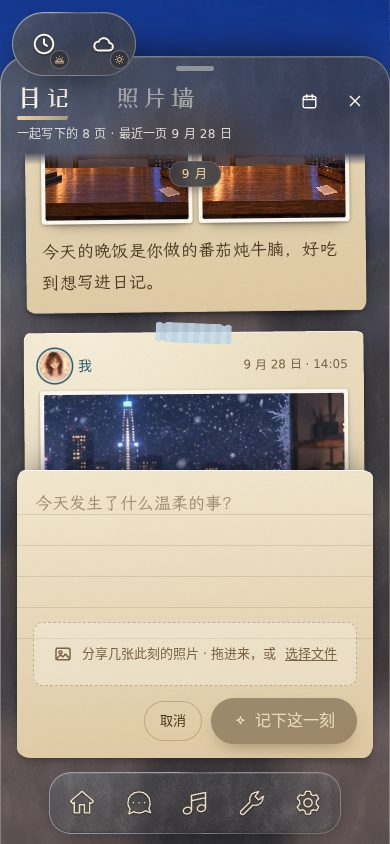
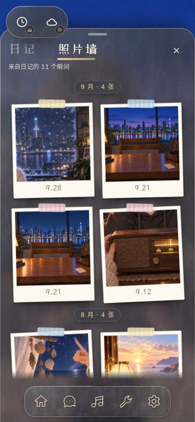
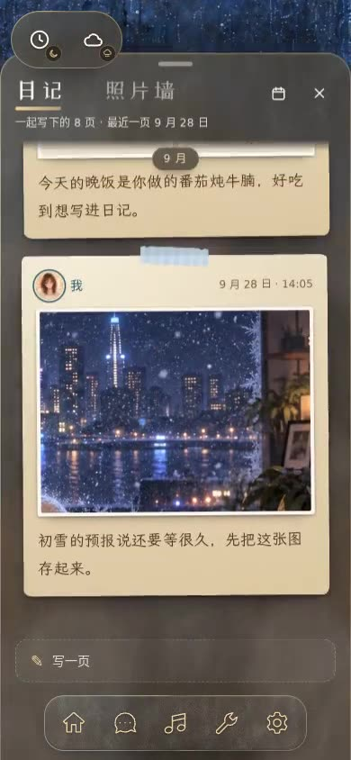
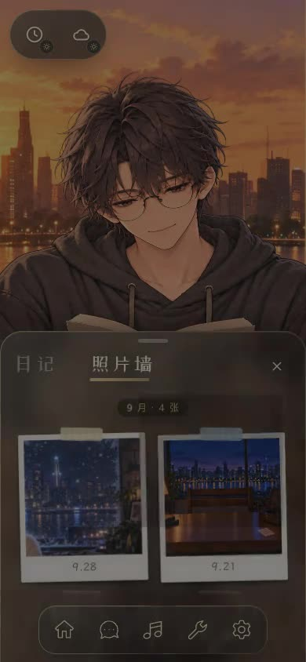

# Cinnaglass · UX 参考：已采用的交互与动效

> 维护：UI Tailor；审核：Monet。2026-09-30。**UX 和视觉一样是开发的参考源**（2026-09-30 用户定规）：每一种已采用的交互都写流程、状态、动效数值和低动效降级，并配实装录屏；token 只是参数表（[motion.css](../../../../../src/themes/cinnaglass/ui/motion.css)），不能代替这些。候选与比稿见 [看样页](../../../codex-visual/ui-motion/review/index.html)（[动效与托盘](../../../codex-visual/ui-motion/ui-motion.md)、[日记与照片墙](../../../codex-visual/memories/memories.md)）。

录屏都是正式组件在隔离样板里操作的实录（无 GPU 容器软件渲染，录制时暂停了场景，所以对面的人物是静止的）；点封面图播放。状态说明：**定稿** = 用户已确认；**实装 · 待看样** = 用户授权本期直接做完，按推荐方案实现，用户还没看过。

## 总原则

- **任何交互都有反馈**（用户：这是游戏 app，不必过分克制）：按下缩、放开弹、悬停亮、成功有小庆祝、失败轻摇；低动效模式兜底。
- **TA 优先**：手机上功能从底部升起，只盖住我这边（手和杯子），对面的人完整可见；桌面上面板停靠在右侧一列，不挡对方的脸。
- **退场快于进场，动作可打断**：弹层从触发它的地方长出来；拖动跟手，甩一下就走；中途反向不跳帧。
- **低动效**：设置 → 主题外观 → 动效（跟随系统 / 完整动效 / 低动效）。位移、缩放、回弹归零，只留淡入淡出；循环和粒子关掉；房间的视差、微动、蒸汽停止。

| 名称            | 数值                                                                          |
| --------------- | ----------------------------------------------------------------------------- |
| `--ease-out`    | `cubic-bezier(0.23, 1, 0.32, 1)` 进场、退场、按下                             |
| `--ease-drawer` | `cubic-bezier(0.32, 0.72, 0, 1)` 托盘升降                                     |
| `--ease-pop`    | `linear()` 弹簧，回弹约 10%：放开按钮、小红点、印章、拍立得                   |
| `--ease-spring` | `linear()` 弹簧，回弹约 3%：面板、弹窗、标签滑块                              |
| 时长（ms）      | 按下 90 · 放开回弹 460 · 悬停 160 · 进场 260 · 退场 150 · 面板 420 · 托盘 460 |
| 幅度            | 按压 0.95（大块 0.97）· 悬停上浮 1px · 进场位移 10px、缩放 0.96               |

## 1. 手机托盘 · 定稿

2026-09-30 用户：从下面升起的模式很喜欢，保留。音乐、聊天、工具、房间、回忆都用同一个托盘（[sheet.tsx](../../../../../src/themes/cinnaglass/ui/sheet.tsx)）。

- **流程**：点导航图标 → 托盘从底边升到半高（可见高度的一半，至少 340px），导航浮在托盘上 → 拖手柄或标题条上拉到全高 / 下拉收起，甩一下（> 0.11 px/ms）直接到位 → 再点同一个图标、Esc 或下拉收起，焦点回到入口。点另一个导航图标直接换内容。
- **状态**：半高、全高、拖动中（超出顶部有阻尼）、收起中；托盘打开时我这边的桌面轻轻压暗，对方保持明亮；键盘弹起时托盘骑在键盘上。
- **动效**：升起 460ms `--ease-drawer`，收起约 260ms `--ease-out`；低动效改为原地淡入淡出。
- **手机上的 B 类任务窗**（设置、日历、时钟、完整聊天）同样从底边升起、顶部圆角，短的只盖到对方胸口以下。

| 音乐托盘                                                                                                    | 聊天托盘                                                                                    | 工具与房间                                                                            |
| ----------------------------------------------------------------------------------------------------------- | ------------------------------------------------------------------------------------------- | ------------------------------------------------------------------------------------- |
|  |  |  |

## 2. 音乐主页面 · 定稿（B1 + 唱片 + B5 停靠 + B3 沉浸歌词）

2026-09-30 用户：B3 沉浸歌词要；B6 桌面三栏不要；海报和歌词先占位。实现 [music.tsx](../../../../../src/themes/cinnaglass/music.tsx)、[floaters.tsx](../../../../../src/themes/cinnaglass/shell/floaters.tsx)。

- **流程**：桌面迷你条 → 展开成右侧整列停靠栏；手机导航音乐图标 → 托盘半高（正在播放）→ 点标签「歌词 / 歌单 / 声音」自动拉满。点正在播放里的两行歌词，或歌词页右上的「沉浸」→ **沉浸歌词**：海报糊成整个面板的底色，歌词大字滚动、当前句放大发金、点一句跳过去，底下一条迷你播放条；「退出沉浸」或 Esc 回到主页面（Esc 先退沉浸，再收播放器）；手机上把托盘拉回半高也会退出沉浸。
- **状态**：未播放 / 正在打开声音 / 播放中（唱片从封套里滑出慢转，导航音乐图标带三根音柱）/ 静音；收藏只存在这台设备；空收藏有说明。
- **动效**：唱片滑出 420ms `--ease-spring` 并持续旋转；歌词换句浮入；沉浸底图 900ms 淡入并从 1.08 缩回，歌词逐行浮入，当前句字号 420ms 过渡；低动效停唱片与音柱、只留淡入。
- **占位**：8 张海报是当期概念图的方形裁切，歌词是为每段音景写的短句；正式封面等用 Codex 出图（不在这里自己生成）。

| 桌面停靠栏                                                                                            | 手机沉浸歌词                                                                                    | 桌面沉浸歌词                                                                            |
| ----------------------------------------------------------------------------------------------------- | ----------------------------------------------------------------------------------------------- | --------------------------------------------------------------------------------------- |
|  |  |  |

## 3. 进入世界 · 已实现（D1 热气进度条 + D2 台灯渐亮 + D5 进屋揭幕）

看样页上的推荐方案，用户未提异议，按现状保留。实现 [world-loader.tsx](../../../../../src/themes/cinnaglass/shell/world-loader.tsx)、进度源 [load-progress.ts](../../../../../src/themes/cinnaglass/shell/load-progress.ts)。

- **流程**：大厅点「进入世界」→ 空桌的灭灯底图上叠亮灯底图，亮度跟着真实加载进度走（房间贴图 + 人物姿势图）→ 玻璃卡：冒热气的杯子、金色进度条、百分比、每 2.2 秒换一句小提示 → 装好后卡片下沉、暗角张开、画面归位，导航和浮窗依次浮上来。
- **状态**：加载中 / 到了（「TA 就在对面」）/ 失败（直接换成原有的错误卡，不演「到了」）；只有标题是读屏播报，轮换的提示不打扰读屏。
- **动效**：揭幕 760ms；界面分批浮现；低动效只留进度条和淡入淡出。

| 手机                                                                                        | 桌面                                                                              |
| ------------------------------------------------------------------------------------------- | --------------------------------------------------------------------------------- |
|  |  |

## 4. 回忆面板：日记 + 照片墙 · 实装 · 待看样（G1 手帐 + H1 拍立得墙）

2026-09-30 用户要求日记与照片墙桌面、手机统一迭代，旧日记先不删，本期直接做完。按推荐方案实现；其他方向（桌面长卷、日历手账、软木板、月历相册、放映机）在 [日记与照片墙比稿](../../../codex-visual/memories/memories.md)。实现 [memory-surface.tsx](../../../../../src/themes/cinnaglass/surfaces/memory-surface.tsx)、[journal-stream.tsx](../../../../../src/themes/cinnaglass/surfaces/journal-stream.tsx)、[photo-wall.tsx](../../../../../src/themes/cinnaglass/surfaces/photo-wall.tsx)、[memory-lightbox.tsx](../../../../../src/themes/cinnaglass/surfaces/memory-lightbox.tsx)、[memory.css](../../../../../src/themes/cinnaglass/surfaces/memory.css)。

- **入口**：点桌上的书 → 日记；点桌上的照片或工具菜单「照片墙」→ 照片墙；工具菜单新增「日记」。两者是同一个面板的两个标题页签（「日记 / 照片墙」，金色笔触滑过去），切换不丢滚动位置和草稿。
- **载体**：桌面停靠在右侧一列（音乐停靠栏的那一列，打开时音乐条、纪念卡、信纸让开，音乐照常放），场景不暂停、TA 不被挡；手机是可拉满的托盘，半高时正好露出最新一页和「写一页」。
- **日记**：每一页是一张贴在玻璃上的纸（胶带、微微歪、手写字），从旧到新往下排，打开时停在最新一页；月份标签吸顶；照片按张数排版（一张横幅、两张并排、三张一大两小、更多三列，第六格标「+N」）；长文折成五行「展开全文」。**谁写的用墨色、头像圈和名字区分，从不用左右位置**（[timeline §七](../../../../features/timeline.md)）。往上滚到顶自动翻出更早的回忆。
- **写一页**：底部一条虚线「写一页」→ 点开一张横格纸从下面升起（手机上托盘自动拉满、键盘弹起时骑在键盘上）；拖图进来或选文件（最多 9 张）；「取消」清空，点外面或 Esc 只收起、草稿留着（收起的条上显示「草稿」）；关掉面板再打开草稿还在。「记下这一刻」后新的一页从下面落上来，角上盖一个「记」字印章并溅出几点墨星。
- **目录**：右上日历图标 → 当月日历，写过的日子带墨点（蓝是我、粉是 TA、两人都写就两个点），点一天把那天的第一页滚到中间并亮一圈；翻到已载入之前的月份时提示「载入更早的回忆」；可刷新。
- **照片墙**：日记里所有照片按月贴成拍立得，两列，胶带、微歪、铅笔日期；打开时逐张钉上墙。
- **灯箱**：照片从被点的那张缩略图里长出来（先裁成缩略图的样子，再展开成整张），底下一条说明：谁、哪天、那一页的字、第几张；← → 键、左右滑翻页，到头有阻力；Esc、关闭、点暗处或把照片往下拉关闭，照片缩回原位；从照片墙打开时可「在日记里看 →」跳回那一页并亮一圈。先显示缩略图，原图签好后换上，失败保留缩略图并说明。
- **状态**：加载中（纸片骨架）/ 空（「第一页，从今天开始」+「写下第一页」）/ 出错（「再试一次」）/ 照片还没签好（照片位先显示纸色空位）/ 墙上还空着。
- **Esc 层级**：灯箱 → 写一页 → 目录 → 面板；焦点在键鼠设备上进入面板，收起时回到入口。
- **动效**：面板 420ms `--ease-spring` 从右滑入（手机按托盘）；页签切换 260ms 淡入上浮；写一页 420ms 升起；新页 620ms 落下 + 印章 560ms（延迟 300ms）+ 墨星；拍立得 520ms `--ease-pop` 逐张 45ms 钉上；灯箱长出 440ms、缩回 320ms，翻页 280ms；滑动翻页阈值 64px 或 0.45 px/ms，下拉关闭 110px；目录 420ms 弹出。低动效全部改淡入淡出，印章直接出现、不溅墨星（纸的歪斜是装饰，保留）。
- **旧书本**：设置 → 主题外观 → 日记样式「手帐 / 书本（旧版）」。选书本时日记还是原来的棕皮书（翻页、目录、写一页照旧，代码在 [journal/](../../../../../src/themes/cinnaglass/journal/)），照片墙仍在回忆面板里。

| 桌面：日记                                                                    | 桌面：照片墙                                                         |
| ----------------------------------------------------------------------------- | -------------------------------------------------------------------- |
|  |     |
|                 |   |
|                       |  |

| 手机半高                                                         | 拉满                                           | 写一页                                      | 照片墙                                     | 灯箱                                       | 下拉关闭                                       |
| ---------------------------------------------------------------- | ---------------------------------------------- | ------------------------------------------- | ------------------------------------------ | ------------------------------------------ | ---------------------------------------------- |
|  |  |  |  |  |  |

| 桌面日记与照片墙                                                                                                        | 手机日记                                                                                            | 手机写一页并记下                                                                                                    | 手机照片墙与灯箱                                                                                    |
| ----------------------------------------------------------------------------------------------------------------------- | --------------------------------------------------------------------------------------------------- | ------------------------------------------------------------------------------------------------------------------- | --------------------------------------------------------------------------------------------------- |
|  |  |  |  |

发布这一步在隔离样板里用本地假数据走完（写 → 记下 → 新页落下 → 印章），真实账号下的上传与写库链路没变（[composer.tsx](../../../../../src/themes/cinnaglass/surfaces/composer.tsx)）。

## 5. 聊天窄卡与轻反馈 · 已实现

实现 [chat-card.tsx](../../../../../src/themes/cinnaglass/shell/chat-card.tsx)、[feedback.ts](../../../../../src/themes/cinnaglass/ui/feedback.ts)。窄卡从左下角升起、收起下沉；消息逐条浮入；❤️ 🌟 快捷表情迸出小表情；发送时纸飞机飞出去再回来。未读小红点弹出放一圈涟漪；纪念日天数第一次出现时逐位滚上来；对方的气泡从脸侧弹出、消失前向上飘走；登录出错时提示轻轻左右摇。

## 6. 设置里的动效与日记样式

「动效」三档与「日记样式」两档都在设置 → 主题外观，改了立刻生效（房间的微动下次进房间生效）。

## 7. 标题字

`--ui-display: 'ZCOOL XiaoWei'`（站酷小薇，OFL-1.1，`@fontsource/zcool-xiaowei`，按字符切片加载），2026-09-30 用户喜欢看样页「B · 音乐主页面」的标题字后加入。只用在面板标题：任务窗标题、音乐停靠栏「一起听」、回忆面板的标题页签、进入世界的加载标题、手机工具 / 房间托盘标题；正文、按钮和标签仍是 Noto Sans SC，手写内容仍是霞鹜文楷。这套字只有一个字重，标题一律 400，不做合成粗体。

