# Cinnaglass · UX 参考：已采用的交互与动效

> 维护：UI Tailor；审核：Monet。2026-09-30，2026-10-01、10-02 更新。**UX 和视觉一样是开发的参考源**（2026-09-30 用户定规）：每一种已采用的交互都写流程、状态、动效数值和低动效降级，并配实装录屏；token 只是参数表（[motion.css](../../../../../src/themes/cinnaglass/ui/motion.css)），不能代替这些。这一期在用的界面、录屏和能上手的动效试验区都在 [UI/UX 看样页](index.html)（2026-10-02 起常驻设计系统）；还没做的设计在 [比稿区](../../../codex-visual/ui-motion/ui-motion.md)，定下来的旧比稿在 [档案](../../../../../arts/archive/v3-ui-rounds/README.md)。

录屏都是正式组件在隔离样板里操作的实录，点封面图播放。**2026-10-02 重录**了托盘、音乐、聊天、沉浸歌词、回忆页和写一页：本机显卡渲染，场景照常在动；为了一帧不漏，页面里的时钟、定时器和动画一起放慢 4 倍录、再按原速合成（[录制方法](#9-弹窗的流畅度2026-10-02)），所以录屏展示的是设计的动效，流畅度看 §9 的帧测。进入世界、桌面聊天、手机设置仍是 10-01 在无 GPU 容器里软件渲染的录制（录的时候暂停了场景，对面的人物是静止的）。状态说明：**定稿** = 用户已确认（2026-10-02 用户说这一版的实现都很好，此前「待看样」的都定了）。

## 0. 产品分层：场景伴生与内容页（2026-10-01 用户定，贯穿以后的开发）

用户原话的意思：音乐、聊天、房间切换、回忆入口这些是**场景伴生**功能，陪着你待在房间里，可以半开；日记和照片墙从回忆入口点开，代表要**进入非场景伴生的内容页面**——是来看内容的，所以手机上直接展开、桌面正中弹窗，不缩在一边。回忆是产品的另一大特点，入口不该是扳手。

| 层                | 现在有谁                                               | 桌面                                   | 手机                                                             | 场景                       |
| ----------------- | ------------------------------------------------------ | -------------------------------------- | ---------------------------------------------------------------- | -------------------------- |
| **场景伴生**（A） | 房间、聊天、一起听、回忆入口（菜单）、时辰 / 天气      | 贴边浮窗、右侧停靠栏、导航弹出的小菜单 | 底部托盘，可半开 / 拉满；导航展开成托盘的标签栏；关闭按钮 + 下拉 | 不暂停，TA 完整可见        |
| **内容页**        | 日记、照片墙（回忆的内容）；以后要「进去看」的都归这里 | 屏幕正中的大窗，房间压暗、虚化         | 直接全屏，从底边升起，没有半开；页头关闭按钮 + 下拉关闭          | 压暗退后，关掉内容页再回来 |
| **任务窗**（B）   | 设置、日历·纪念日、时钟、心愿单、完整聊天              | 正中小窗                               | 从底边升起、顶部圆角（2026-09-30 用户保留）                      | 压暗                       |

- **手机一次只开一个窗口**：开任何托盘、内容页或任务窗，别的自动收起，不叠在一起。桌面上伴生浮窗可以同时开（聊天卡 + 停靠栏），内容页和任务窗盖在它们上面。
- **关闭永远有按钮**：拖动、下拉、Esc 都是快捷方式，不是唯一的路。
- 新功能先问「它是陪着你，还是你要进去看」，再选载体。

## 总原则

- **任何交互都有反馈**（用户：这是游戏 app，不必过分克制）：按下缩、放开弹、悬停亮、成功有小庆祝、失败轻摇；低动效模式兜底。
- **TA 优先**（场景伴生的功能）：手机上从底部升起，只盖住我这边（手和杯子），对面的人完整可见；桌面上贴边或停靠在右侧一列，不挡对方的脸。内容页是例外：进去看内容时房间压暗退后（§0）。
- **退场快于进场，动作可打断**：弹层从触发它的地方长出来；拖动跟手，甩一下就走；中途反向不跳帧。
- **低动效**：设置 → 主题外观 → 动效（跟随系统 / 完整动效 / 低动效）。位移、缩放、回弹归零，只留淡入淡出；循环和粒子关掉；房间的视差、微动、蒸汽停止。

**弹簧按苹果的模型**（2026-10-02 用户要求参考苹果设计师的弹簧曲线；WWDC23「Animate with springs」）：一根弹簧只由「感觉多长」（duration）和「回弹多少」（bounce）定，质量 1、刚度 (2π / duration)²、阻尼比 1 − bounce。CSS 曲线是这些弹簧采样出的 `linear()`，时长取弹簧真正停稳的时刻，由 [spring-curves.mjs](../../../../../scripts/spring-curves.mjs) 从 [spring.ts](../../../../../src/themes/cinnaglass/ui/spring.ts) 生成，改弹簧改那里。

| 名称                                 | 弹簧（感觉 · bounce）                                           | 停稳   | 回弹  | 用在哪                                     |
| ------------------------------------ | --------------------------------------------------------------- | ------ | ----- | ------------------------------------------ |
| `--spring-smooth`（`--ease-drawer`） | 0.42s · 0                                                       | 621ms  | 0     | 托盘、手机内容页升起                       |
| `--spring-snappy`（`--ease-spring`） | 0.36s · 0.15                                                    | 504ms  | 0.6%  | 面板、弹窗、卡片、列表逐项、唱片滑出       |
| `--spring-bouncy`（`--ease-toggle`） | 0.42s · 0.3                                                     | 692ms  | 4.6%  | 标签滑块、回忆页的样子切换                 |
| `--spring-pop`（`--ease-pop`）       | 0.34s · 0.42                                                    | 667ms  | 10.7% | 放开按钮、开关圆钮、小红点、印章、拍立得   |
| release / fling / away（JS）         | 0.38 · 0.12 / 0.34 · 0.22 / 0.32 · 0                            | 随速度 | —     | 拖完松手 / 甩出去（> 0.5 px/ms）/ 往下收起 |
| `--ease-out`                         | `cubic-bezier(0.23, 1, 0.32, 1)`                                |        |       | 进场、退场、按下                           |
| 其它时长（ms）                       | 按下 90 · 悬停 160 · 进场 260 · 退场 150 · 托盘收起 280         |        |       |                                            |
| 幅度                                 | 按压 0.95（大块 0.97）· 悬停上浮 1px · 进场位移 10px、缩放 0.96 |        |       |                                            |

- **拖动**（WWDC18「Designing Fluid Interfaces」）：移动 6px 才算拖，之前按下还是按下；之后 1:1 跟手；过了边缘是 iOS 滚动视图的橡皮筋 `(x · d · 0.55) / (d + 0.55 · x)`（d 是被拖的东西的高度）；放手按减速率 0.998 推算落点（`v · 0.998 / 0.002`，v 取最后 100ms 的速度），停在离落点最近的位置，弹簧从手指的速度起步；半路再按住会停在手指下。低动效时不用弹簧，直接到位。

## 1. 手机托盘 · 定稿（2026-10-01 改：关闭按钮、一次一个；10-03 改：往上推展开；托盘打开时的导航第二轮比稿中）

2026-09-30 用户：从下面升起的模式很喜欢，保留。2026-10-01 用户：导航单独叠在托盘上很不自然，要融进窗口；只能拖着关有时很麻烦，要有关闭按钮；手机上不该同时开好几个窗口。2026-10-02 用户：导航只是去掉背景还不够，没背景的图标大部分时候看起来还不是弹出框的一部分，仍有第三层的感觉，要重新设计。场景伴生的音乐、聊天、房间、回忆入口都用同一个托盘（[sheet.tsx](../../../../../src/themes/cinnaglass/ui/sheet.tsx)），日记和照片墙不再用托盘（见 §4）。

> **10-03：坞被否决**（用户：导航在托盘弹出后样子变了、按钮位置也变了，打断体验的连续；真机上还挡住了半开的托盘）。线上暂时还是坞（下面「坞」的几条描述的是它），第二轮比稿——A 浮在导航上方（推荐）/ B 插在导航后面 / C 凹槽托住，导航都保持平时的胶囊——在 [比稿区](../../../codex-visual/nav-dock/nav-dock.md) 和 [看样页 N 节](index.html#nav2-title)，用户选定后替换。

- **流程**：点导航图标 → **导航展开成托盘的标签栏（坞）**，托盘从标签栏后面升到半高（可见高度的一半，至少 340px）→ **从托盘任何地方拖**（2026-10-02 起；按钮和卡片点一下照旧，拖完松手不会误点；输入框和滑杆不拖；拉满时能滚的列表自己滚）：上推到全高、下拉收起，放手按推算的落点停在拉满 / 半开 / 收起 → **右上角的关闭按钮**、再点同一个图标、Esc 或往下甩都能收起，托盘沉回标签栏里，标签栏再收回胶囊，焦点回到入口。点标签栏上别的图标：这个托盘沉下、那个升起，标签栏不收回。
- **往上推展开**（10-03 用户：聊天框往上拉不会展开，一定要按展开）：聊天托盘只有一个高度，它的「全高」就是完整聊天。往上推过顶 36px，或往上甩快于 0.3 px/ms，和右上角「展开完整聊天」一样：托盘停在原处淡出，完整聊天从底边升起（`Sheet` 的 `onPullUp`）；轻推一下会弹回来。**托盘里的列表**照常滚动，滚到头再往同一个方向拖就是在拖托盘（iOS 托盘的做法）：聊天记录在最新一条时往上推＝展开，列表在顶上时往下拉＝收托盘。
- **坞（标签栏）长什么样**（10-02 实装，10-03 否决）（[navigation-glass.css](../../../../../src/themes/cinnaglass/shell/navigation-glass.css)）：贴着屏幕底边、整屏宽、高 64px（另加底部安全区）；底色是托盘的玻璃（`--ui-base`，比托盘略实，不透明度 `0.78 + --ui-boost`，托盘里的内容从它后面经过时被挡住），顶上一道和面板里一样的细分隔线 `--ui-line`；五个图标平分宽度、25px，下面写名字（10.5px）；平时是托盘的次要字色，当前这个用金色 `--ui-accent` 并在图标后垫一块金色小圆角底（金色 16%，按下 26%）；未读红点和音柱挪到图标的右上 / 右下。三种界面风格都跟着变（暖瓷是浅色标签栏、深金字）。
- **为什么是坞**：10-01 的版本只把胶囊底去掉，图标还留着自己的发光底、投影和浮在半空的位置，托盘的内容上下滑时从图标底下穿过——读起来是托盘、导航、场景三层。标签栏占满宽、贴底、用托盘的墨色和字号、写着名字，和手机应用底部的标签栏是同一种读法：它就是这块面板的底边，托盘从它后面出来。没选：①只把图标染成托盘的墨色（仍是浮着的一排，第三层还在）；②托盘打开时把导航整个藏起来（失去一键换到另一个托盘的捷径，「一次一个」要多点一下）。三个方向的实景对比在 [比稿区](../../../codex-visual/nav-dock/nav-dock.md)。
- **一次一个**：开另一个托盘、内容页、任务窗或时辰 / 天气面板，正开着的托盘自己收起（[WorldPage.tsx](../../../../../src/pages/WorldPage.tsx) `others()`）。
- **回忆入口**：导航第四个图标从扳手换成「回忆」（两张叠着的拍立得，前面一张有颗心）；托盘里是三张卡：日记 / 照片墙 / 纪念日。原来工具里属于房间的东西（装扮、纪念日卡和音乐迷你条的开关、回大厅）挪到「房间」里。「回忆」二字用日记的手写体。
- **状态**：半高、全高、拖动中（过顶是橡皮筋，越拉越紧）、回弹中（可以再按住）、收起中；托盘打开时我这边的桌面轻轻压暗，对方保持明亮；键盘弹起时托盘骑在键盘上（导航藏起）。标签栏只在竖屏手机上出现：横屏时托盘是右侧一列，导航仍是自己的胶囊；鼠标悬停才出的名字在手机上不画。
- **动效**：升起 `--spring-smooth`（621ms，不回弹），收起 280ms `--ease-out`；拖完松手走 JS 弹簧：停在拉满或半开用 release（0.38s · 0.12），甩得快（> 0.5 px/ms）用 fling（0.34s · 0.22），收起用 away（0.32s · 0）；低动效改为原地淡入淡出。2026-10-02 用户说往上拖托盘发沉、拖不动：原因是只有手柄和标题条能拖、过顶阻尼太重（多拉 100px 只跟 25px）、松手后用固定的 460ms 曲线、丢了手指的速度，改成上面这一套（看样页 M 节能拖着对比）。
- **标签栏的动效**：**展开是一下切过去**——胶囊在托盘还看不见的时候（托盘先画好再升起，§9）变成标签栏，只有颜色 260ms 过渡、名字 260ms 淡入；逐帧放大标签栏会让托盘升起的每一帧都多一次排版和重画（10-02 帧测）。**收起有过程**：托盘沉下时名字先 150ms 淡出，托盘卸下后标签栏 260ms `--ease-out` 收回胶囊（宽、高、圆角、离底 10px、图标回到 28px），这时别的都不在动。低动效时形状直接换，只有颜色淡变。
- **手机上的 B 类任务窗**（设置、日历、时钟、完整聊天）同样从底边升起、顶部圆角，短的只盖到对方胸口以下。

| 坞：托盘的标签栏                                                                    | 回忆入口                                                        | 房间                                                                   |
| ----------------------------------------------------------------------------------- | --------------------------------------------------------------- | ---------------------------------------------------------------------- |
| 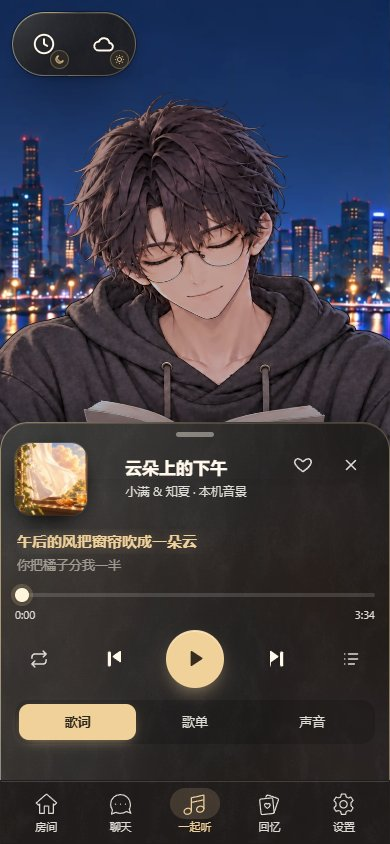 | 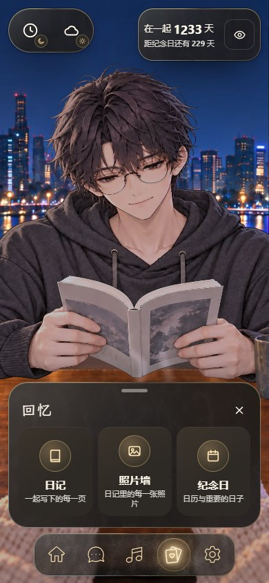 | 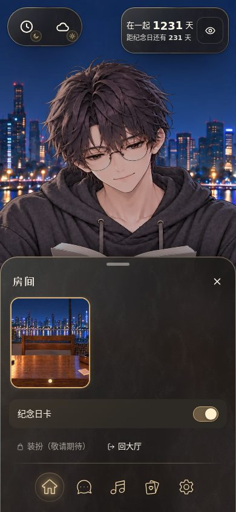 |

| 托盘与坞：标签栏、关闭按钮、一次一个                                                                                                                              | 音乐托盘                                                                                                    | 聊天托盘                                                                                    |
| ----------------------------------------------------------------------------------------------------------------------------------------------------------------- | ----------------------------------------------------------------------------------------------------------- | ------------------------------------------------------------------------------------------- |
|  | [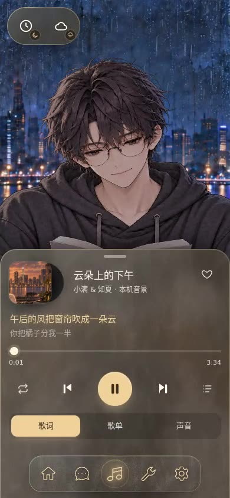](live/phone-music.mp4) | [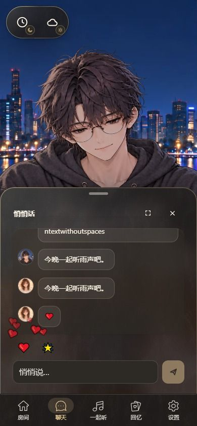](live/phone-chat.mp4) |

## 2. 音乐主页面 · 定稿（B1 + 唱片 + B5 停靠 + B3 沉浸歌词）

2026-09-30 用户：B3 沉浸歌词要；B6 桌面三栏不要；海报和歌词先占位。实现 [music/player.tsx](../../../../../src/themes/cinnaglass/music/player.tsx)（2026-10-03 从 `music.tsx` 迁入 `music/` 文件夹）、[floaters.tsx](../../../../../src/themes/cinnaglass/shell/floaters.tsx)。

- **流程**：桌面迷你条 → 展开成右侧整列停靠栏；手机导航音乐图标 → 托盘半高（正在播放）→ 点标签「歌词 / 曲库 / 声音」自动拉满（「歌单」10-03 改名「曲库」，见 §2.1）。点正在播放里的两行歌词，或歌词页右上的「沉浸」→ **沉浸歌词**：海报糊成整个面板的底色，歌词大字滚动、当前句放大发金、点一句跳过去，底下一条迷你播放条；「退出沉浸」或 Esc 回到主页面（Esc 先退沉浸，再收播放器）；手机上把托盘拉回半高也会退出沉浸。
- **状态**：未播放 / 正在打开声音 / 播放中（唱片从封套里滑出慢转，导航音乐图标带三根音柱）/ 静音；收藏只存在这台设备；空收藏有说明。
- **动效**：标签的金色滑块用 `--spring-bouncy`；唱片滑出用 `--spring-snappy` 并持续旋转；歌词换句浮入；沉浸底图 900ms 淡入并从 1.08 缩回，歌词逐行浮入，当前句字号 420ms 过渡；低动效停唱片与音柱、只留淡入。
- **海报**：8 张是这份歌单自己的封面（2026-10-02 Codex 生成，待看样）：每首一个静物画面——纱帘与积云、雨窗边的杯子、暖灯收音机、河边长椅上的面包、落针的唱机、星空下的贝壳风铃、清晨列车的便当、霜窗上的心——44px 的歌单行里靠轮廓和明暗就分得清；载入前先垫海报自己的平均色。歌词仍是为每段音景写的短句。来源 [要图清单 ART-01](../../../codex-visual/art-requests/art-requests.md)。

| 桌面停靠栏                                                                                            | 手机沉浸歌词                                                                                    | 桌面沉浸歌词                                                                            |
| ----------------------------------------------------------------------------------------------------- | ----------------------------------------------------------------------------------------------- | --------------------------------------------------------------------------------------- |
|  | [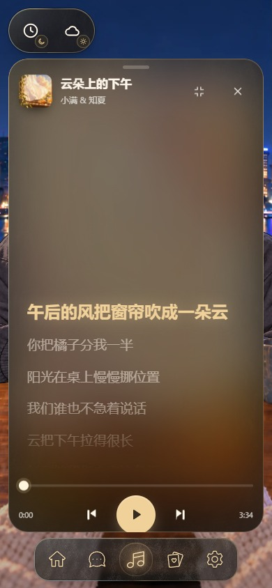](live/phone-lyrics.mp4) | [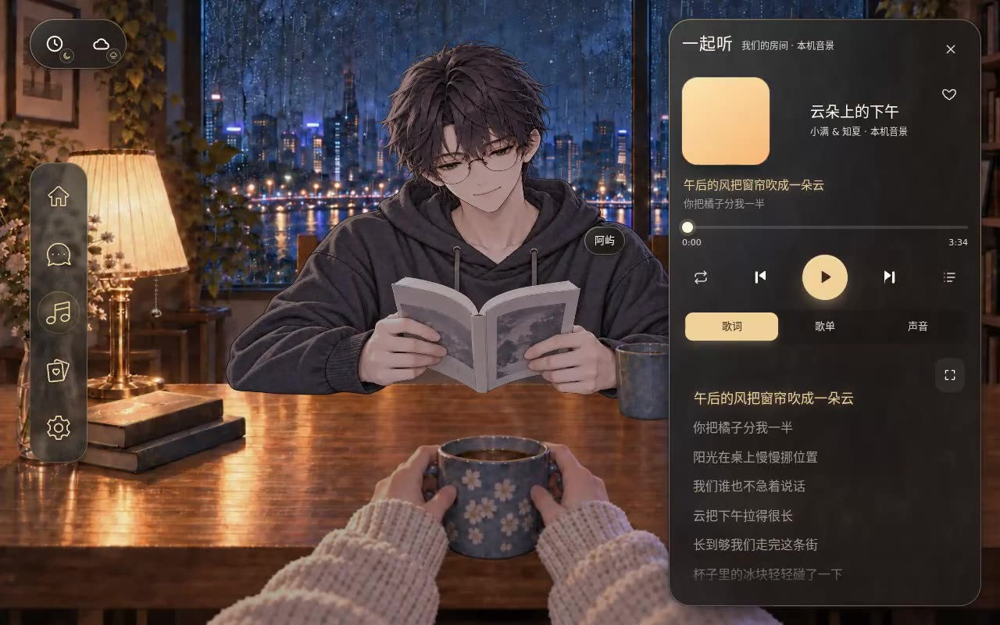](live/desk-lyrics.mp4) |

### 2.1 曲库、上传与音质 · 已实现，待看样（2026-10-03）

2026-10-03 用户：方案书的界面不错，但要在 dev 最新的实现上改；不要「始终原件」设置，改成每首歌可以在原件和省流版之间切换。实现 [library-view.tsx](../../../../../src/themes/cinnaglass/music/library-view.tsx)、[upload-view.tsx](../../../../../src/themes/cinnaglass/music/upload-view.tsx)、[quality-view.tsx](../../../../../src/themes/cinnaglass/music/quality-view.tsx)；功能与数据见 [impl.md](../../../../features/music/impl.md)。

- **流程**：曲库页签 → 搜索 / 筛选（全部 · 我传的 · TA 传的 · 收藏 · 已下载 · 本机音景）→ 点一行播放（当前行再点是暂停 / 继续）；行尾 ⋯ 在行下面就地展开：下载原件 / 省流版、仅自己可见 / 改回共享、从曲库删除（只有上传者能改可见范围和删除，删除要点两次）。曲库为空时是一张「上传第一首」卡片，下面照样列本机音景。「上传」→ 上传页（替换当前页面，像沉浸歌词；手机托盘自动拉满）：选择文件 / 选择文件夹 / 拖进来 → 每首一张卡片读完待上传（歌名可以改）→「上传 N 首」逐首上传，可暂停；关掉托盘上传不停，再打开回到上传页。正在播放里歌名下面的音质徽章（Hi-Res / 无损 / 格式名，放省流版写「省流」，从本机放带小绿点）→ 音质页：自动 / 原件 / 省流、信号路径、离线下载；「回到播放器」或把托盘拉回半高回到主页面。
- **状态**：上传卡片 读取中（封面糊着）· 待上传 · 上传中 % · 入库中 · 生成省流版 % · 已入库 ✓（绿边）· 曲库里已有 · TA 已传过 · 失败（红边，写原因）；格式这台设备放不了时照样能入库并写明。整轨第一次播放显示「整轨第一次播放，先取到这台设备」和进度条。播放键在加载时有一圈呼吸光，还能再点一下取消。歌词有翻译时小一号写在原句下面，逐字歌词当前句的字随时间点亮；纯文本歌词只列出不滚动；没有歌词写明怎么加。
- **动效**：沿用现有 token：卡片和行内操作 `ow-rise-in` 浮入，子页面淡入，按压回弹；低动效时只留淡入、播放键不呼吸。
- **措辞**：「曲库」是两个人的库；「省流版」= 有损的小副本；「原件」= 上传的文件本身；「存到这台设备」= 离线下载。不用「缓存」「转码」这类技术词。

| 桌面：曲库                                                              | 桌面：上传页（读完待上传）                                                | 桌面：音质页                                                                  |
| ----------------------------------------------------------------------- | ------------------------------------------------------------------------- | ----------------------------------------------------------------------------- |
| 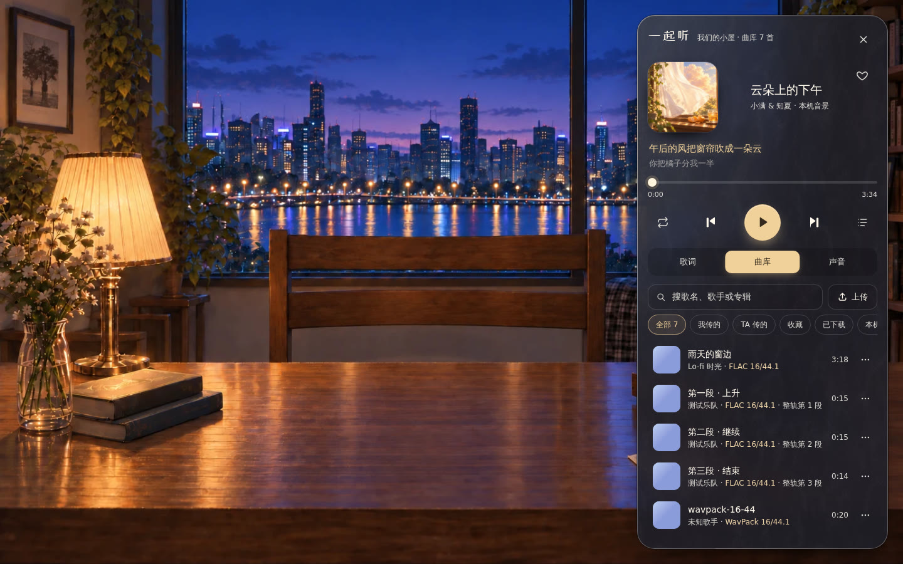 | 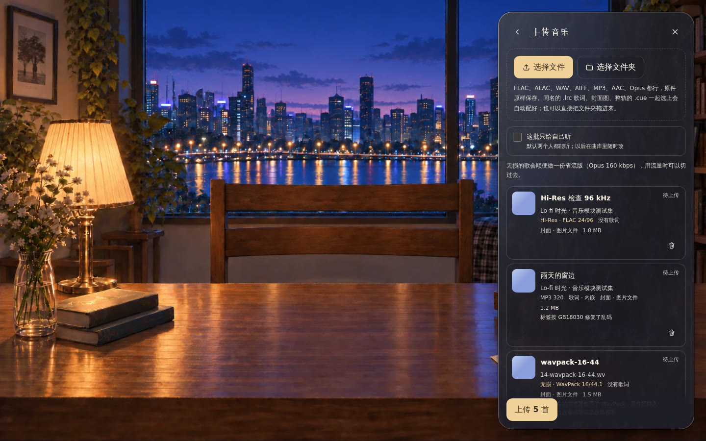 | 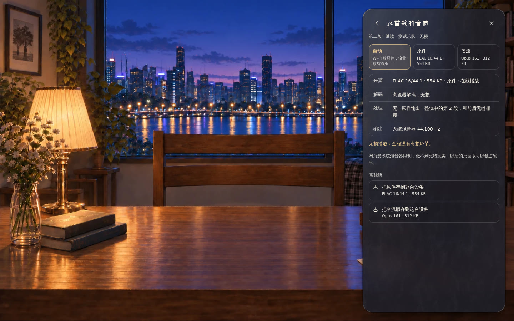 |

| 手机：曲库                                       | 手机：行内操作                                                          | 手机：上传页                              |
| ------------------------------------------------ | ----------------------------------------------------------------------- | ----------------------------------------- |
| 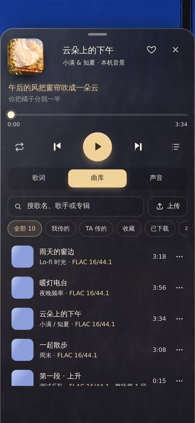 | 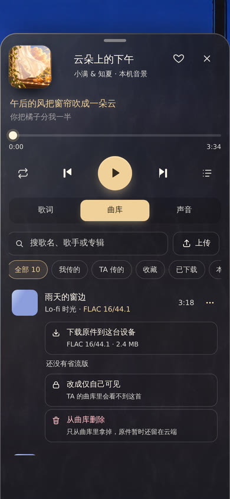 | 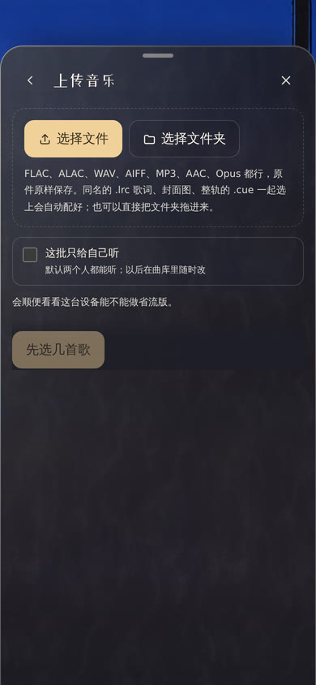 |

截图来自 [check-music-library.mjs](../../../../../scripts/check-music-library.mjs)（正式组件 + 内存假后端，测试曲集的封面是生成的渐变图）；实装录屏要等用户机器上的 Chrome（`record-ux.mjs` 用 Chrome 正式版的 H.264 录制，云端容器只有 Chromium），记在 TODO。

## 3. 进入世界 · 已实现（D1 热气进度条 + D2 台灯渐亮 + D5 进屋揭幕）

看样页上的推荐方案，用户未提异议，按现状保留。实现 [world-loader.tsx](../../../../../src/themes/cinnaglass/shell/world-loader.tsx)、进度源 [load-progress.ts](../../../../../src/themes/cinnaglass/shell/load-progress.ts)。

- **流程**：大厅点「进入世界」→ 空桌的灭灯底图上叠亮灯底图，亮度跟着真实加载进度走（房间贴图 + 人物姿势图）→ 玻璃卡：冒热气的杯子、金色进度条、百分比、每 2.2 秒换一句小提示 → 装好后卡片下沉、暗角张开、画面归位，导航和浮窗依次浮上来。
- **状态**：加载中 / 到了（「TA 就在对面」）/ 失败（直接换成原有的错误卡，不演「到了」）；只有标题是读屏播报，轮换的提示不打扰读屏。
- **动效**：揭幕 760ms；界面分批浮现；低动效只留进度条和淡入淡出。

| 手机                                                                                        | 桌面                                                                              |
| ------------------------------------------------------------------------------------------- | --------------------------------------------------------------------------------- |
| [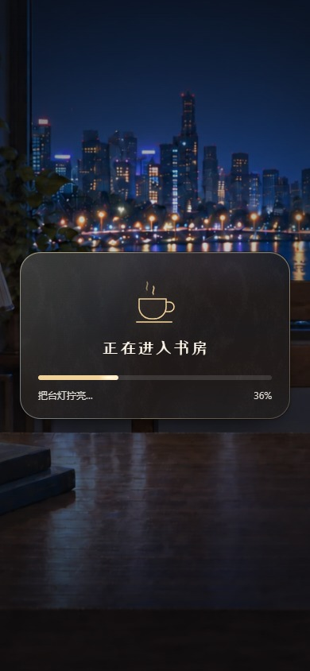](live/phone-enter.mp4) | [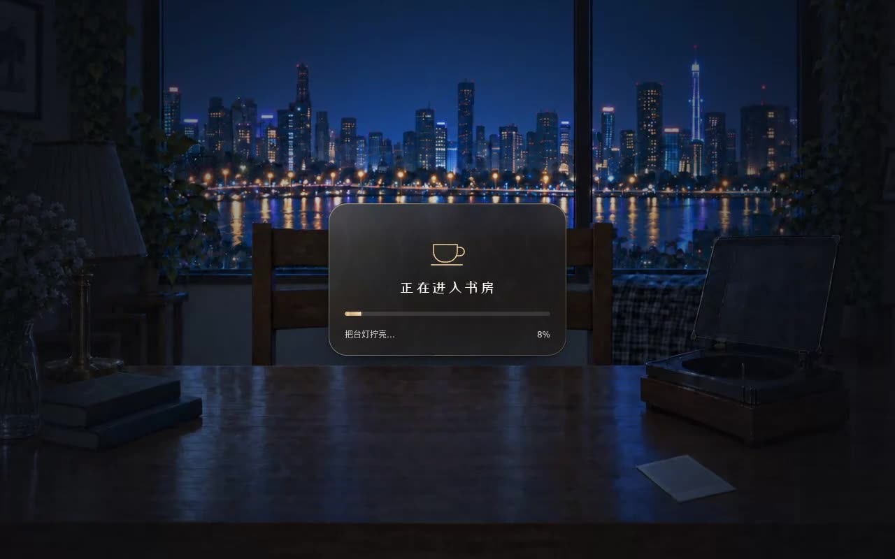](live/desk-enter.mp4) |

## 4. 回忆页：日记 + 照片墙 · 定稿（2026-10-01 改成内容页，日记三种样子、照片墙四种）

2026-09-30 用户要日记与照片墙桌面、手机统一迭代，旧日记先不删。2026-10-01 用户：日记和照片墙是**内容页**（§0），手机直接全屏、桌面正中弹窗，不缩在一边，也没有半开；G3 日历和旧书本都是日记的样子，G1 手帐按居中重做；H2 软木板、H3 相册、H4 放映也做成照片墙的样子；每种都有手机版，想怎么看就切换。实现 [content-page.tsx](../../../../../src/themes/cinnaglass/ui/content-page.tsx)（内容页外壳）、[memory-surface.tsx](../../../../../src/themes/cinnaglass/surfaces/memory-surface.tsx)（页头与样子切换）、[memory-views.ts](../../../../../src/themes/cinnaglass/surfaces/memory-views.ts)（样子登记）、[memory-lightbox.tsx](../../../../../src/themes/cinnaglass/surfaces/memory-lightbox.tsx)、[memory.css](../../../../../src/themes/cinnaglass/surfaces/memory.css)；比稿在 [日记与照片墙比稿](../../../../../arts/archive/v3-ui-rounds/memories/memories.md)。

- **入口**：导航「回忆」→ 日记 / 照片墙 / 纪念日；桌上的书 → 日记，桌上的照片 → 照片墙。打开时回忆菜单收起（手机一次一个）。
- **载体**：原生模态 `<dialog>`。桌面是屏幕正中的大窗（最大 1120 × 820，四周至少留 32 / 24px，圆角 30px），房间压暗 0.6、虚化 6px，音乐照常放；手机直接全屏（顶上让出安全区再留 8px，顶边圆角 26px），从底边升起，背后只压暗不虚化（页面几乎盖满屏幕，虚化只落在顶上那条缝里）。页面自己不再做背景模糊：它几乎不透明，背后又已经压暗虚化过（2026-10-02）。房间在页面打开时暂停，关掉再走。关闭：页头右上「收起回忆」、Esc、点窗外的暗处；手机上还能下拉页头（110px 或甩一下 0.45 px/ms；短了就带着手指的速度弹回去，往上推是橡皮筋）。焦点进页面，关掉回到入口。关着时页面不卸载：滚动位置、草稿、照片列表都留着。
- **页头**：标题页签「日记 / 照片墙」（金色笔触滑过去，← → 键切换）；桌面上跟一行小字（「一起写下的 8 页 · 最近一页 9 月 28 日」/「来自日记的 11 个瞬间」）；**样子切换**是一组分段按钮，金色底块滑到选中的那个（← → 键切换，悬停有一句说明）；手机上切换按钮单独占一行，手帐样子多一个「目录」日历按钮。
- **样子记在设置里**（设置 → 主题外观 →「日记的样子」「照片墙的样子」也能改，[tweaks.ts](../../../../../src/themes/cinnaglass/tweaks.ts)）；默认手帐 + 拍立得。切换样子时写到一半的「写一页」不丢：几种样子共用一份草稿。

| 样子                         | 桌面                                                                     | 手机                                                              |
| ---------------------------- | ------------------------------------------------------------------------ | ----------------------------------------------------------------- |
| **手帐**（G1，日记默认）     | 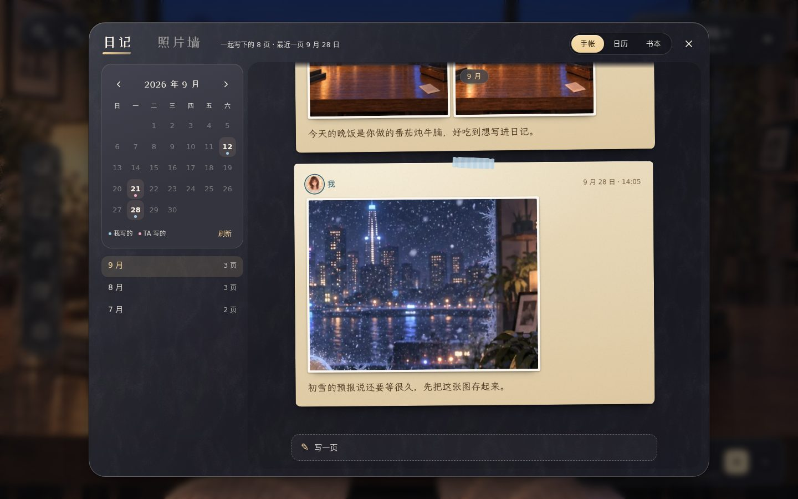 | 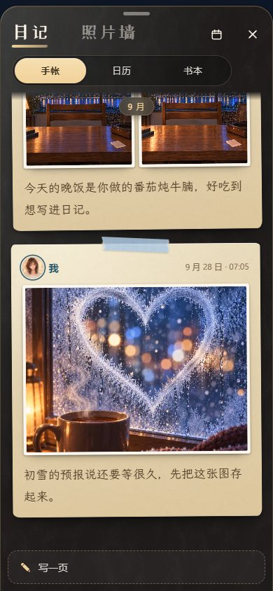   |
| **日历**（G3）               | 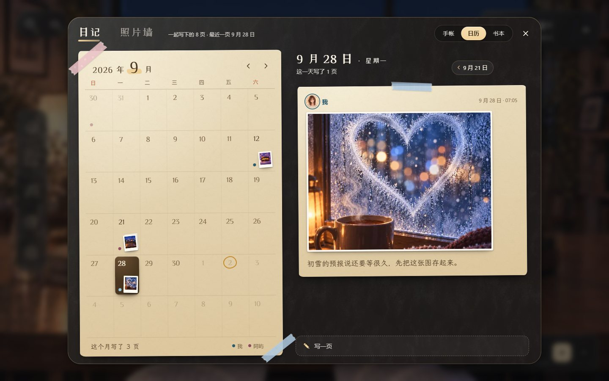          | 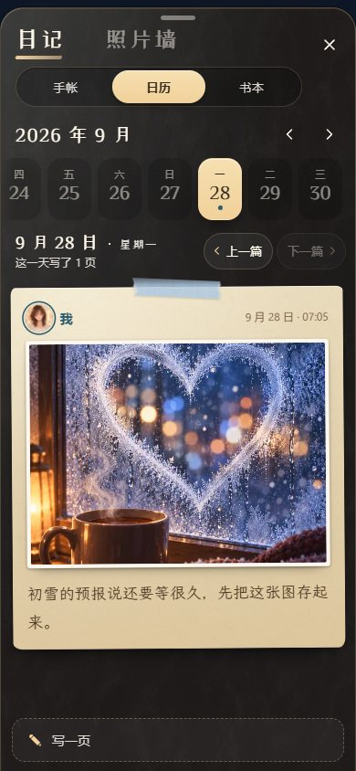          |
| **书本**（旧版）             | 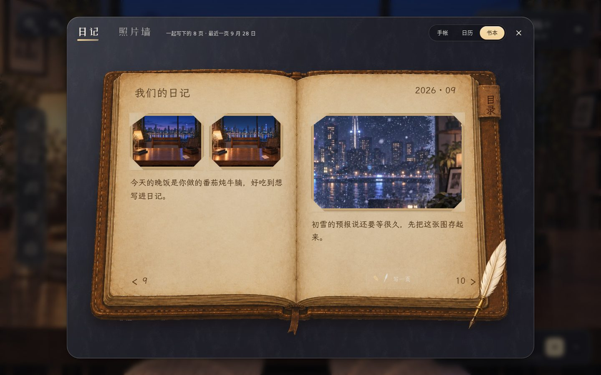                | 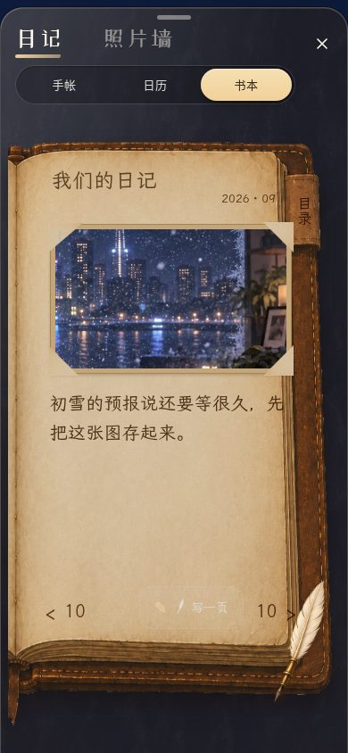                          |
| **拍立得**（H1，照片墙默认） | 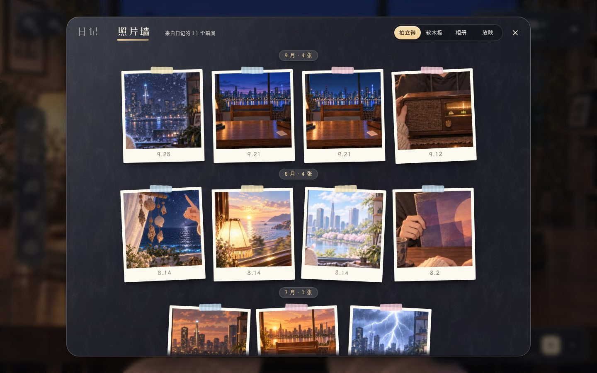                  | 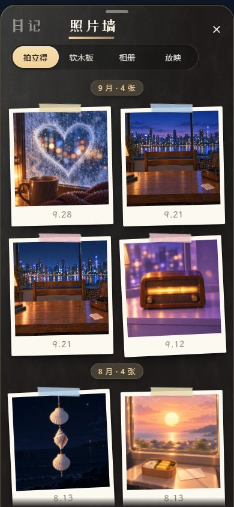                    |
| **软木板**（H2）             | 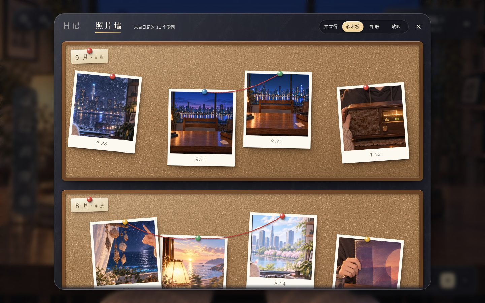            | 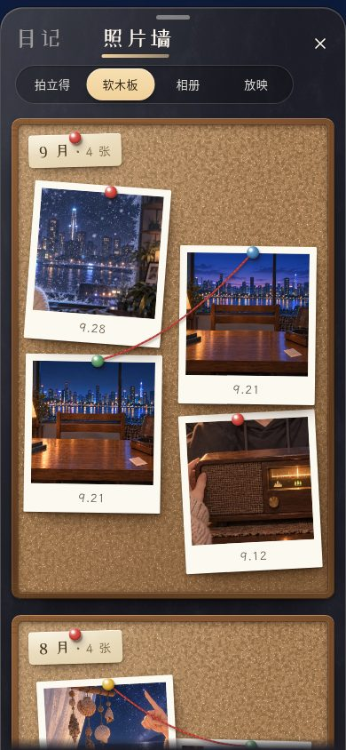                    |
| **相册**（H3）               | 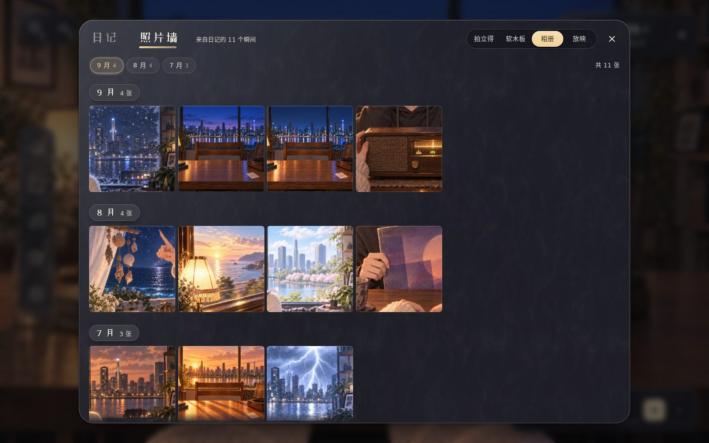     | 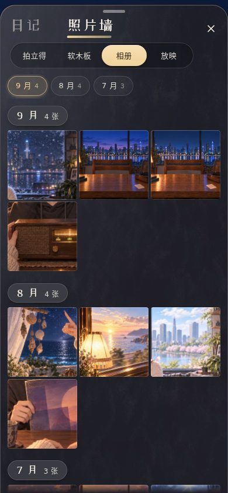                     |
| **放映**（H4）               | 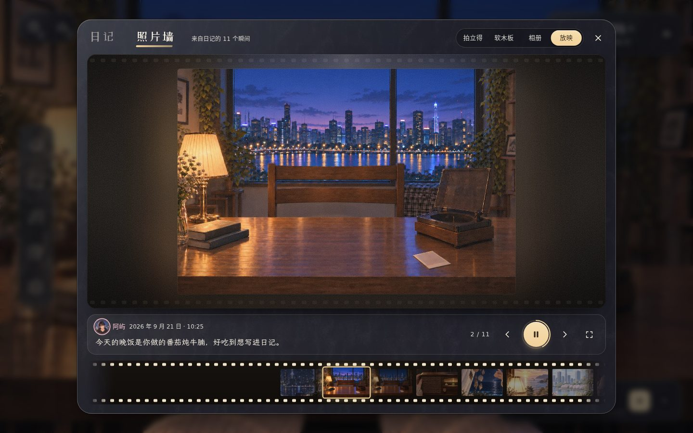         | 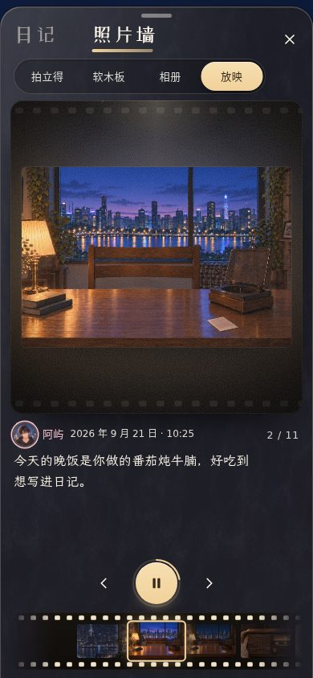 |

- **手帐**（[journal-stream.tsx](../../../../../src/themes/cinnaglass/surfaces/journal-stream.tsx)）：桌面左边一栏是当月日历（写过的日子带墨点，蓝是我、粉是 TA、两人都写就两个点；点一天把那天的第一页滚到中间并亮一圈；翻到已载入之前的月份时提示「载入更早的回忆」；可刷新）和按月的目录（滚到哪个月哪个月亮起，点一下跳过去），中间纸页长卷居中、最宽 660px，「写一页」在底部；手机全屏长卷，目录收在页头的日历按钮里弹出。每一页是一张贴在玻璃上的纸（胶带、微微歪、手写字），从旧到新往下排，打开停在最新一页；月份标签吸顶；照片按张数排版（一张横幅、两张并排、三张一大两小、更多三列，第六格标「+N」）；长文折成五行「展开全文」；往上滚到顶自动翻出更早的回忆。**谁写的用墨色、头像圈和名字区分，从不用左右位置**（[timeline §七](../../../../features/timeline.md)）。
- **日历**（[journal-calendar.tsx](../../../../../src/themes/cinnaglass/surfaces/journal-calendar.tsx)）：桌面左边一页手账月历（两角贴胶带）：写过的日子带墨点，有照片的日子角上贴一张那天的小拍立得，今天画一个金圈，选中的那天涂成墨块；‹ › 翻月，翻到还没载入的月份会自己往前翻（那些日子打斜线，页脚写「正在往前翻…」，失败时给「载入更早的回忆」按钮）；页脚「这个月写了 N 页」和图例。右边是选中的那天：「9 月 28 日 · 星期一」「这一天写了 2 页」，‹ › 跳到上一个 / 下一个写过的日子，纸页在下面滚，「写一页」在底部；默认打开最近写过的一天。手机：月份和 ‹ › 在上，下面一条左右滑的日期条（写过的日子更亮，今天金圈，选中那天变成金色并滚到中间），再下面是那天的纸页；在纸页上左右滑换到上一个 / 下一个写过的日子（64px 或甩一下 0.45 px/ms，没得翻时有阻力）。键盘：方向键按天 / 按周走，Home / End 到周首尾，PageUp / PageDown 翻月（加 Shift 翻年）。手机横过来时日期条和写一页在左栏，纸页在右边。
- **书本**（[journal-book-view.tsx](../../../../../src/themes/cinnaglass/surfaces/journal-book-view.tsx)）：原来的棕皮书放进回忆页的窗里，翻页、目录、写一页都照旧（代码在 [journal/](../../../../../src/themes/cinnaglass/journal/)）；手机上是单页。书有自己的翻页，所以灯箱里没有「在日记里看」。
- **拍立得**（[photo-wall.tsx](../../../../../src/themes/cinnaglass/surfaces/photo-wall.tsx)）：日记里所有照片按月贴成拍立得（胶带、微歪、铅笔日期），桌面一行居中排开，手机两列；打开时逐张钉上墙。
- **软木板**（[photo-cork.tsx](../../../../../src/themes/cinnaglass/surfaces/photo-cork.tsx)）：每个月一块软木板（软木和胡桃木框是生成的平铺纹理，图钉和红线是 CSS），左上钉一张「9 月 · 4 张」的纸签；拍立得松散地钉在板上，位置、歪斜和图钉颜色由照片决定，每次打开都一样；同一天的照片用一根红线从图钉串到图钉。桌面上能拿鼠标拖着摆（按下移动 6px 才算拖；拿起时放大、摆正、影子加深，红线跟着走；松手轻轻一弹、图钉按回去；拖到上下边，板会跟着滚），摆法只存在这台设备；摆过的板上出现「整理一下」，照片依次滑回原位。键盘：Alt + 方向键挪 12px（加 Shift 挪 48px）。手机上不拖，滑动照常滚动，两列错落，点一下看大图。
- **相册**（[photo-album.tsx](../../../../../src/themes/cinnaglass/surfaces/photo-album.tsx)）：一本方格相册。最上面一排月份签（照片跨年后出现年份，右边「共 11 张」，月份多了可以横着滑），下面按月从新到旧排，月份标签吸顶；桌面一行 6 格、手机 3 格（横过来 6 格），正方形裁切、紧挨着排，一屏看得最多，月份少时一行排不满、靠左（和比稿一样）。滚到哪个月，那个月份签就亮；点月份签滑到那个月。鼠标悬停时照片微微放大并浮出「9.21 · 阿屿」（键盘聚焦时也有）；方向键在格子间走（← → 按顺序，↑ ↓ 到上一行 / 下一行最近的一格，跨月也行）。最后一行写「这本相册从 … 开始，一共 N 张」；还有更早的，底下是「翻出更早的照片」，滚到时自动载入。
- **放映**（[photo-projector.tsx](../../../../../src/themes/cinnaglass/surfaces/photo-projector.tsx)）：一块暗下来的银幕：上方一束光、浮尘、胶片齿孔边、颗粒和暗角；照片按原比例放在中间（四周垫着它自己糊开的颜色），慢慢推拉（每张的推法固定）。下面一条说明（谁、哪天、那页的字、第几张）和放映键：‹、金色的播放 / 暂停（外圈随每张 4.5 秒走满）、›、桌面上的「看大图」；正在一起听时多一枚「♪ 配着音乐放映」。再下面是一条胶片，当前那格描金、略大并停在中间，点哪格放哪张。打开就自动放，放完从头再来；鼠标停在银幕上先停住（「停在这一张」），移开接着放；自己翻、点胶片、按键、滑动或打开灯箱就暂停，直到再按播放；回忆页关着、切到别的标签页或银幕不在视野里时计时停住，回来接着剩下的时间。点银幕打开灯箱。键盘：← → 翻，空格播放 / 暂停，Home / End 到头尾，Enter 看大图。手机上银幕占上面一半多，放映键在拇指够得着的底部，左右滑换张（64px 或甩一下 0.45 px/ms）；横过来银幕在左，说明和胶片在右。只有一张照片时不显示翻页、胶片和播放。

- **写一页**（手帐、日历两种样子都有；书本用书里原来的）：底部一条虚线「写一页」→ 横格纸从下面升起（手机上骑在键盘上）；拖图进来或选文件（最多 9 张）；「取消」清空，点外面或 Esc 只收起、草稿留着（收起的条上显示「草稿」）；关掉回忆页、切换样子再回来，草稿都在。「记下这一刻」后新的一页从下面落上来，角上盖一个「记」字印章并溅出几点墨星。
- **灯箱**（所有样子共用）：照片从被点的那张缩略图里长出来（先裁成缩略图的样子，再展开成整张），底下一条说明：谁、哪天、那一页的字、第几张；← → 键、左右滑翻页，到头有阻力；Esc、关闭、点暗处或把照片往下拉关闭，照片缩回原位；从照片墙打开时可「在日记里看 →」切回日记那一页并亮一圈（书本样子没有这个按钮）。先显示缩略图，原图签好后换上，失败保留缩略图并说明。
- **状态**：加载中（纸片骨架 / 「正在把照片一张张贴上墙…」）/ 空（「第一页，从今天开始」+「写下第一页」；照片墙「墙上还空着。」；纸条标题上方一张钢笔小画——空本子、空白拍立得、空相册页、盖着镜头的放映机，96px、手机 72px，正片叠底在纸上，2026-10-02）/ 出错（「再试一次」）/ 照片还没签好（照片位先显示纸色空位）。
- **Esc 层级**：灯箱 → 写一页 → 目录 → 回忆页。
- **动效**：打开前页面先在原位排好、画好（透明度 0.01），视野里的照片、纸纹和胶带解码、字体就绪（最多等 300ms），再出发（§9）；桌面窗 `--spring-snappy` 放大浮起、退场 150ms；手机 `--spring-smooth` 从底边升起、280ms 落下；背后的压暗随面板渐入，桌面的 6px 虚化一开始就是满的、跟着压暗一起淡入（以前虚化半径逐帧变大，每一帧都要把整屏重新模糊一遍）；页签与样子切换的金色块 `--spring-bouncy` 滑过去，新样子 260ms 淡入上浮；各样子进场：拍立得 520ms `--ease-pop` 逐张隔 45ms 钉上；软木板的照片从上方落下并摆正（`--ease-pop`，逐张隔 75ms），接着图钉按进去，红线 700ms 画出来；日历换一天时新的一页从前进的方向滑进来（420ms `--ease-spring`），旧的一页往另一边淡出，翻月时格子横着滑进来、墨点弹出、小拍立得依次塞进格子；相册的格子依次淡入、轻轻放大；放映换张 600ms 交叉淡化并带一点缩放，滑走的照片顺着手势离开，胶片平滑滚到当前格；写一页 420ms 升起；新页 620ms 落下 + 印章 560ms（延迟 300ms）+ 墨星；灯箱长出 440ms、缩回 320ms，翻页 280ms；滑动翻页阈值 64px 或 0.45 px/ms，下拉关闭 110px。低动效全部改淡入淡出：印章直接出现、不溅墨星；软木板不落下，红线一开始就画好；放映换张 200ms 淡入淡出、不推拉，颗粒、浮尘和外圈都静止，胶片直接跳到当前格（自动放映照常）；纸和照片的歪斜是装饰，保留。

| 桌面：各种样子与关闭                                                                                                        | 手机：各种样子与关闭                                                                                              | 手机：写一页并记下                                                                                                  |
| --------------------------------------------------------------------------------------------------------------------------- | ----------------------------------------------------------------------------------------------------------------- | ------------------------------------------------------------------------------------------------------------------- |
|  |  | [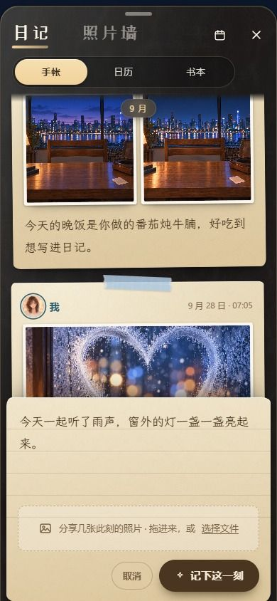](live/phone-publish.mp4) |

| 灯箱（桌面）                                                        | 灯箱（手机）                                           | 灯箱往下拉关闭                                                 |
| ------------------------------------------------------------------- | ------------------------------------------------------ | -------------------------------------------------------------- |
| 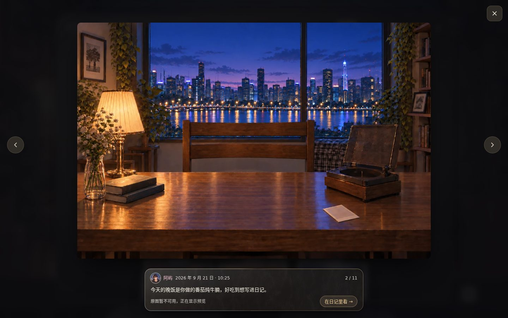 | 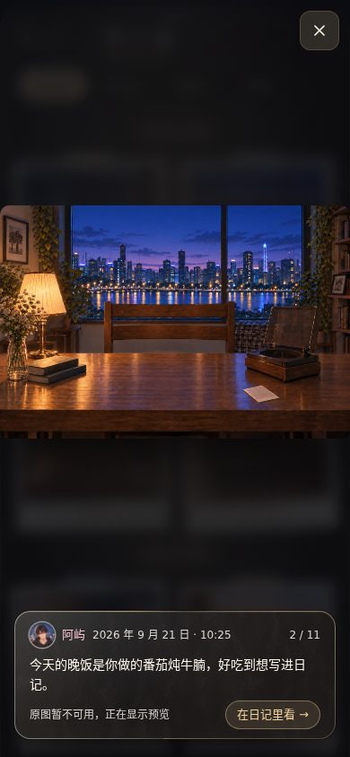 | 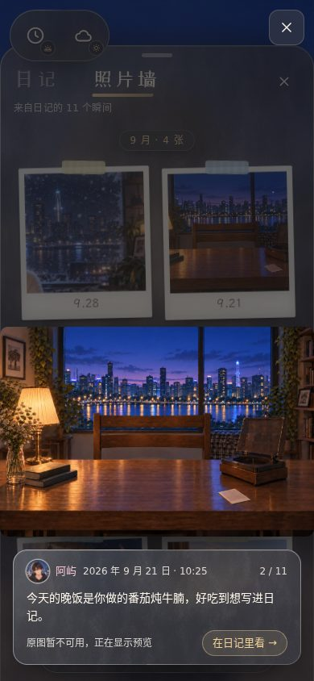 |

发布这一步在隔离样板里用本地假数据走完（写 → 记下 → 新页落下 → 印章），真实账号下的上传与写库链路没变（[composer.tsx](../../../../../src/themes/cinnaglass/surfaces/composer.tsx)）。

## 5. 聊天窄卡与轻反馈 · 已实现

实现 [chat-card.tsx](../../../../../src/themes/cinnaglass/shell/chat-card.tsx)、[feedback.ts](../../../../../src/themes/cinnaglass/ui/feedback.ts)。窄卡从左下角升起、收起下沉；消息逐条浮入；❤️ 🌟 快捷表情迸出小表情；发送时纸飞机飞出去再回来。未读小红点弹出放一圈涟漪；纪念日天数第一次出现时逐位滚上来；对方的气泡从脸侧弹出、消失前向上飘走；登录出错时提示轻轻左右摇。

## 6. 设置里的界面风格、动效与回忆的样子

「界面风格」三档（深玻璃 / 描金暗夜 / 暖瓷，2026-10-02，§8）、「动效」三档、「日记的样子」三档（手帐 / 日历 / 书本）和「照片墙的样子」四档（拍立得 / 软木板 / 相册 / 放映）都在设置 → 主题外观，改了立刻生效（房间的微动下次进房间生效）；后两项和回忆页页头的切换是同一个设置。

[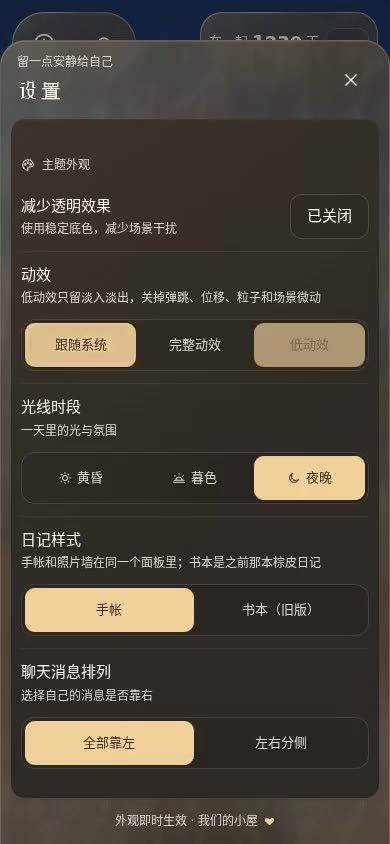](live/phone-settings.mp4)

## 7. 标题字

`--ui-display: 'ZCOOL XiaoWei'`（站酷小薇，OFL-1.1，`@fontsource/zcool-xiaowei`，按字符切片加载），2026-09-30 用户喜欢看样页「B · 音乐主页面」的标题字后加入。只用在面板标题：任务窗标题、音乐停靠栏「一起听」、回忆页的标题页签、进入世界的加载标题、手机房间托盘标题；正文、按钮和标签仍是 Noto Sans SC，手写内容仍是霞鹜文楷。这套字只有一个字重，标题一律 400，不做合成粗体。

**「回」字**（2026-10-01）：站酷小薇把「回」画成实心方块（里外两个方框的轮廓同向，内框被填满），所以 `--ui-display` 最前面垫了一个只含「回」的字面，由霞鹜文楷来画。「回忆」入口的标题整个用手写体 `--ui-hand`：回忆是写下来的，不是印出来的。

## 8. 界面风格：深玻璃 · 描金暗夜 · 暖瓷 · 定稿（2026-10-01；暖瓷 10-02 正式实装）

用户：UI 对场景来说颜色对比、层次太低，弹窗快融进场景里了，参考同类风格的优秀设计重新设计。调研的结论（来源见 [看样页](index.html) 第 L 节）：叠在复杂画面上的玻璃要**垫一层更实、更暗的底**（Apple 的透明玻璃要求下面有压暗层，NN/g 建议 10–30% 实色衬底和 8–20px 模糊）、**一道硬的细边**加**更深的投影**让眼睛抓得住边、**不要玻璃叠玻璃**（里层用实色填充）、**进入内容就把场景压暗**（星穹铁道的全屏菜单、原神不透明的奶油色面板都是这么做的）。

- **默认：深玻璃**（[ui-system.css](../../../../../src/themes/cinnaglass/ui/ui-system.css)）：底色从导航色板里抽出来单独成 `--ui-base`（暮色 31 31 40、黄昏 40 33 27、夜 30 27 26），每个面板的不透明度在原值上加 `--ui-boost` 0.17（原来 0.65–0.74 → 0.82–0.91），模糊 12 → 18px，霜纹 0.18 → 0.1，外加 1px 暗描边 `--ui-hairline` 和更深的两层投影；导航玻璃从 0.17–0.52 提到 0.66；任务窗背后压暗 0.4 → 0.5 并虚化 3px，内容页背后 0.6 + 虚化 6px。边上的金色 / 冷色光仍跟着时辰走。
- **描金暗夜**（设置里可选）：近乎不透明的墨蓝玻璃（不透明度 +0.25、导航 0.86），不要霜纹，描边换成一道金线、顶边最亮。最像游戏 UI。
- **暖瓷**（2026-10-02 用户：浅色风格可以应用实现；[look-porcelain.css](../../../../../src/themes/cinnaglass/ui/look-porcelain.css)）：浅色霜玻璃配深色暖墨字，夜景上对比最强，是很多恋爱游戏的做法。底色 `250 247 241`，不透明度 +0.24，模糊 24px，霜纹 0.05，导航 0.88；字 `#2a231b`、次要字 `#675b4c`；一道 `rgb(70 52 30 / 0.22)` 的暖色细描边和更深的投影，贴着亮墙也看得出边。金色分成两种：字、图标和焦点圈用深金 `#855617`，主按钮、选中的分段、今天这些实心的地方用浅金渐变 `#eecd8e → #d8a960`，上面配深墨 `#2d2012`。原来写死在各组件里的浅色字、白色描边、给深玻璃调的金光都换成了暖瓷的版本；纸、照片、放映的银幕和房间的画保持原色。所有规则都挂在 `:root[data-look='porcelain']` 下，别的风格看不到。按渲染出来的像素量过对比度（三个时辰 × 手机 / 桌面 / 横屏，190 张截图、3005 段字）：正文最差 8.9:1，次要字最差 3.5:1（沉浸歌词的浅底上，别处 4.8 以上），深金小字 4.6:1，金底上的深墨 7.4:1。减少透明效果时每块都是实色 `#f5f0e8`。
- **怎么换**：设置 → 主题外观 → 界面风格，点了立刻换，记在这台设备上（[look.ts](../../../../../src/themes/cinnaglass/ui/look.ts) 的 `setLook`，设置里用 [use-look.ts](../../../../../src/themes/cinnaglass/ui/use-look.ts) 跟着变）。`?look=gilded|porcelain` 在任何页面都能直接试，`?look=default` 回到默认；`?look=classic` 是改之前的玻璃，只作对比，设置里没有。

| 深玻璃（默认）                                        | 描金暗夜                                     | 暖瓷                                        | 改之前                                      |
| ----------------------------------------------------- | -------------------------------------------- | ------------------------------------------- | ------------------------------------------- |
|  |   |   |   |
| 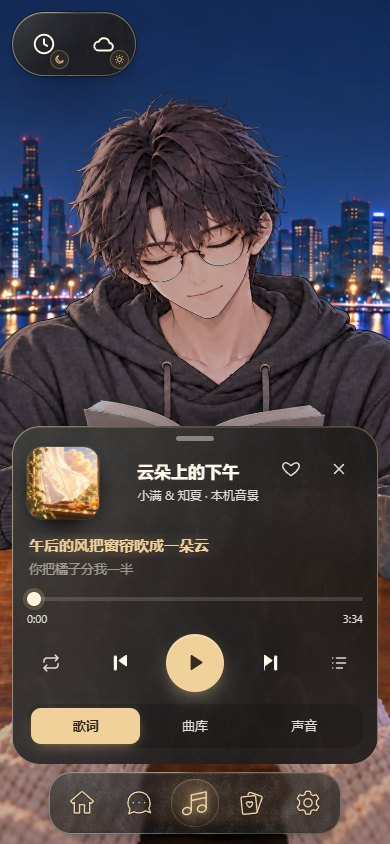      | 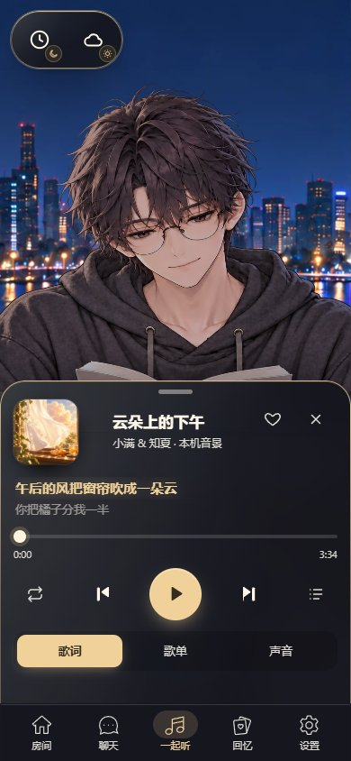 | 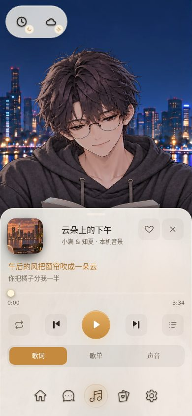 | 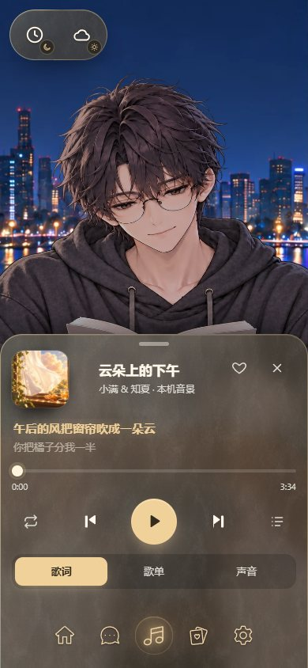 |

| 暖瓷：设置里的界面风格                                          | 暖瓷：回忆入口                                      | 暖瓷：黄昏里的房间托盘                                          |
| --------------------------------------------------------------- | --------------------------------------------------- | --------------------------------------------------------------- |
| 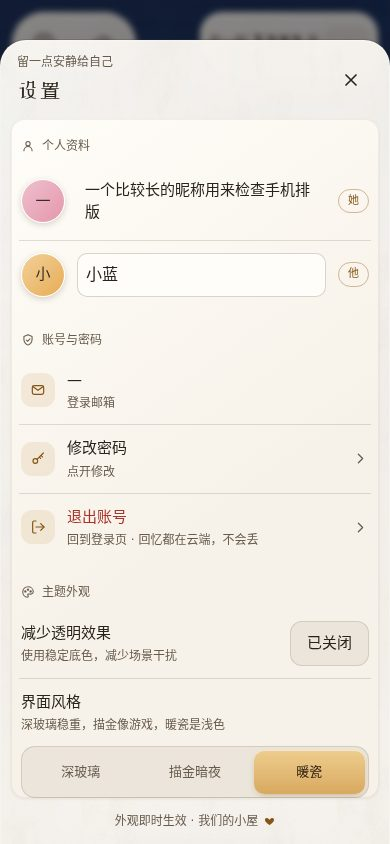 | 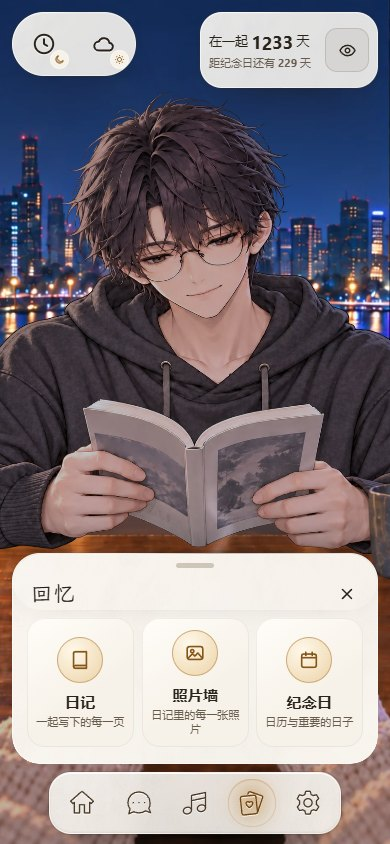 | 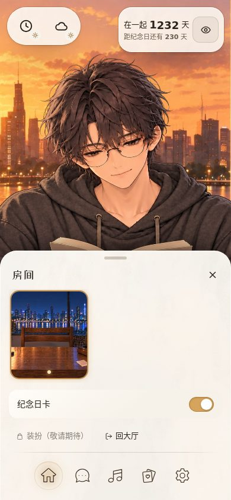 |

## 9. 弹窗的流畅度（2026-10-02）

用户：现在弹出框时能看出来有明显的掉帧，是场景的渲染性能太差了吗？——**不全是场景**。测法：在 Chrome 跟踪里取合成器真正把一帧画上屏的时刻（viz 的 `Graphics.Pipeline.DrawAndSwap`），手机 390 × 844 三倍屏、本机 GTX 1080，改前（`454753c`）和改后在同一份样板里各测 4 次；再用 Chrome 软件渲染（SwiftShader）把 GPU 开销放大做旁证。

**掉帧从哪来**

1. **第一次画托盘落在了上升途中**：托盘一出现就开始升，同时才去排版、光栅化（整张托盘的大投影、玻璃描边的遮罩、封面解码），GPU 卡住 100–180ms，托盘停住再跳一截。这是看得见的那一下。
2. **房间和托盘抢 GPU**：房间的 WebGL 每秒 30 帧画满屏（三倍屏上是 1170 × 2532 像素），托盘每动一帧还要重算一次背景模糊。
3. **几处贵的画法**：整张托盘的投影（大半在屏幕外或标签栏底下）；顶边阴影用的是上圆下方的圆角，模糊走了慢路径；唱片的 `drop-shadow` 滤镜；内容页自己的整页背景模糊（页面几乎不透明，模糊看不出来）和逐帧变大的背后虚化；逐帧放大的标签栏（每帧都要重排重画）；看不见的按钮光晕和悬停名字也在画投影。

**改了什么**

- **先画后升**：托盘（[sheet.tsx](../../../../../src/themes/cinnaglass/ui/sheet.tsx)）和内容页（[content-page.tsx](../../../../../src/themes/cinnaglass/ui/content-page.tsx)）都先在停靠的位置排好、画好，透明度 0.01 看不见，等两帧再出发；内容页还会等视野里的照片和纹理解码、字体就绪（最多 300ms）。上升时只是在移动已经画好的像素。
- **动的时候房间暂停**（[scene-hold.ts](../../../../../src/themes/cinnaglass/ui/scene-hold.ts)）：托盘升起 680ms、拖动中、收起到标签栏收回胶囊，内容页升起与退场，房间都停着不画；内容页打开期间房间一直停着（[WorldPage.tsx](../../../../../src/pages/WorldPage.tsx) `active`）。**TA 优先**（10-03）：TA 一有动作（状态变化，以后接上真实在场的开始打字、离开等），房间立刻恢复，之后 2.5 秒里面板不再让它暂停，TA 的动作准时、从头播放（`releaseScene`）；TA 的姿势按真实时钟走，暂停着的房间会让动作晚出现、还跳过开头。场景画布最高 2 倍像素：房间的底图和人物只有 1536 宽，三倍屏多画 2.25 倍像素看不出区别（[room-scene.tsx](../../../../../src/themes/cinnaglass/room/room-scene.tsx)）。
- **便宜的画法，样子不变**：托盘的投影只画顶边一条，四角同样的圆角，浏览器一次就能糊好（下面两个角在托盘里面，外投影本来就看不见）；唱片阴影换成同样的圆形 `box-shadow`（`drop-shadow` 的模糊是标准差，等于 `box-shadow` 模糊的一半，逐像素对过）；内容页去掉自己的背景模糊，背后虚化一开始就是 6px、跟着压暗一起淡入，手机上只压暗；标签栏展开一下切过去（§1）；看不见的按钮光晕不带外圈投影，手机上不画悬停才出的名字。

**改前改后**（第一次打开 = 页面加载后第一次，包含一次性的着色器编译、解码；之后再开没有这些）

| 操作（390 × 844 三倍屏）     | 改前                                                           | 改后                                                                   |
| ---------------------------- | -------------------------------------------------------------- | ---------------------------------------------------------------------- |
| 一起听托盘 · 第一次打开      | 卡 120ms → 出一帧 → 再卡 181ms，这时托盘已经在升，看上去跳一截 | 一次约 245ms 的准备（托盘还看不见、房间静止），之后整段上升每帧 ≤ 20ms |
| 聊天 / 回忆托盘 · 第一次打开 | 两段卡顿（131 + 123ms / 95 + 111ms），中间托盘在动             | 约 180–190ms 的准备，之后基本连贯（聊天偶有一帧 46ms）                 |
| 托盘再次打开、收起           | 都连贯（最长 39ms）                                            | 都连贯（最长 51ms；升起前多等 1–2 帧）                                 |
| 回忆页 · 桌面 · 第一次打开   | 0.9 秒里画出 43 帧，上升中卡 180ms                             | 画出 62 帧，上升中最长 25ms                                            |
| 回忆页 · 手机 · 第一次打开   | 51 帧，上升中卡 165ms                                          | 58 帧，上升途中还有 1–2 次 25–45ms（待办）                             |
| 软件渲染下托盘运动中的每一帧 | 约 460ms                                                       | 约 200ms                                                               |

**还没解决的**（记在 [TODO](../../../../TODO.md)）：第一次打开仍要准备 180–250ms，多是一次性的着色器编译和解码，可以在空闲时预热；回忆页倾斜的拍立得每张两层模糊投影，转了角度就走慢路径，可换成预先画好的阴影图；以上都是本机显卡和仿真，iOS / Android 真机还没测。

**以后做新弹层的规矩**（[交互规则 §6](../../interaction.md#6-动效全局体系与低动效模式) 同步）：

- 用 `Sheet` / `ContentPage` 外壳就自带先画后升和房间暂停；自己写的弹层也要先画好再动，动的时候 `holdScene(ms)`。
- 动画只动 `transform` / `opacity`，不逐帧改宽高、圆角、模糊半径；形状要变就一下切过去，或者放在别的都不动的时候。
- 大的模糊投影只画在看得见的那条边上，用四角同圆角的盒子；圆的东西用 `box-shadow`，不用 `drop-shadow` 滤镜。
- 几乎不透明的面板不加 `backdrop-filter`；背后的虚化用固定半径、淡入。
- TA 的动作不等任何面板：改 TA 状态、放反应的地方先 `releaseScene(ms)`。

**录屏是怎么录的**：[record-ux.mjs](../../../../../scripts/record-ux.mjs) 抓合成器的屏幕帧，录的时候页面里的时钟、定时器和动画一起放慢 4 倍，合成时按原速、每秒 25 帧，再用 Chrome 自己的编码器出 H.264；场景清单在 [record-ux.json](../../../../../scripts/record-ux.json)。放慢录制保证重负载的瞬间也不漏帧，但也因此录屏看不出卡顿，流畅度以上表为准（帧测脚本 [probe-frames.mjs](../../../../../scripts/probe-frames.mjs)）。
