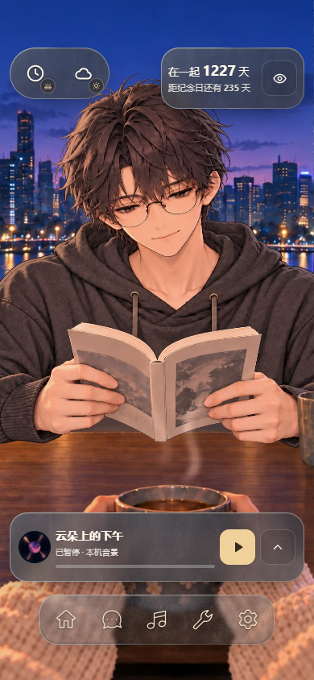
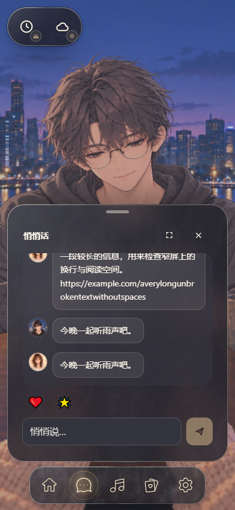
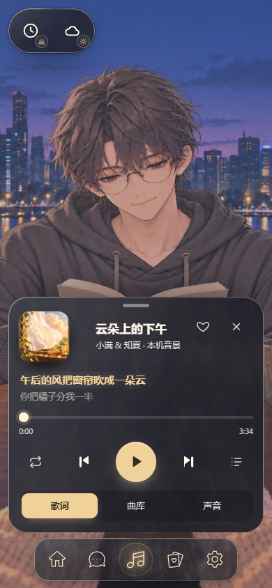
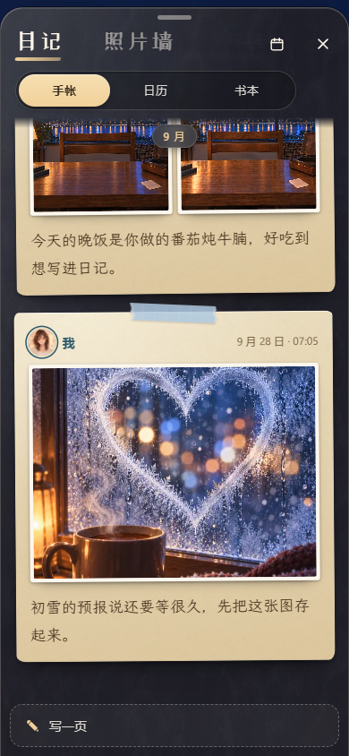
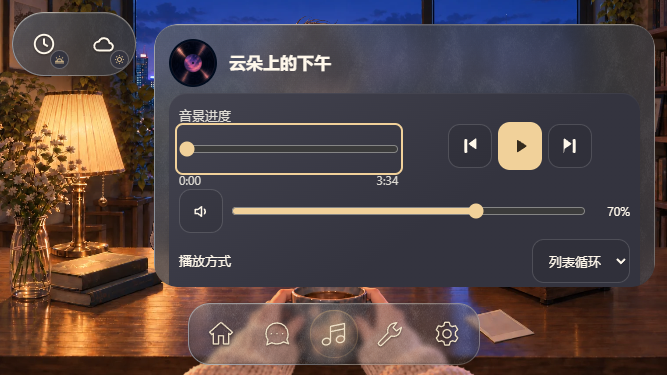
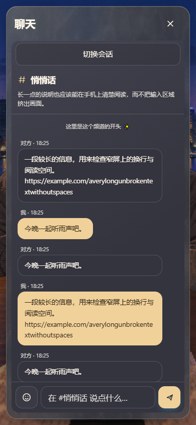
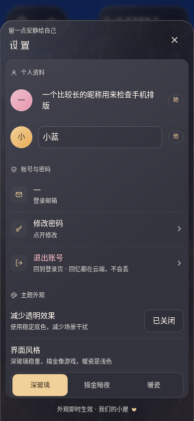

# Cinnaglass · 手机与低高度布局

> 2026-09-21 · 当前产品布局；2026-09-30 换成底部托盘版的截图（用户看样后保留）；2026-10-01 一次一个窗口、回忆改为全屏内容页、深玻璃，截图重拍；2026-10-02 托盘打开时导航展开成托盘的标签栏（坞），弹层先画好再动（掉帧修复，[UX 参考 §9](cinnaglass/ux/ux.md#9-弹窗的流畅度2026-10-02)）；2026-10-03 坞被否决，改成方向 A：导航不变，托盘浮在导航上方，截图重拍。由 UI Tailor 实施，Monet 同 agent 视觉自审；真机输入法与性能仍待验收。交互的流程与录屏见 [UX 参考](cinnaglass/ux/ux.md)。
> [UI/UX 地图](uiux.md) / [交互](interaction.md) / [主题](cinnaglass/ui-system.md) / [Feature 与测试](../../features/mobile-ui.md)

使用既有磨砂、时辰受色和真实书房原画。以下来自正式组件的隔离运行，消息、回忆与资料为演示数据，场景是软件渲染的书房；不是整条账号/联网链路的截图。

## 房间与陪伴浮窗

窄于 768px 或矮于 600px 时采用底部导航，按钮与内容避开设备安全区。纪念卡靠右上，天气展开时让位；**同一时间只开一个窗口**（2026-10-01 用户）：托盘、内容页、任务窗、时辰 / 天气面板，开一个别的就收起，未读状态不因此清除。

**底部托盘**（2026-09-30 用户看样后保留，10-01 改）：场景伴生的聊天、音乐、房间、回忆入口从底边升起托盘，半高按内容（音乐到标签那一行，聊天顶到屏幕往下 40%），对方的脸完整可见；导航始终是平时的胶囊，托盘浮在它上方（10-03 方向 A：离屏幕边 12px、四角圆、脚下离导航 8px，从导航上沿长出来；10-02 的坞——导航展开成托盘的标签栏——被用户否决，[比稿区](../codex-visual/nav-dock/nav-dock.md)），量的是导航上沿以上的空间，换什么手机内容都不被导航挡住；聊天托盘往上推＝展开完整聊天；托盘头有**关闭按钮**，托盘哪儿都能拖，甩一下也能收起；音乐没有悬浮条，托盘可拉满看歌词、曲库和沉浸歌词。横屏时托盘是右侧一列，停在导航上方，导航保持自己的条。

**内容页**（2026-10-01 用户）：日记和照片墙是来看内容的，从回忆入口点开就**直接全屏**，没有半开，页头关闭或下拉关闭；页头第二行切换日记 / 照片墙的样子。

| 聊天托盘                                                                                                           | 音乐托盘                                                                                                | 日记（全屏内容页）                                                                    |
| ------------------------------------------------------------------------------------------------------------------ | ------------------------------------------------------------------------------------------------------- | ------------------------------------------------------------------------------------- |
|  |  |  |

触屏打开聊天不主动唤起软键盘，点输入框开始输入。手机文本输入至少 16px；允许用户缩放。关闭或缩放不应清除草稿，切换会话仍遵循原有草稿规则；日记关掉再打开、换一种样子，草稿都还在。

横屏把托盘放在右侧，左上保留环境入口；托盘内容超高时整体滚动。播放状态与托盘开关独立。

## 聚焦任务与输入

会话入口为可展开按钮，选择后收起并返回入口焦点。Esc 优先关闭表情或会话列表，下一次才关闭聊天。标题和输入固定，消息列表独立滚动；横竖屏切换保留当前草稿。

设置、日历、时钟、完整聊天与心愿沿用同一 B 壳，竖屏手机上从底边升起、顶部圆角（2026-09-30 用户：保留）；照片墙在回忆内容页里。安全区和可见视口共同限制尺寸。登录/重置入口在可见区域内滚动，重置密码的已登录表单仍需有效恢复会话实测。

键盘适配由 `use-ui-viewport.ts` 发布可见高度、偏移与底部遮挡量，`mobile-layout.css` 消费。输入时暂时隐藏场景上的次要控制，让输入区处于可见区域；键盘收起恢复原布局。双指缩放交给浏览器，不能误判为键盘。

## 来源与验收

- 实现：[共享移动样式](../../../src/themes/cinnaglass/ui/mobile-layout.css)、[可见视口](../../../src/themes/cinnaglass/ui/use-ui-viewport.ts)、[完整聊天](../../../src/themes/cinnaglass/chat/chat-hub.tsx)。
- [可操作真实组件样板](../../../scripts/fixtures/mobile-ui.html?screen=room)；可将 `screen` 换为 `compact-chat`、`music`、`journal`、`photos`、`chat`、`settings` 等，完整列表在 Feature。
- 截图由 [Playwright 回归](../../../scripts/check-mobile-ui.mjs) 生成，精选图保存在本页链接的 `mobile-verification/`；整批截图留临时目录，不逐轮写报告入库。
- 手机仿真只证明浏览器布局与对应交互，合成可见视口事件只证明适配逻辑。Safari/iOS/Android 真机输入法、地址栏与性能继续单列验收。
