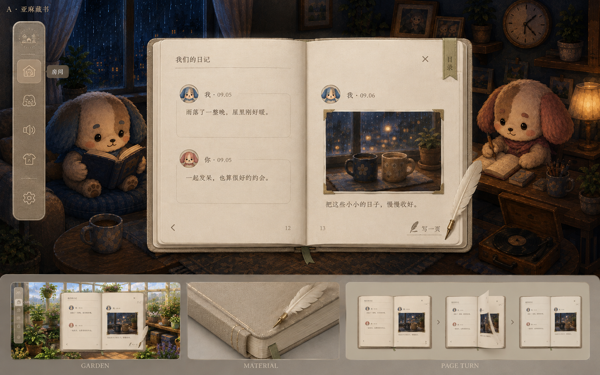
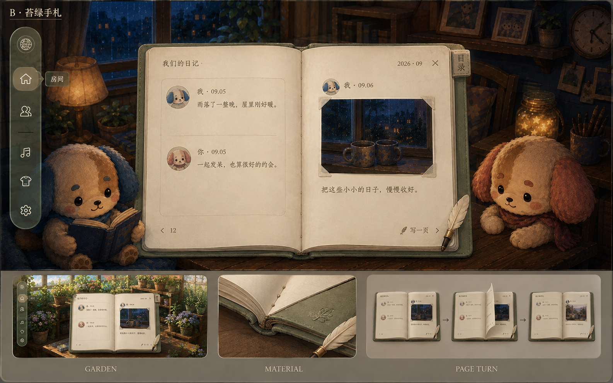
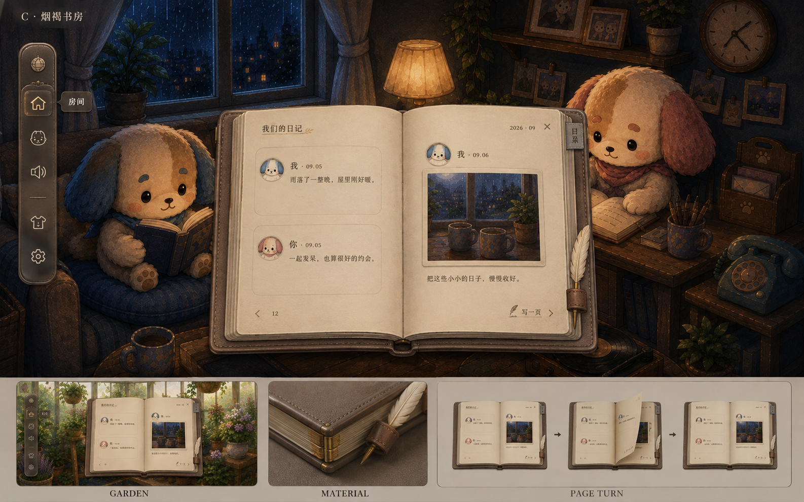

# 双页日记与跨场景 UI 材质提案

日期：2026-09-06。状态：**用户已批准 B，已接入本地产品；未部署**。

本文件正文保留出图阶段的提案与研究语境；其中「待批准」「未实施」描述的是当时状态，不是当前状态。实际尺寸、落点、翻页实现、验证与未覆盖项以 [实现报告](implementation.md) 为准。

入口：[设计系统组件登记](../../../cinnaglass/ui-system.html#journal-book-proposal)。本文件与图片共同组成一个提案，不是另一份在运行的样式真源。

## 1. 结论与本轮边界

赞成真正的左右双页。日记不是缩窄的信息流，而是有封皮、书脊、书页厚度、留白和翻阅节奏的一件游戏物品。

推荐 **B「苔绿手札」作为默认方向**：灰苔绿软封皮、暖灰纸、深暖墨字、少量旧黄铜、象牙羽毛笔。A 可作为更清雅的备选，C 可作为偏古典的备选；不建议首版同时开发三套皮肤。

统一的是纸色、文字、边缘、阴影、按钮和工具栏，不是让所有弹窗都长成一本书。照片、心愿、日历、设置都进入同一家族，但保留各自物件的形态。

用户本轮要求是出设计稿、登记设计系统、先不改。故本轮只生成图片、写提案和更新文档入口/待办；不改 src、不安装翻书依赖、不改后端、不部署、不编辑 .claude/ 或 skill 配置。

## 2. 规范化 brief：这次必须解决什么

- 情绪：安静、沉浸、温暖古朴、略可爱；高级感来自分寸与触感，不靠复杂装饰。
- 形态：实体双页日记；左右是连续阅读顺序，不是两位作者各占一栏。
- 层级：房间负责氛围，书页负责阅读。去掉刺眼纯白大板和高不透明深色卡片的对立。
- 内容：独立头像、名字/时间、柔和范围框；无彩色左边线、无聊天气泡尖角。
- 留白：每页有外边距和书脊安全区，不让内容顶满容器；不为了书的外形缩小正文。
- 装饰：允许小羽毛笔、线装、纸边、一个书签；不叠加藤蔓、角花、星链、金框。
- 复用：书房与花园使用同一纸色和信息层；封皮/工具栏轻接环境色。
- 动作：单次翻动一张纸；跳多页时可看见多张书页依次翻过，不是一次旋转后换内容。
- 交付：三款完整概念板，均含导航、花园对照、材质近景、翻页分镜。

## 3. 为什么上一版没有完全贴合

用户指出颜色、透明度不一致，这个反馈成立；“功能回归通过”不等于“视觉还原通过”。

代码事实：当前 diary.css 外壳底色透明度为 0.91，条目底色约 0.88～0.90。两层底色叠加，在不考虑额外渐变的简化条件下，房间只剩约 0.9%～1.1% 的直接透出量。因此它很容易读成一块深色实板，而不是概念图暗示的轻材质。此处是合成计算，不是对上一张图隐藏透明通道的测量。

另一个问题是系统层面：日记单独改为烟茶玻璃，而其他功能仍沿用白纸；材质选择没有统一。新方案不继续提高透明度补救，而是分开“适合阅读的纸”和“融入场景的轻工具”。

图像事实：三张新图都是生成式概念图，1586×992，细节、场景位置和纸色存在偏差。不能从它们反推出唯一 CSS 透明度，也不能据此声称动态性能与字号验收通过。

## 4. 三款设计与独立复核

### A · 亚麻藏书

亚麻硬封、平展的纸页、细窄书脊、苔绿书签。最清雅，最像被妥善收藏的日常记录。导航更像布面书签，留白稳定。

不足：生成图的导航偏实心，不足以作为透明导航的最终样板；照片用了偏金属的四角，实际应改成纸角或直接细框，避免贵重相册感。A 主图缺少清晰的右翻箭头，不能照图删掉该操作。

### B · 苔绿手札（推荐）

灰苔绿软封、细线装、柔弯纸边、朴素纸角、羽毛笔。导航能看到模糊场景颜色透过，选中项是安静的小内凹块。三款里最能同时表达游戏触感与日常亲密感；花园对照也自然。

不足：主图两条文字框的空白略多、边缘偏明显；落地时保留外部留白，但条目框由实际内容决定高度，不能照搬大空盒。书页在生成图中偏黄，目标采用下节较中性的暖灰色，不做泛黄旧纸。软皮纹理只在近看可辨，不能满屏高频噪点。

### C · 烟褐书房

烟褐细皮、低调压线、较厚纸叠和笔套。书在画面中更收敛，古朴感最强，适合喜欢旧书馆气质的取向。

不足：皮套与金属细节使它更成熟、更重，导航也接近深色皮盒；在花园虽然不突兀，轻盈感仍不如 B。生成的材质近景出现额外金属结构，不进入规格，不能把它当成需要制作的铰链。

### 统一比较（设计判断，不伪装成用户测试分数）

| 维度 | A 亚麻 | B 苔绿 | C 烟褐 |
| --- | --- | --- | --- |
| 温暖古朴、可爱而不花 | 温柔清雅 | 最平衡 | 古典偏成熟 |
| 书房 / 花园复用 | 都自然 | 都自然，植物背景最协调 | 书房更强 |
| 导航的轻盈和透感 | 偏实，需修正 | 最接近目标 | 偏重 |
| 物件触感 | 布纹、装订 | 软封、线装、纸角 | 皮革、纸叠、笔套 |
| 后续制作负担（预估） | 较低 | 中等 | 中等偏高 |
| 裁决 | 最简洁备选 | 默认推荐 | 古典备选 |

三图不是严格像素级 A/B 测试：C 的书更小，角色、房间取景和文字细节也有变化。判断主要针对材料和形态，不把场景重绘造成的好看误算成 UI 实现效果。

## 5. 共用材质系统：暖灰纸 × 灰苔封皮 × 中性轻壳

以下是**待批准的明确目标值**，不是从生成图精确提取的颜色，也不是已加入产品的变量。

| 建议语义名称 | 目标 | 使用规则 |
| --- | --- | --- |
| material.paper | #D8CDBA，100% 不透明 | 日记、照片底板、心愿内容、日历、设置内容共用；不再各自调白 |
| material.paper-edge | #B8AA94 | 书页叠层、纸边；不能铺在正文底下制造脏感 |
| ink.primary | #443E35 | 标题、正文、主要图标 |
| ink.secondary | #5D5448 | 时间、页码、辅助标签；同样保证可读，不用极淡金字 |
| cover.default | #727D6B | B 的灰苔绿封皮；不是全系统所有大面的背景色 |
| cover.alternative | A #A99C87 / C #786B60 | 本轮备选，不默认增加换肤功能 |
| metal.brass | #A58A5A | 羽毛笔笔箍、小连接件；非大面积按钮色 |
| shell.neutral | rgba(65,65,57,0.58) | 仅导航/轻工具；建议柔化背景 18px，最终以场景合成测试为准 |
| shell.foreground | #EEE3D2 | 轻壳图标；在明暗两种底图上分别验证 |
| identity.blue | #36515E | 暖灰纸上的“我”名字与极小身份标识 |
| identity.pink | #724650 | 暖灰纸上的对方名字与极小身份标识 |

色系控制为五族：纸与暖墨中性色、苔绿封皮、旧黄铜、身份蓝、身份粉。象牙羽毛归入纸色族。蓝粉依然保留原有身份语义；本提案不直接替换全局 --accent-deep，纸上可读的文字色应与原有装饰强调色分开。

纯色对比计算：主文字对目标纸色约 6.73:1，蓝色名字 5.35:1，粉色名字 4.94:1。这只是起点，不等于叠上纹理、阴影、场景后的可读性验收。

### 光照与透明的职责

- 纸张始终不透明，中央阅读区保持目标纸色；夜晚不变成黑底，花园不染成绿纸。
- 封皮、纸边、金属可以接受小幅暖/冷环境反光；不能把整个阅读面加灯光滤镜。
- 不再规定“内容纸必须比全场任何像素都亮”。灯泡、窗外和天空可以更亮；纸只需在阅读局部清楚舒适。这是对旧 STYLE 白纸最高明度规则的明确替代提案，待批准后再同步生效。
- 透明只放在导航与轻工具；正文框不再叠第二层玻璃。图片、正文和输入区沿用同一纸底。
- 纹理以近看才见为目标：微弱纤维，不用噪点遮字、不做发黄污渍。
- 局部细反光只出现在笔箍、封皮迎光边、轻壳短边。宽约 1px 的短弧或短线，逐渐淡出，不绕一整圈，不自动扫光。纸面使用柔影表达厚度，不画玻璃反射。
- 反光位置未来由场景给出光源方向，不把“右上角有台灯”写死成通用组件前提；方向未知时用中性微弱边光。

### 字体与几何

标题用清雅宋体风格，正文用清楚的人文无衬线；正文不使用花体或仿手写字体。字体具体资源与中文授权在实施前确定，本轮不下载新字体。

桌面标题 21～24px，正文 16px / 1.75 行高，辅助字 13～14px。书页角 10～14px，文字范围框角 8px，细框同色低对比；边框不是作者色载体。头像 32～36px，名字与正文不挤在同一行。羽毛笔视觉长约 80～104px，操作热区至少 44×44px。

## 6. 其他功能怎么复用，不再长成两套产品

| 功能 | 物件形态 | 共用内容 | 不应该照搬 |
| --- | --- | --- | --- |
| 日记 | 双页装订书 | 暖灰纸、深墨字、羽毛笔动作、日期书签 | 只属于日记的逐页阅读 |
| 照片 | 浅口相片匣 / 纸底相册板 | 同纸底、细框、朴素纸角、封皮色的窄底托 | 不强迫九张照片塞进双页正文 |
| 心愿 | 暖灰纸签与简洁底托 | 同字色、勾选形状、按钮、微弱纸纹 | 不做玻璃框里再套玻璃卡 |
| 日历 | 装订日历纸 | 同纸色、标题字、细线、身份点色 | 不需要厚书脊和装饰羽毛 |
| 设置 | 单张纸面工具页 | 同控件、层级、间距、轻壳工具区 | 不为了拟物牺牲输入与操作效率 |
| 导航 / 音乐轻条 | 中性半透明工具壳 | 同透明配方、局部反光、图标线宽 | 不套大张纸挡住房间 |

这是复用规则登记，不是承诺本轮把这些功能全部重做。后续先做日记和导航的共同基础，再迁移其他功能；布局改动另按各功能需要安排。

## 7. 旁边的导航：短工具栏，不是第二个主角

推荐 B 的轻壳方向，但绿色来自透过的环境与窄封皮细节；导航基底仍是中性灰，不把所有场景永久罩绿。

- 桌面外宽 56px，离屏幕边 20px，圆角 22px；图标 20px / 1.5px 线宽，44px 点击区域。取消八个同等强度的大按钮。
- 建议常驻四项：房间、聊天、声音、工具；设置放底部分组。工具中保留照片、日历、悬浮组件的可发现快捷入口；未实现装扮继续不可用，不虚构新功能。
- 图中的衣服图标是材质示意，不是已决定取代工具入口；实际语义以本节为准。
- 物件入口依然是主要入口，工具栏提供跨场景兜底；不重新把日记/相册/心愿塞回同一个三 tab 弹窗。
- 悬停或键盘聚焦显示中文短标签，触屏点击可展开有标签的工具菜单；不能把理解成本全交给小图标。
- 当前项只有一个浅内凹块；未选项无独立底板。焦点边缘必须清楚，不能为了精致让键盘用户找不到位置。
- 展开工具菜单时保持同一轻壳，不拉出占满侧边的黑墙。读日记期间入口保持可辨，切换功能先保留草稿。

这是现有八项导航的整理提案，所有现有功能都要有迁移后的入口，不以“更简洁”为由删掉功能。

## 8. 真双页的阅读与尺寸

一“页”是纸的一面，一“张”是有正反两面的纸，一“跨页”是打开时同时看到的左右两面。例如 12—13 翻动右侧一张纸后看到 14—15，不能只把右页替换成 14 而左页永远不动。

阅读顺序为左页从上到下，再到右页，再翻下一张；两位作者在这个顺序中自然混排。保留旧 D-1 的时间顺序和非聊天原则，但**用实体分页替代无限滚动单列**属于新的交互裁决，待用户批准，不声称两套形态已同时成立。

| 可用视口 | 建议书体上限（含封皮） | 页面排版 | 导航退化 |
| --- | --- | --- | --- |
| 宽 ≥1200 且高 ≥700 | 800×540px；也受可用空间限制 | 双页，外边距 36px，近书脊各 30px；每页正文约 310px 宽 | 左侧 56px 短栏 |
| 宽 768～1199 且高 ≥600 | 640×460px | 双页，外边距 26px，近书脊各 24px；正文仍 16px，不缩字 | 48px 短栏，可收起 |
| 宽 <768 或高 <600 | 单页宽 min(360px, 视口宽减32px)，高不超过视口高减88px | 单页翻阅，保留封皮/纸叠/页码；不强塞两个窄栏 | 收成底部有标签的工具入口 |

以上是排版目标，不是三张图的实测边框。最终按当前房间座位锚点检查两只角色的可辨识区域；不照抄生成图重新画房间，也不靠任意放大背景掩盖遮挡。桌面保留背景呼吸空间，极矮窗口优先单页，必要时允许阅读区正常滚动而非截断内容。

### 内容放不下时

- 正常短记录以完整条目排入纸面；页底不足时整条移到下一页，不把头像留在前页、正文扔到后页。
- 超长记录可按段落续到下一页，显示“续”，保持同一记录身份；这不是拆分数据库帖子。没有可断点的长串按字符安全换行。
- 多图最多九张的规则不变。使用小型接触印样排列或跨页延续，同条记录的照片顺序不变；点击仍开详情原图，不把全部原图塞进翻书动画。
- 字体和图片尺寸准备好后再确定页面；翻动中不能因为图片加载突然换页数。
- 目录优先显示日期/月，不把动态排出来的“第几页”当成永久地址。阅读位置用记录 ID 与段落位置记住；调整窗口时恢复到同一条记录。
- 新回忆到来时提示“有新的一页”，不把用户正在读的旧页突然翻走。

### 数据范围不能被设计掩盖

现有服务端按游标取一批记录，和 UI 的“一张纸”不是同一个东西。每次取到的记录在前端排版成多页；只维护当前与相邻少量页面，不预先生成所有历史页面。

现有接口不能凭一个未知历史月份直接给出对应页码。因此首版目录只把已加载的日期做成可跳转项，更早内容明确显示“继续载入”；不得展示所有月份都能瞬间跳转的假能力。若要任意年月直达，需单独评估日期索引/接口范围，不默默改数据层。

## 9. 翻页：单张清楚，多张有连续感

这些时值是设计目标，需要动态样机检验，并非已有性能数据。

| 用户动作 | 画面应发生什么 | 建议时长 |
| --- | --- | --- |
| 点下一页 / 键盘右键 | 右页外角先抬起，纸面弯曲越过书脊，背面落到左边，露出新右页 | 单张 420ms 左右 |
| 点上一页 / 键盘左键 | 同样过程反向，光影与背面方向正确 | 单张 420ms 左右 |
| 跳过 2～4 个跨页 | 相应数量的纸依次翻动，首张起势、中段加快、末张落稳；不要只闪白 | 约 650～1000ms |
| 跳到更远的已加载日期 | 4～5 张可辨纸叶连续掠过后到目标，表示快速翻书，不逐张播放几十页 | 最长约 1100ms |
| 拖动页角未过中线就松手 | 当前纸回落原位；不是误提交一次翻页 | 随距离回落 |
| 系统要求减少动态效果 | 无立体卷页，直接换页或约 100ms 淡换 | 不强制多页扑动 |

长跳是明确的压缩表达，不表示每张掠过的纸都对应全部历史记录；落定后日期和内容必须真实。连续翻动比旧普通 UI 220ms 动效更长，是仅限日记的拟物动作提案，不扩大到设置/菜单。

动作流程：点击目的日期 → 若目标未加载，当前页保留并显示加载状态 → 内容与排版准备好 → 翻动 → 落定 → 焦点与日期标签更新。网络失败不让书翻到空白页。翻页本身不写后端、不通知对方、不产生一条“互动记录”。

快速连点时合并为最新目的地，不累积几秒的动画队列；拖角与正文选字、图片点击、输入法编辑的操作区分开。页码/按钮提供明确替代，不能要求一定会拖角。

### 实现路线研究

**优先研究真实网页内容 + 翻书组件。** 文字、头像、图片仍是可访问的网页元素，翻动时负责纸的正反面、遮挡与阴影。StPageFlip 提供 HTML 内容载入及前后翻页接口，可作为小范围技术样机候选；并未在本轮安装或承诺直接采用。[官方接口](https://nodlik.github.io/StPageFlip/docs/classes/pageflip.html)

查阅源码确认：该组件的 `flipToPage` 会先调整到目的跨页的附近，再调用一次向前/向后翻动；**它不是逐张翻过全部中间页**。连续多张仍需另做翻页队列或受控的多叶过场，不能靠一个跳页 API 冒充实现。[官方实现](https://github.com/Nodlik/StPageFlip/blob/master/src/Flip/Flip.ts)

备选是纸角/阴影的帧动画：适合手绘质感与低端设备，但用户内容不能烘焙进一套固定图片；动画中间可以只表现纸叶，落定仍显示真实文字。简单地把整块页面绕竖轴旋转，会像硬纸板翻门，不足以作为默认效果。自制可弯曲的三维网格自由度更高，但字体清晰度、点击定位和维护成本更大，暂不推荐起步就走这条路。

动态减弱遵循系统偏好；该设置可通过 `prefers-reduced-motion` 检测。[MDN 说明](https://developer.mozilla.org/en-US/docs/Web/CSS/Reference/At-rules/@media/prefers-reduced-motion)

### 写日记与草稿

羽毛笔/“写一页”打开同材质的写作状态，保留清楚的保存和取消，不要求在翻动的纸片上编辑。输入中不让页角拖动接管选字。点外/Esc 收起保留文字与选图；回到书页可见草稿书签预览；只有显式“取消”执行放弃草稿。成功保存遵循现有发帖链路，对方仍通过已有数据读取机制看到记录，不承诺本轮新增实时能力。

## 10. 防止再出现“设计稿一套、实现一套”

1. 用户选方向后，先做单一材质样板：封皮、两页纸、一个头像框、导航、羽毛笔；暂不扩散到所有页面。
2. 图片用于判断触感，批准的参数表用于判定颜色/透明度；不能凭肉眼从生成图猜一套 rgba 后宣称还原。
3. 样板必须引用真实产品 CSS。分别在实际书房三时辰与花园概念背景上截图，后者标注为环境测试，不冒充已解锁房间。
4. 用相同背景位置比较原场景与叠 UI 后的采样；检查纸色、文字对比、透明壳透景，注明采样矩形。主/辅助文字对实际底色均要求至少 4.5:1；描边/焦点不靠颜色单独区分。
5. 以文字稀疏、长日记、九图、无图、空日记、草稿、失败、字体放大和窄屏做内容压力检查，不只验生成图的三条短文。
6. 录制真实单翻、连续多翻、快速连点、反向翻、翻动中缩放、加载失败与减少动态效果。验收翻的是正确的纸、落的是正确的记录，而不只是动画好看。
7. 房间与角色使用现有资产核验遮挡。当前概念图对角色和场景有重绘，不是无需调整就能得到的产品截图。

本轮完成了三图视觉复核、目标纯色对比计算、尺寸及引用文件检查；**没有运行产品回归，没有动态样机，也没有验证翻页帧率**。

## 11. 登记与待拍板

已确定的用户边界：本轮只设计；统一跨场景材质；克制、有物件触感；不要突兀彩色左边线；需要单翻和多翻的区别。

设计师推荐、尚待用户确认：B 为默认；暖灰不透明纸 + 中性透明轻壳；桌面双页/小屏单页；日期目录；整理为短导航；允许日记的连续翻页比普通菜单动效更长。

需要用户本人决定的只有主方向，以及是否接受“桌面双页、小屏单页”的阅读规则。其他功能本轮仅登记共用规范；实际迁移范围和顺序在获得实施授权后再排，不把当前“先不改”解释为全项目翻新授权。

历史夜灯玻璃稿与功能验证记录保留，但标明用户已要求进一步重设计，不能继续当成最终视觉验收结果。旧 STYLE/UX 与产品变量本轮不替换，避免待审提案混入运行规范。

## 12. 产物清单

- `direction-a-linen.png`：亚麻款；1586×992。
- `direction-b-sage.png`：苔绿款；1586×992，推荐。
- `direction-c-leather.png`：烟褐款；1586×992。
- `prompts.md`：三次生成的完整描述与参考素材角色。
- 本文：设计、跨场景系统、导航、双页模型、翻页研究、边界与验收。
- 上级 `ui-system.html`：待审入口；`ai/TODO.md`：新的设计评审/后续迁移待办。

原始生成文件保留在生成目录，本目录为副本。输入参考未覆盖。
