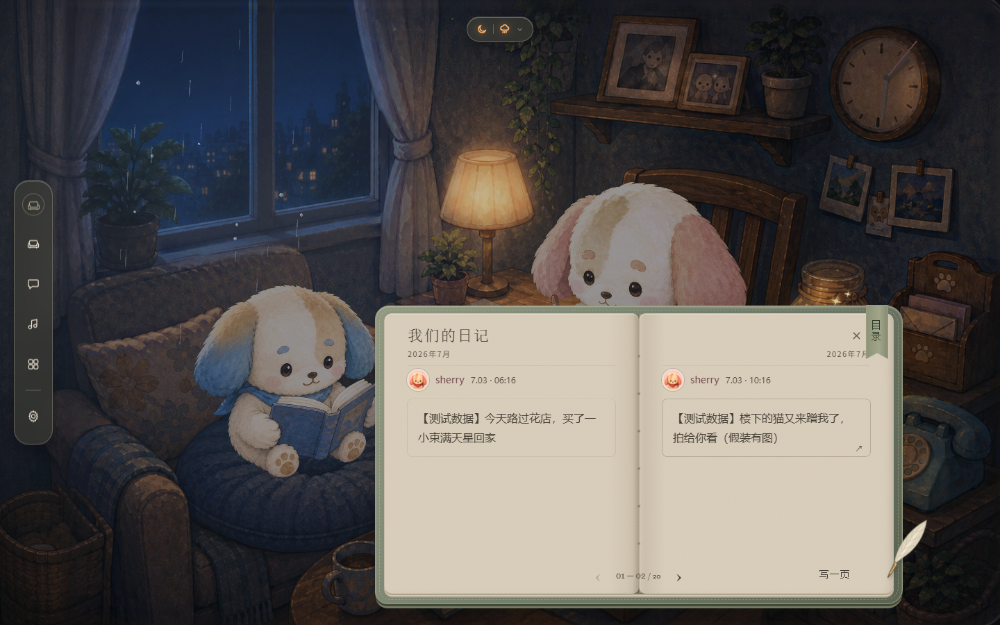

# B 苔绿手札 · 本地实现与验证

> 后续评审：用户已否决此实现的视觉效果，指出文字/纸面脱离、材质平涂、落位和场景暂停问题。下方「通过」仅为当时功能检查，不代表视觉通过；新提案见 [桌上的同一本日记](../../../cinnaglass/journal-room-object/codex-report.md)。本轮出新稿未修改当前产品代码。

2026-09-06。用户批准推荐 B 后实施，未部署、未提交 git。

入口：[设计系统](../../../cinnaglass/ui-system.html#journal-book-proposal) · [原始设计提案](codex-report.md) · [功能文档](../../../../../Features/timeline.md)

## 1. 已落地的设计

日记改为有灰苔软封、线装书脊、暖灰纸页和羽毛笔的实体书。左右页是连续时间顺序，不是两位作者各占一列。头像独立、作者用蓝/粉名字与头像圈识别，正文只有中性细框，没有彩色左边线，也没有聊天气泡。

纸不是透明玻璃：不透明的暖灰保证换场景也能读。透明感留给短导航与工具。照片墙、心愿单、日历、设置共用纸色、文字、线条、按钮和底缘；保持各自内容组织，不把每个弹窗都做成书。未全面重画既有彩色功能图标，也未改变设置与心愿单原有数据完成度。

### 当前材质真源

`src/themes/cinnaglass/materials.css` 集中定义，`cinnaglass.css` 导入，`diary.css` 只使用或组合这些值；设计系统通过真实 CSS 展示，不再复制一套独立色值。

| 用途 | 值 |
| --- | --- |
| 暖灰纸 | `#D8CDBA` |
| 深暖墨 / 次级文字 | `#443E35` / `#5D5448` |
| 灰苔封皮 / 旧黄铜 | `#727D6B` / `#A58A5A` |
| 纸上的蓝 / 粉身份色 | `#36515E` / `#724650` |
| 中性轻壳 | `rgba(65,65,57,.58)` |

纸上身份色是为阅读单独设置的深色，不改全局品牌 `--accent-deep:#2F9AD3`。玻璃实际观感还受渐变、模糊与场景影响，不能用单个透明度声称与生成图逐像素相同。

### 相对概念稿的必要几何调整

原场景蓝色角色在左下、粉色角色在中上，居中大书会同时挡住两张脸。落地版将书移到偏右下，保留蓝色脸和粉色眼鼻可辨识部分；不放大房间、不改角色位置、不重画场景。小屏以可读性优先改为单页，无法承诺两张脸均完整。

| 真实窗口 | 书本外框 | 位置 x / y | 页数形态 |
| --- | --- | --- | --- |
| 1440×900 | 760×430 | 540 / 440 | 双页 |
| 960×700 | 560×315 | 280 / 355 | 双页 |
| 640×400 | 360×300 | 140 / 30 | 单页 |
| 390×844 | 358×560 | 16 / 122 | 单页 |

宽 ≥1200：宽最大 760，高 `min(430px,48vh)`；768–1199：宽最大 560，高 `min(360px,45vh)`。宽 <768 或高 <600：宽最大 360，高 `min(560px,100% - 100px)`。正文 16px/28px；页内边距桌面 32px、中小屏 24px，标题、页脚与书脊各留安全区。

导航桌面 56×381，保留房间、聊天、音乐、工具、设置；工具中保留照片、日历与组件开关。小屏横置底部。不是删除原入口来缩短导航。

## 2. 翻页与内容行为

- 点击左右箭头或键盘方向键：实际软纸折曲翻过，不是整本书旋转。单次目标时长 420ms。
- 日期目录跳多页：相邻途中逐张翻；远距离显示最多四次连续纸叶动作，每张目标 210ms，省略中段后落在真实目的页。不逐张播放数百页，也不假称远距离每张都播放。
- 页底外角可拖动，跨过书脊完成、未跨过则回弹；正文区域保留文字选择和详情点击。
- 系统开启「减少动态效果」时直接定位目的页；不播放连续翻动。
- 静止和关闭后停止翻页渲染循环，不让翻书引擎每帧空转。
- 正文用浏览器真实排版尺寸分页。整条能放下则保持完整，超长才续页；按完整字符簇切分（例如组合表情保持完整），优先段落边界，不裁掉文字。照片有独立高度预算，最多九图仍按原顺序出现，详情继续打开原图。
- 进入时打开最新记录起点。窗口改变时重新分页并尽量保持正在看的记录位置。签名图片地址更新只换图片地址，不重新分页。
- 羽毛笔打开写作卡；输入文字/选图后，点外或 Esc 收起保留，折叠状态显示草稿；「取消」清空。发布成功后清除旧阅读锚点并重新读取数据。未改创建帖子和存储接口。
- 目录「载入更早的回忆」继续调用原游标分页，「刷新回忆」重新读取。日期目录只承诺已载入日期，不假装已有全量历史索引。

### 翻页依赖及修补

采用 [StPageFlip 官方项目](https://nodlik.github.io/StPageFlip/)，固定 `page-flip@2.0.7`（MIT）。官方一次远距 `flip` 不等于逐页连续播放，因此队列由 `journal-book.tsx` 管理。

`patches/page-flip@2.0.7.patch` 经 pnpm 的补丁配置保存：增加渲染器 start/stop，仅动画或拖动时持续请求下一帧；重启时刷新时间基准，将偶发负帧下标限制为零。开发服务的旧预打包曾导致修补没有生效，重新启动并强制刷新依赖后，完整浏览器检查两次通过。今后更改补丁后应重启预览，不依赖样式热更新刷新依赖。

React 只拥有外层容器，翻页库拥有内部书页节点，防止两个系统同时移动同一批 DOM。DEV 专用引擎引用仅用于验证，生产环境不暴露。

## 3. 局部细反光怎么做

封皮右上边缘放一条 **1px 高、两端透明的短渐变线**；顶缘用低强度内阴影，书脊用窄明暗渐变模拟弯曲，羽毛笔的金属笔尖只有一条浅色亮边。纸面不叠玻璃、不扫大面积光带。

这些反光是静态 CSS/SVG，不需要逐帧重绘或鼠标跟随。纸张触感来自很轻的纹理、书页厚度、接触阴影和翻动时的动态阴影；不是在正文后铺重噪点。

## 4. 实测与边界

执行 `scripts/check-journal.mjs`，用 Chrome 在真实开发页面验收。该脚本只读取已有共享数据；草稿与长文压力数据仅在浏览器内，不发布任何测试帖子。

已通过：

- 四尺寸真页面截图，当前可见页的横向/纵向溢出均为 0。
- 真实时辰控件切换夜间、黄昏、暮色，纸底均为 `rgb(216,205,186)`；截图在 `verification/`。
- 多页目标最终回到第 1–2 页，中途观察到连续页变更；手动拖角到第 3–4 页。
- 额外 12 次交替翻页，验证停止后的重复启动；无浏览器运行错误。
- 减少动态效果即时落页；静止状态为 `read`、渲染循环 `running:false`。
- 选 10 张图片被限制为 9 张，文字与图稿 Esc 收起后还在；取消后无草稿；详情 Esc 只关详情，日记保留。
- 三种页内尺寸的长中文、组合表情、超长英文串和九图压力排版：原文完整拼回、图片顺序完全一致、每页无溢出。
- 照片墙、设置、工具导航实景截图；新增/修改 TS 文件的定向 ESLint 通过。
- `pnpm exec vite build` 打包通过；仍有主包超过 500KB 的体积警告。

**不能当作已经验证的部分：**真实花园当前锁定；未做跨设备双账号真实发帖、40 分钟等待续签、超大量历史压测、全离线/上传失败测试；日历/心愿的原功能完成度不因这次换材质提升。分页页码随窗口宽度变化，不是数据库永久编号。

**已有项目构建问题：**完整 `pnpm build` 的类型检查仍被 `shell/chat-card.tsx:10` 的 `Msg` 导入阻断；该文件从 `../model` 引用了不存在的类型。本次未修改聊天消息结构。不要把 Vite 打包通过说成完整类型构建通过。

数据与测量：[results.json](verification/results.json)。本地预览：`http://localhost:5175/?enter=1&surface=timeline`。

## 5. 文件职责

`journal-layout.ts` 负责安全内容节点与实测分页；`journal-book.tsx` 负责书本生命周期、翻页队列、目录、拖角与羽毛笔；`diary.css` 负责形状和响应尺寸；`materials.css` 负责共用材质；`cinnaglass.css` 映射全局纸/工具变量；`screens.tsx` 接入原数据、草稿和详情；`shell/rail.tsx` 收敛导航并保留入口；`src/types/page-flip.d.ts` 描述使用到的依赖接口。

另含依赖锁文件、pnpm 补丁与验证脚本。`.claude/`、既有 skill 配置、场景原图、数据库与存储接口均未在本轮修改；工作区其他已有改动保留。
