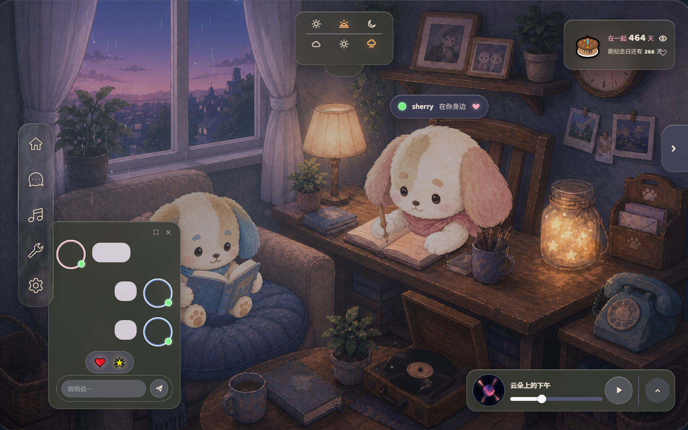

# Our World · 当前 UI/UX

> UI Tailor 主维护，Monet 负责全局统一与视觉审核 · 2026-09-20。
> [整体设计系统](../design-system.md) / [Cinnaglass 主题](cinnaglass/ui-system.md) / [交互规则](interaction.md)

这是现状示例，不是统一完成稿。界面围绕安静陪伴、真实状态和需要时可读展开；不把所有功能都做成同一种浮窗。

**M1 提案已可查看**：[实景操作](cinnaglass/standard-board.html) / [两种弹窗材质并排比较](cinnaglass/material-comparison.html) / [图文与边界](cinnaglass/ui-system.md#m1-可操作标准板提案未定稿)。B1 的正文仍有磨砂纹理，B2 的正文铺稳定实底；待用户选定，产品尚未迁移。

## 所有在用 UI 的登记

| 类别与采用界面                       | 当前外观/行为                                            | 常驻规范与实施依据                                                                                            |
| ------------------------------------ | -------------------------------------------------------- | ------------------------------------------------------------------------------------------------------------- |
| A 导航                               | 五入口中性细纹磨砂；工具菜单、选中/悬停/按压反馈         | [主题 A](cinnaglass/ui-system.md#a-场景悬浮-ui)、[导航功能说明](../../features/navigation-glass.md)           |
| A 天气/聊天/音乐                     | 当前独立灰绿配方；实况/手动天气、聊天窄卡、音乐两态      | [主题 A](cinnaglass/ui-system.md#a-场景悬浮-ui)、[现状审计](../../features/ui-system/audit.md)                |
| A 纪念卡/头顶状态/气泡               | 纪念信息与在场/聊天反馈；小屏有重叠问题待处理            | [交互规则](interaction.md)、[审计](../../features/ui-system/audit.md)                                         |
| B 设置/确认/选择/错误弹窗            | 当前暖灰纸；背景层级、焦点与真实保存语义需统一           | [主题 B](cinnaglass/ui-system.md#b-任务与功能弹窗)、[统一计划](../../features/ui-system/ui-system.md)         |
| B 日历/时钟/完整聊天/照片/心愿通用壳 | 有真实功能，也有旧外壳/特殊内部内容                      | [主题 B](cinnaglass/ui-system.md#b-任务与功能弹窗)、[交互规则](interaction.md)                                |
| C 日记                               | 棕皮旧纸、手写风文字、图文随纸翻页                       | [主题 C](cinnaglass/ui-system.md#c-专属物件-ui)、[timeline 功能](../../features/timeline.md)；本 session 冻结 |
| 登录/重置/大厅/加载与错误页          | 当前主题实现，待 M5 收敛；有意保留的数据功能不随样式删除 | [主题边缘页面](cinnaglass/ui-system.md#边缘页面与公共规则)、[审计](../../features/ui-system/audit.md)         |

每项采用 UI 的图片、特征、交互/动画与来源在上述常驻主题/交互文档中维护。全局 Monet 不能只管理 concept 而忽略这些链接。

## 共同使用模型

场景中的物件是功能入口，导航提供常用功能；A 浮窗支持轻量陪伴操作，B 处理聚焦任务，C 保留物件自身形态。点物件不必然属于 C：音乐浮窗属于 A，时钟弹窗属于 B。具体热点见 [物件文档](../props.md)。

关闭、草稿、焦点、键鼠/触屏和多浮窗避让遵循 [interaction.md](interaction.md) 中明确区分的当前行为与目标。状态表达对应真实数据；未实现播放、保存等行为不能画成成功。

## 当前设计边界

导航是 A 基准；B 的较厚磨砂外壳尚待标准板批准。日记冻结，整体 UI 动画后置。[decisions.md](cinnaglass/decisions.md) 只记录 UI 当前决定，位于本项目 `ai/design_system/uiux/`，不放技能目录。

研究与比稿在 [research](research/README.md)，未来概念及否决方向从 [concept](../concept/README.md) 查。日常任务报告只在 session 汇报。用户随时看当前 UI 就打开本页；HTML 为特定交互预览，不能替代持续更新的 Markdown。
