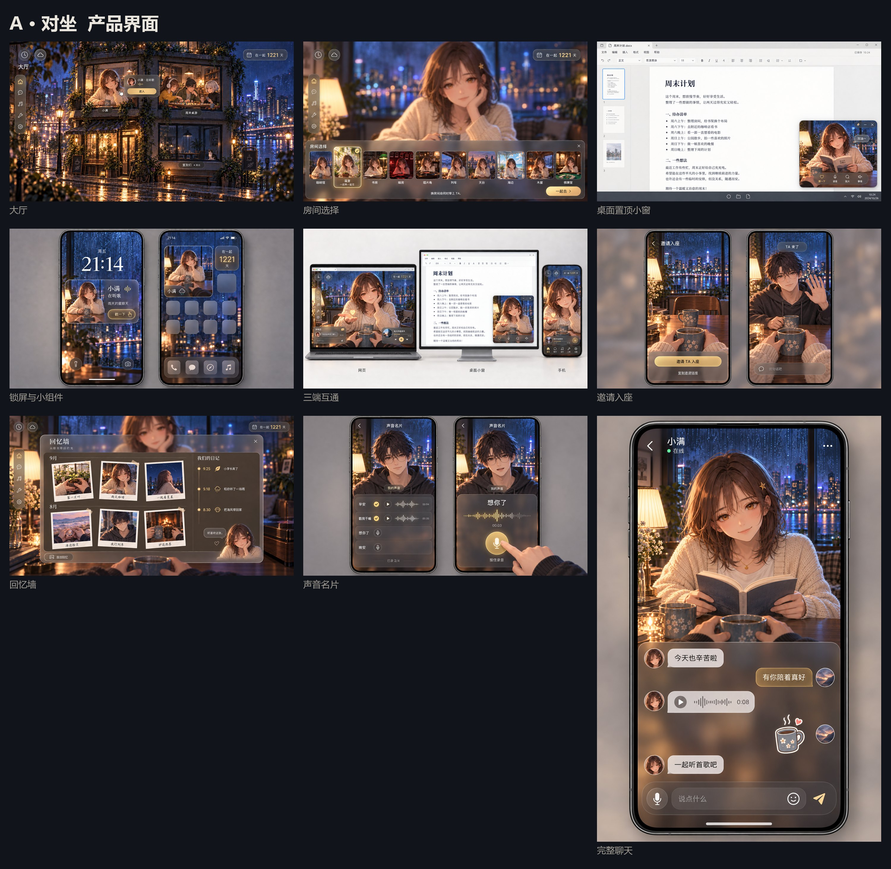

# Our World · 当前 UI/UX

> UI Tailor 主维护，Monet 负责全局统一与视觉审核 · 2026-09-21。
> [整体设计系统](../design-system.md) / [Cinnaglass 主题](cinnaglass/ui-system.md) / [交互规则](interaction.md)

**[打开 UI/UX 全局风格预览](../preview.html#ui)**：直接展示本页及当前主题已登记的真实素材/实景，文字负责说明与链接；候选不混入此视图。与 [整体风格预览](../preview.html#world) 共用一个常驻入口，从 Markdown 自动取材。

这是本地已实施的统一基线。界面围绕安静陪伴、真实状态和需要时可读展开；不把所有功能都做成同一种浮窗。

## 所有在用 UI 的登记

| 类别与采用界面                       | 当前外观/行为                                                 | 常驻规范与实施依据                                                                                            |
| ------------------------------------ | ------------------------------------------------------------- | ------------------------------------------------------------------------------------------------------------- |
| A 导航                               | 五入口中性细纹磨砂；工具菜单、选中/悬停/按压反馈              | [主题 A](cinnaglass/ui-system.md#a-场景悬浮-ui)、[导航功能说明](../../features/navigation-glass.md)           |
| A 天气/聊天/音乐                     | 同源磨砂/受色内衬；左上双圆时辰/天气入口，音乐使用真实本机合成音频 | [主题 A](cinnaglass/ui-system.md#a-场景悬浮-ui)、[现状审计](../../features/ui-system/audit.md)                |
| A 新来信 | 金亮信纸提示世界未读消息，点击进入聊天、已读消失 | [信纸规范与实景](cinnaglass/ui-system.md#时辰--天气与新来信) |
| A 纪念卡/头顶状态/气泡               | 真实纪念日、姓名与聊天反馈；小屏避让，无占位在线绿点          | [交互规则](interaction.md)、[审计](../../features/ui-system/audit.md)                                         |
| B 设置/确认/选择/错误弹窗            | 共享连续磨砂壳/受色内衬、原生弹层；内联确认/选择器可键盘操作  | [主题 B](cinnaglass/ui-system.md#b-任务与功能弹窗)、[统一计划](../../features/ui-system/ui-system.md)         |
| B 日历/时钟/完整聊天/照片/心愿通用壳 | 已共用 B 壳；照片保留内容纸框，提醒/心愿明确本机能力          | [主题 B](cinnaglass/ui-system.md#b-任务与功能弹窗)、[交互规则](interaction.md)                                |
| C 日记                               | 棕皮旧纸、手写风文字、图文随纸翻页                            | [主题 C](cinnaglass/ui-system.md#c-专属物件-ui)、[timeline 功能](../../features/timeline.md)；本 session 冻结 |
| 登录/重置/大厅/加载与错误页          | 真实书房素材与同源材质；加载/错误/重试保持账号与世界链路      | [主题边缘页面](cinnaglass/ui-system.md#边缘页面与公共规则)、[审计](../../features/ui-system/audit.md)         |

每项采用 UI 的图片、特征、交互/动画与来源在上述常驻主题/交互文档中维护。全局 Monet 不能只管理 concept 而忽略这些链接。

## 手机与低高度布局

当前手机实装的图文、横屏播放器、聊天会话收纳和键盘行为见 [手机版规范](mobile.md)。8 种尺寸的正式组件回归由 [独立 Feature](../../features/mobile-ui.md) 管理，真机验收另列。

## 共同使用模型

场景中的物件是功能入口，导航提供常用功能；A 浮窗支持轻量陪伴操作，B 处理聚焦任务，C 保留物件自身形态。点物件不必然属于 C：音乐浮窗属于 A，时钟弹窗属于 B。具体热点见 [物件文档](../props.md)。

关闭、草稿、焦点、键鼠/触屏和多浮窗避让遵循 [interaction.md](interaction.md) 中明确区分的当前行为与目标。状态表达对应真实数据；未实现播放、保存等行为不能画成成功。

## 当前设计边界

导航是 A 基准；B 连续磨砂外壳与随时辰阅读内衬已批准，现役 A/B 与边缘页面已本地实装；世界设置入口按既定决定暂缓。日记冻结，整体 UI 动画后置；已批准的环境圆钮滑动和展开动效单独接入。[decisions.md](cinnaglass/decisions.md) 只记录 UI 当前决定，位于本项目 `ai/design_system/uiux/`，不放技能目录。

## 对坐一期带来的界面（已定方向，待细化）

2026-09-27 用户把「对坐」定为开发方向，UI 继续沿用 Cinnaglass。概念里画出的新界面还不是定稿规范，书房第一期之后逐个细化，定稿后再写进本页：大厅（亮着的窗）、房间选择、桌面置顶小窗、锁屏与小组件、邀请入座、声音名片录制、回忆墙、完整聊天的对坐版。概念图与流程说明见 [对坐深化稿·产品界面](../concept/across-the-table/across-the-table.md#产品界面)。

书房第一期直接影响现有 UI 的只有两点：场景层会显示对方的在场状态（在线、输入中、离开、睡着），气泡与信纸要避让对方的脸；场景取景随屏幕变化（宽屏从对方头顶往下取，窄屏横向以脸为中心，见 [场景·镜头与取景](../scene.md#镜头与取景)）。环境、手机、设置与统一四组实装截图已在 2026-09-28 按原尺寸重拍到新书房上（阿屿坐在对面，聊天用新头像）；世界设置、好友解除确认、表情选择器、路由加载四张和选中透镜动图暂无免账号的测试页状态，仍是上一期书房背景，接入测试页后再补。日记与导航的两组验证图属于冻结的日记和导航基准，需要登录真实账号运行 `check-journal-art.mjs` / `check-navigation.mjs` 重跑。

聊天窄卡、完整聊天、回忆详情与日记里的头像是小满和阿屿（2026-09-28 生成，替换上一期小狗）：圆形 CG 头像给聊天与回忆卡，旧纸圆章给日记本；谁是「我」由 `src/themes/cinnaglass/cast.ts` 决定，账号里存的旧默认路径 `/avatars/…` 也解析到新头像。

### 对方身边的气泡与名牌

已实装。对方正对镜头坐着，头顶上方就是时辰 / 天气圆钮和纪念卡，所以气泡不再放在头顶，而是放在脸侧，对应概念稿 A2（桌面）与 A3（手机）。

- **宽屏与平板**：气泡在对方脸侧的眼睛高度，贴着头发外侧，哪一侧空间够（至少 150px）就放哪侧，先看右侧；名牌落在同一侧的肩线上。气泡单行，过长省略。
- **手机竖屏**：头几乎占满屏宽，两侧都放不下。气泡贴屏幕右边缘、在眼睛高度，只用脸右侧的空间，最多两行，最多盖到头发，不盖脸；名牌不显示。
- **睡着时不显示名牌**：趴睡的姿势已经说明状态，名牌反而会压在头发上。离开 / 离线时椅子是空的，不显示名牌。
- 对方状态目前由右侧的「对方状态（开发模拟）」面板驱动，只在开发环境出现；接入真实在场后移除。

| 桌面：气泡在脸侧，名牌在肩线                                            | 手机竖屏：气泡贴右边缘，折两行                                      |
| ----------------------------------------------------------------------- | ------------------------------------------------------------------- |
|  |  |

实现：[room-scene.tsx](../../../src/themes/cinnaglass/room/room-scene.tsx) 的 `placeBeside`，锚点是模板里阿屿座位的 `beside`（[study-table.ts](../../../src/themes/cinnaglass/room/study-table.ts)），样式在 [room-overlays.css](../../../src/themes/cinnaglass/room/room-overlays.css)。

新研究与比稿在 [视觉工作台](../codex-visual/README.md)；上一期的 UI 历史研究已移到 `arts/archive/v2-companion-house/ui-research/`，不作当前规范。当期概念从 [concept](../concept/README.md) 查。日常任务报告只在 session 汇报。用户随时看当前 UI 就打开本页；HTML 为特定交互预览，不能替代持续更新的 Markdown。
