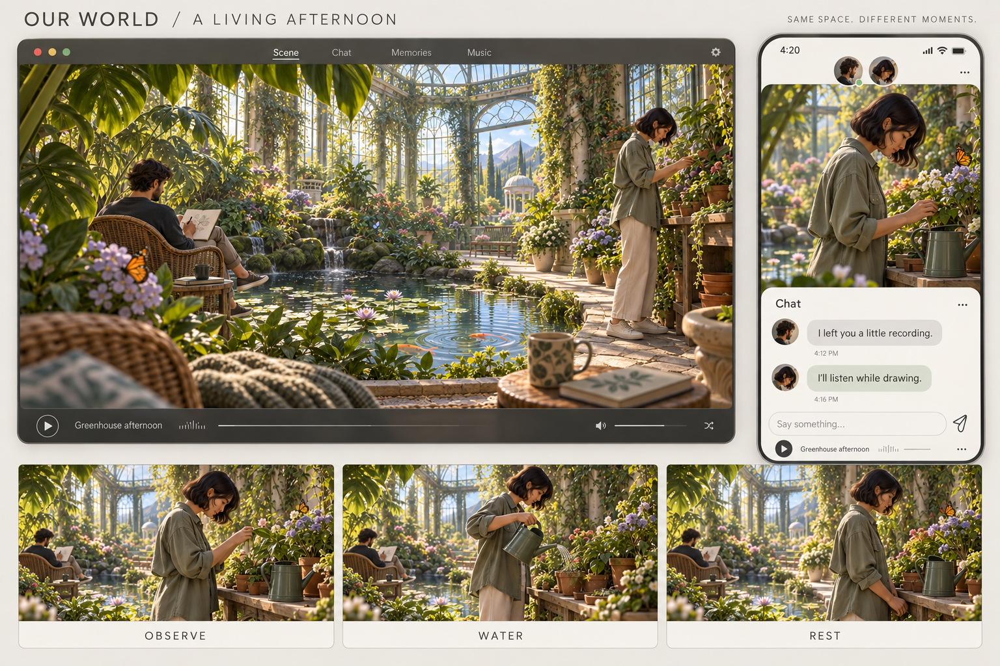

# Cozy 场景持续演出 · 候选设计

> 2026-09-22 · 用户体验要求已确认；场景、动作方案、角色画风与渲染媒介待选择。全部图片为静态概念，未验证动画、真实交互或跨端性能。

## 已确认的体验要求

场景应在不操作时持续呈现自然、有层次的生活，让人愿意安静观看、放空。人物、海浪、风、蝴蝶等活物共同构成演出；角色入镜后，仅靠静止立绘与轻微飘动不足以满足期待。镜头强调身处其中的沉浸感，不把高俯视、全房间小物件的操作视角作为本期方向。

平台为手机、电脑客户端、网页；角色代表真实用户。聊天、回忆、音乐仍是主要功能，场景交互需要产生可观赏的变化，不能只有重复打开功能的入口。

## 三种场景候选

| 方向 | 自然主节律 | 人物活动候选 | 轻触后的变化候选 |
| --- | --- | --- | --- |
| 海边屋檐 | 海浪推进、泡沫消退、海风与帘布 | 一人阅读，一人沿短路径散步、停看、返回 | 沙上留下笔画，后续浪潮冲淡 |
| 温室午后 | 水面、叶片、蝴蝶飞行与停落 | 一人写生，一人观察、浇水、放下工具 | 点水产生涟漪，鱼先散开再靠近 |
| 雨夜列车 | 窗外缓行景色、雨滴、偶尔经过的光 | 听歌、记录、阅读、打盹 | 轻触雾窗留下痕迹，逐渐消散 |

## 行为设计候选

角色持续有正在做的事，不等于身体必须一直移动。活动允许停顿，环境保持自己的节奏。近景真人化身的手、视线、重心与物件接触需要真实制作；状态机只安排动作，不能生成动作资产。

1. 动作层：坐下、行走、翻页、拿放工具等实际片段，处理进入、持续、退出和物件连续性。
2. 活动层：阅读、写生、照料植物、散步等长活动，约束可用动作、停留地点和合理结束点。
3. 场景层：错开显眼事件，管理可用席位与路径，并让一阵风等环境原因影响相关元素。

例如阅读中可以翻页、调整书本、短暂望海，再继续阅读；合书并放好后才起身。蝴蝶飞向花、停落、停留、再离开，不能只绕固定圆圈。

变化采用条件、停留时间、冷却和不立即重复。小样先限制同一时刻一个显眼的大动作；这只是调试起点，不是已批准的全局参数。用户提出的各自活动是重点候选，人物之间的互动可以稀疏。

## 身份、多人和手机

自主表演表达虚拟场景里的活动，不代表系统知道真人正在现实中做什么，也不替真人发言。主要活动、位置与用户触发事件可以共享，眨眼和细小自然变化不需要承担真实状态语义。

多人通过不同活动位置增加生活层次，保持镜头与人物可读尺度；手机为当前观景区域单独构图，允许切换关注位置。不得只缩小整个横向房间。具体人数与构图尚未定稿。

## 媒介与验收候选

固定机位、局部换座和独立活动可比较分层 2.5D、预渲染资产及受控实时 3D。3D 不必采用俯视镜头；本轮温室图也不构成真实 3D 运行效果或轻量性能证明。

建议下一步用一个场景做可持续观看数分钟的小样，检查：无人点击也成立；人物休息时环境仍然自然；看出循环后仍舒服；显眼动作不抢在一起；打开聊天和手机键盘后仍能阅读与观景。尚未启动这项实现或性能测试。

## 一手参考与来源

- [Spirit City 官方资料](https://mooncubegames.com/home/spirit-city-lofi-sessions-press-kit/)：角色活动、环境声音和光照组成安静陪伴；借鉴活动机制。
- [All Aboard! 官方介绍](https://store.steampowered.com/app/3815280/?l=english)：稳定车内活动与持续移动的窗景；借鉴移动世界中的安稳座位。
- [Placid Plastic Duck Simulator 官方介绍](https://store.steampowered.com/app/1999360/Placid_Plastic_Duck_Simulator/?l=english)：持续基础运动与偶发变化；借鉴观赏节律。

图片由内置 image_gen 生成；完整提示词及参考图记录在 [prompts.json](prompts.json)。角色与构图的一致性需在后续实际动画资产中重新验证。
