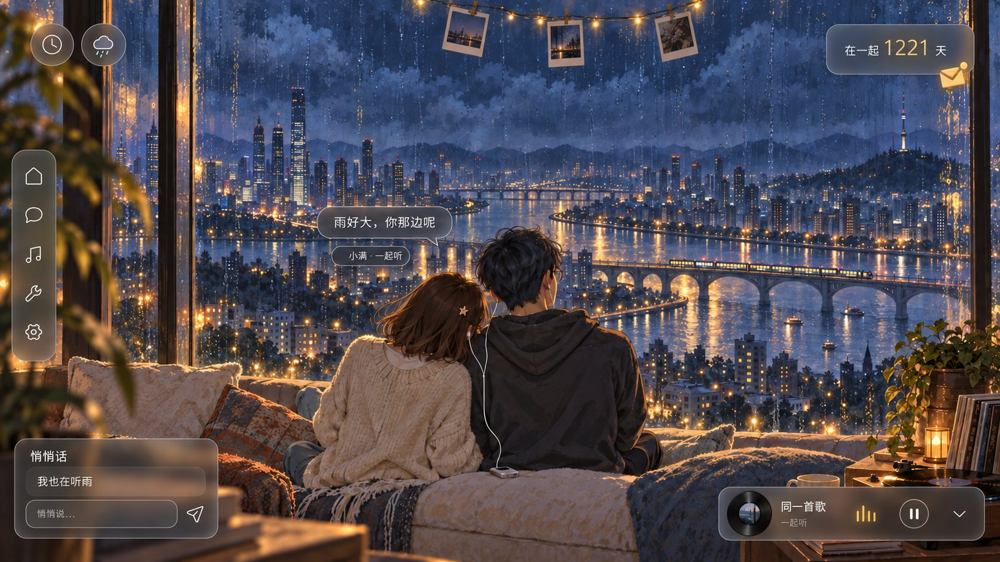
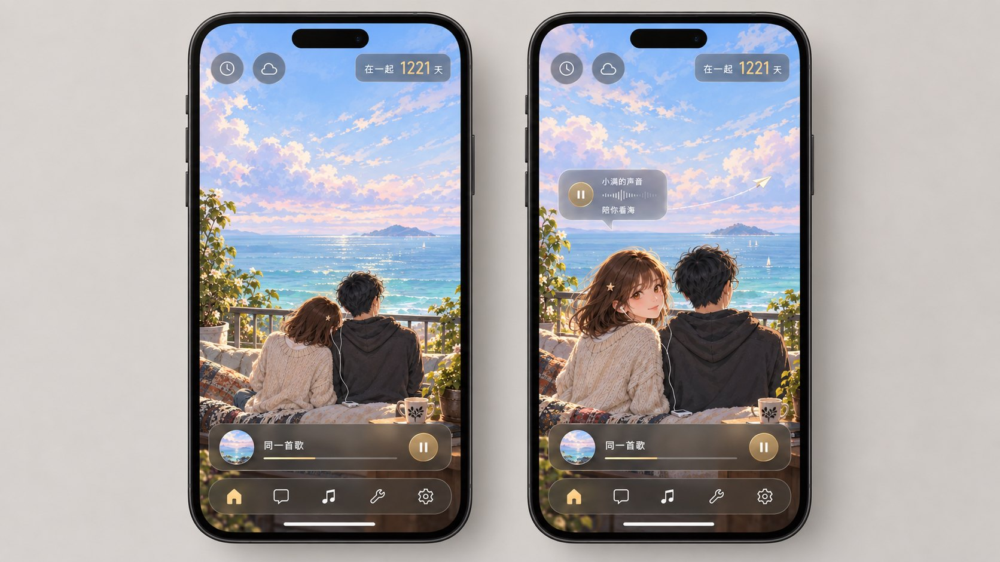
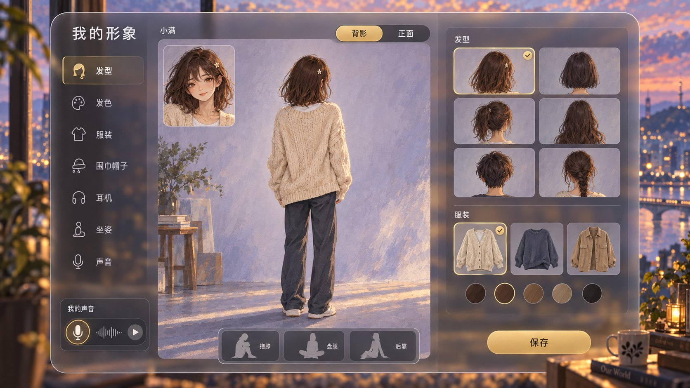
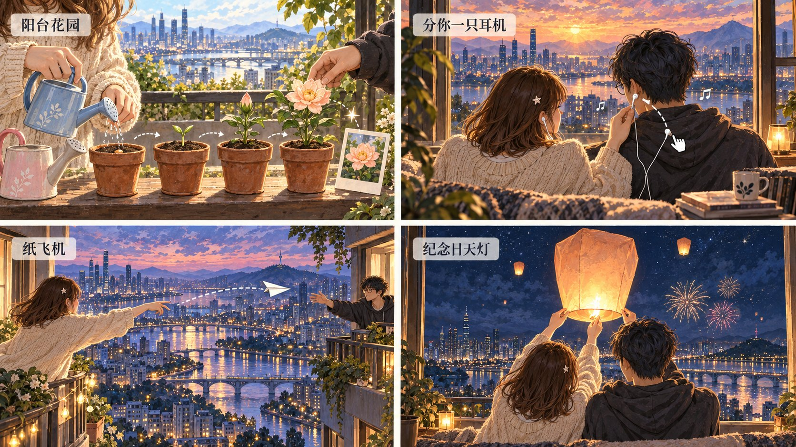
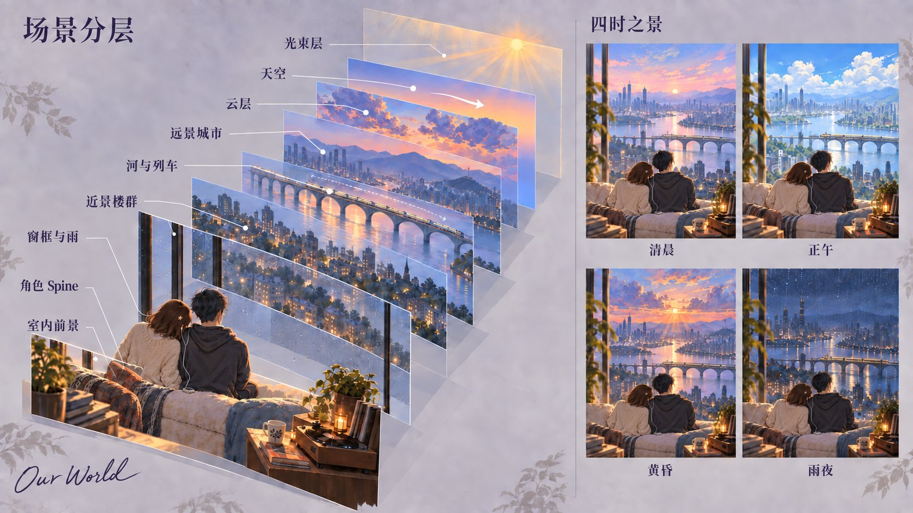

# Concept B「并肩」视觉交付报告

## 1. 模式与归一化 brief

- **模式：design。** 本轮只制作三个平行方向中的 B，不比较或替其他方向下结论。
- **交付：** B1–B7 七张 PNG、精确生成/修正提示词、产物校验清单和本报告。全部是候选概念，未晋升正式设计系统，未接产品代码。
- **命题：** “同一片风景、同一首歌、肩并肩”。默认背影一起看景，点击真人伙伴形象后，通过回头眼神与本人录音产生个人回应。
- **画面要求：** 原创成年人类；小满栗棕肩发、星夹、米白针织开衫，阿屿黑发、圆眼镜、炭灰卫衣；清晰前中后景、空气透视、情绪光、可拆的 2D 层。UI 沿用 Cinnaglass，中文短而清楚，桌面贴边、手机避开安全区。
- **硬规则：** 零维护在场、只有正反馈；交互是种花、分耳机、投递纸飞机与共放天灯等场景行为；无物件热点光圈、描边或 pin；不沿用旧书房和小狗，不模仿现有角色 IP，不使用艺术家/工作室风格名。
- **本轮优先级：** 最新 brief 覆盖旧文档的“双狗书房、物件重复入口”方向；沿用当前材质和产品三铁律。当前项目的共享音乐、多人 Presence、真人语音、换装与 Spine 仍是待实现能力，不因图中出现而算已完成。

## 2. 证据清单与执行方式

### 输入：三张均直接查看像素

| 输入 | 角色 | 直接观察与采用边界 |
| --- | --- | --- |
| `uiux/cinnaglass/environment-verification/scene-twilight.png`，1440×900 | 桌面 UI 参考 | 左侧五图标窄 rail、左上环境入口、左下聊天、右下音乐，中性磨砂外壳和暖金操作。只继承 UI 语言；旧书房不进入新图。 |
| `uiux/cinnaglass/mobile-verification/room-safe-area.png`，390×844 | 手机布局参考 | 顶部双入口与纪念卡、底部音乐条和五入口导航。继承停靠关系，不复制大幅裁切旧书房的构图。 |
| `concept/baselines/companionship-room/06-presence-comparison.png`，1536×1024 | 被替代的人物基线 | 两幅中的长耳小狗、空位和在场差异可见；这是上下文，不是新角色风格参考。 |

以上相对路径均从 `ai/design_system/` 起算。**三张原图未改，也没有传入 image_gen。**

已核对当前 `ai/PROJECT.md`（含开工红线）、`ai/TODO.md`、`ai/JASKILL.md`、`design-system.md`、`uiux/uiux.md`、`uiux/cinnaglass/ui-system.md` 与 `decisions.md`。当前规范说明聊天窄卡已从截图所示旧透明度降低，不能把参考截图当作现行 CSS 数值证明。

**工具与来源：** 使用 bundled imagegen skill 和内置 `image_gen`；没有 CLI/API-key 生图。B1 无图片输入，所有后续生成及局部修正都引用 B1 的绝对路径；修正时另附该张原稿。生成器默认文件已复制到本批次目录；未用脚本后画、拼图、改字或重采样。

**审核分工：** 主代理逐张检查全部最终图；两个制作子代理分担 B4/B6、B5/B7；另一个只读子代理独立做像素 QA 与工程边界复核。这是本轮内部独立检查，**不是外部 Claude Monet 已签收或用户已批准**。

## 3. 执行结论

**建议把 B1 + B3 作为这个方向的主推证据：B1 证明“愿意一直开着”，B3 证明“对方会回应我”。** B2 展示可容纳现有 UI 的雨夜产品形态；B4 证明五人可共处；B5–B7说明身份、玩法和轻量制作路径。

最成功的是前景遮挡、河流消失方向、发光列车与远城雾色建立了明显空间层次，人物不再对坐表演；米白与炭灰轮廓使“我们”能一眼成组。它适合低打扰、长时间共处。

**尚未证明的是陪伴心理效果和运行性能。** 静图能展示回头直视，不能证明真人伙伴身份、录音真实性、实时同步或长期留存。整体笔触偏细密数字厚涂，水彩颗粒比 brief 的典型水彩更轻；这套图优先达到完成度与一致性。

## 4. 概念矩阵与重要问题

| 图 | 主问题 | 视觉证据 | 取舍 / 判断 |
| --- | --- | --- | --- |
| B1 | 能否超越平面室内背景 | 模糊叶片与书本、窗座、近楼、桥、远城、山与云分层 | 空间表现强；背影无法单独验证正脸吸引力 |
| B2 | 场景与常用 UI 能否共存 | 夜雨窗景，五入口、双圆、聊天、音乐、纪念卡、夹照贴边 | 可用的产品概念；不是组件级还原验收 |
| B3 | 被陪伴，而非旁观两个人 | 左屏并肩、右屏回头直视、本人声音气泡、纸飞机 | 核心成立假设最清楚；动作与声音尚未制作 |
| B4 | 小群体是否还能读懂身份 | 五套轮廓、圆圆回头挥手、额外空位留毯和汽水 | 五人成立；八人和手机群聊尚未验证 |
| B5 | 用户能否定义“这是我” | 大背影、小正脸、发型服装轮廓、坐姿和声音 | 身份入口清楚；换装与坐姿组合成本不能由 UI 推断 |
| B6 | 物件互动有没有社交结果 | 首花照片、共享耳机、跨景纸飞机、共放天灯 | 四个行为均超出重复导航；跨天进度仍需原型说明 |
| B7 | 电影感能否拆为轻量资产 | 九层爆炸图、列车/云方向、四时段缩略 | 有明确制作方向；不是可直接导入的分层素材 |

| 优先级 | 证据 / 问题 | 影响 | 具体处理 |
| --- | --- | --- | --- |
| 高 | B1/B2 默认主要见背影，B3 才有眼神 | 可能仍被理解为“看一对情侣” | 优先验证点肩回头 + 伙伴本人声音，不先堆特效；身份不清时减少自己可见面积，镜头靠向自己的肩后 |
| 中 | B4 采用有坐垫的屋顶长座，读感更接近户外沙发而非裸露台沿 | 扩展至八人后横向空间与遮挡变紧 | 保留座位锚点，八人版另验远近两层或更宽长凳；不把五人图当成八人验收 |
| 中 | B5 站立背影，坐姿只由 chip 展示 | 不能证明长衣、头发与屈膝接触正确 | 用同一套服装先做抱膝、盘腿、后靠三个姿势交叉检查 |
| 中 | B6 耳机分镜同时画拖动耳塞与佩戴结果 | 可能误读为多余耳塞 | 动画只保留一个正在交接的耳塞，按拖出→接收→点头切状态 |
| 中 | B7 各层存在示意性透明交叠，四时段是重画小图 | 无法作为 alpha、遮罩、几何锁定的生产验收 | 定稿后独立生产透明层；固定相机、几何与接触阴影，再验证时段切换 |
| 低 | B1 轮廓暖光主要来自夕阳，实灯贡献较弱 | 独立室内照明的存在感不足 | 原型保留实灯光层，夜晚单独调节人物暖边而不整体染黄 |
| 低 | B2 磨砂主要读为平滑模糊，细纹弱于参考 | 与现有 UI 仍有细节差异 | 实装复用现有固定细纹与真实组件；不从生成图反推 CSS |

## 5. 逐图说明与制作注记

### B1 — 黄昏主视觉

**所见：** 恰好小满、阿屿两名成年人，从背后靠肩看城市；星夹、眼镜侧缘、米白开衫、深灰兜帽、共享耳机线与中间小播放器可辨。近处叶片和书虚焦，窗框形成遮挡；河流串起两岸楼群与桥上列车，远城、山、云逐层降对比；夕阳光束可见。没有 UI。

**回应目标：** 把视线从“两个角色互聊”转成“一起望向同一景”。光、视差和真实距离主要由画面自身结构建立，而非加界面特效。

**弱点：** 没有正脸证据；低处道具与织物较细密。B1 正面不可见，所以 B3/B5 的脸是本批次建立的新正面解释，尚不是锁定的角色三视图。

**制作：** 天空、云、山/远城、河桥、列车、近楼、窗框、窗座接触阴影、双人、植物书杯唱机前景、光束分开。云漂、列车平移、少量窗灯、发梢、呼吸和轻微靠肩；人物采用背面为主的 Spine 风格局部骨骼，回头另备视角附件。单场景含双人压缩美术目标 **5–9 MB**，未实测，不含代码/音频。

### B2 — 雨夜桌面产品屏

**所见：** 与 B1 相同窗座和人物位置，外景转蓝色雨夜，玻璃有水滴与反射；桥上列车亮起。左五入口导航、左上等大双圆、右上“在一起 1221 天”、左下聊天和右下音乐齐全；小满气泡“雨好大，你那边呢”与“一起听”状态可读。窗上三张夹照、右上暖金来信可辨。

**回应目标：** 支持实用聊天与听歌，同时让城市保持画面主体。均衡器和窗灯可建立轻微节奏呼应；夹照维持回忆是空间中的物件这一关系。

**弱点：** 是生成的产品概念屏，不能证明真实文本对比度、44px 点击区或同步状态。玻璃细纹较轻；小头像/播放图标细节不应直接当 UI 资产。

**制作：** 继承 B1 结构，追加雨滴/雨丝小图集、窗反射、夜间灯光蒙版、三张独立照片；UI 用原 DOM 组件。雨夜追加美术预估 **1–2 MB**；人物骨架复用。窗灯只在真实播放时低强度响应，不把整城做成闪烁频谱。气泡、语音、在线及未读状态应由真实事件驱动。

### B3 — 手机晨海与回头回应

**所见：** 最终版是同一横向画布中的两台完整竖屏手机。浅蓝晨空、粉紫薄云与开阔海面替代首稿的橙色湾城；左屏两人更小，坐在底部阳台共享耳机。右屏小满转头、目光看向镜头，旁有“小满的声音”波形和“陪你看海”，纸飞机飞向海面。两屏都有双圆、纪念卡、音乐条、五图标底栏；未遮住脸或系统底部指示条。

**回应目标：** 同时说明低打扰常驻与主动回应；“伙伴的形象 + 伙伴自己的声音”把陪伴从环境气氛落到真实的人。

**弱点：** 右屏为表达面部情绪适当拉近，不能当作同一摄像机一帧切换的动画证据。浅色天空上的小文字仍需真机验证；同屏录音与音乐需规定播放混音行为。首稿保留仅为修正证据，不作为最终方案。

**制作：** 海天、远岛、海面高光、阳台栏杆、植物、座位、两人、飞机分层。背影→三分之四回头→正脸用 3 个视角附件配骨骼过渡，避免把平面头强扭 180°；声音播放期间轻微表情响应，音乐适当降低，结束恢复。手机场景压缩美术目标 **3–5 MB**，语音另按录音时长估算。

### B4 — 五人屋顶陪伴

**所见：** 左起小满、阿屿、圆圆、老K、七七，恰好五名。栗发星夹、黑发兜帽、白耳机高马尾黄毛衣、毛线帽橄榄夹克、银 bob 黑高领可区分。圆圆回头挥手，可见五指；最右额外空座保留折毯和汽水。前景灯串、食物、毯子与城市烟花形成层次。

**回应目标：** 朋友在同一条观看方向上共处，群组焦点通过一位回头者建立；空位是温暖留痕，不提示缺席惩罚。

**弱点：** 更接近有软垫的屋顶长座，不是清楚裸露的台沿；五人横向占比已高，不能保证八人缩放后可读。烟花只适合短时事件，长期循环会喧宾夺主。

**制作：** 复用 B1 城市资产，替换屋顶前景；五个座位锚点与一个空位，背景人物只保留低幅呼吸，圆圆用回头/挥手附件。额外每位角色美术预估 **0.3–0.8 MB**，屋顶/烟花增量 **1–2 MB**。同一个用户的离线位只留物件，不复制“幽灵角色”。

### B5 — 背影优先的形象编辑

**所见：** 中性磨砂连续外壳、稳定灰紫阅读内衬；小满大背影与小正面 inset；“背影 / 正面”、七类目、发型/服装轮廓选项、三个坐姿 chip 和声音卡清楚。暖金只用于选中与主要操作。正面白 tee、细项链与星夹可辨。

**回应目标：** 背影常见，所以先改变轮廓和穿着最能获得“这是我”的识别；声音成为身份的一部分。选择不依赖高成本全脸连续捏塑。

**弱点：** 正面头像精细程度稍高于环境；站立预览没有验证坐姿换装。发色、长发、帽子与耳机组合仍可能穿插。

**制作：** 后发/前发/头部视角/躯干/袖臂/腿/配饰拆附件，使用 skin 组合；三种坐姿需要独立接触与遮挡检查。首批少量换装候选压缩图集目标 **2–4 MB**，按选项懒加载，不包含在首屏强制下载内。UI 只在编辑时占满中部，退出回到场景。

### B6 — 四个有结果的小仪式

**所见：** 2×2 四格：“阳台花园”有蓝/粉把手水壶、种植→嫩芽→花苞→开花和首花照片；“分你一只耳机”有递耳机与动作提示；“纸飞机”跨城市送达对方；“纪念日天灯”两人共放灯、夜空烟花。没有物件热点描边或光圈；白虚线仅用于分镜运动说明。

**回应目标：** 每个操作都有可见动作与共同结果，不是点击道具再打开同一个导航页面。首花形成回忆卡；耳机触发共同聆听；纸飞机携带对方可收取的短句；纪念日天灯留作共同经历。

**弱点：** 四盆植物是跨时间状态示意，并非四盆必须同时养；“跨天”没有在画面中明确计日。递耳机同时画了过程与结果，动画需要消歧。图中双阳台是投递关系的叙事，不应理解为必须另建可漫游的城市。

**制作：** 花盆固定，植物 4 个阶段附件、浇水粒子、花朵到卡片过渡；耳机曲线和头部点头；飞机 3–5 张转向帧沿路径；天灯小图集与有限烟花粒子。角色复用骨架，游戏道具合计追加目标 **1–3 MB**。植物随时间正向生长，浇水可增加小反馈，**不干枯、不掉进度、不要求双方同时上线**。

### B7 — 分层与四时之景

**所见：** 左侧三分之四爆炸图，九项标签为“室内前景 / 角色 Spine / 窗框与雨 / 近景楼群 / 河与列车 / 远景城市 / 云层 / 天空 / 光束层”；列车方向与云漂箭头可见。右侧“清晨 / 正午 / 黄昏 / 雨夜”保持同一窗座、双人、河桥与城市地标。

**回应目标：** 把空间感对应到可控制的平面，气氛变化不依赖重型 3D 场景。人物、天气、交通与 UI 可以分别调度。

**弱点：** 层间透明交叠为示意；四时段不是同一几何的像素锁定渲染；云漂箭头在云带上方空隙，需结合图层理解。它不含真实 alpha 素材、法线、深度图或 Spine 工程文件。

**制作：** 图上的九类可作为目录结构，但实际合成须按遮挡分组；“光束层”不表示永远盖在所有层上。窗外雨和光束受窗 mask 控制，人物、窗框与实灯有独立遮挡。四时段目标总美术约 **12–20 MB**、按需加载；应共享几何，优先灯光蒙版/调色与局部替换，不把四套整幅图全部常驻显存。

## 6. 不确定性与可比性边界

- 原参考分别为旧桌面截图、窄屏裁切与双图角色板；任务、内容、视口和完成方式不同。本轮没有做伪精确的旧/新打分，也不声称已客观达到所有高端动态壁纸的表现。
- 最终七图均为 **1672×941 PNG**，接近 16:9，保留内置工具原生输出；它们不是 4K，也不是动态资产。B3 首稿是 1536×1024，最终已替换为横向 16:9 比例版本。
- 已检查人数、短标签、明显手脸缺陷、遮挡与禁止热点标记；没有发现阻断概念交付的问题。这不等于完整无障碍、真机触控、动画连贯或全套换装验证。
- 人物描述与提示词为原创设定，未引用现有 IP 或艺术家；视觉检查未见明显特定 IP 标志，但不能由单次生成保证所有形象的法律独占性。
- 自拍/个人化脸型没有被这些图验证；B5 主要验证轮廓选择。away/睡眠行为只有文案映射和 B4 空位例子，尚无完整睡眠状态图。
- 所有性能、体积、工期均为制作目标或估算。压缩下载 MB 不等于解码/GPU MiB；一个 2048×1152 RGBA 层约 9 MiB，十张全画幅约 90 MiB，尚未包含额外缓冲或 mipmap。
- 内部工程复核查到当前合成器为 30fps 上限、页面隐藏时暂停；本轮未运行性能基准，不能声称省电或手机帧率达标。

## 7. 推荐与下一步

**最值得先验证：B1 的静置场景 + B3 的一次回头。** 先做一个黄昏、两人、一层云、一列车：六层背景、双背影、小满三个回头关键姿态、3–5 秒伙伴本人录音，再补空坐垫/毯子/暖杯的离线态。无需先投入全套捏人、四季或八人场景。

建议原型动作：点肩→约 0.6–0.9 秒转头→看向镜头并播放本人录音→自然回到并肩；录音须明确是历史录音，不能伪装伙伴正在实时开口。若伙伴不在线，不用录音演出伪造在线。共同听歌的拖动耳塞必须有对方可接受/退出的真实会话结果。

找少量真实伴侣/朋友做探索测试，观察：能否快速指出“我”和“对方”；回头后感到朋友在回应还是 NPC 表演；不操作放置十分钟是否舒服；离线留痕是否没有压力。这是待做的研究，不是本轮已经得到的结论。

工程上优先裁掉透明空白、降低远景分辨率、图集复用和局部滤镜；移动端减少粒子，隐藏暂停，减少动态偏好下保留静态场景和核心反馈。[PixiJS 官方性能建议](https://pixijs.com/8.x/guides/concepts/performance-tips) 支持精简纹理/滤镜的方向；角色附件组合可基于 [Spine 官方 skins 文档](https://en.esotericsoftware.com/spine-runtime-skins)。上述预算是本轮估算，并非这些文档给出的项目保证。

单场景解码纹理目标可先设为手机 ≤80 MiB、桌面 ≤160 MiB，再测真实低端设备；运动 30fps、静置降低帧率均只是候选策略。不要把整幅城市每盏灯独立成重对象，也不要同时做全屏雨、全屏 blur 与每物件实时阴影。

## 8. 产物清单与修正记录

所有文件位于：
`D:\Repo\our-world\.claude\worktrees\dynamic-scene-concept-design-0b6ef0\ai\design_system\codex-visual\scene-concepts\B-side-by-side\20260925-091929Z`

| 最终文件 | 用途 |
| --- | --- |
| [B1-keyart.png](../img/B1-keyart.jpg) | 无 UI 黄昏主视觉 |
| [B2-desktop.png](../img/B2-desktop.jpg) | 雨夜桌面产品屏 |
| [B3-mobile.png](../img/B3-mobile.jpg) | 晨海手机双屏 |
| [B4-group.png](../img/B4-group.jpg) | 五人 + 离线空位 |
| [B5-avatar-creator.png](../img/B5-avatar-creator.jpg) | 背影优先形象编辑 |
| [B6-interactions.png](../img/B6-interactions.jpg) | 四项互动分镜 |
| [B7-scene-layers.png](../img/B7-scene-layers.jpg) | 九层构造 + 四时段 |
| [codex-report.md](B-side-by-side.md) | 本报告 |
| [artifact-manifest.json](../../../../ai/design_system/codex-visual/scene-concepts/B-side-by-side/20260925-091929Z/artifact-manifest.json) | 文件尺寸、字节数、SHA-256、状态及生成来源 |

精确提示词：`B1-prompt.txt` 至 `B7-prompt.txt`；单图修正另存 `B2-repair-prompt.txt`、`B3-repair-prompt.txt`、`B7-correction-prompt.txt`、`B7-leaders-prompt.txt`、`B7-motion-prompt.txt`。

过程图保留作证据，**均不属于最终推荐**：
- `B2-first-pass.png`：天气圆钮被扩成带温度的胶囊，已针对性修回等大双圆，并移除无必要绿点。
- `B3-first-pass.png`：人物偏大、背景是偏橙湾城，已调整为浅色晨海、缩小左屏人物和横向展示版式。
- `B7-first-pass.png`、`B7-label-pass.png`、`B7-leaders-pass.png`：依次处理缺失天空标签、引线落点和运动箭头；最终只采用 B7-scene-layers.png。没有对通过的图做批量重抽。

执行记录：读取/搜索用于核对规范与命名；view_image 用于逐图像素检查；内置生图完成全部画面与修正；Copy-Item 仅将生成原件复制至本目录；文件头、字节数和 SHA-256 校验用于确认七张可读取、命名正确且来源可追踪。工作区保底脚本仅尝试 dry-run，未据此改协议；本轮没有改应用代码、AGENTS.md、CLAUDE.md 或正式规范，也没有发布/提交。

**最大风险与最便宜的验证：** 这仍可能被看成“我在观看两个人”。先用同一背景、两张背影和三张回头关键姿态，配伙伴本人短录音，验证一次回头是否让用户感到“是你在陪我”；若不成立，先改镜头与身份呈现，城市特效不能补救。

