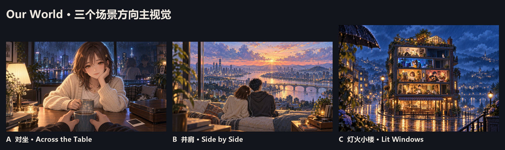
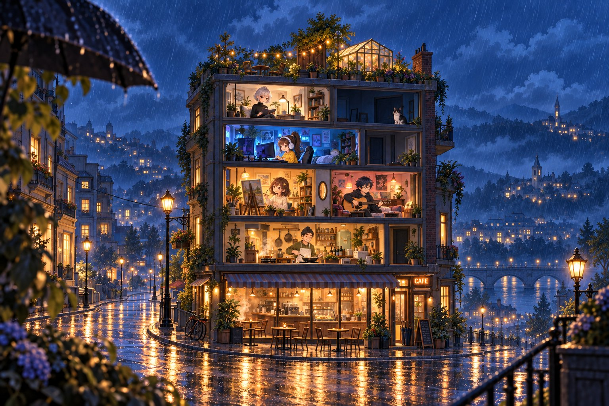
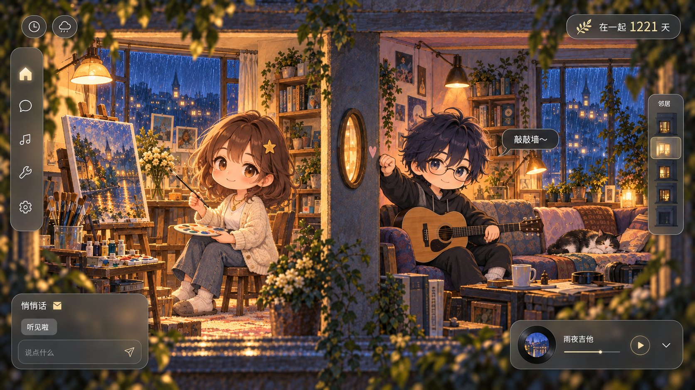
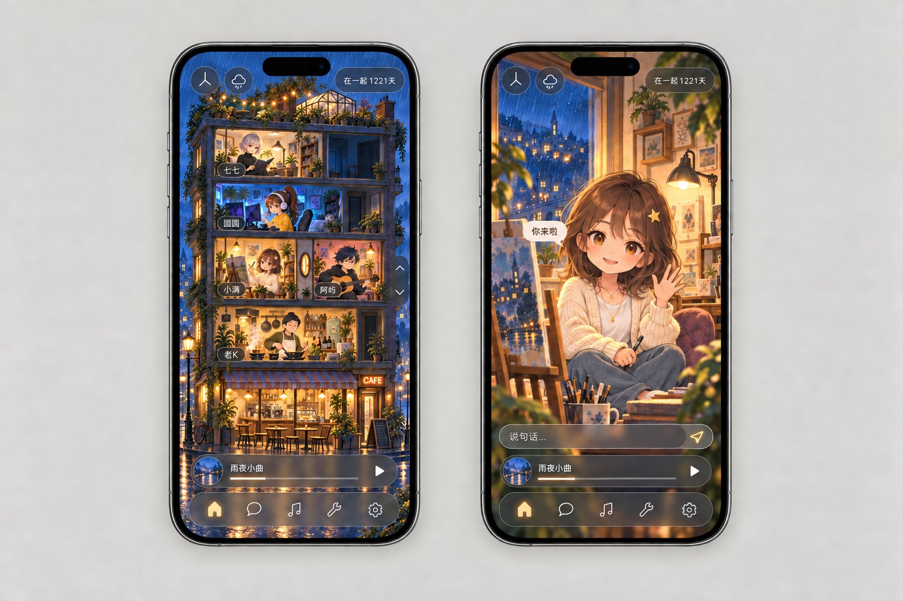
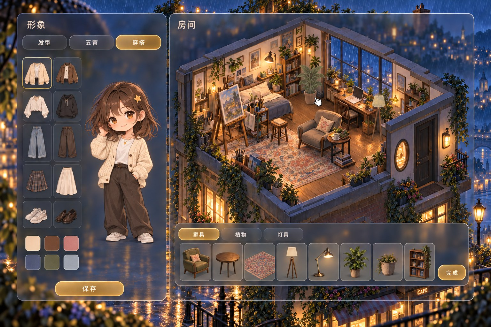
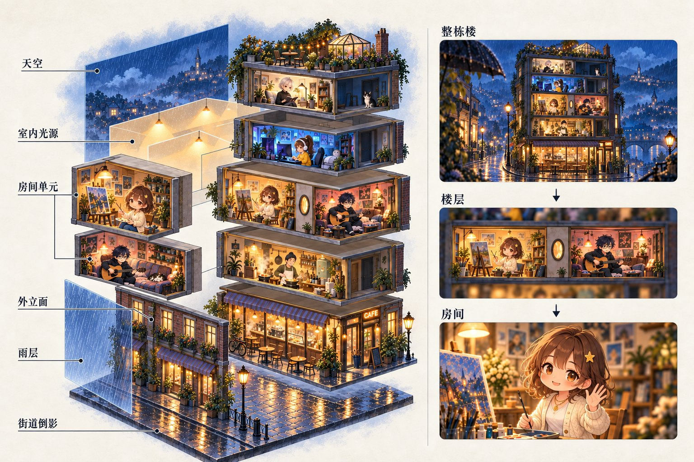

# 场景方向提案 · 对坐 / 并肩 / 灯火小楼

> **档案（2026-09-27 移档）**：用户选定 A「对坐」并定为开发方向，A 的全部概念已写进 [设计系统](../../../ai/design_system/design-system.md) 与 [对坐深化稿](../../../ai/design_system/concept/across-the-table/across-the-table.md)。本页保留三个方向的比较和落选的 B、C 图，只作依据；下文里的「状态」「推荐」是 09-25 当时的文字。

> 2026-09-25 · Monet 主设计，图片由 Codex（`codex-visual`）按 Monet 的 brief 生成，Monet 逐张复核。**状态：用户当天选定 A「对坐」为产品方向**（原话要点：符合产品定位、更突出和对方的交互、可以把角色想象成对方、适合手机电脑互通）。这是方向认可，房间、角色、交互细节仍在深化，深化稿见 [A · 对坐世界](../../../ai/design_system/concept/across-the-table/across-the-table.md)；细节定稿后只把定下来的部分晋升到 [设计系统](../../../ai/design_system/design-system.md) 与角色/场景/物件/效果文档，书房与大耳狗转入 [concept 档案](../../../ai/design_system/concept/README.md) 作被替代方向。B、C 保留为比较依据。
> 每个方向 7 张：主视觉、桌面/网页产品页、手机双屏、多人、形象创建、场景玩法、动态分层与光。三个方向用同一对人物（小满 / 阿屿）和同一套已批准 UI 语言，方便横向比较。`img/` 是压缩后的审阅副本；原图、提示词、被替换的初稿与 Codex 报告（含逐图制作注记和资源预算）在各方向的批次目录：[A](../../../ai/design_system/concept/across-the-table/notes/first-batch.md) · [B](notes/B-side-by-side.md) · [C](notes/C-lit-windows.md)。三批共约 38 次生图，其中约 17 次是针对单张缺陷的修正（胶囊形天气钮、越界气泡、Q 版比例等），没有整批重抽。

## 一句话结论

**角色数量不是问题，镜头站在哪里才是。** 现在的书房是「旁观两个角色各做各的」，所以两个角色显得多余。三个方向是三种镜头关系：

| 方向           | 镜头 = 谁                      | 你在画面里看到             | 陪伴从哪来             |
| -------------- | ------------------------------ | -------------------------- | ---------------------- |
| **A 对坐**     | 镜头就是你，坐在桌子这头       | 对方一个人，正对着你       | 被看着、被回应（眼神） |
| **B 并肩**     | 镜头在你们身后                 | 你和对方的背影，同一片风景 | 在一起、听同一首歌     |
| **C 灯火小楼** | 镜头在街对面，可推进任何一扇窗 | 一栋楼里所有你在乎的人     | 大家都在、随时能串门   |

Monet 推荐 **A 作为产品主画面**，把 B 的「活窗景」放进 A 的窗外，把 C 的「亮着的窗」留作多人、多房间的总览入口。理由和代价见文末。

## 现在为什么不够

- **没有景深**：中远景略俯视、全画面等焦，前中后景的细节和对比一样强，看起来是一张平面插画，不是一个空间。
- **光是画死的**：光色烘焙在原画里，运行时只有整屏色罩和窗边光晕；没有会动的光源，也没有照在角色身上的轮廓光。
- **动态只有一个频率**：呼吸、眨眼、转盘、窗内雨都是微动。好的动态壁纸同时有慢（云、日光）、中（窗帘、蒸汽）、快（雨、粒子）和事件（列车经过、猫走过）四档。
- **用户是旁观者**：两个角色背对彼此各做各的，没人看你；用户看到的是「他们」，不是「我们」。

## A · 对坐 Across the Table

**「不是 AI 陪伴，是你的那个人坐在你对面。」** 镜头就是你，画面里只有对方一个人，正对着你。她屏幕上坐着的是你，你屏幕上坐着的是她，是同一张桌子的两头。

| 桌面 / 网页                                                                                 | 手机                                                                                  |
| ------------------------------------------------------------------------------------------- | ------------------------------------------------------------------------------------- |
|         |  |
| **多人**                                                                                    | **形象创建**                                                                          |
|   |    |
| **场景玩法**                                                                                | **动态分层与光**                                                                      |
|                   |                          |

| 你的问题     | A 的回答                                                                                                                         |
| ------------ | -------------------------------------------------------------------------------------------------------------------------------- |
| 空间与光     | 浅景深三层：你的手和杯子（清晰）→ 对方（在焦）→ 窗外城市（虚化）；台灯暖主光 + 窗外冷轮廓光随时辰天气变；雨窗、蒸汽、音乐呼吸灯 |
| 一个还是两个 | 画面里只有一个角色，正对你                                                                                                       |
| 互相陪伴     | 这个角色就是对方本人。对方在做什么，角色就做什么：打字→看手机，听歌→戴耳机，离开→空椅 + 外套 + 冒热气的杯子，睡了→趴桌；你自己出现在前景的手里和夜窗倒影里 |
| 多人         | 桌子变大：3–5 人围坐圆桌或被炉，你坐镜头位；离线的人座位留痕。超过 5 人第一人称坐不下，要换总览（见推荐）                         |
| 画风         | 二次元 CG 厚涂（半写实），最强的「有人坐在我面前」满足感；半身构图，桌子挡住下半身，rig 只做半身                                  |
| 自定义形象   | 半身模板 + 部件换装（脸型、眼、眉、前/侧/后发带物理、渐变发色、肤色、上衣、配饰）+ 声音名片                                        |
| 场景玩法     | 戳一下→反应 + 对方录的话；手冲咖啡，杯子滑到对方桌上；雾窗涂鸦留在对方窗上；放下唱针一起听；拍立得进照片墙                        |

**代价**：脸就是产品，角色品质门槛三者最高，自定义组合要保证「怎么捏都好看」成本高；第一人称桌子最多坐 5 人；二次元画风可能被看成恋爱游戏；Live2D 在 PixiJS v8 只有社区运行时。

**审图意见**：A1 的眼神和三层景深最打动人，是三个方向里「被陪伴」最强的一张；但窗里的倒影画得太实，可能被读成「窗外另有一对人」，生产时要改成低对比、单独绘制的反射。A2 闭眼听歌作为一帧成立，常驻时要以抬眼为主，否则失去回应感。人脸目前偏通用二次元，正式制作前需要一轮我们自己的角色设计（标志性五官、发型轮廓）。本批只画了阿屿端看到的小满；原型必须补上小满端看到的阿屿，才能验证「互为对面」。Codex 估算首屏下载：桌面 8–12 MiB，手机 4–7 MiB（未实测）。

## B · 并肩 Side by Side

**「同一片风景，同一首歌，肩并肩。」** 镜头在你们身后。你和对方都在画面里，一起看窗外活着的城市；想看脸时点她，她回头看你。

| 桌面 / 网页                                                                               | 手机                                                                       |
| ----------------------------------------------------------------------------------------- | -------------------------------------------------------------------------- |
|   |  |
| **多人**                                                                                  | **形象创建**                                                               |
|       |  |
| **场景玩法**                                                                              | **动态分层与光**                                                           |
|               |             |

| 你的问题     | B 的回答                                                                                                                  |
| ------------ | ------------------------------------------------------------------------------------------------------------------------- |
| 空间与光     | 窗外 8–10 层视差（天空、云、远城、河与列车、近楼、窗框与雨、室内前景），最接近动态壁纸；落日体积光、黄昏城市灯逐个亮起、雨夜倒影 |
| 一个还是两个 | 画面里是「我们」：你和对方的背影，一起看同一片风景，不是两个角色在对话                                                     |
| 互相陪伴     | 两人都在线→肩靠得近；一起听→一人一只耳机；离开→空坐垫 + 毯子 + 杯子；点她→她回头看你笑，播她录的话                         |
| 多人         | 长椅变长：屋顶、河堤、山坡，2–8 人排排坐，线性扩展最自然                                                                   |
| 画风         | 手绘厚涂（水粉水彩笔触、电影感光）；角色小、背影多，轮廓决定身份，容错高                                                   |
| 自定义形象   | 纸娃娃：发型、发色、衣服、围巾帽子、耳机 + 坐姿 + 声音；背影/正面切换预览                                                  |
| 场景玩法     | 阳台花园（真实时间生长、两人各一个水壶、第一朵花变拍立得）；分一只耳机；纸飞机送信；纪念日天灯和烟花                        |

**代价**：没有正脸的「被看着」，陪伴满足感靠「回头」这一刻，弱于 A；远景制作量大，每个新场景都是一整张多层大图；角色小，动作表现有限；lofi 氛围类竞品多。本批城市轮廓接近首尔（山顶塔），正式做要换成原创城市。

**审图意见**：B1 是三个方向里最像顶级动态壁纸的一张，列车、河、云、落日各自是一层，天然适合做视差和时辰。B3 右屏的回头是这个方向成立的关键：没有这一下，用户仍然是在看一对情侣。B6 的纸飞机画成了飞到另一栋楼的阳台，正好表达异地；阳台花园的四个盆是时间示意，不是要同时养四盆。Codex 估算单场景含双人 5–9 MB（未实测）。

## C · 灯火小楼 Lit Windows

**「你在乎的人，都住在隔壁那扇亮着的窗。」** 一栋剖面小楼，每人一间房，亮灯就是在线；镜头能从整栋楼推进任何一个房间。情侣住隔壁，共一面墙。

| 桌面 / 网页                                                                               | 手机                                                                        |
| ----------------------------------------------------------------------------------------- | --------------------------------------------------------------------------- |
|  |  |
| **多人**                                                                                  | **形象与房间**                                                              |
|                       |  |
| **场景玩法**                                                                              | **动态分层与光**                                                            |
|                 |     |

| 你的问题     | C 的回答                                                                                                   |
| ------------ | ---------------------------------------------------------------------------------------------------------- |
| 空间与光     | 楼的剖面本身就是纵深；每个房间有自己的光源，随主人在线亮灭，「亮着的窗」本身就是动态演出；外面雨夜和湿街倒影 |
| 一个还是两个 | 总览是一栋楼的人；推进某个房间才是一对一，房间主人会抬头挥手                                                 |
| 互相陪伴     | 情侣是隔壁：敲墙、塞纸条、送咖啡到门口；朋友是邻居                                                           |
| 多人         | 最强：楼可以加层，屋顶花园和一楼咖啡馆是聚会空间                                                             |
| 画风         | Q 版手绘（约 3.5 头身、彩铅加水粉），最好量产、最好自定义，但「美少女坐在你面前」的满足感最低               |
| 自定义形象   | 形象 + 房间装修（家具目录拖放），最适合做装扮和家具的商业化                                                   |
| 场景玩法     | 屋顶花园（帮别人浇花）、拉花咖啡送到别人门口、敲墙、信箱（信、拍立得、语音磁带）、楼里的猫                   |

**代价**：和 Bondee、Pocket Love 同类，差异化只剩光影和真实回忆；一对一亲密感最弱；内容生产量最大（房间 × 家具 × 角色动作）；Q 版比例在修正后仍不完全统一，C4/C6 偏幼，比例规范需要先定死。

**审图意见**：C1 的「亮着的窗 = 在线、暗窗里只有猫 = 离线」不用任何 UI 就把多人在场讲清楚了，这是三个方向里对「多人怎么展示」最好的回答。但 Q 版牺牲了成熟感：同一批里 C4 的正常比例初稿（`C-lit-windows/20260925-091935Z/C4-group-v1-proportions.png`）反而更有吸引力，说明这个结构也能用正常比例来画。C2 右侧楼层导航高亮的是第二层，和主视觉里情侣所在的第三层对不上，生产时要从房间数据生成。Codex 估算整楼首屏 3–5 MB，进入房间再加载 1–6 MB（未实测）。

## 横向对比

●越多越好；「生产成本」一行 ● 越多表示越省。

| 维度                     | A 对坐                    | B 并肩                | C 灯火小楼              |
| ------------------------ | ------------------------- | --------------------- | ----------------------- |
| 被陪伴的满足感（正脸、眼神） | ●●●●●                   | ●●●○○                 | ●●○○○                   |
| 情侣互相陪伴的清晰度     | ●●●●●                     | ●●●●○                 | ●●●○○                   |
| 多人扩展                 | ●●○○○（≤5 人）            | ●●●●○（≤8 人）        | ●●●●●                   |
| 动态壁纸潜力（空间 + 光） | ●●●●○                    | ●●●●●                 | ●●●●○                   |
| 手机竖屏                 | ●●●●●（视频通话构图）     | ●●●●○（高天空）       | ●●●●●（楼是竖的）       |
| 自定义形象成本           | ●●○○○                     | ●●●●○                 | ●●●●●                   |
| 美术生产成本             | ●●●○○                     | ●●○○○                 | ●●○○○                   |
| 与现有 UI 的兼容         | ●●●●●                     | ●●●●●                 | ●●●●○（多一个楼层导航） |
| 差异化                   | ●●●●●（真人陪伴，不是 AI） | ●●●○○（lofi 同类多） | ●●○○○（Bondee 同类）    |
| 首屏下载（Codex 估算，未实测） | 桌面 8–12 MiB / 手机 4–7 MiB | 5–9 MB           | 3–5 MB，房间按需加载    |

## Monet 推荐与下一步

**主推 A · 对坐，吸收 B 的窗景、C 的楼。**

1. **它正面解决你最不满意的两件事**：画面里只有一个人、正对着你、会看你——而这个人是你真实的另一半或朋友。「两个角色在对话」的问题消失了，情侣和朋友的互相陪伴又没丢：每个人屏幕上都是对方。
2. **动态演出不输 B**：A 的窗外就是 B 那片活城市（雨、列车、车流、黄昏灯），再加上照在她脸上的光，这比远景更打动人。
3. **多人用 C 做总览**：一对一和小桌（≤5 人）用对坐；更多朋友、多个群组时，用「亮着的窗」做大厅，点哪扇窗就坐到那张桌子前。大厅可以直接替换现在的房间选择页。
4. **三端都顺**：手机竖屏就是视频通话构图；桌面置顶小窗就是她的脸，R2/R3 的小窗和桌宠形态也最自然。
5. **定位最清楚**：AI 陪伴很多，真人陪伴没人做好。A 的铁律：角色的每一个主动行为都来自真人（在线状态、录好的话、发来的消息），人不在就不装在；只翻译应用内已知的状态，不因为几分钟没操作就把对方画成睡着。

需要你拍板的三件事：

1. **方向**：A / B / C，或推荐的 A + B 窗景 + C 总览。
2. **画风**：结构和画风可以拆开选。A 的构图可以用二次元 CG（本批 A），也可以用 B 的手绘厚涂来画。
3. **第一个垂直切片**：建议一个场景（雨夜窗边桌）+ 两个互为对面的半身角色 + 3 个状态（抬眼、听歌、趴睡）+ 2 个真实事件链（戳一下 → 对面笑并播放本人录音；递一杯咖啡 → 出现在对方桌上）+ 视差 / 光层 / 雨窗。两个浏览器双账号同时开着，看真实用户能不能把回应归因于彼此，同时在网页和手机上实测帧率与包体，再决定是否投入完整 rig、换装和多人。

选定后 Monet 更新设计系统（角色、场景、物件、效果），UI Tailor 只需补新组件（头顶气泡、语音条、在场标签、楼层导航），整体沿用现有 Cinnaglass。

## 三个方向共用的底层

### 让 2D 有空间和光（动态壁纸级，但保持轻量）

| 效果         | 做法（PixiJS / WebGL）                                                     | 成本 | 手机降级               |
| ------------ | -------------------------------------------------------------------------- | ---- | ---------------------- |
| 浅景深分层   | 前景道具清晰、角色在焦、背景虚化，5–8 层透明图                             | 低   | 同                     |
| 视差         | 桌面跟鼠标、手机跟陀螺仪，按深度每层偏移 2–12px，带延迟回弹                | 低   | 陀螺仪需授权，可关     |
| 深度图位移   | 单张原画 + 深度图做位移滤镜（Wallpaper Engine depth parallax 同一原理）    | 低中 | 降分辨率               |
| 会动的光源   | 加色光层 + 遮罩：台灯呼吸、日光角度随时辰、车灯扫过天花板、霓虹闪          | 低   | 同                     |
| 角色受光     | 角色按时辰吃主光和冷色轮廓光（法线图或受光遮罩），不是每档重画角色         | 中   | 只保留轮廓光           |
| 体积光与尘埃 | 渐变网格 + 滚动噪声，尘埃粒子只在光束里可见                               | 低   | 减粒子数               |
| 雨窗         | 着色器：水滴折射虚化背景 + 水痕下滑                                        | 中   | 退回精灵雨             |
| 窗外活景     | 精灵动画：列车定时经过、车流光带、飞机航灯、黄昏窗灯逐个亮                 | 低   | 同                     |
| 音乐联动     | WebAudio 频谱驱动：灯光呼吸、城市灯随节拍闪、粒子律动                     | 低   | 同                     |
| 调色与泛光   | 每个时辰一张 LUT；泛光在半分辨率做                                         | 中   | 关泛光                 |
| 帧率策略     | 活动 30fps、静止 15fps、页面隐藏 0；DPR 上限 1.5                           | —    | 同                     |

角色 rig 二选一：**Live2D Cubism** 正脸转头、眼神跟随最强，适合 A，但 PixiJS v8 只有社区运行时（如 [untitled-pixi-live2d-engine](https://github.com/Untitled-Story/untitled-pixi-live2d-engine)），授权条款要核对；**Spine** 有 [官方 PixiJS v8 运行时](https://en.esotericsoftware.com/blog/spine-pixi-v8-runtime-released)，换装 skin 成熟，适合 B / C，做 A 的正脸也可以但转头幅度更小。两者都是 2D 骨骼网格，不引入 3D 引擎。

### 场景玩法原则：是仪式，不是入口

聊天、音乐、回忆的功能入口留在 UI；场景里的东西是玩具和仪式，要满足这六条：

1. **有手感**：直接操作（倒、拖、画、浇）+ 动画 + 声音。
2. **有回响**：结果出现在对方那一侧——杯子到了她桌上、涂鸦留在她窗上、你录的话在她戳你时响起。
3. **不等人**：对方不在线也能做，对方回来再发现（呼应「零成本在场」）。
4. **会变成回忆**：第一朵花、纪念日天灯、一起拍的拍立得，自动落进时间线或照片墙。
5. **只加不减**：植物不会死、没有连续打卡、没有排行（呼应「只做正反馈」）。
6. **不抢 UI 的活**：放下唱针可以直接开播，但完整播放器仍在 UI；场景负责感受，UI 负责功能。

### 形象自定义（三个方向通用）

- **一套模板骨架 + 部件换装**：脸型、眼、眉、前/侧/后发（带物理）、发色（含渐变）、肤色、上衣、配饰；Spine 用 skin 组合，Live2D 用同参数的部件模板。
- **先预设后自由**：首版 10–12 套精修预设 + 换色，保证每个人都好看；部件自由组合放第二步。
- **声音名片**：每人录 3–5 句（打招呼、被戳、晚安），对方点你的形象时播放。这是「只有一个角色」也能承载真人的关键。
- 可选：上传照片只用来推荐部件，不用 AI 生成新画，保证画风统一。

## 调研来源

- [Wallpaper Engine · Depth Parallax](https://docs.wallpaperengine.io/en/scene/parallax/depthparallax.html) / [视差](https://docs.wallpaperengine.io/en/scene/parallax/introduction.html) / [效果总览](https://docs.wallpaperengine.io/en/scene/effects/overview.html)：单图 + 深度图做空间感，光束、粒子透视。
- [Blue Archive Memorial Lobby](https://bluearchive.wiki/wiki/Memorial_Lobby)：正脸 Live2D 大厅，摸头、眼神跟随光标、点击播语音三件套。
- [Love and Deepspace 制作人访谈](https://automaton-media.com/en/column/love-and-deepspace-is-designed-to-make-players-love-themselves-and-the-male-lead-more-producer-explains-the-romance-sims-unorthodox-design-choices-and-r/)：第一人称、眼神接触和「一起度过日常」的陪伴模式。
- [Pocket Love](https://hyperbeard.com/game/pocketlove/) / [Bondee](https://en.wikipedia.org/wiki/Bondee)：情侣装修小家；公寓剖面式好友房间、串门留言。
- [Sky: Children of the Light 社交设计](https://www.gamedeveloper.com/design/using-emotion-to-drive-social-play-in-i-sky-children-of-the-light-i-)：点蜡烛、长椅并排坐下才开始聊天。
- [Spirit City: Lofi Sessions](https://store.steampowered.com/app/2113850/Spirit_City_Lofi_Sessions/)：可定制人物与房间；社区长期要求双人模式。
- [Viridi](https://store.steampowered.com/app/375950/Viridi/)：真实时间生长的多肉盆栽；[Coffee Talk 拉花](https://www.gamedeveloper.com/design/deep-dive-making-a-cozy-therapeutic-experience-in-i-coffee-talk-i-)：不会失败的冲煮与拉花。
- [Focus Friend](https://techcrunch.com/2025/11/18/hank-greens-focus-friend-is-google-plays-app-of-the-year)：一个小角色在你专注时陪着做事，完成后装修它的房间。
- [Spine Mix-and-Match](https://esotericsoftware.com/spine-examples-mix-and-match) / [pixi-live2d-display](https://github.com/guansss/pixi-live2d-display)：2D 换装与网页端 Live2D。
