# UI 动效与手机托盘 · 比稿与本轮实装

> **档案（2026-10-02 移档）**：这一轮已经定案，定下的方向都已实装，现行规范与实装录屏在 [UX 参考](../../../../ai/design_system/uiux/cinnaglass/ux/ux.md)。本页保持移档时的原样，图里是当时的界面（旧导航、工具扳手、旧玻璃），只作依据。

状态：2026-09-29 出稿，**2026-09-30 用户看样并拍板**（见文末「用户的决定」）。用户要求一轮全项目 UI 迭代，重点做交互动效、手机托盘、音乐主页面和进入世界的加载；搜索播放、房间切换的异步加载这一期只出设计，不做。**[看样页](review/index.html)**（本页的完整展示版：方案图、状态标签、实装录屏、动效试验区、决定清单与调研；用开发服务打开）· [画板](board.html) · [手机上看的发布版](https://claude.ai/artifact/UrhFYNuXyJzR5DSLAR546G)（私有，需登录）· 定稿的交互已晋升到 [UX 参考](../../uiux/cinnaglass/ux/ux.md)，录屏也放在那里。第二轮的日记与照片墙在 [memories](../memories/memories.md)。

画板用开发环境里拍下的书房截图做背景（隐藏界面），材质数值抄自线上 Cinnaglass（[ui-system.css](../../../../src/themes/cinnaglass/ui/ui-system.css)），所以玻璃和线上一致。图上的金色虚线标签是设计注记，不是界面。这台云端容器里没有 Codex CLI，`codex-visual` 用不了，所以方案图是用 HTML 按真实素材搭出来、再由浏览器截图，不是生成图。之后需要正式美术时先用占位，等用户在机器上装好 Codex 再生成（2026-09-30 用户定）。

## 调研：动画库与 Emil 的技能

| 候选                                                                            | 是什么                                                                                                                                                                                                                                                                                                         | 对本项目                                                                                                                                                                                                                                                                                                                                                                                   |
| ------------------------------------------------------------------------------- | -------------------------------------------------------------------------------------------------------------------------------------------------------------------------------------------------------------------------------------------------------------------------------------------------------------- | ------------------------------------------------------------------------------------------------------------------------------------------------------------------------------------------------------------------------------------------------------------------------------------------------------------------------------------------------------------------------------------------ |
| [emilkowalski/skills](https://github.com/emilkowalski/skills)（MIT，13 个技能） | Emil Kowalski（Sonner、Vaul 作者）把动效判断写成的技能：`emil-design-eng`、`animate`（带 RECIPES）、`review-animations`、`improve-animations`、`find-animation-opportunities`、`animation-vocabulary`、`apple-design`、`mobile-native`、`pick-ui-library` 等；安装 `npx skills@latest add emilkowalski/skills` | 适合当动效的**评审标准**：什么该动、曲线、时长、按压 0.95–0.98、不从 `scale(0)` 出现、弹层从触发点长出、退场快于进场、甩动收起阈值 0.11 px/ms、「减少动态效果 = 留淡入、去位移」。它整体偏克制，本项目按其中「俏皮的产品可以更有弹性」放宽了回弹。示例代码还是旧包名 `framer-motion`。**2026-09-30 用户决定装**：10 个适用的原文装进 `ai/jaSkills/`，登记在 [JASKILL](../../../JASKILL.md) |
| [Motion](https://motion.dev)（`motion@13.4`，`motion/react`）                   | React 动画库：弹簧、退场（AnimatePresence）、布局动画、拖拽                                                                                                                                                                                                                                                    | 能用，支持 React 19；但体积 29–43 KB（gzip，拖拽要 domMax），`x`/`y` 简写跑在主线程，会和常驻的 Pixi 场景抢帧；它的 `reducedMotion` 只管位移类属性。**本轮不引入**                                                                                                                                                                                                                         |
| [Vaul](https://github.com/emilkowalski/vaul)                                    | Emil 的底部抽屉                                                                                                                                                                                                                                                                                                | 仓库已标注不再维护，不采用                                                                                                                                                                                                                                                                                                                                                                 |
| [Base UI Drawer](https://base-ui.com/react/components/drawer)（1.8，MIT）       | 无样式抽屉：吸附点、滑动收起、非模态                                                                                                                                                                                                                                                                           | 以后想把自写托盘换成成熟组件时的首选                                                                                                                                                                                                                                                                                                                                                       |
| GSAP 3.15 / anime.js v4 / Lottie、Rive                                          | 时间线动画库 / 轻量动画库 / 设计师动画运行时                                                                                                                                                                                                                                                                   | GSAP 商用免费但不是开源许可；Lottie、Rive 的运行时对一个加载动画太重                                                                                                                                                                                                                                                                                                                       |

**结论**：CSS 优先，再自写一个小托盘（拖动、两档吸附、甩动收起），不新增依赖。浏览器原生能力够用：`@starting-style` 做进场、`transition-behavior: allow-discrete` 做弹窗退场、`linear()` 做弹簧曲线、Web Animations API 做粒子。本轮新增 JS 约 9 KB、CSS 约 6 KB（gzip，与改动前生产构建对比）。

## 动效语言（本轮实装）

| 名称            | 数值                                                                                | 用在哪                         |
| --------------- | ----------------------------------------------------------------------------------- | ------------------------------ |
| `--ease-out`    | `cubic-bezier(0.23, 1, 0.32, 1)`                                                    | 进场、退场、按下               |
| `--ease-in-out` | `cubic-bezier(0.77, 0, 0.175, 1)`                                                   | 屏上移动、失败轻晃             |
| `--ease-drawer` | `cubic-bezier(0.32, 0.72, 0, 1)`                                                    | 托盘升降                       |
| `--ease-pop`    | `linear()` 弹簧，回弹约 10%                                                         | 放开按钮、小红点、气泡、换图标 |
| `--ease-spring` | `linear()` 弹簧，回弹约 3%                                                          | 弹窗、面板、列表逐项、标签滑块 |
| 时长            | 按下 90 · 放开回弹 460 · 悬停 160 · 进场 260 · 退场 150 · 面板 420 · 托盘 460（ms） |                                |
| 幅度            | 按压 0.95（大块 0.97）· 悬停上浮 1px · 进场位移 10px、缩放 0.96                     |                                |

**低动效模式**：设置 → 主题外观 → 动效，三档「跟随系统 / 完整动效 / 低动效」。低动效把上面的位移、缩放、回弹归零、时长缩短，只留淡入淡出；循环（唱片、音柱、热气、光扫）和粒子关掉；房间的视差、微动和蒸汽也一起停（下次进房间生效）。旧棕皮书只跟随系统设置；新的回忆面板跟随这里的三档。实现：[motion.css](../../../../src/themes/cinnaglass/ui/motion.css)、[motion-preference.ts](../../../../src/themes/cinnaglass/ui/motion-preference.ts)。

## A · 手机功能托盘

你的想法：手机上音乐不要悬浮条，点开直接从下往上弹出，盖住场景里我这边（手和杯子），对方人物完整可见；其他功能同理。

| A1 半桌托盘（推荐，已实现）                    | A2 整页播放器                                  | A3 镜头上抬                        |
| ---------------------------------------------- | ---------------------------------------------- | ---------------------------------- |
| 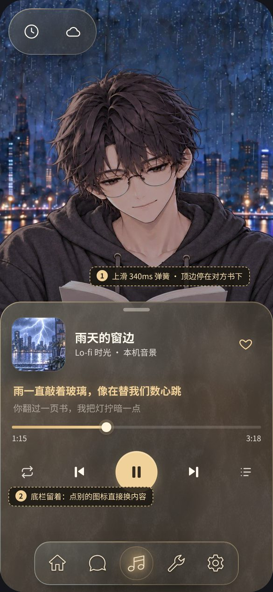                     | 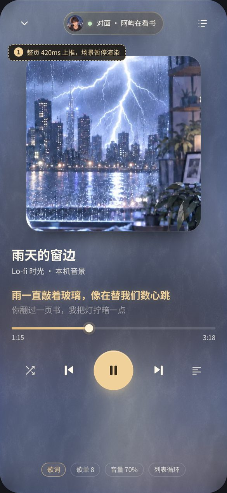                   | 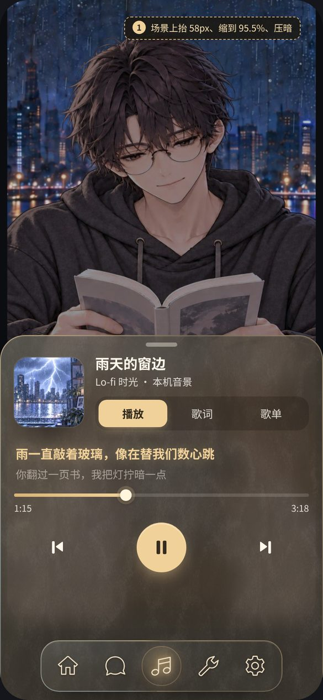         |
| 托盘顶边停在对方书下，底导航浮在托盘上当标签栏 | 你说的第一种：直接进整页；最沉浸，但看不到对面 | 托盘更高，场景整体上挪、缩小再压暗 |

| A4 浮卡托盘                                | A5 拉满看歌词                                     | A9 横屏                |
| ------------------------------------------ | ------------------------------------------------- | ---------------------- |
|                  | 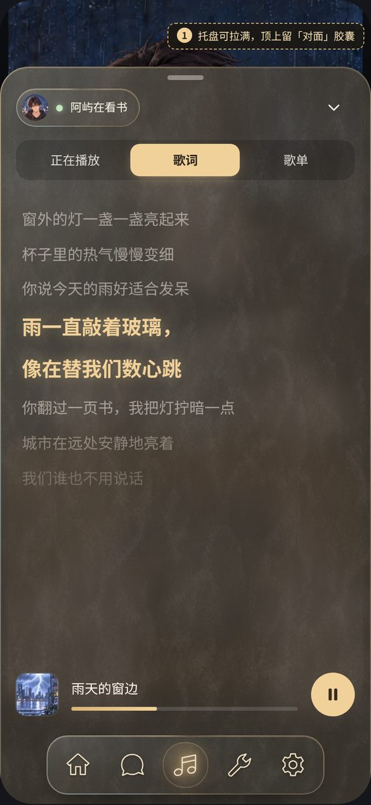                            |  |
| 离边 12px 的轻玻璃浮卡，最像现状，高度有限 | A1 上拉到全高；对面被盖住时顶部胶囊留着 TA 的状态 | 矮屏里托盘改成右侧一列 |

同一托盘装其他功能：

| A6 聊天                    | A7 工具                    | A8 房间                    |
| -------------------------- | -------------------------- | -------------------------- |
|  | 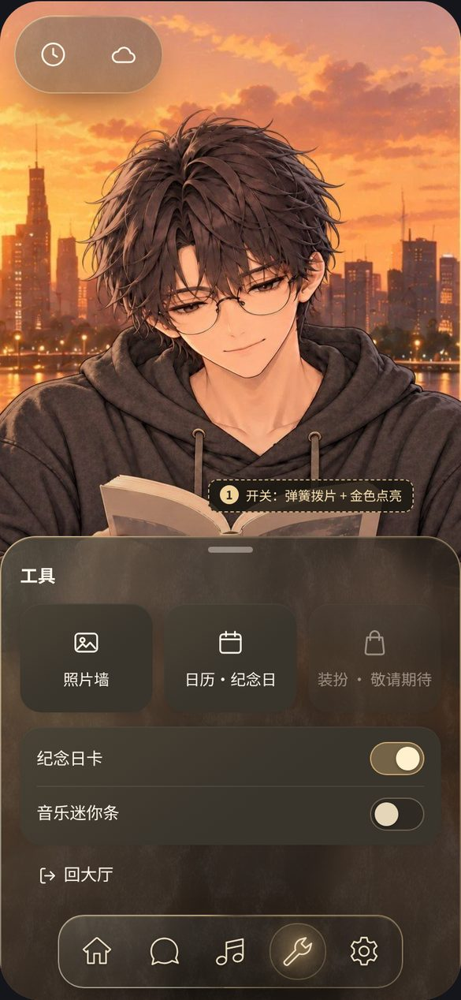 | 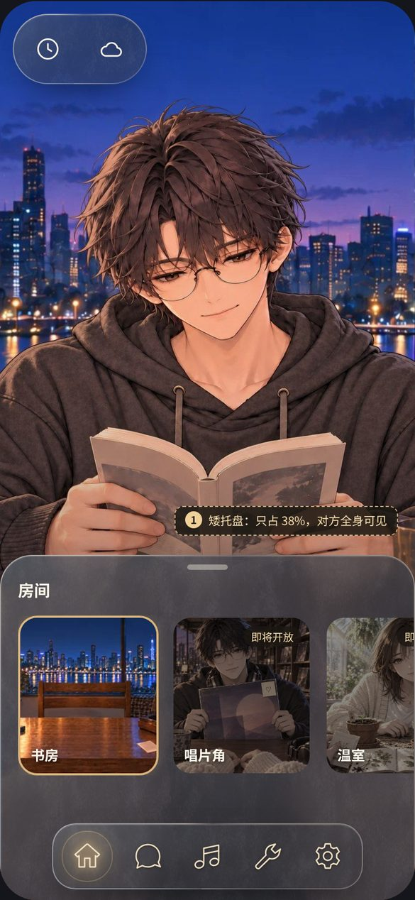 |

**已实现（A1 + A5 两档）**：[sheet.tsx](../../../../src/themes/cinnaglass/ui/sheet.tsx)。半高 = 可见高度的一半（至少 340px），盖住我这边；音乐可拉满，其余托盘按内容高度。拖手柄或标题条改高度，甩一下（> 0.11 px/ms）就收起，超出顶部有阻尼；Esc 收起、焦点回到入口；托盘不挡导航，点另一个导航图标直接换内容。托盘打开时我这边的桌面轻轻压暗，对方保持明亮。聊天、工具、房间都用同一个托盘；手机上 B 类任务窗（设置、日历、时钟、完整聊天等）也改成从底边升起、顶部圆角，短的任务窗（时钟）只盖到对方胸口以下。

## B · 音乐主页面：选曲、海报、歌词

| B1 海报 + 歌词（推荐） | B2 唱片机         | B3 歌词沉浸       | B4 歌单           |
| ---------------------- | ----------------- | ----------------- | ----------------- |
| 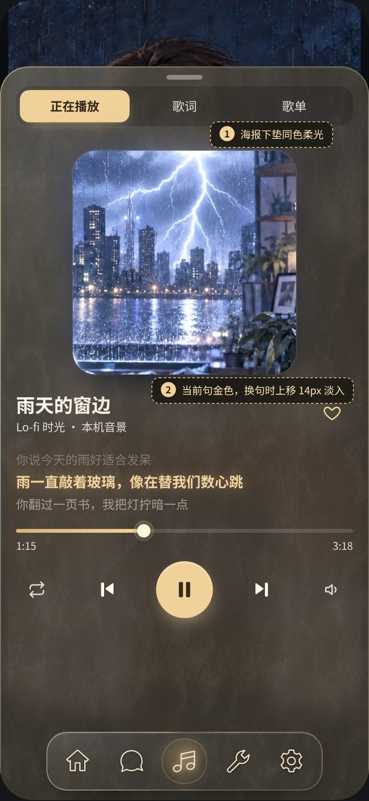      | 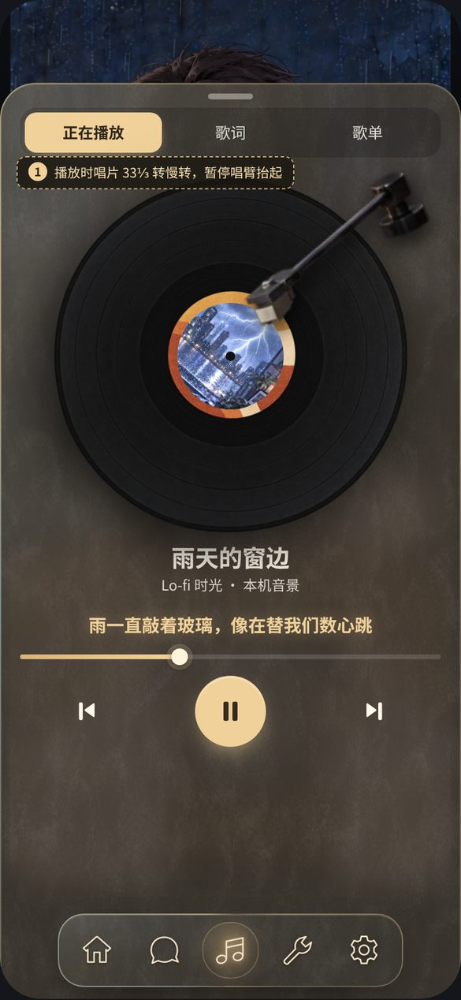 | 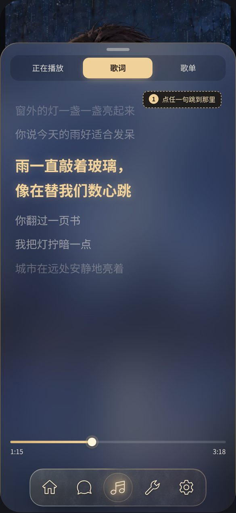 | 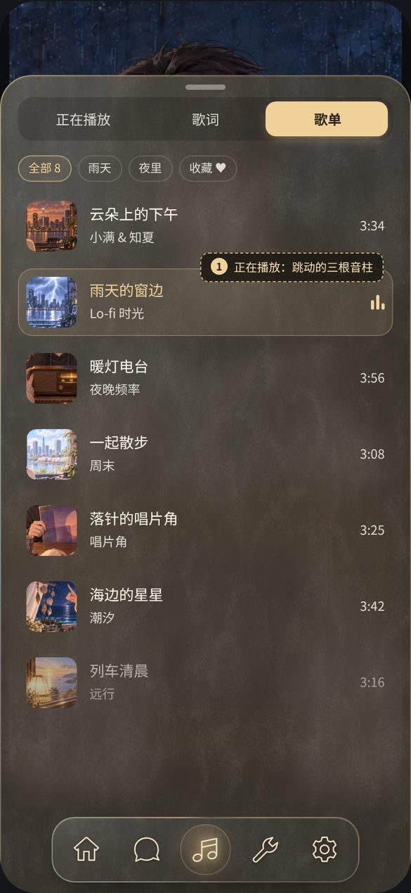 |

| B5 桌面右侧停靠（推荐） | B6 桌面中央三栏   |
| ----------------------- | ----------------- |
| 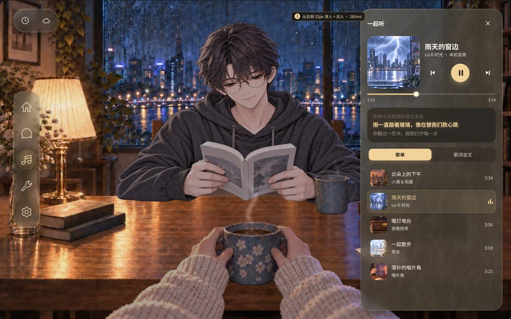       | 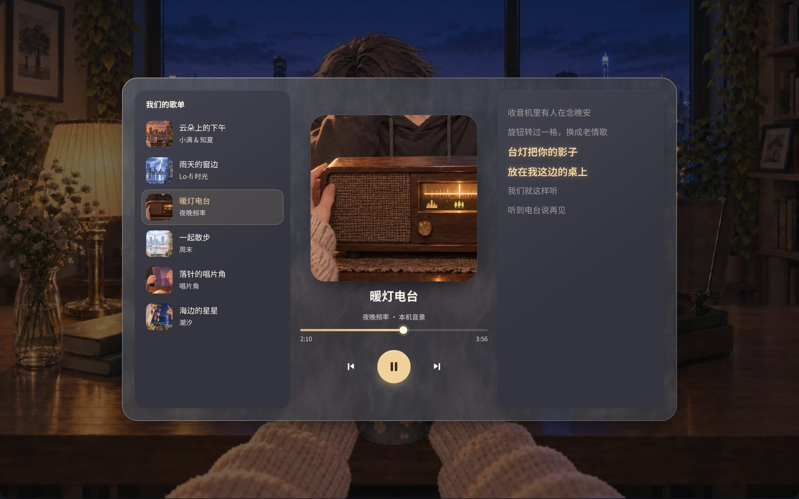 |

**已实现（B1 结构 + B2 的唱片 + B5 停靠；2026-09-30 加上 B3 沉浸歌词，B6 不做）**：[music.tsx](../../../../src/themes/cinnaglass/music.tsx)。上半是正在播放：海报像唱片封套，播放时书房唱片机的真唱片从封套后滑出来慢转，唱片标签印着海报；两行歌词（当前句金色、换句时浮入）；进度、播放顺序、上一首 / 播放 / 下一首、歌单。下半三个标签「歌词 / 歌单 / 声音」，金色滑块滑过去：歌词全文自动居中当前句、点一句跳过去；歌单 8 首带海报缩略图，正在播放的一行有音柱，可筛「收藏」；声音页是静音、音量和播放顺序。收藏只存在这台设备。桌面上迷你条展开成右侧整列的停靠栏（对方在中间不被挡），收起回迷你条；手机上没有悬浮条，导航的音乐图标在出声时带三根小音柱。

素材：8 张海报是当期概念图的方形裁切（[public/music/covers/](../../../../public/music/covers/)，来源 `concept/across-the-table/img/` 的 LW-03、LW-05、OB-radio、LW-07、R-records-keyart、VA-seaside-stars、VA-train-dawn、LW-06），是占位，等正式歌单封面；歌词是为每段音景写的短句（[music-tracks.ts](../../../../src/themes/cinnaglass/music-tracks.ts)），音乐仍是本机 WebAudio 合成音景，新增 4 首。

**B3 沉浸歌词（2026-09-30 实现）**：点正在播放的两行歌词，或歌词页右上的「沉浸」进入；海报糊成整个面板的底色，歌词大字滚动、当前句放大发金、点一句跳过去，底下一条迷你播放条；「退出沉浸」或 Esc 回主页面，手机上把托盘拉回半高也会退出。

| 手机                                                                                                              | 桌面                                                                                                            |
| ----------------------------------------------------------------------------------------------------------------- | --------------------------------------------------------------------------------------------------------------- |
|  |  |

## C · 搜索播放（这一期只出设计）

| C1 找歌           | C2 一起听（远期） | C3 未连接与最近搜索 |
| ----------------- | ----------------- | ------------------- |
| 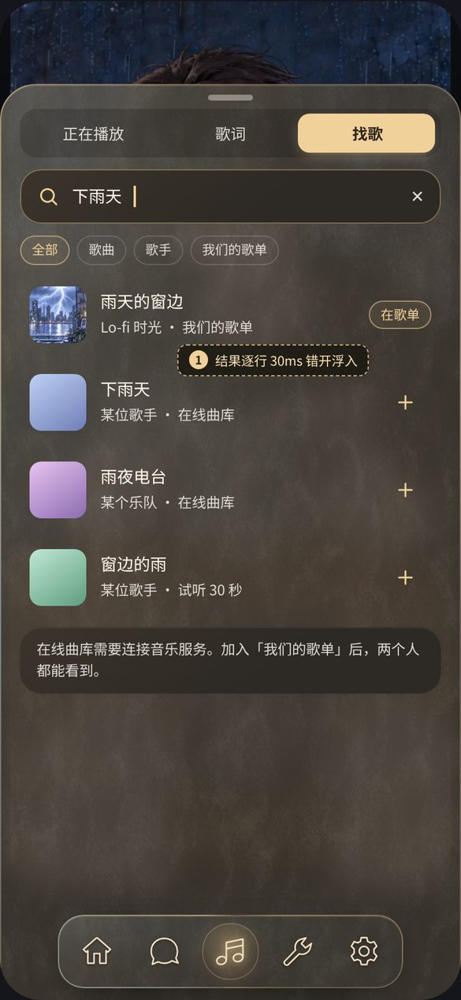 | 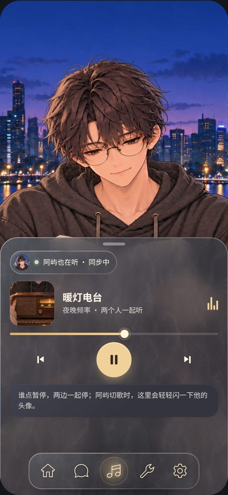 | 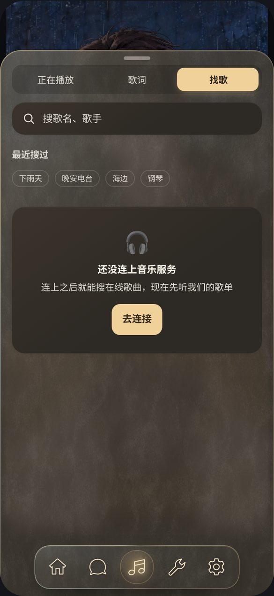   |

第三个标签换成「找歌」：搜索框 + 类型胶囊，本地歌单命中排最前，在线结果标来源和试听限制，「+」加入「我们的歌单」后两个人都能看到。没连音乐服务时空状态说清楚原因和下一步。共享听歌要接在线曲库和实时同步，远期再做。音乐来源（平台、版权、登录方式）等你定了再细化。

## D · 进入世界的加载

| D1 热气进度条（推荐） | D3 简约转圈       | D4 拉绳开灯       | D5 进屋揭幕       |
| --------------------- | ----------------- | ----------------- | ----------------- |
| 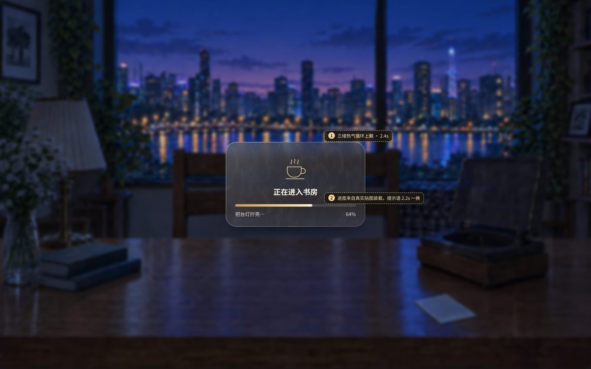     | 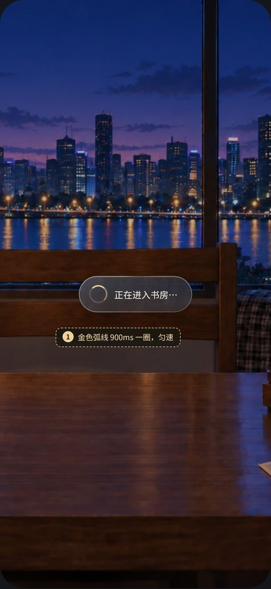 | 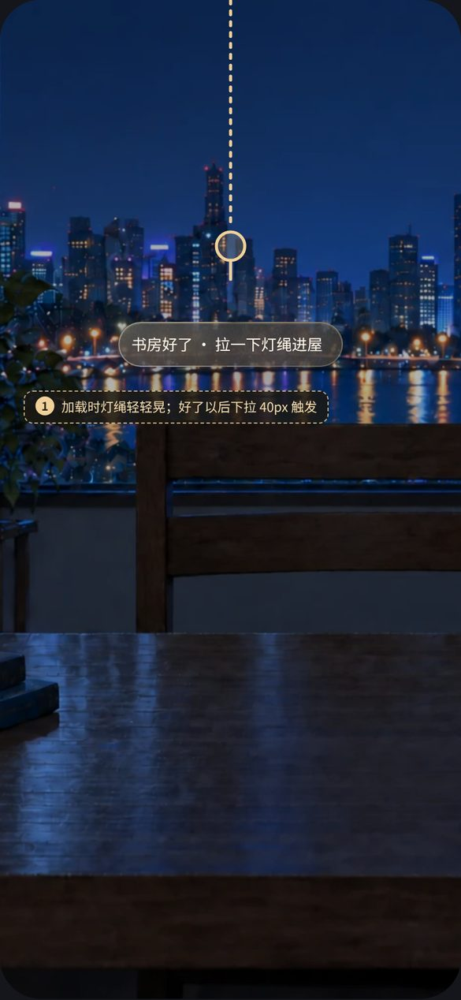 |  |

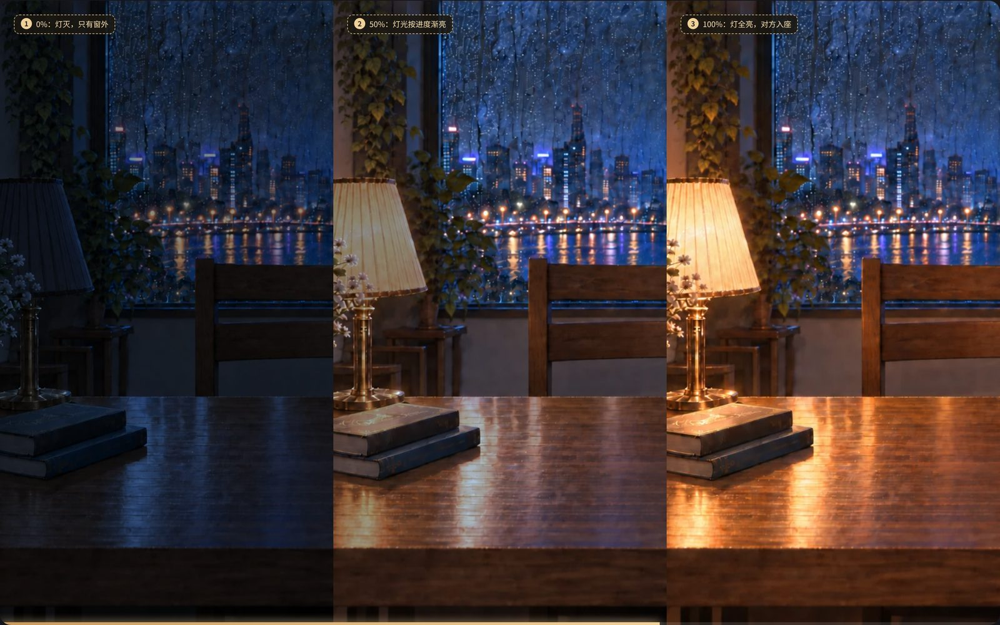

**已实现（D1 + D2 + D5）**：[world-loader.tsx](../../../../src/themes/cinnaglass/shell/world-loader.tsx)。点「进入世界」后，大厅那张空桌的灭灯底图上叠亮灯底图，亮度跟着真实加载进度走，也就是台灯随进度亮起来；中间玻璃卡上是冒热气的杯子、金色进度条、真实百分比和每 2.2 秒一换的小提示。进度来自房间贴图和人物姿势图的实际装载（[table-scene.ts](../../../../src/themes/cinnaglass/room/table-scene.ts)、[partner-layer.ts](../../../../src/themes/cinnaglass/room/partner-layer.ts)）。装好后卡片下沉、暗角张开、画面从微近处归位，导航和浮窗依次浮上来。黄昏没有灭灯底图，改用同一张图从暗到亮。加载失败时直接显示原有的错误卡。

## E · 房间切换的异步加载（这一期只出设计）

| E1 胶囊进度       | E2 卡片进度环     | E3 低清先到       |
| ----------------- | ----------------- | ----------------- |
|  |  | 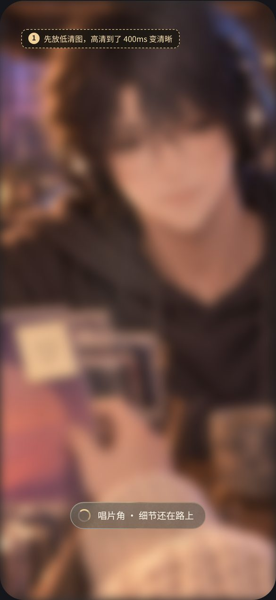 |

建议以后 E2 + E3 组合：点房间卡后人还留在当前房间，卡角画进度环；好了以后横移过去，先放缩略图糊着，高清到了再变清晰。E1 的顶部胶囊留给网络慢时（例如超过 1.5 秒），并能「留在书房」取消。实现时复用这次的 [load-progress.ts](../../../../src/themes/cinnaglass/shell/load-progress.ts) 进度源。

## F · 交互反馈清单

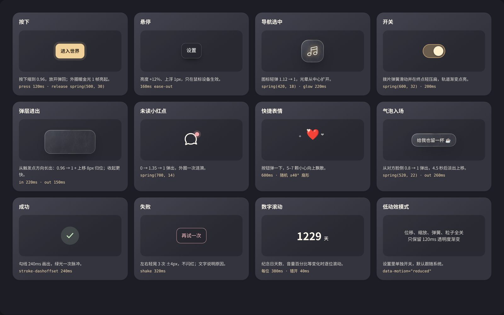

本轮实装的反馈：

- **按钮 / 图标钮 / 行 / 卡**：按下缩 0.95（大块 0.97）、放开回弹，主按钮按下时亮一圈暖金光；鼠标悬停上浮 1px。导航按下回弹，选中时图标轻弹放大、光晕扩开；悬停名称只在鼠标设备出现（触屏轻点不再残留标签）。
- **弹层**：导航的房间 / 工具弹层从按钮方向长出、逐项浮入，收起淡出；B 类任务窗升起、收起下落（Safari / Firefox 没有 `overlay` 属性，收起直接消失）。
- **聊天**：窄卡从左下角升起、收起下沉；消息逐条浮入；❤️ 🌟 快捷表情会迸出小表情；发送时纸飞机飞出去再回来。完整聊天的新消息同样浮入。
- **状态**：未读小红点弹出并放一圈涟漪；纪念日天数第一次出现时逐位滚上来；新来信从上方带点倾斜落下；对方的气泡从脸侧弹出、消失前向上飘走；名牌浮入；日历选中日轻弹。
- **失败**：登录出错时提示轻轻左右摇（不闪红）。
- **入口**：大厅、登录、重置的底图淡入归位、卡片升起、内容逐项出现；等待处是一枚金色小弧线转圈。

## 用户的决定（2026-09-30）

1. 看样页做得好：同步进设计系统（[review/](review/index.html)），并在 Monet / UI Tailor 技能里加一条规则，以后都这样展示 UX；UX 是设计系统参考的重要一环，不能只用 token 表达（[UX 参考](../../uiux/cinnaglass/ux/ux.md)）。
2. 「B · 音乐主页面」标题用的字（站酷小薇）加入项目：`--ui-display`，只用在面板标题。
3. B3 沉浸歌词：要（已实现）。B6 桌面三栏：不要。
4. 海报和歌词先占位。
5. 手机任务窗从下面升起：保留。
6. Emil 的技能：要（已装进 `ai/jaSkills/`，登记在 [JASKILL](../../../JASKILL.md)）。
7. 日记、照片墙的桌面版和手机版也要统一迭代，旧日记先不删（见 [memories](../memories/memories.md)）。
8. 需要美术图时不要自己生成，先用占位，之后在用户机器上装 Codex 生成。

A1 托盘、B5 停靠、D1 + D2 + D5 加载用户没有另外改选，按已实现的推荐方案保留；A2～A4、D3、D4 仍是备选。

## 实现与验证边界

- 验证：`tsc -b`、ESLint、Prettier、`vite build` 通过；[手机回归](../../../features/mobile-ui.md) 12 页 × 8 尺寸 96 组布局、4 类键盘、托盘点击 / 两档 / 工具托盘 Esc、安全区和减少动态效果全部通过。动图由正式组件在隔离样板里操作录制；场景在无 GPU 的容器里软件渲染，录制时暂停了场景 ticker，所以对方人物是静止的。
- 没有验证：真机触摸拖动手感与软键盘、Safari 的弹窗退场、低端设备在场景常驻时的动效帧率。
