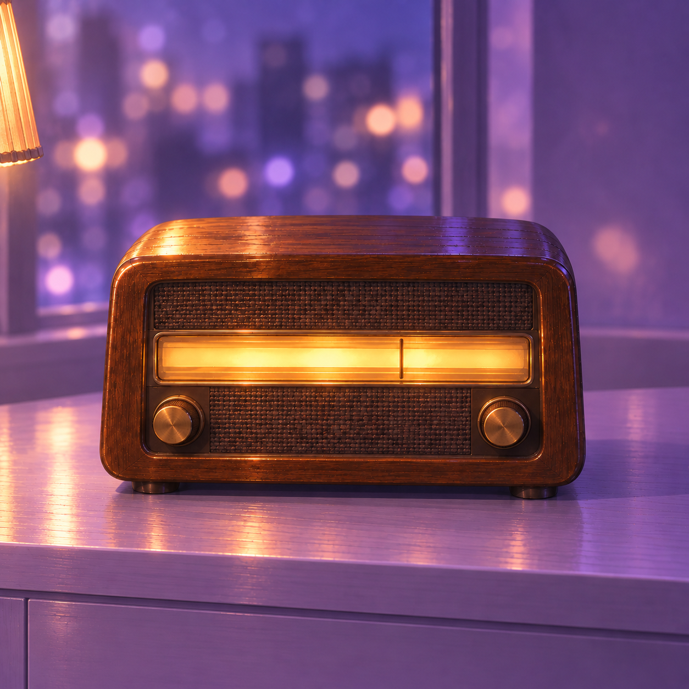
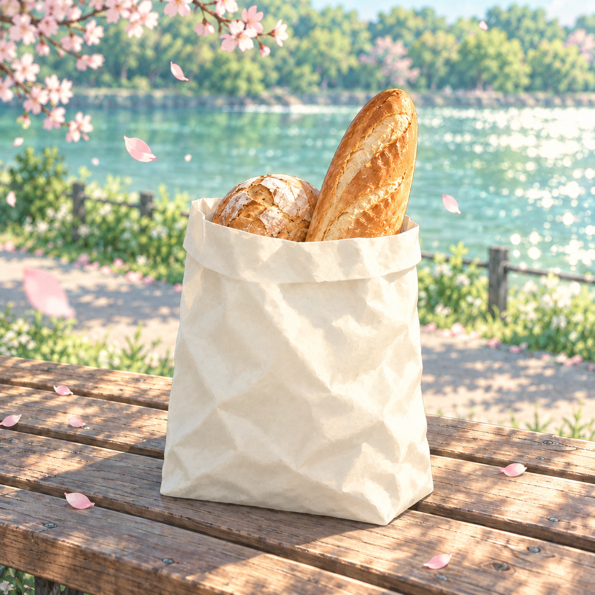

# ART-01 歌单封面二轮 · 制作与自审报告

## 1. 模式与归一化 brief

**模式：design。** 本轮制作生产用封面原图，只重做 lamp-radio.png 与 spring-walk.png。六张已获批封面按原字节复制，全部交付在本批次目录。制作与视觉检查由同一个 Codex agent 完成，属于**自审**，不冒充调用方 Monet 的独立批准。

- 收音机：自然胡桃木外壳，暖灯照亮顶面和正面，调谐窗发琥珀光；丁香紫由夜间环境、散景、墙面与台面承担。目标机身宽为画面 60–65%。
- 春日：沿用河畔长椅、面包袋、樱花瓣、薄荷绿水面构图；奶白纸袋用自然柔软褶皱与轻折袋口，消除上一轮的低多边形切面。
- 统一画法：延续现有系列的精细二次元 CG 插画、浅景深、柔和泛光、材质密度与饱和度。方形、不透明 PNG。
- 硬禁项：文字、字母、数字、标识、水印、签名、人物、脸、手、装饰外框、圆角、暗角及唱片形封面。封面直接来自生成，禁止手工补画或拼贴修复。
- 重试上限：每张首次生成后最多重生成两次。实际收音机 3 次，面包袋 1 次，共 4 次内置 image_gen 调用，每次一张。
- 工具：Node MCP 的 fs / path / pngjs 做文件操作与像素检查；生成仅用内置 image_gen。证据板的缩小、最近邻放大和圆形显示属于验收预览，不是对生产原图的修补。

## 2. 证据清单

| 输入 | 声明用途 | 直接观察与使用方式 |
| --- | --- | --- |
| 上一轮 lamp-radio-initial.png | 收音机材质参考 | 棕色木纹、金黄顶光、编织网与琥珀调谐窗可信；机身很大、暖色面积高。作为每次收音机生成的材质输入。 |
| 上一轮 record-corner.png | 紫夜配色与系列画法 | 淡紫机座、深紫唱片、银色唱臂和紫色书架构成冷紫环境。前两稿意外带入书架/封套，最后一稿已清除。 |
| 上一轮 spring-walk.png | 构图与薄荷白配色 | 白袋、斜向法棍、河面、花瓣与木椅位置明确；纸袋正面是明显三角平面拼接。新稿沿用构图。 |
| 上一轮 spring-walk-initial.png | 自然纸材参考 | 牛皮纸皱折细密、边缘自然，纸感更可信；其棕色不应继承。新稿借纸张行为，保留奶白色。 |
| 上一轮 rainy-window.png | 系列渲染核对 | 暖瓷杯、冷蓝雨窗、浅景深与高光构成系列基准。用于视觉对照，未作为本轮生成的直接输入。 |
| 上一轮 prompts.json | 既有提示词 | 已读返工图及其重试记录；本轮把纸袋要求改为连续柔软明暗，避免再次生成几何色面。 |
| 上一轮 contact-overview.png / contact-44.png / contact-label.png | 成套效果 | 直接检查原系列、44 px 缩略图和圆形预览，保留原系列八种识别轮廓。 |
| 当前 design-system.md 与 art-requests.md 的 ART-01 | 现行规范 | 核对画法、母版/运行时用途、44 px、圆标及禁止后修要求。最新 brief 的无人物要求优先。 |

参考目录：D:\Repo\our-world\ai\design_system\codex-visual\20261002-081349Z。本轮首稿和 retry1 分别作为下一次收音机定向生成的第三张参考；完整路径见 prompts.json。

## 3. 执行结论

**spring-walk.png 建议采用。lamp-radio.png 的木色、紫色环境和无字要求已改善，但构图宽度未完全达标，不能报告为全部验收通过。**

收音机最终机壳按像素边界人工读数约 x=181–1068，宽约 888 px，即全图 **70.8%**；目标为 60–65%。连续两次提示缩小后仍未达到目标，因此按重试上限交付本轮最优候选，明确保留这项中等问题。没有通过裁切、缩放粘贴或重绘来伪造合格。

春日的奶白色、轻折袋口和不规则软褶皱成立，大块三角网格已消退；但右下角和正面仍有较硬的大折痕，纸感略厚，不是毫无缺陷。两张在 44 px 下的主体仍能区分。

六张获批图均与上一轮逐字节一致。两张新图及两张废稿也与生成器原始文件逐字节一致。八张母版均为 **1254 × 1254、8 位 RGB、不透明 PNG**，保留工具原生尺寸，与上一轮一致。

## 4. 验收矩阵与问题表

| 检查 | 收音机最终稿 | 春日最终稿 | 证据 |
| --- | --- | --- | --- |
| 单主体、44 px 辨识 | 通过 | 通过 | 横向琥珀亮条 / 竖向白袋和面包 |
| 原系列画法、景深与泛光 | 基本通过 | 基本通过 | 精细材质、暖局部光与冷环境；春日保持高调晨光 |
| 专项材质纠正 | 通过 | 通过，局部硬折痕仍在 | 胡桃木为棕色；白纸有连续皱褶与折口 |
| 目标主色 | 通过 | 基本通过 | 电台最大两个色簇均为紫；春日由奶白、薄荷与木椅共同构成 |
| 60–65% 机身宽 | **未通过：约 70.8%** | 不适用 | 人工像素边界记录在 metrics.json |
| 无字、无人物、无装饰框 | 最终稿未见违规 | 未见违规 | 原尺寸与局部放大目视；伪文字稿已淘汰 |
| 方形、全不透明 | 通过 | 通过 | PNG 头与全像素 alpha 扫描 |
| 原样交付、未后修 | 通过 | 通过 | 与生成源 SHA-256 一致 |
| 120 px 全图圆形 | 通过 | 通过 | contact-label.png 保留中央主体 |

| 严重度 | 文件 / 位置 | 观察到的问题 | 影响与处理 |
| --- | --- | --- | --- |
| 中 | lamp-radio.png，横向尺寸 | 约 70.8%，高于目标上限 65% | 环境留白较少；不签收为完全达标。两次重生成已用完，保留候选及废稿。 |
| 低 | lamp-radio.png，左侧窗光与台面 | 反射和少量大散景偏亮，木漆高光较亮 | 44 px 左侧仍有次级亮点，中央调谐窗保持主识别特征。未后处理压光。 |
| 低 | lamp-radio.png，下方柜门 | 较大、较均匀的紫色区域 | 有柜体结构但细节偏少；圆图中大部分被裁掉。 |
| 低 | spring-walk.png，正面及右下 | 大折痕仍略硬，纸感略厚 | 明显好于三角切面；原尺寸仍看得到，44 px 不影响识别。 |
| 低 | spring-walk.png，整幅色彩 | 木椅与金黄面包让均值偏灰米色 | 保住薄荷河面；不把均值虚报成薄荷，也不直接拿均值替换 UI tint。 |
| 高，已淘汰 | lamp-radio-retry1.png，右侧书脊 | 局部放大见排列成行的模糊伪文字 | 不符合完全无字要求；最终稿通过生成删除全部书本。 |
| 中，已淘汰 | lamp-radio-initial.png | 机身约八成宽，带入花束和封套 | 镜头过近、陈设过多。作为首稿证据保留，不采用。 |

## 5. 逐文件说明、颜色实测与提示词

### 5.1 测量方法

平均色是全图所有 8 位 RGB 像素的算术均值，按常规 sRGB 数值解释，**不是线性光均值，也不是推荐 UI tint**。两个“主色”是确定性 RGB k-means 的最大两个色簇：每隔 4 像素采样，5 位直方图加权，k=6，最多 24 轮。比例是采样像素归属比例，不能当成物件面积或语义分割。算法与完整六色结果见 build-evidence.mjs、metrics.json。

原始生成 PNG 无嵌入 ICC / sRGB / gAMA 块；本次未重编码附加配置，以保持生成源字节不变。颜色按常规 sRGB 解码假设报告。

### 5.2 lamp-radio.png

- 尺寸：1254 × 1254 px；8 位 RGB，不透明 PNG；1,849,527 字节。
- 平均色：**#794E6D**。最大色簇：**#604179（38.4%）**、**#855793（23.0%）**。
- 生成轮次：3；与原始生成源 SHA-256 一致。

**用途与回应：**最终候选。窗外、墙面、台面与下柜承担紫色，机壳保留自然棕色；顶面与正面受局部暖灯照明，调谐窗无刻字。最大两簇紫色合计约 61.5%，支持紫环境主导的判断。

**残留缺陷：**机身约 70.8% 画宽，未到 60–65%；左侧亮斑较多，木漆反光偏亮，下柜色块略空。专项材质/配色通过，构图不完全通过。



**实际发送的完整提示词：**

```text
ONE square opaque full-bleed production album cover PNG, native at least 1024 x 1024. High-finish 2D anime CG background painting, matching the reference series' material rendering, depth of field, bloom and saturation.
Reference 1: natural brown walnut radio design and material. Reference 2: lilac-violet room palette and painted finish only. Reference 3: recent draft to refine. Keep reference 3's natural brown radio in lilac surroundings, but apply ALL three corrections:
1. Radio body 10% smaller than reference 3, exact target width 62% of the entire square (x19% to x81%), horizontally centred, top at y34%, feet at y74%. The amber dial near y53%. View slightly above radio eye level, its wooden top plainly visible. Natural brown walnut, NEVER violet-painted or purple-stained wood.
2. COMPLETELY REMOVE EVERY BOOK, BOOKCASE, ALBUM SLEEVE, FRAMED PICTURE, PLANT, FLOWER, VASE AND BOUQUET. Their surfaces were accidentally turning into pseudo-text. Background is exclusively soft deep lilac plaster, a defocused violet night window with a few diffuse light bokeh points, soft violet window reflections, and the lilac-painted shelf beneath the radio. There is no book or printed surface anywhere, including under the shelf. Smooth lilac cabinet front below the shelf instead of books. No sharp rain drops or rain streaks. Keep a subtly varied, cosy layered night background rather than a large empty flat wall, but everything except the radio stays blurred and subordinate.
3. Strictly zero text: no writing-like decorative marks anywhere, even blurred. All surfaces are plain and unmarked. The tuning glass is a clean amber luminous horizontal strip with ONE thin tuning needle, and nothing else.
Only hero: original vintage walnut wooden tube radio, rounded cabinet, natural warm brown grain, deep brown woven grille, two small plain bronze knobs. A very SMALL warm lamp is mostly off-canvas at the far left edge: just a sliver of lampshade, under 6% frame width. It lights the top and front of the walnut with local amber highlights; tuning glass also glows amber. Walnut should be rich brown, not black, orange plastic or purple. Soft violet ambient on shadow edges only. Clear horizontal hero silhouette at 44 pixels.
Dominant frame colour must be LILAC-VIOLET #B68FD9 to #E7C4F0 with deep plum shadows, supplied by the wide surrounding environment, window light, lilac painted shelf and lilac cabinet below. Keep local amber to the radio and a small lamp edge; no brown tabletop. Delicate painterly tonal gradients, fine illustration contours, tactile refined material, soft bloom, calm intimate view. Not a photographic product mockup, low-poly render, origami facets, flat vector or watercolour.
HARD CONSTRAINTS: NO text, numbers, letters, glyphs, logos, brands, signatures, watermark, labels, symbols or pseudo-writing. NO books at all. NO people, faces, bodies, hands or sleeves. NO borders, outer picture frames, rounded corners, vignette or artificial edge darkening. NO vinyl-record-shaped cover, collage or cutout. Full continuous painted scenery to every edge and corner, fully opaque. Original, no existing IP, no artist or studio names. Produce one complete square image.
```

直接参考输入：

- D:\Repo\our-world\ai\design_system\codex-visual\20261002-081349Z\lamp-radio-initial.png
- D:\Repo\our-world\ai\design_system\codex-visual\20261002-081349Z\record-corner.png
- D:\Repo\our-world\ai\design_system\codex-visual\20261002-085413Z\lamp-radio-retry1.png

### 5.3 spring-walk.png

- 尺寸：1254 × 1254 px；8 位 RGB，不透明 PNG；2,250,751 字节。
- 平均色：**#BAB6A1**。最大色簇：**#DCCDB2（26.6%）**、**#A0BBAF（18.4%）**。
- 生成轮次：1；与原始生成源 SHA-256 一致。

**用途与回应：**建议采用。沿用河面、长椅、白袋、面包与花瓣位置；袋口轻折，纸面改成不规则软皱与连续明暗，未继承牛皮纸棕色。

**残留缺陷：**正面大折痕和右下折角略硬、略厚；木椅和面包使全图均值偏米灰。主要材质缺陷已解决，尚非毫无硬折线的柔纸。



**实际发送的完整提示词：**

```text
Use case: illustration-story.
Asset: ONE final production playlist cover, full-bleed square opaque PNG, at least 1024 x 1024 native pixels. It is the finished illustration, no UI and no mockup.
References: Image 1 spring-walk.png supplies the EXACT composition, pale mint-green and cream-white palette, camera distance and riverside setting. Its angular polygonal paper bag is the defect to FIX, do not repeat those geometric facets. Image 2 spring-walk-initial.png supplies NATURAL SOFT PAPER MATERIAL only: believable loose crumples with continuous soft shading. Do NOT take its kraft-brown paper colour or tighter framing. Match the references' high-finish anime CG painted series, tactile illustrated materials, soft depth of field, bloom and saturation.
Scene: weekend morning on a riverside wooden bench, a single very pale CREAM-WHITE bakery paper bag holding a fresh golden baguette and one smaller round loaf. Keep the first reference's central upright bag and baguette leaning just slightly to the right, sparkling softly defocused river, mint foliage, riverside path, subtle wooden railing, a few small drifting pink cherry petals and a little blossom entering from upper left. No new objects. The bag and bread are the one main silhouette, with the bag roughly 43–46% of the image width. Close intimate view at the same distance and angle as reference 1. Keep the sparkling mint river visible on both sides. Wooden bench seat supports the bag along the bottom.
CRITICAL BAG MATERIAL: thin supple white bakery PAPER with loose rounded crumples, shallow irregular waviness, delicate paper fibres and natural gentle pressure dents. Continuous curved tonal gradients across the front, very soft transitions; a few subtle organic creases that fade out, not intersecting diagonal lines or a network of triangular planes. Gently undulating silhouette. The top rim is softly folded down once, narrow and irregular, visibly PAPER, not fabric. The bag is full enough to stand but slightly relaxed, not rigid packaging. Pale ivory-white local paper colour, softly warm-white highlights and delicate cool mint-grey shadows, absolutely NOT brown kraft. Never origami, low-poly, triangulated, crumpled metal, faceted stone, sharp planar cel-shading or a cloth tote. Keep natural paper behaviour from reference 2 but with white paper, without photographic microtexture.
Colour: fresh HIGH-KEY MINT #BFE8D2 to #86C9A6 and luminous white dominate. Warm golden bread and restrained light weathered wood are accents; sparse pink petals. No overall yellow-gold or brown wash. Soft white morning sunlight and cool mint reflected light. Match the approved series' high-finish 2D anime CG background painting, fine contours and painterly material gradients, depth of field and soft bloom, not flat vector, watercolour or a low-poly 3D render.
Thumbnail purpose: at 44 px, a clear pale upright bag + warm baguette against cool mint; the whole scene can be shown inside a circular crop. Preserve the first reference's composition while fixing the bag material only.
HARD RULES: absolutely NO text, letters, digits, numbers, glyphs, logos, brands, labels, signatures or watermarks. NO people, faces, bodies, hands or sleeves. NO border, outer frame, rounded corners, vignette or artificial darkened corners. Every edge and all four corners show the continuous scene, no cutout or transparent areas. Do not paint the cover as a vinyl record. Original, no existing IP, no named artist or studio. ONE finished square image.
```

直接参考输入：

- D:\Repo\our-world\ai\design_system\codex-visual\20261002-081349Z\spring-walk.png
- D:\Repo\our-world\ai\design_system\codex-visual\20261002-081349Z\spring-walk-initial.png

### 5.4 lamp-radio-initial.png

- 尺寸：1254 × 1254 px；8 位 RGB，不透明 PNG；2,087,001 字节。
- 平均色：**#68444E**。最大色簇：**#321D20（30.6%）**、**#543B60（23.6%）**。
- 生成轮次：1；与原始生成源 SHA-256 一致。

**状态：淘汰首稿。**自然木色成立，但机身约八成宽，花束、封套与书架引入多余内容，棕色机身挤占紫环境。保留原始文件，未用于最终联系表。


**实际发送的完整提示词：**

```text
Use case: illustration-story.
Asset: ONE final production playlist cover for the Our World app, an opaque full-bleed SQUARE PNG, at least 1024 x 1024 native resolution. The image is the finished cover illustration itself, not a mockup or contact sheet.
References: Image 1 lamp-radio-initial.png is the precise radio MATERIAL and design reference: real NATURAL BROWN WALNUT, rounded wooden casing, woven speaker cloth, two simple knobs and long amber tuning glass. Image 2 record-corner.png is the exact series RENDERING and LILAC-VIOLET ROOM COLOUR reference. Keep their high-finish anime CG painted material detail, intimate camera, soft depth of field, bloom and controlled saturation. Recompose to the framing below; do not copy the first image's orange-dominated composition or its oversized radio.
Subject and framing: one old original unbranded walnut wooden-cased tube radio, front facing the viewer, centred horizontally, centred around y54%, with its body occupying 60–65% of the total image width and about 41–44% of image height. Camera slightly above the radio, showing its wooden top catching lamplight. Keep a convincing warm brown wood local colour and dark brown woven grille. A glowing, plain, horizontal amber tuning glass with ONE thin tuning needle passes near the image centre. Glass has NO numerals, NO lettering, NO scale marks, NO logos. Two plain small bronze knobs. Clearly readable compact horizontal silhouette at 44 px.
Scene and dominant palette: deep LILAC-VIOLET night room with a muted lilac-painted shelf beneath the radio, softly lit lilac plaster wall, a softly defocused violet night window with lilac bokeh, and a soft suggestion of a shelf/bookcase off to one edge, without legible spines. These are subordinate low-contrast background layers that make a cosy inhabited corner rather than a large empty flat wall. Most of the image area must read violet-lilac, in the #B68FD9 to #E7C4F0 colour family with deeper plum shadows. The shelf/table surface and ambient fill are lilac too, not a broad brown wooden tabletop. Keep the room deep and calm, not neon purple.
Lighting: a SMALL partly cropped lamp at the extreme left edge provides a local amber pool across the radio TOP and FRONT and a bright amber dial. The lamp is secondary, small, less salient than the radio. Warm highlights stay local to the natural walnut object; violet ambient fills its shadows softly. The radio is NOT purple wood, NOT painted purple, NOT violet stained, not monochromatically purple. It is a brown walnut object in a violet room. A few tiny lavender sprigs beside it are allowed, no large bouquet or decorative clutter.
Match the supplied series' refined 2D anime CG background painting, soft painted tonal transitions and fine illustrated edges, subtle grain, tactile materials, gentle soft bloom. Continuous scene all the way to all four edges and square corners. One strong central hero readable at 44px and in a full-image circle, no vacant upper half.
HARD RULES: absolutely NO text, letters, digits, numbers, glyphs, labels, logos, brands, signatures or watermarks anywhere. NO people, faces, bodies, hands or sleeves. NO graphic border, outer frame, rounded corners, vignette or artificial edge darkening. Do not paint the cover as a vinyl record. Original design only, no existing IP, no named artist or studio. No collage, cutout, mockup, chart or UI. No flat vector, watercolour, low-poly mesh or hard faceted shading. Deliver one continuous finished opaque square painting.
```

直接参考输入：

- D:\Repo\our-world\ai\design_system\codex-visual\20261002-081349Z\lamp-radio-initial.png
- D:\Repo\our-world\ai\design_system\codex-visual\20261002-081349Z\record-corner.png

### 5.5 lamp-radio-retry1.png

- 尺寸：1254 × 1254 px；8 位 RGB，不透明 PNG；1,972,634 字节。
- 平均色：**#69445A**。最大色簇：**#563A63（33.2%）**、**#855B93（22.3%）**。
- 生成轮次：2；与原始生成源 SHA-256 一致。

**状态：淘汰重试稿。**机身缩小、紫环境保留，但右侧书脊局部放大可见排列成行的模糊伪文字，不能用于完全无字的生产母版。最终稿通过生成移除了书本。


**实际发送的完整提示词：**

```text
Use case: illustration-story. Produce ONE finished opaque full-bleed SQUARE production playlist-cover PNG, at least 1024px, matching this series exactly in rendering, shallow depth of field, saturation and gentle bloom.
References, roles: Image 1 is the convincing NATURAL WALNUT radio reference; image 2 is ONLY the lilac-violet night palette and anime CG rendering reference, do NOT copy its turntable, album sleeve, books or plant; image 3 is the first draft of this new cover, whose natural wood colour and violet room are correct but WHOSE RADIO IS MUCH TOO LARGE.
RECOMPOSE image 3 by pulling the camera back: make the radio's entire body 25 percent smaller in the image. Its exact target bounding box is x18% to x82%, y32% to y74%. Thus it is ONLY 64% OF THE SQUARE WIDTH. Keep this box and its placement: a comfortable hand-width of lilac room remains on EACH side. Do not fill the frame with the radio. Its natural walnut top is visible, camera slightly above it. Centre the glowing amber dial at x50%, y52%. The radio remains the only main subject and fits inside a circular crop.
Radio: original unbranded rounded vintage wooden tube radio with NATURAL warm BROWN WALNUT local colour, brown woven speaker grille, two plain round bronze knobs, a horizontal amber tuning glass with ONE fine needle and absolutely no lettering, numerals or scale marks. The amber lamp lights the TOP and FRONT locally. Keep brown wood, no purple stain or purple-painted casing. Violet reflected fill is subtle, shadows still read walnut.
Environment: the MAJORITY of the square is clearly LILAC-VIOLET, not orange or brown: a lilac-grey painted shelf supports the radio, violet plaster wall and softly defocused lilac window bokeh fill the upper/background regions. Colour family #B68FD9 to #E7C4F0 in lit environment, deeper smoky plum shadows. Background is softly layered and cosy, without a large flat empty wall. A soft window division may be visible, no sharp architecture or competing story. Very small partly cropped warm lamp at extreme left, only a thin sliver of shade, max 7% frame width, subordinate in salience. Optionally TWO or THREE small lavender sprigs, no vase bouquet. NO hanging plant, NO record sleeve, NO picture, NO new dominant props. Foreground shelf and front lip are lilac-grey, not brown, lower region continues naturally. No dark foreground plant blocking the image.
Maintain the reference series' high-finish 2D anime CG background PAINTING, fine clean contours, painterly gradients, detailed yet painted natural materials, warm practical versus cool ambient light, soft depth and restrained bloom. Compact brown horizontal radio and its warm amber bar against the violet room, instantly distinct at 44px. Do not make it a flat diagram or 3D product mockup.
Absolute rules: no text, letters, numbers, logos, brands, signatures, watermarks or pseudo-writing anywhere. No people, faces, bodies, hands or sleeves. No borders, graphic frames, rounded corners, vignette or artificial edge darkening. All four edges and corners are continuous opaque scenery. Do not paint the cover as a vinyl record. Original design, no existing IP, no named artists or studios. No collage or cutout. The decisive correction is the 64% frame-width NATURAL BROWN radio within predominantly violet surroundings.
```

直接参考输入：

- D:\Repo\our-world\ai\design_system\codex-visual\20261002-081349Z\lamp-radio-initial.png
- D:\Repo\our-world\ai\design_system\codex-visual\20261002-081349Z\record-corner.png
- D:\Repo\our-world\ai\design_system\codex-visual\20261002-085413Z\lamp-radio-initial.png

### 5.6 成套缩略图与圆标


顺序固定为：afternoon-clouds、rainy-window、lamp-radio、spring-walk、record-corner、seaside-stars、dawn-train、first-snow。上排底色 #1c1b20，下排 #f5f0e8；每张先缩到 44 × 44，再严格最近邻放大 4 倍成 176 × 176；第三排为未放大的 120 px 全图圆形。

直接观察：八张分别保留白窗帘、瓷杯、横向电台、竖向面包袋、唱片椭圆、竖向贝壳、日出横线、霜心等识别特征。电台与唱片角都偏紫，但前者是暖横条、后者是暗椭圆；春日是全系列唯一的薄荷白直立物件。深浅底均能区分。此结论来自目视，没有做用户盲测。


补充检查 ART-01 提到的中心 40% 圆标：


收音机只剩调谐窗和编织网；春日只剩白袋与上缘少量面包，完整法棍轮廓不在中心 40% 内。这个裁切保住局部材质与色彩身份，不能称完整物件都保留。

## 6. 不确定性与可比性限制

- 同一 agent 制作后自审，没有独立第二位审核者。系列一致、自然纸感等是直接目视判断，不是用户研究结果。
- 44 px 为面积平均缩小，再严格最近邻放大 4 倍。浏览器滤镜、DPR、显示器可能略有差别；原生 44 px 才代表实际大小。
- 全图 120 px 圆形与中心 40% 圆形不是同一种裁切。后者会切掉收音机旋钮、法棍尖、长椅等上下文，不能声称完整主体都在中心 40% 内。
- 新旧收音机主体比例与环境不同，均值差异不能当成同一像素的重新打光。春日构图更接近，适合直接比较纸材。
- 聚类取决于 k 值与算法；实测 hex 不等于“精确命中” brief 的参考 hex。PNG 未嵌入色彩配置，跨色彩管理环境没有实机验证。
- 无字和无人物为目视结论，没有跑 OCR 或版权数据库检索；通用收音机与面包袋未见可识别品牌/IP。
- 本轮未接运行时、未导出 512 px WebP、未做 60 KB 压缩验收，未改 tint、代码、设计系统或 TODO。这符合仅写本批次目录的范围，不能称已上线。

## 7. 推荐与后续动作

1. **采用 spring-walk.png 作为本轮春日母版。** 主要返工点已解决，保留局部硬折痕说明。
2. **lamp-radio.png 作为本轮最优候选，构图项不予完全通过。** 色彩与材质纠正成功，最终稿未见文字；但机身约 70.8% 仍偏大，在严格 60–65% 标准下不建议直接签收。本轮不突破重试次数上限。
3. 六张已批准封面直接沿用。本目录提供原字节副本与统一联系表，可整组取用。
4. 后续接入按 ART-01 既有路径处理母版、WebP 与 UI 实景验收。这一步不在本轮范围内，本报告不把原图制作和运行时验收合并为“通过”。

## 8. 产物清单

本轮交付目录：D:\Repo\our-world\ai\design_system\codex-visual\20261002-085413Z

| 文件 | 像素尺寸 | 角色 / 来源 |
| --- | --- | --- |
| [afternoon-clouds.png](afternoon-clouds.png) | 1254 × 1254 | 上一轮已批准，原字节复制 |
| [rainy-window.png](rainy-window.png) | 1254 × 1254 | 上一轮已批准，原字节复制 |
| [lamp-radio.png](lamp-radio.png) | 1254 × 1254 | 本轮最优候选，构图未完全达标 |
| [spring-walk.png](spring-walk.png) | 1254 × 1254 | 本轮春日母版，建议采用 |
| [record-corner.png](record-corner.png) | 1254 × 1254 | 上一轮已批准，原字节复制 |
| [seaside-stars.png](seaside-stars.png) | 1254 × 1254 | 上一轮已批准，原字节复制 |
| [dawn-train.png](dawn-train.png) | 1254 × 1254 | 上一轮已批准，原字节复制 |
| [first-snow.png](first-snow.png) | 1254 × 1254 | 上一轮已批准，原字节复制 |
| [lamp-radio-initial.png](lamp-radio-initial.png) | 1254 × 1254 | 淘汰首稿 |
| [lamp-radio-retry1.png](lamp-radio-retry1.png) | 1254 × 1254 | 淘汰重试稿，书脊伪文字 |
| [contact-44.png](contact-44.png) | 1696 × 672 | 44 px 深浅条带放大 4 倍，加 120 px 圆形一排 |
| [contact-44-native.png](contact-44-native.png) | 424 × 120 | 原生 44 px 深浅底 |
| [contact-label.png](contact-label.png) | 1050 × 140 | 独立 120 px 全图圆形条带 |
| [contact-center-40.png](contact-center-40.png) | 1050 × 140 | 中心 40% 裁切证据，不能用作封面母版 |
| [prompts.json](prompts.json) | — | 四次实际提示词、参考绝对路径、生成源和轮次 |
| [metrics.json](metrics.json) | — | 所有 PNG 尺寸、均色、六色聚类、alpha、字节数与哈希 |
| [verification.json](verification.json) | — | PNG、源字节、底色及最近邻逐像素验证 |
| [build-evidence.mjs](build-evidence.mjs) | — | Node/pngjs 预览与测色脚本，仅写本目录 |
| [codex-report.md](codex-report.md) | — | 本报告 |

### 全部图像的测色索引

新生成作品的完整提示词见 §5；六张沿用图没有新提示词，原词见上一轮 prompts.json。联系表没有生图提示词，来自确定性显示转换；其测色只描述整张证据板，不代表某一张封面。

| 文件 | 平均色 | 主色 1 | 主色 2 |
| --- | --- | --- | --- |
| afternoon-clouds.png | #C7A37C | #FBE4C0 | #ECBF9A |
| rainy-window.png | #735959 | #313A67 | #6D3E2A |
| lamp-radio.png | #794E6D | #604179 | #855793 |
| spring-walk.png | #BAB6A1 | #DCCDB2 | #A0BBAF |
| record-corner.png | #574063 | #291E32 | #4A3655 |
| seaside-stars.png | #111625 | #030A1A | #09142A |
| dawn-train.png | #C18669 | #F5A77C | #7D5242 |
| first-snow.png | #675B6D | #38426B | #361E1D |
| lamp-radio-initial.png | #68444E | #321D20 | #543B60 |
| lamp-radio-retry1.png | #69445A | #563A63 | #855B93 |
| contact-44-native.png | #837373 | #1A1820 | #F4EDE2 |
| contact-44.png | #6E6061 | #1D1A20 | #F3ECE0 |
| contact-label.png | #5C4C4E | #1D1A21 | #544672 |
| contact-center-40.png | #685550 | #1E1B22 | #EFD9BD |

### 可复核结果

- 六张已批准图复制一致：6 / 6。
- 本轮生成图与保存文件一致：4 / 4。
- 五张附图及其余已批准来源哈希未变。
- 八张最终封面与两张废稿全部 1254 × 1254、8 位 RGB、零透明像素。
- 联系表底色实测：(28, 27, 32) / (245, 240, 232)。
- 4 倍最近邻逐通道比较：0 处不一致。
- 收音机宽度目标：**false，约 70.8%**。
- 除本批次目录的新交付文件外，未写入项目源文件、规范或原图。
